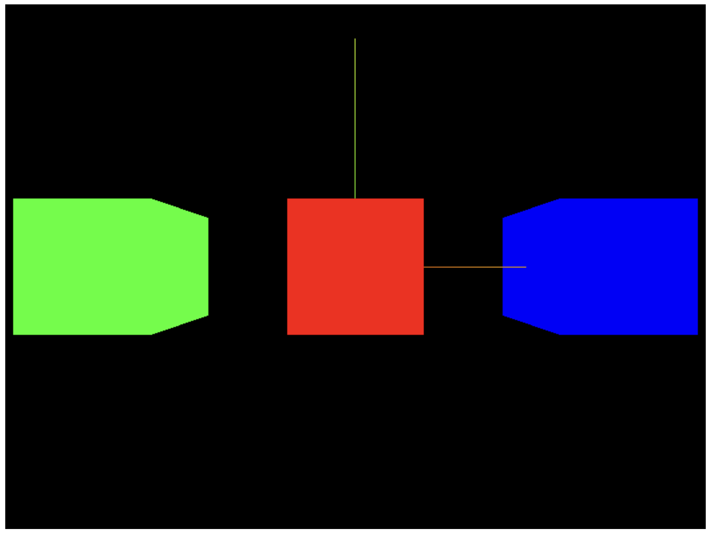
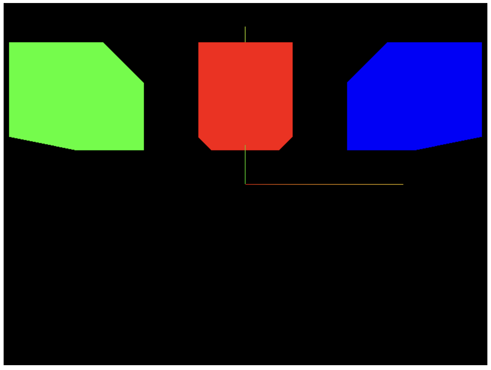
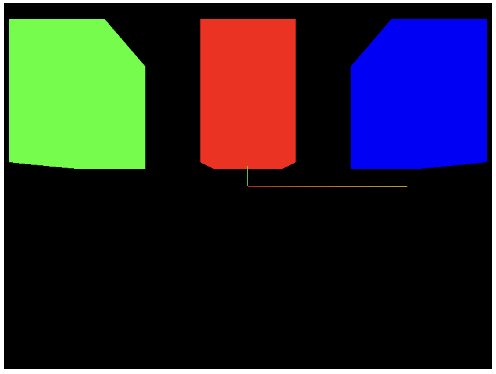
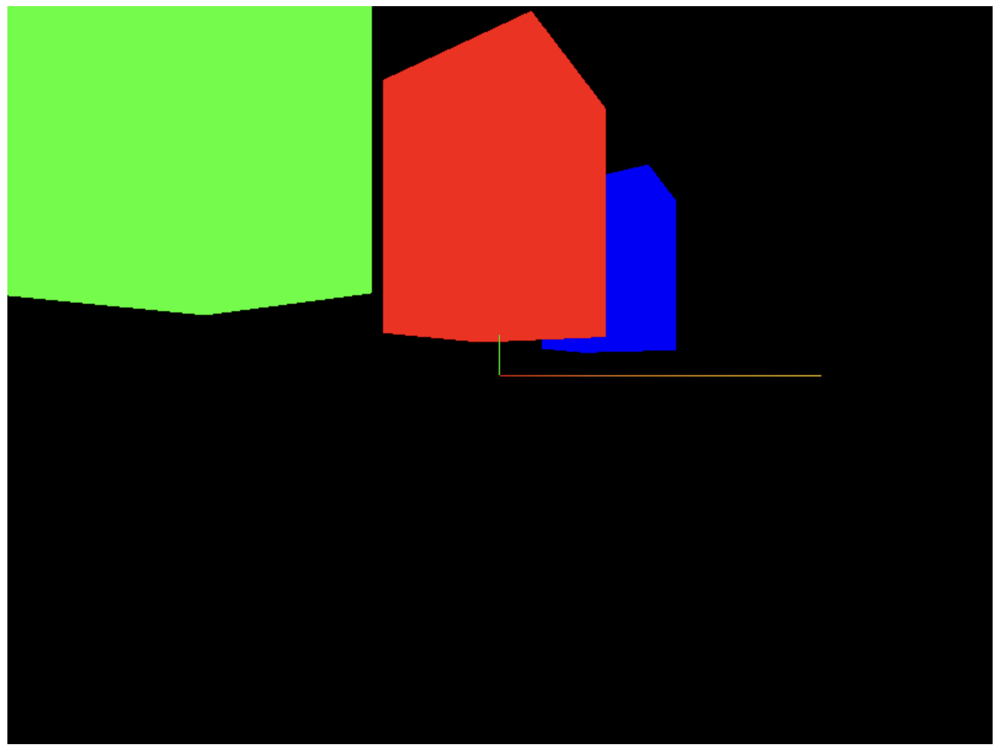

### Group

複数のオブジェクト (Mesh) を1つのグループとして扱うためのクラス
- 複数のオブジェクトで構成される1つのオブジェクトを作りたいときに便利
    - 例: 車オブジェクトは以下のオブジェクトのグループであると考えることができる
        - 車体
        - 窓
        - エンジン
        - タイヤ
        - ハンドル

        などなど
    
<br>


Group は Object3D を継承したクラス
- Group 自体に対して移動、回転、スケールなどの操作ができる

---

### Group の使い方

#### Group の作成と追加

ポイント
- Groupに属するオブジェクト(Mesh)は Scene ではなく Group インスタンスに add() で追加する

- Group インスタンスは Scene インスタンスに add() で追加する


```js
// Gruopの作成
const group = new THREE.Group();

// Groupに属するオブジェクトの作成
// *cubeGeometryやredMaterialは宣言済みとする
const redCube = new THREE.Mesh(cubeGeometry, redMaterial);

const greenCube = new THREE.Mesh(cubeGeometry, greenMaterial);

const blueCube = new THREE.Mesh(cubeGeometry, blueMaterial);

// オブジェクトをGroupに追加
group.add(redCube); // オブジェクトを1つだけ渡すこともできる
group.add(greenCube, blueCube); // 複数のオブジェクトを一度に渡すこともできる

// GroupをSceneに追加
scene.add(group);
```

<br>

#### Group の操作

ポイント
- Groupに移動や回転、スケールの操作を行う = そのGroupに属しているオブジェクト全てに操作を行う

```js
// ★前準備
// Groupを作成し、redCube, greenCube, blueCubeを追加ずみ
// GroupをSceneに追加済み

// 各cubeが重ならないように移動
greenCube.position.x = -2;
blueCube.position.x = 2;
```



<br>

Group インスタンスを position で移動してみると
```js
group.position.y = 1;
```



<br>

さらに Group インスタンスを scale で拡大してみると
```js
group.scale.y = 1.5;
```



<br>

さらに Group インスタンスを rotate で回転してみると
```js
group.rotate.y = 1;
```


