### オブジェクトのアニメーションに関する4つのプロパティ

Three.js にて Object3D を継承したクラス (CameraやMeshなど) は以下の4つのプロパティを継承する

1. position
    - オブジェクトの座標に関するプロパティ
    - [Vector3](#vector3) 型オブジェクト
        - x, y, z などのプロパティを持つ
    - `position.x = <value>` で x の座標を設定できる (y,z も同様)
    - `position.set(<x>, <y>, <z>)` で一度で3つの座標を設定することもできる

2. scale
    - オブジェクトの拡大/縮小に関するプロパティ
    - [Vector3](#vector3) 型オブジェクト
    - オブジェクトの中心を基準に拡大/縮小する
    - `scale.x = <value>` で x軸方向にscaleさせることができる (y,z も同様)
    - `scale.set(x, y, z)` で一度に3軸方向への拡大/縮小の設定が可能

3. rotation
    - オブジェクトの回転に関するプロパティ
    - [Euler](#euler) 型オブジェクト
    - `rotation.x = <value>` でx軸を中心にvalue (**[ラジアン](#ラジアン)**) だけ回転させる
    - 各軸に同じ分だけ回転しても、$\color{red}回転順が異なれば結果も異なる$
    - [ジンバルロック](#ジンバルロック-gimbal-lock)が発生する可能性がある
    - オイラー角を利用してオブジェクトを回転させるため、$\color{red}回転の順番$によって、各軸に同じ角度だけ回転しても同じ姿勢にはならない
    - rotation プロパティを変更すると、$\color{red}それに対応するように quaternion プロパティも更新される$
    
4. quaternion
    - rotation のようにオブジェクトの回転を設定することができる
    - quaternion プロパティを変更すると、$\color{red}それに対応するように rotation プロパティも更新される$

<br>

*上記のプロパティは行列情報として処理される

<br>
<br>

参考サイト

[【Three.js入門】物体操作:position,scale,rotation](https://shiroyuki2020.hatenablog.com/entry/introduction_to_threejs_05

---

### Vector3

3つの数字を持つ3次元ベクトルクラス

順番があり、 x,y,z プロパティを指定することで格納された値にアクセスすることができる

<br>

Vector3 オブジェクトは様々なメソッドを持ち、他の 3D ベクトルとの距離や外積、内積の計算などができる

```js
//mesh.position は Vector3 型オブジェクト
console.log(mesh.position.length()); //原点(0,0,0) からmeshオブジェクトの中心までの距離

//以下は上記のコードと同じ
console.log(scene.position.distanceTo(mesh.position));
```

*Camera オブジェクトも Object3D を継承してるので、 position プロパティを持つ  
→ 原点からカメラの距離や、メッシュとカメラの距離を求めることもできる

---

### Vector3D.normalize()

同じ方向の単位ベクトル(大きさの1のベクトル)に変換するメソッド

```js
// 原点からmesh方向のベクトルを単位ベクトルに変換する
// = 原点からmeshまでの距離を1にする
mesh.position.normalize();
```

<br>

例: ボックスオブジェクトを以下の位置に配置する

```js
mesh.position.x = 0.7;
mesh.position.y = -0.6
mesh.position.z = 1;
```

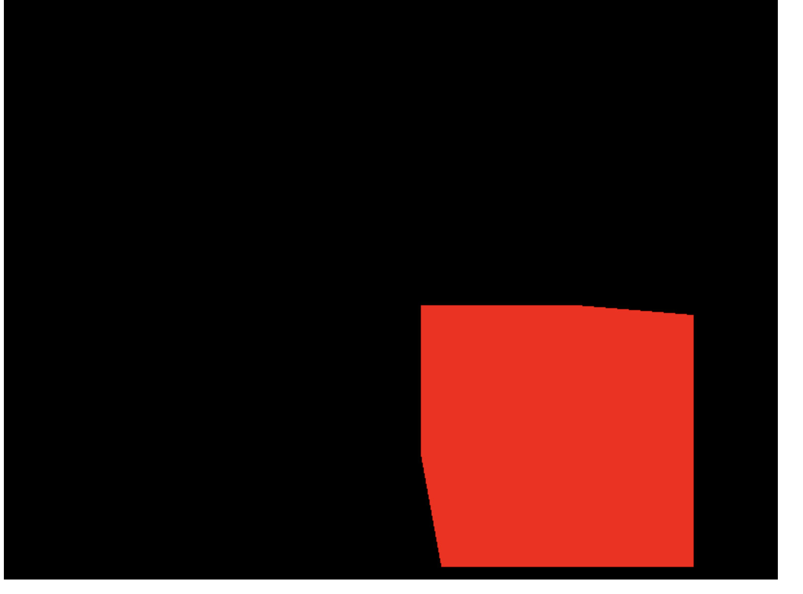

<br>

Sceneの原点からmeshまでの距離を1にする(同じ方向)

```js
mesh.position.normalize();
```


---

### Euler

オイラー角型クラス

- オイラー角とは

    - 3次元空間にて、オブジェクトの姿勢を表す方法の1つ

    - 3次元上のとあるオブジェクトについて、 X軸, Y軸, Z軸のそれぞれを中心に任意の度数分回転することで、対象のオブジェクトの姿勢を表現する

        <br>
        例: 3Dの紙飛行機オブジェクトの回転をオイラー角で考える (*以下の画像ではX,Y,Zを固定座標、x,y,zを機体座標としている)

        <br>

         z軸を中心にψ(プサイ)° 回転する
        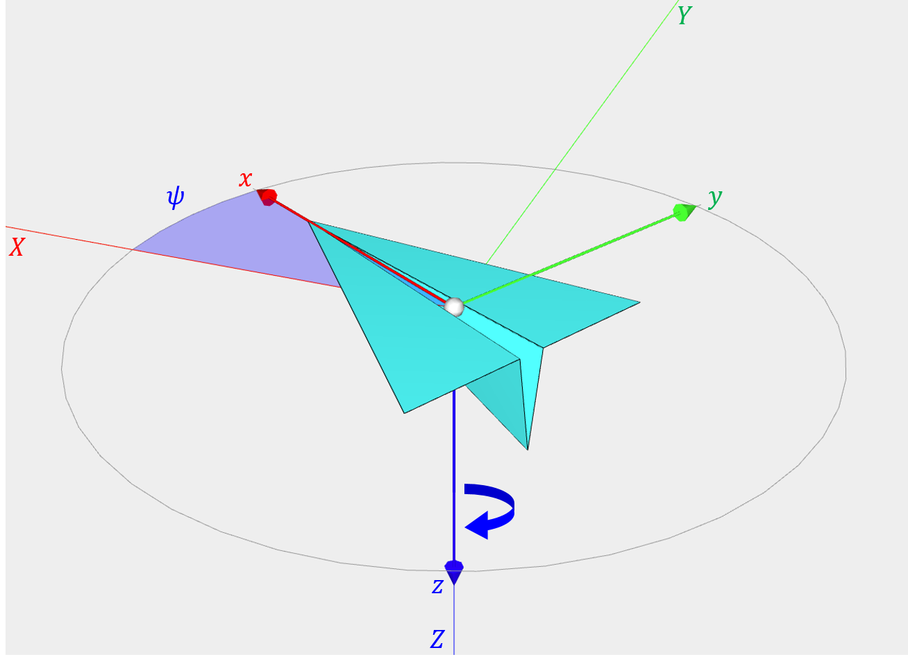

        <br>
        次にy軸を中心にφ(ファイ)° 回転する
        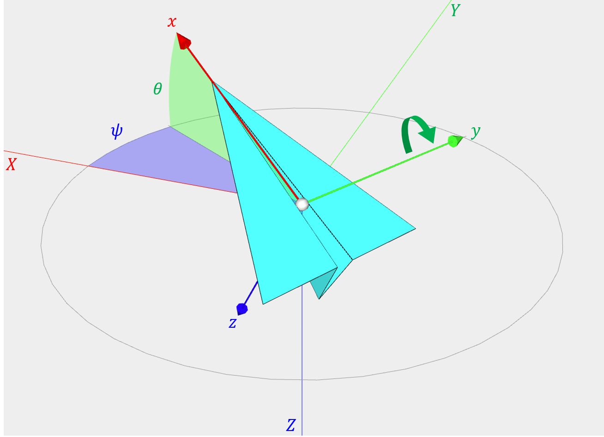

        <br>

        最後にx軸を中心にθ(シータ)° 回転する

        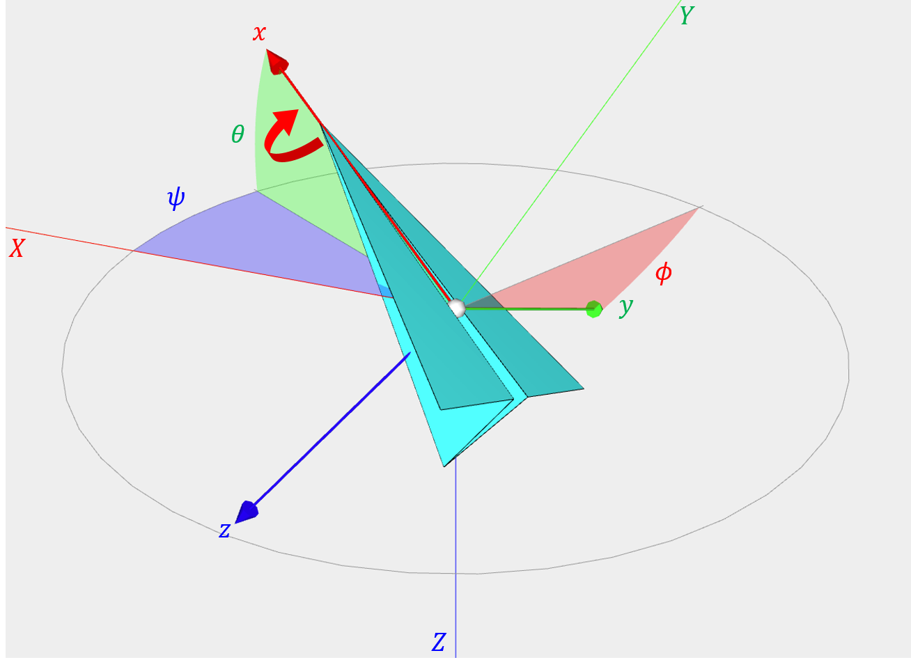

        <br>

        $\color{red}オイラー角 = 上記３つの連続回転の回転角$

        上記例の場合、オイラー角は`(ψ, φ, θ)` で表される
    
    <br>

    - $\color{red}回転の順番が異なると、最終的な姿勢も異なる$

        例: Z → Y → X の順で回転した場合と、 X → Y → Z の順番で回転した場合を比較してみる

        <br>
        
        1. Z → Y → X の順でそれぞれの軸を中心に30°, 40°, 50° 回転した場合

        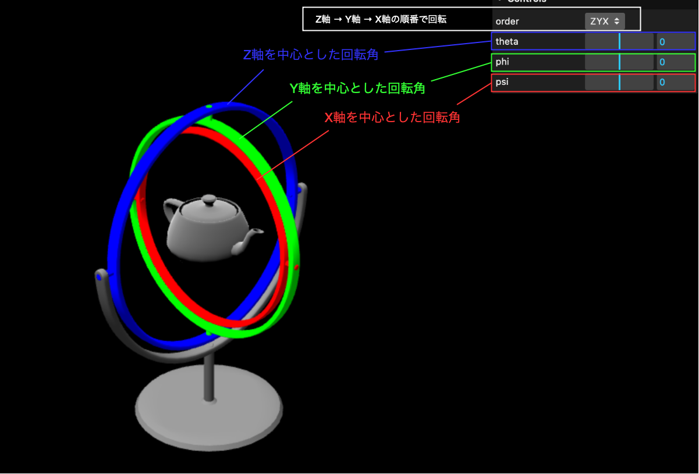

        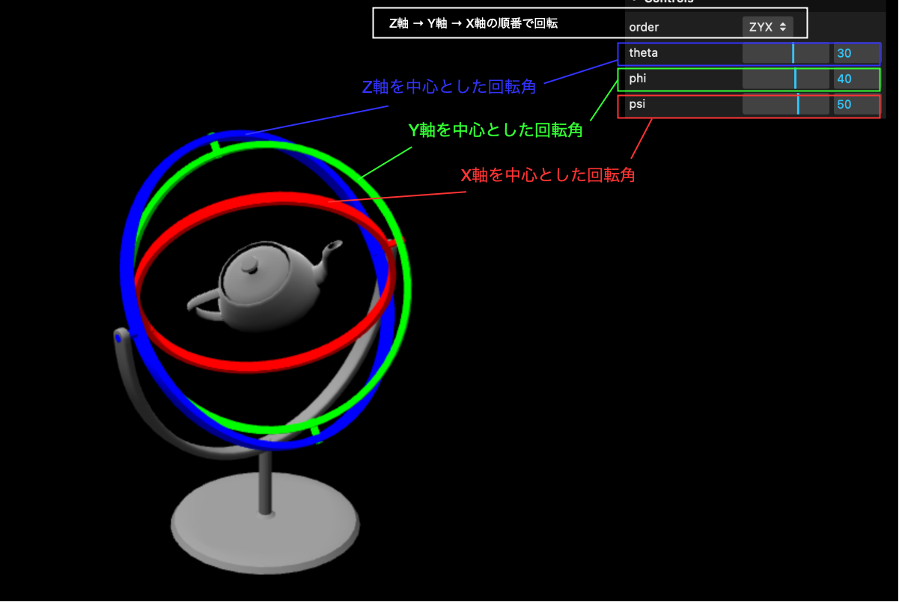

        <br>

        2. X → Y → Z の順で各軸を中心に30° 回転した場合

        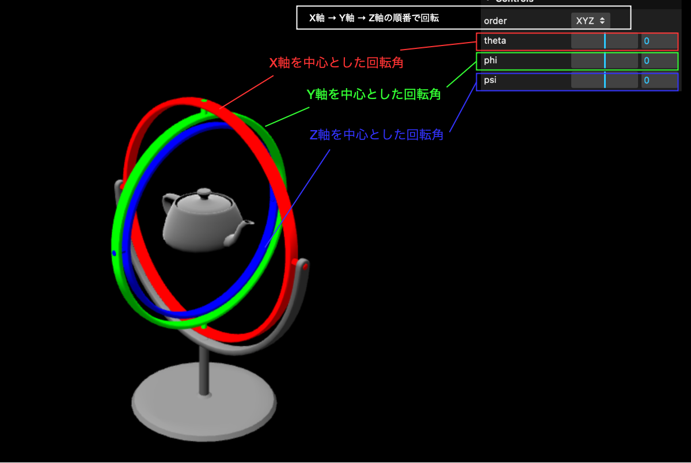

        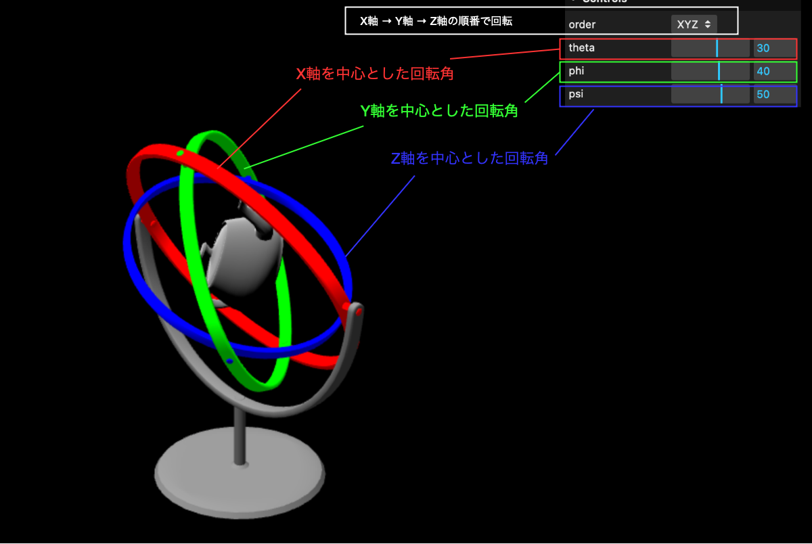

        **最終的なヤカンの姿勢が異なることが確認できた**

    <br>

    - 特定の条件化で[シンバルロック](#ジンバルロック-gimbal-lock)という現象が起きる可能性がある

<br>

### 回転順の変更

Euler.order プロパティで回転する軸の順番を変更する  
*デフォルトはX軸 → Y軸 → Z軸の順番で回転する

```js
mesh.order = "ZYX"; // Z軸 → Y軸 → X軸の順番で回転する

// CameraもObject3Dなので、回転の順番を変更できる
camera.order = "ZYX";
```

<br>
<br>

参考サイト

オイラー角について
- [オイラー角とは？定義と性質、回転行列・角速度ベクトルとの関係](https://www.sky-engin.jp/blog/eulerian-angles/)

- [アドカレ12日目：クォータニオンのニワカになろう](https://ameblo.jp/sssrc/entry-12831777266.html)

固定座標と機体座標についてわかりやすいサイト
- [回転角度と回転行列　オイラー角とは](https://programming-surgeon.com/script/euler-angle/)

「回転の順番が異なると、最終的な姿勢も異なる」箇所で利用したサイト
- [ジンバルロックデモサイト](https://arihide.github.io/demos/gimbal/)

回転順の変更について
- [Three.js でカメラの回転](http://lesguillemets.github.io/blog/2014/06/21/threejs-rotation.html)

---

### ジンバルロック (Gimbal Lock)

3D空間でのオブジェクトの回転にオイラー角をを利用している場合、3軸のうち2軸が同じ回転軸になってしまうこと

→ `回転の自由度が3から2に落ちてしまう` と言うらしい

<br>

例: オイラー角で表現する3Dオブジェクト (Z → Y → X 軸の順番で回転する) にて、 Y軸を中心に90°(-90°)回転してみると、

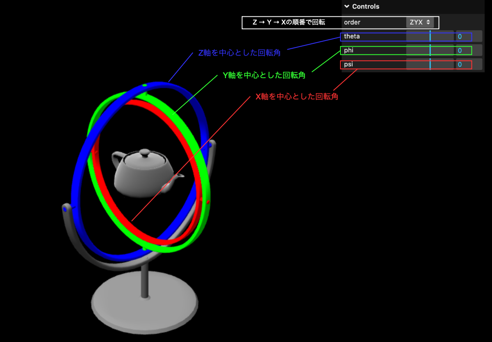

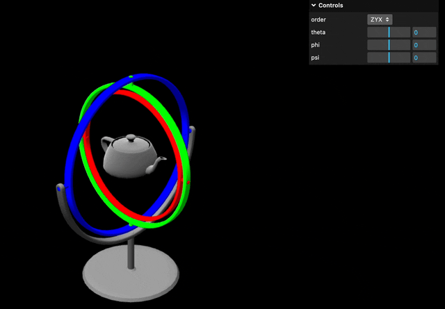

Y軸に90°(-90°)回転すると、**Z軸とX軸は同じ軸周りの回転になってしまう** (ただし、回転の方向は逆)

-> ジンバルロックが発生すると、Y軸を中心にした回転と、 X(Z)軸を中心にした回転の $\color{red}2つの軸でしか回転できなくなる$


引用: [ジンバルロックを完全攻略する](https://ryowaks.com/gimbal-lock/2/)

<br>

#### ジンバルロックが発生する条件

○ → △ → ◻︎ 軸の順番で回転させる場合、△軸を中心に90 $\times x$ ° (X ≠ 0) 回転させると、ジンバルロックが発生する

= 2軸目を90 $\times x$ ° (X ≠ 0) 回転させると発生する

<br>

#### ジンバルロックを防ぐには

以下のようにいくつか方法はあるが、多くのケースではクォータ二オンを利用しているらしい

1. 回転軸の順番を変更する
    - 完全にジンバルロックを防ぐ手段ではない

2. オイラー角ではなくクォータ二オンで回転姿勢を表現する
    - クォータ二オンとは `1つの回転軸(ベクトル)と、それを中心とした回転角度` でオブジェクトの回転姿勢を表現できるものらしい

<br>
<br>

参考サイト

[#unity ジンバルロックをゼロから理解する](https://someiyoshino.info/entry/2022/11/03/143431)

[ジンバルロックを完全攻略する](https://ryowaks.com/gimbal-lock/2/)

[貴方はオイラー角におけるジンバルロックを数学的に説明できますか？](https://qiita.com/Arihi/items/4b306feb3d9e6cd93204)

[なんでQuaternion使うか？(&ジンバルロック)](https://qiita.com/keito_takaishi/items/a0fc972188d1db057194)

---

### ラジアン

ラジアン(弧度法)とは、弧(と半径の比)で角度を表現する方法


\[前提\]

- 角の大きさ = $\frac{円の弧の長さ}{円の半径の長さ}$
    - 扇形のサイズを大きくしても弧と半径の比が同じならば角の大きさは同じ

    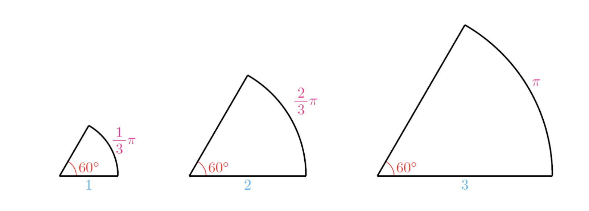

    引用: [一般角と弧度法、扇形の弧長l=rθと面積S=1/2r²θ](https://examist.jp/mathematics/trigonometric/kodohou/)


\[ラジアンの考え方\]

- 半径1の単位円で考えるのが一般的(ラジアンの分母が1になるから)

- 1ラジアンについて考えてみると、

    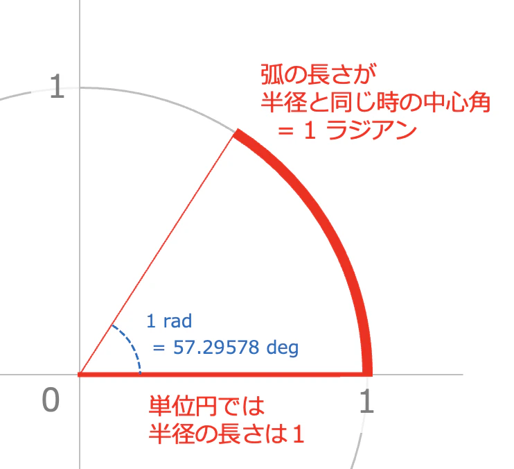

    引用: [ラジアンを食べて理解する](https://qiita.com/Ninagawa123/items/9667e5292b67946bdfc9#そうかラジアンは半径に関係あるのか)

<br>

- では、180°は何ラジアンとなるか?
    
    - 円の円周の長さは $\color{red} 直径 \times 円周率(\pi)$ で求めることができる
        - 単位円の円周の長さは $2 \times \pi$
        - 半円(中心角が180°)の円周の長さは、円の円週の長さの半分なので、 $\pi$

    よって、180° = $\pi$ ラジアンとなる

    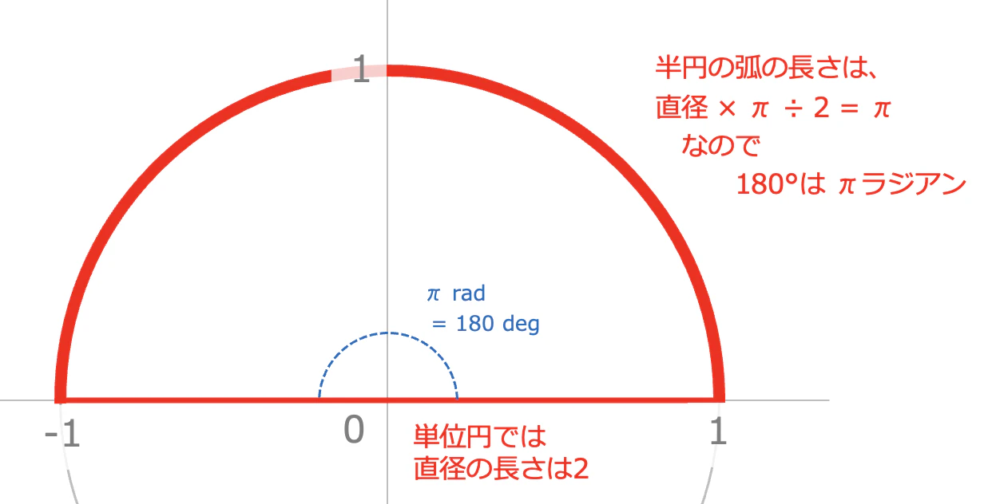

    引用: [ラジアンを食べて理解する](https://qiita.com/Ninagawa123/items/9667e5292b67946bdfc9#そうかラジアンは半径に関係あるのか)

<br>

- 特定の度数をラジアンに変換する
    - 180° = π (ラジアン)がわかったので、 $\color{red} 180 : \pi = 与えられた角度 : x$ で与えられた角度に対するラジアンを求めることができる

    \[例\]: 108°をラジアンで表せ (答えは[こちら](https://examist.jp/mathematics/trigonometric/kodohou/))

    - 求める値(108°のラジアンの値)を $x$ とおくと

    $$
    180 : \pi = 108 : x \\[10pt]
    x = \frac{108\pi}{180} \\[10pt]
    \text{左辺を2で約分すると}\\[10pt]
    x = \frac{54\pi}{90} \\[10pt]
    \text{左辺を6で約分すると}\\[10pt]
    x = \frac{9\pi}{15} \\[10pt]
    \text{左辺を3で約分すると}\\[10pt]
    x = \frac{3\pi}{5}
    $$

    よって、108°は $\frac{3}{5}\pi$となる

<br>
<br>

参考サイト

ラジアン(弧と半径の比)
- [一般角と弧度法、扇形の弧長l=rθと面積S=1/2r²θ](https://examist.jp/mathematics/trigonometric/kodohou/)
- [ラジアン](https://wakariyasui.sakura.ne.jp/p/math/ryou/radian.html)

「ラジアンとは」についてわかりやすかった動画
- [弧度法とは【高校数学】三角関数＃３](https://youtu.be/ApGpRVVkL5Y?si=qLfYL_8FcuCBpzGn)

---

### その他

- AxesHelper はオブジェクトにも追加できる

```js
const helper = new THREE.AxesHelper();

const mesh = new THREE.Mesh(geometry, material);

mesh.position.set(-1, 1, 0);

meas.add(helper)
```


<br>

Scene に別のAxesHelperを追加してみると

```js
// Sceneの設定
const sceneHelper = new THREE.AxesHelper();
scene.add(sceneHelper);

// オブジェクトの設定
const objectHelper = new THREE.AxesHelper();

const mesh = new THREE.Mesh(geometry, material);

mesh.position.set(-1, 1, 0);

mesh.add(objectHelper)
```

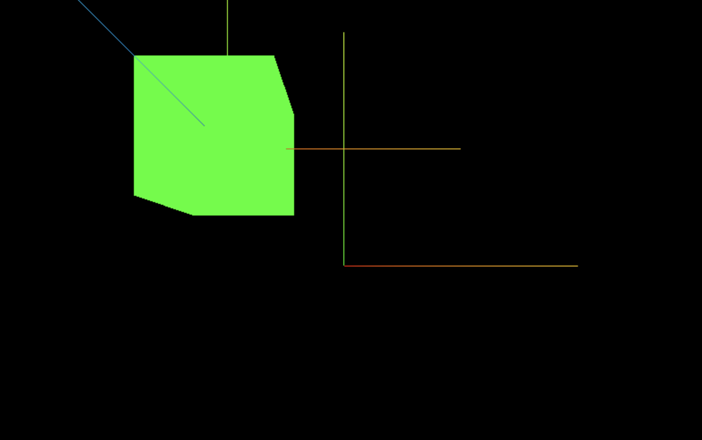

<br>

注意点
オブジェクトやSceneにAxesHelperを追加する際は、 $\color{red}それぞれに新しいAxesHelperインスタンスを用意してあげなければいけない$

<br>

以下はダメなコード (AxesHelperインスタンスを使い回している)

```js
const helper = new THREE.AxesHelper();

scene.add(helper);

mesh.add(helper);

```

結果: helper インスタンスを最後に add したオブジェクトにしか AxesHelper が表示されない


