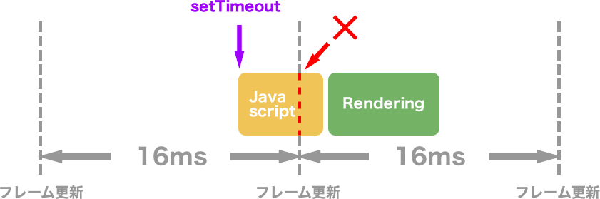

### アニメーション

Three.jsのアニメーション

- パラパラ漫画のように、静止画の画面(フレーム)を1秒間に何回も描画することでアニメーションを実現する

- コンピューターが1秒間に描画できるフレーム回数を FPS (Frame Per Second) と言う

- FPS が低いコンピューターと FPS が高いコンピューターでは、アニメーションが異なる
    - とあるオブジェクトが1フレームに 1cm 動くとすると、 FPS が低いPCではオブジェクトがノロノロ動き、 FPS が高いPCではオブジェクトは早く動く

---

### requestAnimationFrame

- 引数に関数を受け取る
- requestAnimationFrame は受け取った関数を、次のフレーム更新直後に実行する関数

- requestAnimationFrame に渡す関数内で requestAnimationFrame を呼ぶことで、無限ループになり、アニメーションを実現できる
    
    ```js
    const animation = () => {
        // アニメーション処理
        requestAnimationFrame(animation);
    }

    requestAnimationFrame(animation);
    ```

<br>

#### setInterval との違い

setInterval

- 指定した時間ごとに処理を繰り返す関数

    ```js
    const sayHello = () => {
        console.log("hello");
    }

    setInterval(sayHello, 1000); // 1000ms (1s) ごとに sayHello を実行する
    ```

- setInterval の実行を解除したい場合は clearInterval を呼ぶ必要がある
    - clearInterval には setInterval の戻り値を渡す必要がある

    ```js
    let num = 0;

    let timer = setInterval(() => {
        if (num >= 4) { //5回 "hello" を出力したら Interval 終了
            clearInterval(timer);
        }
        console.log("hello");
        num++;
    });
    ```

    <br>

違い

- setInterval のコールバック関数の実行はフレームの更新のタイミングと重なる可能性がある

    - 処理とフレーム更新が重なるとアニメーションのパフォーマンスが下がってしまう

    

    引用: [requestAnimationFrameの仕組みと使い方！うまく使ってパフォーマンスを改善しよう！](https://blog.leap-in.com/use-requestanimtionframe/)

    <br>

- requestAnimationFrame はフレーム更新の邪魔をすることなくコールバック関数の実行が可能(コールバック関数の処理が重くなければ)

    

    引用: [requestAnimationFrameの仕組みと使い方！うまく使ってパフォーマンスを改善しよう！](https://blog.leap-in.com/use-requestanimtionframe/)

<br>
<br>

参考サイト

[requestAnimationFrameの仕組みと使い方！うまく使ってパフォーマンスを改善しよう！](https://blog.leap-in.com/use-requestanimtionframe/)

---

### requestAnimationFrame の注意点

- 処理の実行間隔はこちら側で指定できない
    - 次のフレーム更新のタイミングは PC の FPS に依存するため、~秒毎にコールバック関数を実行させることはできない

- PC の FPS によって requestAnimationFrame で実装したアニメーションに違いが生じる
    - 1フレーム毎にオブジェクトが1px移動するアニメーションを requestAnimationFrame で実装した場合:
        - 60 FPS の PC ではオブジェクトは 60px 移動する
        - 30 FPS の PC ではオブジェクトは 30px 移動する
    - 異なる FPS のデバイスでも同じようにアニメーションを表示したい場合は[デルタタイム](#異なる-fps-デバイス間でも同じようなアニメーションを実装する)を利用する

<br>
<br>

参考サイト

[Canvasだけじゃない！requestAnimationFrameを使ったアニメーション表現](https://ics.media/entry/210414/#リフレッシュレートによって変わるアニメーション速度)

---

### 異なる FPS デバイス間でも同じようなアニメーションを実装する

- requestAnimationFrame は FPS が異なると、アニメーションの速度も異なる
    - 60 FPS ではオブジェクトが1秒間で 6cm 移動するが、 30 FPS ではオブジェクトが1秒間で 3cm しか移動しないなど

- setInterval は処理の実行がフレーム更新のタイミングと重なるとパフォーマンスが落ちる (カクつくとか?)

<br>

Delta Time を requestAnimationFrame に利用すると、アニメーションの際をなくすことができる

**Delta Time**: 直前のフレームと今のフレーム間で経過した時間

```js
// delta time の取得(計算)方法

let time = Date.now();

const tick = () => {
    let current = Date.now();
    delta = current - time; // フレーム間の経過時間(delta time)の計算
    time = current; // 次に呼ばれたときのために time を更新

    requestAnimationFrame(tick);
}

tick();
```

<br>

#### Delta Time をアニメーションに利用

オブジェクトを1フレーム毎にX軸方向に1づつ進めるアニメーションについて考えてみる

- 60 FPS のデバイスでは、1秒で 60 進む
- 30 FPS のデバイスでは、1秒で 30 進む

<br>

(*デルタタイムは毎回一定なわけではないが)上記の各 FPS の平均的なデルタタイムを考えると

- 60 FPS のデルタタイム: $1/60秒 = 0.016666…秒$
- 30 FPS のデルタタイム: $1/30秒 = 0.033333…秒$

<br>

上記で求めたデルタタイムを移動距離に掛けると

- 60 FPS のデバイスでは 1フレーム毎に $1 \times 0.01666… = 0.01666…$　進む

- 30 FPS のデバイスでは 1フレーム毎に $1 \times 0.033333… = 0.033333…$　進む

<br>

各 FPS のデバイス上では、1秒でどのくらいオブジェクトが移動するかを考えると

- 60 FPS: $0.01666…(移動距離) * 60(1秒間のフレーム数) \approx 1$
- 30 FPS: $0.033333…(移動距離) * 30(1秒間のフレーム数) \approx 1$

<br>

\[例\]: デルタタイムを利用してオブジェクトを移動させるコード

```js
let time = Date.now();

const tick = () => {
    let current = Date.now();
    let delta = current - time;
    time = current;

    // オブジェクトのアニメーション (移動)
    mesh.position.x = 1 * delta; // 移動が早すぎる場合は1を0.01など小さくする

    requestAnimationFrame(tick);
}

requestAnimationFrame(tick);
```

#### 注意点

- requestAnimationFrame のコールバック関数内でのオブジェクトのアニメーション箇所全てにデルタタイムをかける必要がある

<br>
<br>

参考サイト

わかりやすかったサイト
- [【Unity 簡単解説】Time.deltaTimeについて分かりやすく解説します](https://nattspapa.com/deltatime/)

もう少し踏み込んだ説明をしているサイト
- [【ゲームプログラミング】「速度」を使う時は必ず\`deltaTime\`を使ってください](https://qiita.com/konbraphat51/items/a7ed9f00dbf84e54060b)

- [【Unity】Time.deltaTimeの正しい使い方わかってる？適当に掛ければいいてもんじゃない！](https://qiita.com/toRisouP/items/930100e25e666494fcd6)

デルタタイム利用時の注意点
- [安定しないフレームレートに効果的！WebGLのカクつき対策まとめ（Three.js編）](https://ics.media/entry/12930/)


---

### requestAnimationFrame と Clock を使ったアニメーション

Clock とは
- three.js のビルトインクラス
- デルタタイムを利用して異なる FPS 間でも同じようにアニメーションを表示した様に、Clock クラスでも同じ様にアニメーションの表示ができる

<br>

ポイント
- new THREE.Clock() でインスタンス化
- clockインスタンス.getElapsedTime() で $\color{red}Clockクラスがインスタンス化された時からの経過時間を取得$

```js
const clock = new THREE.Clock();

const tick = () => {
    const elapsedTime = clock.getElapsedTime();

    // 60FPSでも30FPSでも関係なく1秒間にx軸方向に1進む
    mesh.position.x = elapsedTime;
}

tick();
```

<br>

練習問題
- cubeMesh をフレームレートに関係なく1秒間に1回転させるにはどうすれば良いか。Clockクラスを使って実装せよ。

回答

```js
const clock = new THREE.Clock();

const tick = () => {
    const elapsedTime = clock.getElapsedTime();

    // 1秒経ったら、 1*2π = 2πで1回転する
    mesh.rotate.y = elapsedTime * Math.PI * 2;
}

tick();
```

<br>

注意点

- Delta Time と違って、 Clock.getElapsedTime() は値が増加し続ける

<br>
<br>

参考サイト

[【Three.js】デルタタイムを使ったアニメーション作成](https://and-ha.com/coding/three-js-animation-with-delta-time/)

----

### Delta Time や getElapsedTime の考え方

自分なりにしっくりきた考え方

- Delta Time
    - 60 FPS だろうが 30 FPS だろうが、それぞれ60回、30回 tick() が呼ばれると 1秒になる

    - Delta Time は1秒経過するまで何%みたいなイメージ
        - 何かのファイルをダウンロードするとき ~%経過のシーンをイメージするとわかりやすかった

    ```js
    let time = Date.now();

    const tick = () => {
        let current = Date.now();
        let delta = current = time;
        time = curent;

        // Move to positive X
        mesh.position.x = delta;

        requestAnimationFrame();
    }

    tick();
    ```

    

    <br>

- getElapsedTime()
    - こちらも何回 tick() が呼び出されようが、アニメーションの移動距離は時間経過という FPS に関係ない尺度を利用するというイメージ

    ```js
    const clock = new THREE.Clock();

    const tick = () => {
        const elapsedTime = clock.getElapsedTime();

        // 何回目の実行であろうと、1秒経過したら elapsedTime は 1になる
        mesh.rotation.y = elapsedTime;


        // 同様に何回目の実行であろうと、1秒経過したらx軸の正の方向に 0.1 移動する
        mesh.position.x = 0.1 * elapsedTime;

        requestAnimationFrame(tick);
    }

    tick();
    ```

---

### Camera のアニメーション

Camera も requestAnimationFrame の中で座標や回転を変更するアニメーションを設定できる

```js
const time = new THREE.Clock();

const tick = () => {
    const elapsedTime = clock.getElapsedTime();

    // 3.14秒ぐらいで半回転する = 約6.28秒で1回転する
    camera.rotation.y = elapsedTime;

    requestAnimationFrame(tick);
}

tick();
```

---

### GSAP を使ったアニメーション

事前準備

- gsap モジュールを npm install でインストールする

```bash
npm install gsap
```

- gsap.to()で指定した場所に移動する
    - gsap.to(Object3Dインスタンス.position, { duration: <アニメーション時間>, x: <x座標>, y: <y座標>, z: <z座標>});


```js
import gasp from "gsap";

// 1秒間でオブジェクトをx軸方向に2移動する
gsap.to(mesh.position, {duration: 1,x: 2});

const loop = () => {
    renderer.render(scene, camera);
    requestAnimationFrame(loop);
}

loop();
```

<br>

注意点

- requestAnimationFrame で renderer.render を更新する必要がある
    - ↑を忘れると、オブジェクトの座標は gsap によって更新されても、画面に描画はされない

<br>

GSAPの何が嬉しいのか

- 直感的にかける
- durationを指定するので、FPSの差はライブラリが吸収してくれる
- もっと複雑なアニメーションを実装するためのメソッドも提供されている
