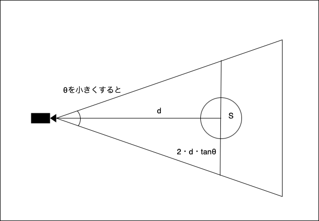

### Perspective Camera

勘違いしてたこと
- fov は並行方向の視野角だと思っていたが、実は垂直方向の視野角だった


引用: [Three.js: How can I find the camera's current plane](https://stackoverflow.com/questions/69622404/three-js-how-can-i-find-the-cameras-current-plane)

- near plane から far plane までの台形の様な箱の範囲内のものが画面に映し出される

<br>

ポイント
- fov を大きくするとオブジェクトは小さく映る、 fov を小さくするとオブジェクトは大きく映る

    <br>

    なぜ視野角を変化すると、オブジェクｔは小さく/大きく映るのか?
    
    - 下記画面の変数が何を表しているのか
        - $θ$ : fov(半分)
        - $d$ : カメラからオブジェクトまでの距離
        - $S$ : オブジェクトの大きさ
        - $2・d・tanθ$ : カメラが映す領域の上から下までの長さ

        *$S$ と $2・d・tanθ$ の比率が fov によって、変わってくる

    

    引用: [【ShaderLab】FoVによらずに一定の太さのアウトラインを作る](https://zenn.dev/r_ngtm/articles/shaderlab-outline-2#を変化させたときの-の変化-1)

    <br>

    **視野角だけ大きくする**と S はそのままで、 2・d・tanθ は大きくなっていく

    → 画面に表示されるSの割合が小さくなる = オブジェクトが小さく映る

    

    <br>

    逆に**視野角だけ小さくする**と S はそのままで、 2・d・tanθ は小さくなっていく、

    → 画面に表示されるSの割合が大きくなる = オブジェクトが大きく映る

    


<br>
<br>

参考サイト

[【ShaderLab】FoVによらずに一定の太さのアウトラインを作る](https://zenn.dev/r_ngtm/articles/shaderlab-outline-2)

---

### マウスの動きに合わせてカメラを動かしてみる


*今回は画面はリサイズしないことを前提に進める

考え方

- マウスの左右上下の動きを取得したい

    - window.addEventListner("mousemove") でマウスの動きにイベントを登録できる

    - window.addEventListner("mousemove", (e) => {}) の第二引数のコールバック関数にて  $\color{red}e.clientX, e.clientY でマウスの座標を取得できる$

    

    ```js
    const canvas = document.querySelector("canvas.webgl");
    canvas.addEventListner("mouseover", (e) => {
        console.log(`X: ${e.clientX}`);
        console.log(`Y: ${e.clientY}`);
    });
    ```

- 取得したマウスの動きをカメラの座標に反映したい

    ```js
    // マウスの動きを保存する変数
    const mouse = {
        x: 0,
        y: 0
    };

    // マウスの動きを取得
    const canvas = document.querySelector("canvas.webgl");
    canvas.addEventListner("mouseover", (e) => {
        // canvas.clientWidthで割る事によって標準化 = mouse.x のとりうる値を 0 ~ 1 にする
        mouse.x = e.clientX / canvas.clientWidth;
        // canvas.clientHeightで割る事によって標準化 = mouse.y のとりうる値を 0 ~ 1 にする
        mouse.y = e.clientY / canvas.clientHeight;
    });


    // マウスの動きをカメラの位置に反映
    const tick = () => {
        camera.position.x = mouse.x;
        camera.position.y = mouse.y;
        requestAnimationFrame(tick);
    };

    tick();
    ```

    

    <br>

- 問題を修正
    - 画面(canvas)の中心を起点に左右にマウスを動かすとカメラも左右に動く様にしたい
        - 現在の cursor.x がとりうる値は 0 ~ 1 -> これを -0.5 ~ 0.5 とか -1 ~ 1 とかにしたい
        - 画面の中心を cursor.x = 0 にしたい
        
    - 画面(canvas)の中心を起点に上下にマウスを動かすとカメラも上下に動く様にしたい
        - 現在の cursor.y がとりうる値は 0 ~ 1 -> これを -0.5 ~ 0.5 とか -1 ~ 1 とかにしたい
        - 画面の中心を cursor.y = 0 にしたい
        - マウスを上に動かすとカメラが下に移動し、マウスを下に動かすとカメラが上に移動してしまう
            - cursor.y は現在上にいくほど 0 に近くなり、 下にいくほど 1 に近くなる = 逆にすれば良いので、負数 -１ をかける

    ```js
    // マウスの動きを取得
    const canvas = document.querySelector("canvas.webgl");
    canvas.addEventListner("mouseover", (e) => {

        // canvas.clientWidthで割る事によって標準化 = mouse.x のとりうる値を 0 ~ 1 にする
        // -0.5 する事によって、 mouse.x のとりうる値は -0.5 ~ 0.5
        mouse.x = e.clientX / canvas.clientWidth - 0.5;

        // canvas.clientHeightで割る事によって標準化 = mouse.y のとりうる値を 0 ~ 1 にする
        // -0.5 する事によって、 mouse.y のとりうる値は -0.5 ~ 0.5
        // 負数をかけることで、マウスを上に動かすと正の値を取り、下に動かすとふの値をとる
        mouse.y = -(e.clientY / canvas.clientHeight - 0.5);
    });
    ```

    

    <br>

- 微修正
    - カメラの移動をもっと大きくしたい
        - アニメーション関数の中で、カメラ座標の設定値を大きくする

    - カメラが常にオブジェクトの方を向くようにしたい
        - アニメーション関数の中で camera.lookAt(mesh); を呼ぶ
        

    ```js
    // アニメーション関数
    const tick = () => {
        // カメラの移動をもっと大きくする
        camera.position.x = cursor.x * 5;
        camera.position.y = cursor.y * 5;

        // 常にオブジェクトの方向を向かせる
        camera.lookAt(mesh);

        renderer.render(scene, camera);

        requestAnimationFrame(tick);
    }

    tick();
    ```

    


<br>

ポイント

- カメラは positionやrotationなどを更新したら、　lookAt() も更新しないとオブジェクトの方を見なくなる

---

### コントロール

Three.js にはビルトインのカメラ/オブジェクトのコントロールがある

-> 自分で、0からマウスイベントに対応したカメラやオブジェクトの動きを実装しなくても良くなる

<br>

Camera のコントロールである OrbitControls を使ってみる

- 定点を中心に周回軌道を描くように、カメラを動かすことができる
- カメラ移動の際に、少し滑るような動きも実現可能

    
<br>

ポイント
- OrbitControls クラスは別途 import する必要があ
る
    - OrbitControls はビルトインコントロールなので、 three モジュールに入っている

- [ドキュメント](https://threejs.org/docs/#examples/en/controls/OrbitControls)を読んで、どのようなカメラの動きが実現可能なのかを調べる

<br>

基本的な利用方法
-  OrbitControls をインポート

    ```js
    import { OrbitControls } from 'three/addons/controls/OrbitControls.js';
    ```

    <br>

- OrbitControls をインスタンス化 & アニメーション関数で renderer.render() を呼び画面を更新する

    ```js
    // scene,mesh,cameraは宣言&設定済み

    // OrbitControls のインスタンス化
    const controls = new OrbitControls( camera, canvas);

    const tick = () => {
        // OrbitControls の設定を更新する必要はない!!超ラク!!
        renderer.render(scene, camera);
    };

    tick();
    ```

    

    <br>

- 設定を少しいじってみる

    - 常にオブジェクト(1,1,1) を見るようにしてみる
        - OrbitControls インスタンスの target プロパティにオブジェクトの Vector3 を指定する

    - カメラを少し滑るように動かしてみる 
        - OrbitControls インスタンスの enableDamping プロパティに true を指定する

    *ポイント
    - OrbitControl インスタンスのプロパティを変更したら、必ずアニメーション関数内で OrbitControlsインスタンスの update() を呼ぶ必要がある

    ```js
    mesh.position.set(1,1,1);

    // OrbitControls のインスタンス化
    const controls = new OrbitControls( camera, canvas);

    // オブジェクトを向き続けるように設置
    controls.target(mesh.position);

    // カメラ移動を少し滑らせる
    controls.enableDamping = true:

    const tick = () => {
        // ★OrbitControls のプロパティを変更したら必ず呼ぶ
        controls.update();

        renderer.render(scene, camera);

        requestAnimationFrame(tick);
    };

    tick();
    ```

    *初期表示時にカメラが仰ぐようにオブジェクトを映している理由はオブジェクトの座標が(1,1,1)で初期表示時のカメラの座標が(0,0,3)だから
    


---

### その他

#### sceneを画面に収めたい

#### カメラをオブジェクト周りでぐるぐる回転させたい


<br>
<br>

参考サイト

[【Three.js】画面からはみ出す問題について考える](https://blog.design-nkt.com/osyare-threejs3/)
