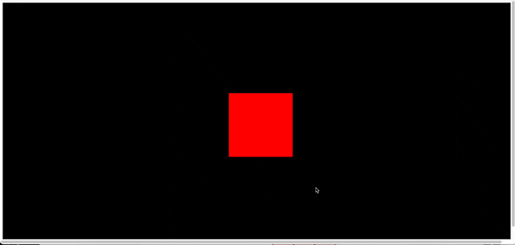
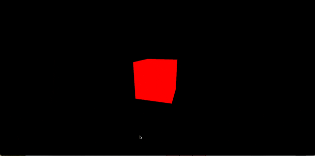
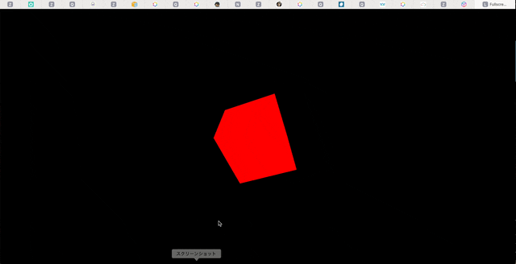
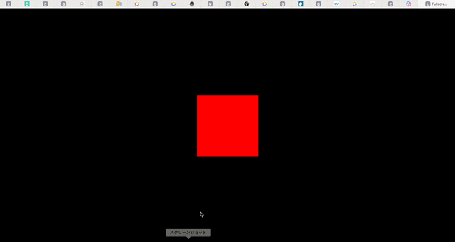
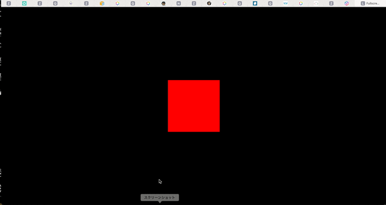
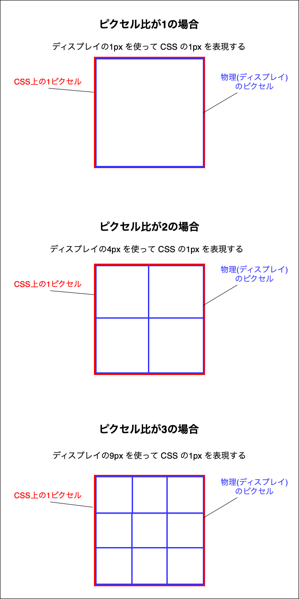
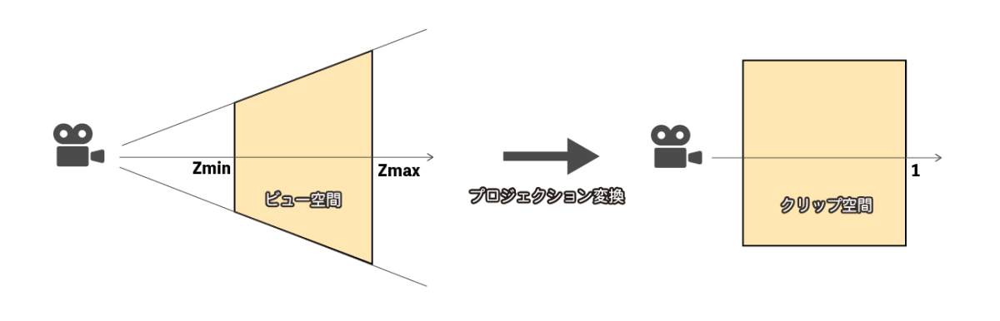

### 画面いっぱいにシーンを表示したい

1. Renderer のサイズをウィンドウの幅と高さに合わせる

    ```js
    const renderer = new THREE.WebGLRenderer({
        canvas: canvas
    });

    renderer.setPixelRatio(window.innerWidth / window.innerHeight);

    renderer.setSize(window.innerWidth, window.innerHeight);
    ```

    - 上下左右に白い余白がある

        → Body の margine

    

<br>


2. CSS でBodyの余白を消す & スクロールバーを非表示にする

    ```css
    html, body {
        margine: 0;
        overflow: hidden;
    }
    ```

    

    <br>

    もしくは、

    ```css
    .webgl {
        position: absolute;
        top: 0;
        left: 0;
        /**
        * ブラウザによってはビューポートに青枠が表示されることがあるらしい
        * その青枠を非表示にするスタイリング
        */
        outline: none;
    }
    ```

    

---

### ウィンドウのリサイズに対応して、キャンバスのサイズもリサイズしたい

1. resize イベントにイベントリスナーを登録する

    - Renderer のサイズをウィンドウの幅と高さに合わせる
    - Renderer のピクセル比も更新する → [ピクセル比も更新する理由](#オブジェクトを綺麗に表示したい)

    ```js
    window.addEventListner("resize", () => {
        // Update Scene
        renderer.setPixelRatio(window.innerWidth / window.innerHeight);
        renderer.setSize(window.innerWidth, window.innerHeight);
    });
    ```

    - 黒い部分 → シーンはウィンドウと共にリサイズされる
    - キューブ → ひしゃげてしまう

    

    <br>

2. オブジェクトがひしゃげるのを防ぐ

    - カメラの aspect を更新する
    - この時、カメラの[プロジェクション行列](#プロジェクション行列とは)も更新する

    ```js
    window.addEventListner("resize", () => {

        // Update Camera
        camera.aspect = sizes.width / sizes.height;
        camera.updateProjectionMatrix();

        // Update Scene
        renderer.setPixelRatio(window.innerWidth / window.innerHeight);
        renderer.setSize(window.innerWidth, window.innerHeight);
    });
    ```

    

---

### オブジェクトを綺麗に表示したい

Renderer の[ピクセル比](#ピクセル比とは)をデバイスのピクセル比に合わせる

```js
renderer.setAspectRatio(window.devicePixelRatio);
```

→ 上記の方法だと、ピクセル比が高いデバイスでパフォーマンス低下が起きる可能性がある [詳しくはこちら](#renderer-のピクセル比とパフォーマンス)

<br>

#### リサイズイベントのコールバック関数でも renderer の setAspectRatio を再設定するわけ

→ デュアルディスプレイユーザーが、ブラウザウィンドウをメインディスプレイからサブディスプレイに移動した際にも、リサイズイベントが発火する

→ メインディスプレイのピクセル比とサブディスプレイのピクセル比が異なる場合、画質の低下が起きる可能性があるので、リサイズイベント内でも renderer  のピクセル比を再設定している

---

### Renderer のピクセル比とパフォーマンス

#### そもそも、ピクセル比とは

CSS の 1px を何物理ピクセルで表すかの比率

$$CSS の 1px : 物理ピクセル数$$



<br>

#### パフォーマンスの問題

高い PixelRatio のディスプレイに renderer の PixelRatio を合わせると、1ピクセルを多くのデバイスピクセルを使って表現しようとする

→ 表示上の 1px に多くの計算時間がかかる = カクつきを起こしやすくなる

\[対策\]
- レンダラーのピクセル比に制限をかける
    - 例: Renderer の PixelRatio は 2 が上限。それより高いディスプレイでも PixelRatio 2 で対応

    - PixelRatio が1と2では画質の違いが顕著だが、2と3では1と2ほど違いが出ないらしい

    - min 関数を使って、ピクセル比の上限とディスプレイのピクセル比で小さい方を renderer のピィセル比に設定する

    ```js
    renderer.setAspectRatio(min( window.window.devicePixelRatio, 2));

    window.addEventListner("resize", () => {
        renderer.setAspectRatio(min( window.window.devicePixelRatio, 2));
    })
    ```

<br>
<br>

参考サイト

ピクセル比とパフォーマンスについて
- [安定しないフレームレートに効果的！WebGLのカクつき対策まとめ（Three.js編）](https://ics.media/entry/12930/#②-canvas要素の解像度を下げる)

ピクセル比とは
- [Webサイト制作でつまずきがちな解像度に関わるあれこれ](https://design-spice.com/2012/09/05/resolutio/)
- [Retinaディスプレイ対応](https://jobtech.jp/html_css/3852/)
- [デバイスピクセル比で画像を出し分ける方法](https://design-remarks.com/device-pixel-ratio/)

---

### プロジェクション行列とは

プロジェクション行列とは、カメラが撮る空間(ビュー空間)をクリッピング空間と呼ばれる正規化された空間に変換する計算に利用される行列

*クリッピング空間からさらに実際のスクリーンに対応する座標系を計算することで、正しくスクリーンに映すことができるらしい



引用: [【Unity】プロジェクション行列を改造して遊ぶ【URP】](https://zenn.dev/r_ngtm/articles/urp-modify-camera-matrix#プロジェクション座標変換)

<br>

ポイント
- camera.aspectRatio などのカメラが写す空間に関する設定を変更した場合、プロジェクション行列を更新しないと、カメラが撮る範囲がおかしくなってしまう

<br>
<br>

参考サイト

プロジェクション行列とは
- [YTTMWORK プロジェクション座標変換](https://yttm-work.jp/gmpg/gmpg_0004.html)

各行列と座標
- [【Unity】MVP行列による座標変換の概念と用語の整理](https://light11.hatenadiary.com/entry/2019/01/27/160541)

プロジェクション行列のイメージ
- [【Unity】【数学】Unityでのビュー＆プロジェクション行列とプラットフォームの関係](https://logicalbeat.jp/blog/929/)

WebGL で 3D 空間がスクリーン表示されるまで
- [WebGL2入門 3D知識編](https://sbfl.net/blog/2016/09/05/webgl2-tutorial-3d-knowledge/)

- [opengl-tutorial チュートリアル3：行列](http://www.opengl-tutorial.org/jp/beginners-tutorials/tutorial-3-matrices/)