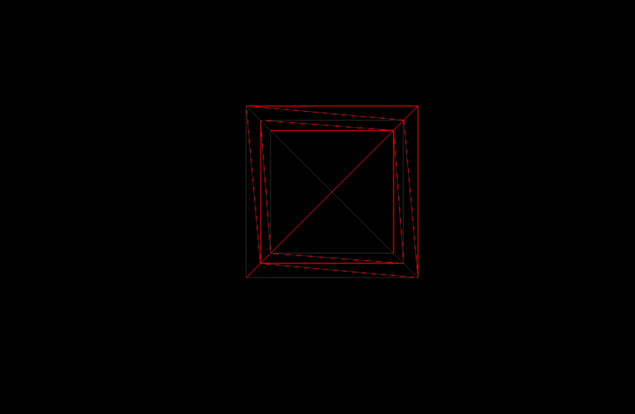

### Geometry とは

- Geometry は Mesh の形状(幾何学情報)
    - 頂点(vertex) を持つ
        - 各 vertex は **3D 座標**や **uv座標**、 **法線**、 **色情報**を持つ
    
    - 辺(edge)
        - 2つの頂点を結ぶ直線

    - 面(face) = ポリゴン
        - 3つの辺でつくられる表面の最小単位

    

    引用: [three.js入門 03: ジオメトリーを使う](https://fumiononaka.com/Business/html5/FN1704012.html)

    <br>


- 全てのビルトイン Geometry クラスは [BufferGeometry](#buffergeometry) クラスを継承している

<br>
<br>

参考サイト

[three.js入門 03: ジオメトリーを使う](https://fumiononaka.com/Business/html5/FN1704012.html)

---

### BufferGeometry

BufferGeometry とは
- 頂点、uv座標、法線、色などを自分で用意することで、自分の好きな形状のジオメトリを作成できるクラス

<br>

BufferAttribute
- BufferGeometry に渡すデータ(頂点、uv座標、法線、色など)を格納するクラス

<br>

#### 頂点データを作成し、 Geometry を作成する

1. 頂点データを格納する配列変数を用意する

    - Float32Array は Float しか格納できない配列

    ```js
    /**
     * 今回は3つの頂点データを格納する
     * 1つの頂点につき3つの数値(x, y, z)を持つので長さが　3*3 = 9 の配列を用意する
     */
    const positionArray = new Float32Array(9);
    ```

<br>

2. 配列に頂点データを格納する

    ```js
    const positionArray = new Float32Array(9);

    // 頂点1
    positionArray[0] = 0 // x座標
    positionArray[1] = 0 // y座標
    positionArray[2] = 0 // z座標

    // 頂点2
    positionArray[3] = 0 // x座標
    positionArray[4] = 1 // y座標
    positionArray[5] = 0 // z座標

    // 頂点3
    positionArray[6] = 1 // x座標
    positionArray[7] = 0 // y座標
    positionArray[8] = 0 // z座標
    ```

<br>

3. 頂点データを格納した配列を、**BufferAttributeに変換する**

    - BufferAttribute にインスタンス化に必要な引数 ([詳しくはこちら](https://threejs.org/docs/#api/en/core/BufferAttribute))
        - 第一引数: 配列データ (今回では頂点データを格納する配列)
        - 第二引数: アイテムサイズ
            - 配列の要素何個で1つのデータを表すのか (今回だと要素3個で1つの頂点情報を表す)

                → uv 座標だったら、1つの座標は2つの数値をもつ

                → 法線や色だったら、1つの数値で1つの法線/色を表す
            

    ```js
    // 頂点データを格納する配列の宣言や、各頂点データの作成は省略

    const positionAttr = new THREE.BufferAttribute(positionArray, 3);
    ```

<br>

4. BufferGeometry を作成し、 BufferAttribute を渡す

    - BufferGeometry へ BufferAttribute の渡し方
        - BufferGeometry.setAttribute() を利用する
            - 第一引数: Attribute名
                - 頂点の位置情報のデータだったら `positions`
                - uv座標のデータだったら `UVs`
                - 法線データだったら `normals`
                - 色データだったら `colors`

            - 第二引数: BufferAttribute

    ```js
    // BufferAttributeは作成ずみ
    const geometry = new THREE.BufferGeometry();
    // 今回は頂点の位置情報(座標)を渡すので Attribute名は positions
    geometry.setAttribute("positions", positionAttr);

    mesh.add(geometry, material);
    ```

    - 結果: 自分で作成した3点の頂点からジオメトリーが形成された
    

    

---

### セグメントとは

- ポリゴンの細分化の分割数

<br>

例: BoxGeometry にてセグメントの指定を試してみる


- セグメント数を指定しないで BoxGeometry を利用すると

    ```js
    const geometry = new THREE.BoxGeometry(1, 1, 1);

    const material = new THREE.MeshBasicMaterial({
    color: 0xff0000,
    wireframe: true,
    });

    const mesh = new THREE.Mesh(geometry, material);
    scene.add(mesh);
    ```
    
    - 各面は2ポリゴン(face)1組で構成される

    

<br>

- widthSegment を変更してみる

    ```js
    const geometry = new THREE.BoxGeometry(1, 1, 1, 2, 1, 1);
    ```

    

    

<br>

- heightSegment を変更してみる

    ```js
    const geometry = new THREE.BoxGeometry(1, 1, 1, 1, 2, 1);
    ```

    

    

<br>

- depthSegments を変更してみる

    ```js
    const geometry = new THREE.BoxGeometry(1, 1, 1, 1, 1, 2);
    ```

    

    

---

### 頂点 (verterx) とセグメント

セグメントを増やす = 頂点が増える、ポリゴン(face)が増える、辺が増える

メリット
- 頂点座標を変更することでもっと複雑な表現ができる
    - 関連項目: 頂点シェーダー

    

- セグメントを増やすことによって、より滑らか/精巧にオブジェクトの形状を表現することができる
    - SphereGeometry: セグメント数が少なければ角ばった球体に、セグメント数が多ければ滑らかな球体になる
    

<br>

デメリット
- セグメントが増えると、各頂点/辺/ポリゴンの計算量が増えるため、処理が重くなる

---

### BufferGeometry　の実験

- 4つの頂点データを渡すとどうなるか

    ```js
    const positionArray = new Float32Array(12);

    // 頂点1
    positionArray[0] = 0 // x座標
    positionArray[1] = 0 // y座標
    positionArray[2] = 0 // z座標

    // 頂点2
    positionArray[3] = 0 // x座標
    positionArray[4] = 1 // y座標
    positionArray[5] = 0 // z座標

    // 頂点3
    positionArray[6] = 1 // x座標
    positionArray[7] = 0 // y座標
    positionArray[8] = 0 // y座標

    // 頂点4
    positionArray[9] = 1 // x座標
    positionArray[10] = 1 // y座標
    positionArray[11] = 0 // y座標
    ```

    - 結果: 頂点1 ~ 3 を基にした三角形のジオメトリが作成された

    

    <br>

    - 推測: 3つの頂点で1つのポリゴンを作るので、4つの頂点座標を渡されても、1つのポリゴンしか作れない → 最初の3つの頂点座標で1つのポリゴンを作って終わりになった

