### Debug UI

- GUI でパラメーターを変更し、即時にオブジェクト/カメラ/シーンに反映することができるツールのこと

- 様々な Debug GUI がある
    - dat.GUI
    - lil-gui
    - Oui
    - Guify

    などなど

---

### lil-gui

事前準備

- lil-gui をインストール

    ```bash
    npm install -D lil-gui
    ```

<br>

利用方法

1. lil-gui から GUI クラスをインポートし、インスタンス化

    ```js
    import GUI from "lil-gui";

    const gui = new GUI();
    ```

<br>

2. GUI.add() にデバッグしたいパラメータオブジェクトとプロパティ名を渡す
    - オプジェクト: GUIコントローラーが操作するオブジェクト 

    - プロパティ名: コントロールするオブジェクトのプロパティ名

    ```js
    // GUI インスタンスは定義ずみ

    const mesh = new THREE.Mesh(geo, mat);
    scene.add(mesh);

    gui.add(mesh.position, "y");
    ```

    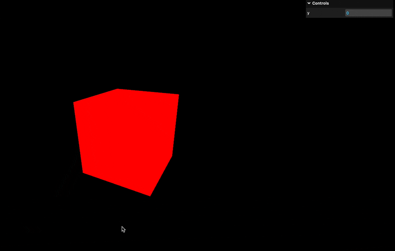

<br>

3. スライダーでパラメーターを変化できるようにしたい

    - GUI.add().min(最初値).max(最大値)(.step())を設定する

    ```js
    gui.add(mesh.position, "y").min(-5).max(5);
    ```

    

    <br>

    - step() を指定すると step()に渡した値刻みにパラメーターを変化させることができる

    ```js
    gui.add(mesh.position, "y").min(-5).max(5).setp(1);
    ```

    

<br>

4. オブジェクトのプロパティの種類によって、GUIに表示されるコントローラーが異なる

    - position.y や rotation.x のような floatなどの数値は、テキストボックス or スライダー

    - mesh.wireframe や mesh.visible のような bool 値はチェックボックス

        ```js
        gui.add(mesh, "wireframe");
        gui.add(mesh, "visible");
        ```

        

        <br>

    - function はボタンで実行できるようになっている
        - *function を直接 GUI.add に渡してはいけない

        - *function を持つ object を第一引数に設定し、第二引数に function のプロパティ名を指定する

        ```js
        import gasp from "gsap";

        // mesh をy軸を中心に1回転させる関数を持つオブジェクトを作成
        const manipulationObj = {
            revolution: () => {
                gsap.to(mesh.rotation, {
                duration: 1,
                y: mesh.rotation.y + Math.PI * 2,
                });
            },
        };

        gui.add(manipulationObj, "revolution");
        ```

        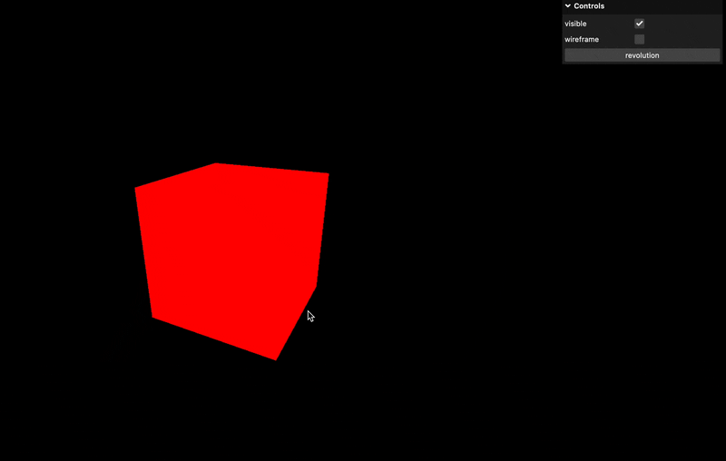
    
<br>
<br>

参考サイト

lil-gui リファレンス
- [lil-gui](https://lil-gui.georgealways.com)

---

### 色を Debug GUI (lil-gui) でデバッグできるようにした場合

- GUI.addColor() を利用する
    - 第一引数: GUIコントローラーが操作するオブジェクト (Three.js では Material インスタンスを渡す)
    - 第二引数: コントロールするオブジェクトのプロパティ名

    ```js
    const material = new THREE.MeshStandardMaterial({ color: "#ff0000"});

    gui.addColor(material, "color");
    ```

    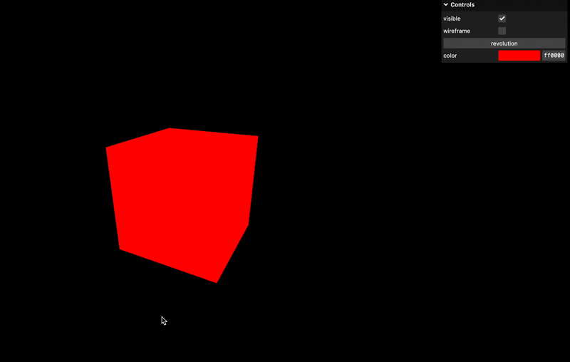

<br>

カラーをデバッグする際の問題点

- デバッグUIに表示されているカラーコードと、Three.js内部で処理されているカラーコードは異なる

    → render インスタンスが内部的にガンマ補正という処理を行なっているかららしい

<br>

\[例\]: デバッグGUIで選択したカラーコードを mesh のカラーコードに設定してみる

1. 現在のマテリアルの色は赤に設定されている

    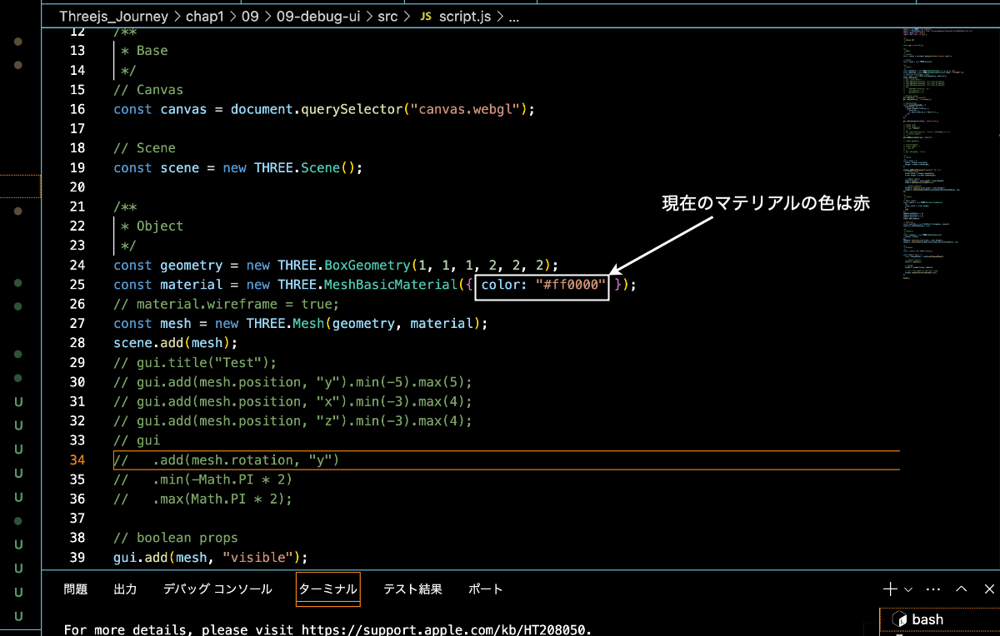

<br>

2. デバッグ GUI のカラーピッカーで好きな色を選択し、カラーコードを控える

    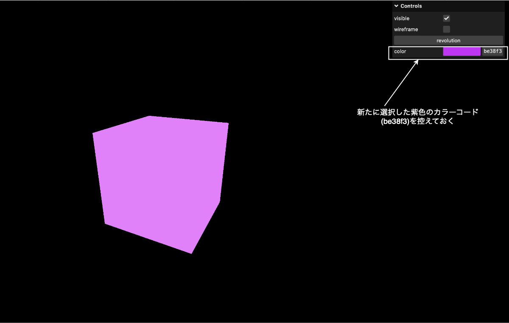

<br>

3. 控えておいたカラーコードを js ファイルのマテリアルのcolorに設定する

    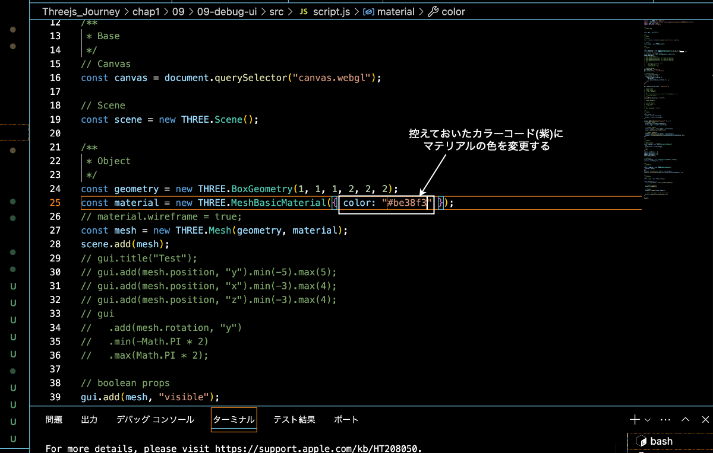

<br>

4. デバッグ GUI で見た時の色より暗くなってしまう

    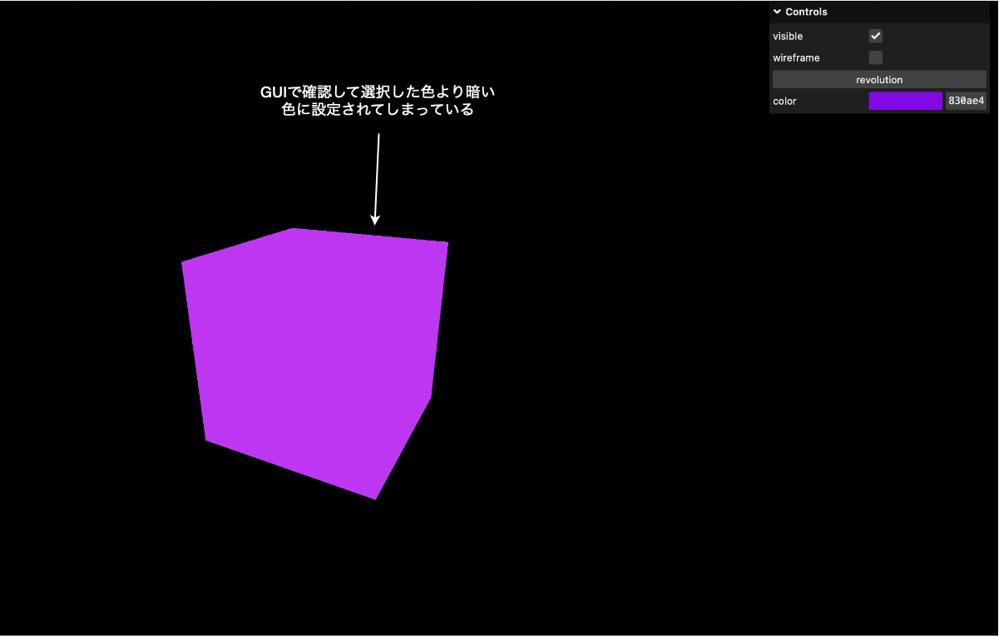

    → デバッグ GUI で表示されているカラーコードと、 Three.js 内部で処理されているカラーコードが違っているから

    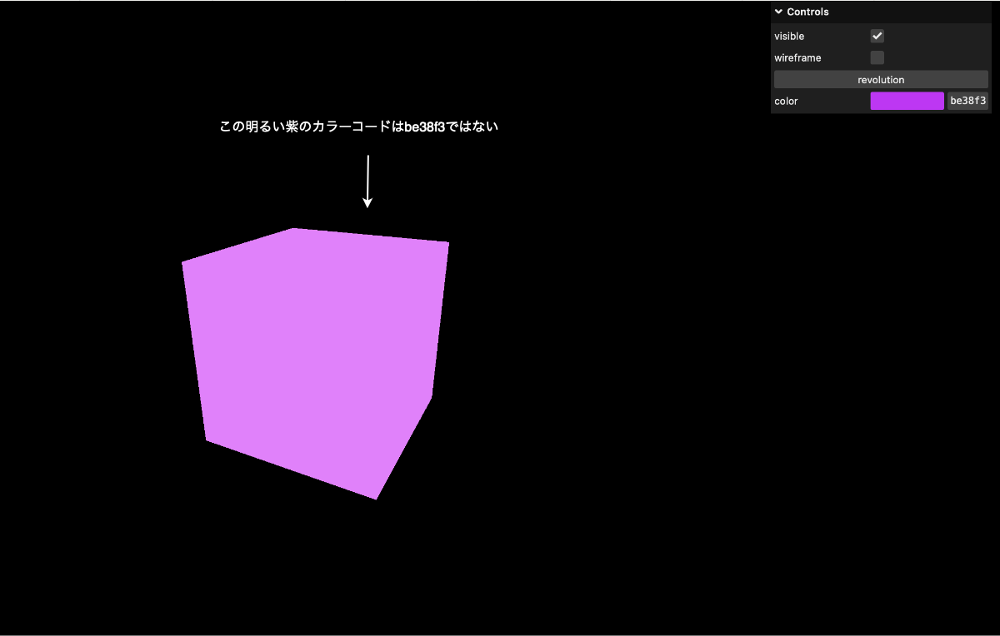

<br>

うまく、デバッグGUIで選択したカラーコードを適用する方法は、  
$\color{red}デバッグGUIからカラーコードを拾うのではなく、コードで選択された色を取得する$


- GUI.addColor().onChange()　のコールバック関数内で、選択されたカラーコードを表示する

    - onChange() の引数はコールバック関数
    - コールバック関数の引数は Color オブジェクト

    ```js
    gui.addColor(material, "color").onChange((value) => {
        // vaule は Color　オブジェクト
        // Color.getHexString() で16新数表記のカラーコードを取得することができる
        console.log(value.getHexString());
    });
    ```

    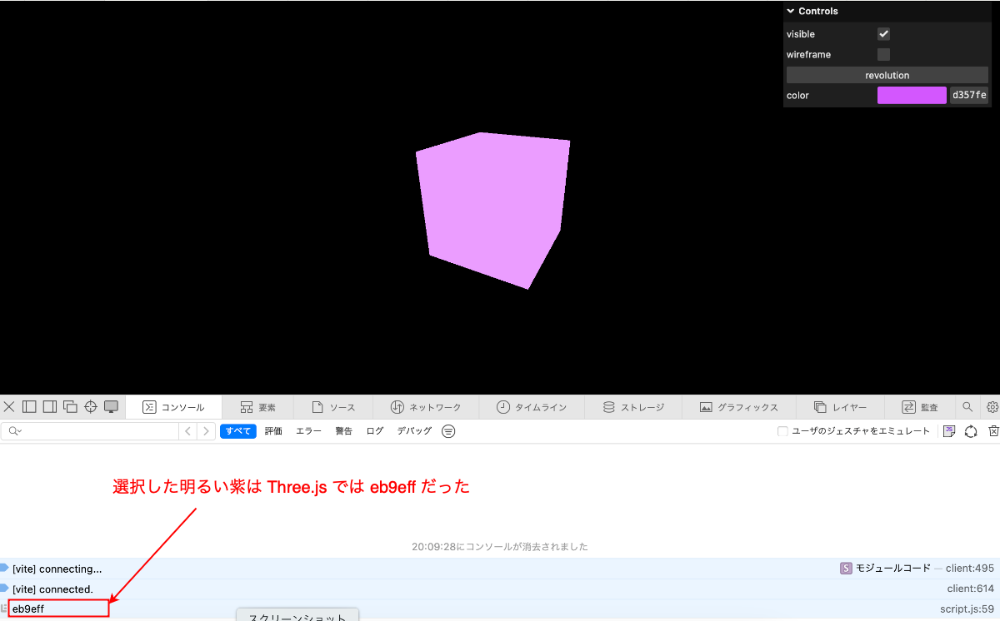

<br>

- コードで取得したカラーコードをマテリアルに適用してみる

    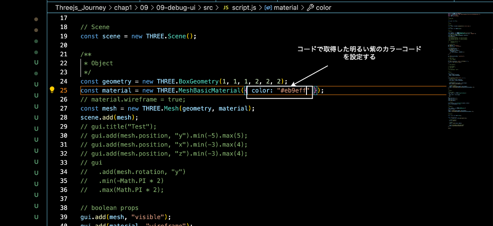

    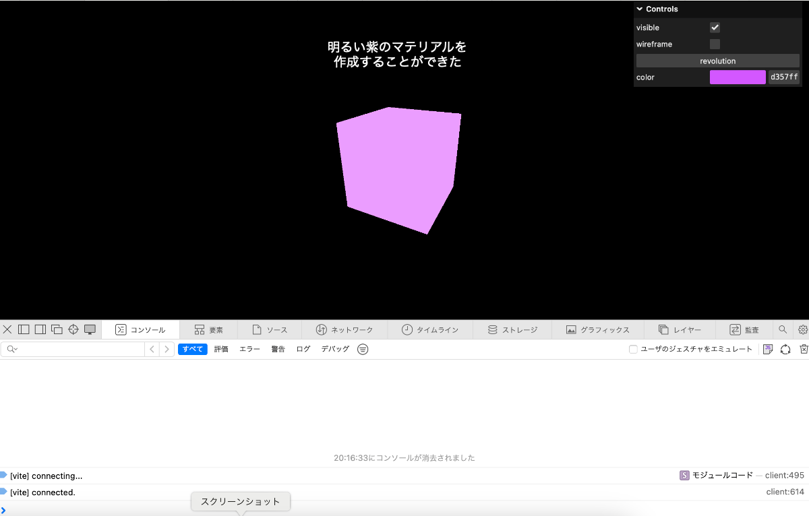

<br>

デバッグ GUI で選択された色を任意のオブジェクトに保持する方法もある

```js
const obj = {
    color: "#ff0000",
};

const material = new THREE.MeshStandardMaterial({ color: obj.color });

// ★material オブジェクトでは無く、 自分で作成したカラーコードを保持するオブジェクトを渡しているのがポイント
gui.addColor(obj, "color").onChange(() => {
    material.color.set(obj.color);
});
```

<br>

イメージ図
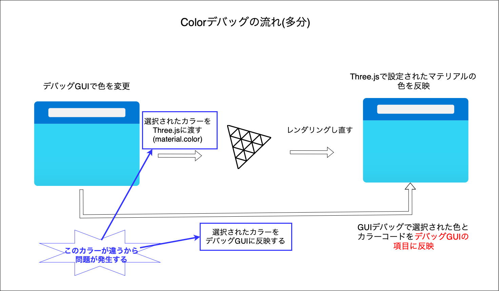
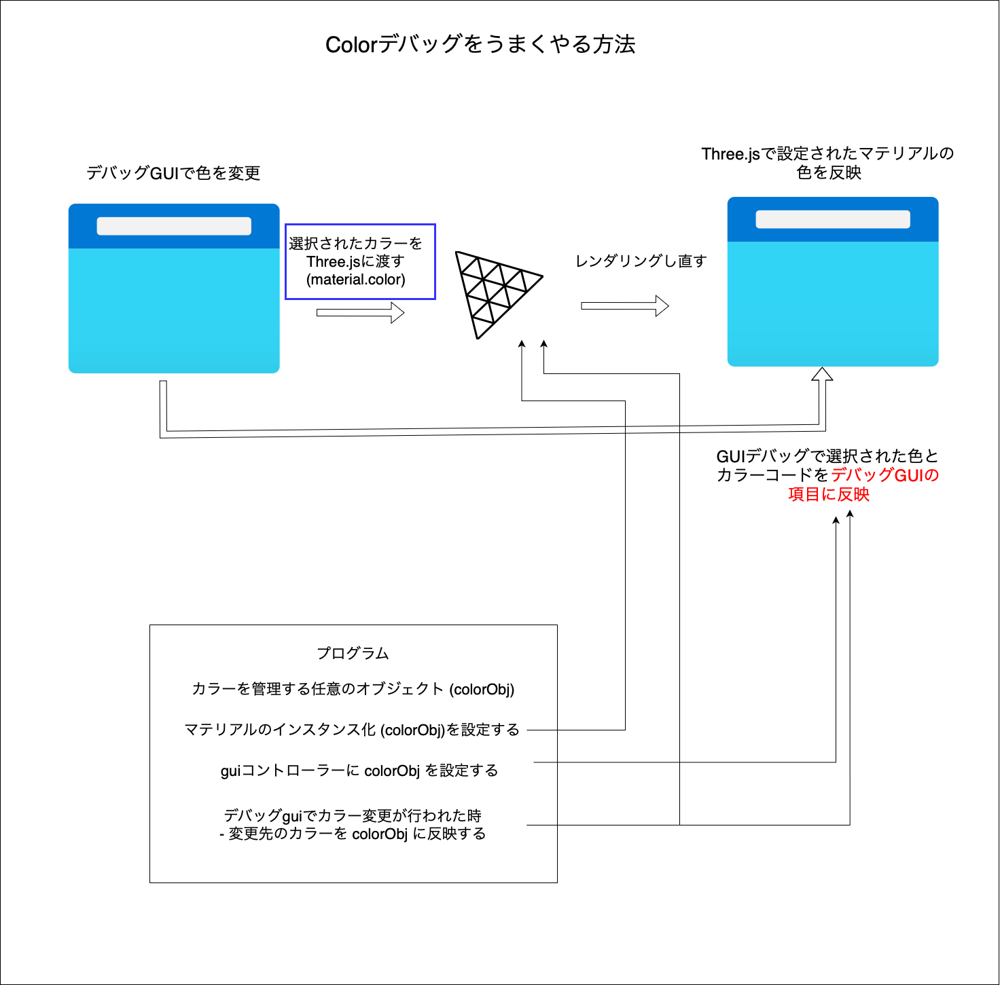

---

### ジオメトリのデバッグ

**ジオメトリ情報をデバッグUIに追加する間違った方法**

```js
const geometry = new THREE.BoxGeometry(1, 1, 1, 2, 2, 2);

gui.add(geometry, "heightSegment").onChange(() => {
    // BoxGeometry インスタンスの heightSegment を変更する
});
```

*width/height/depthSegment はジオメトリインスタンス作成時に使用されるが、インスタンス内部のパラメーターとしては保持されない

→ gui.add() の第二引数に~segmentプロパティとして指定することができない

<br>

また、そもそも
$\color{red}ジオメトリ情報(幅/高さ/深さ/セグメント数)は、作成後に更新はできない$ らしい

→ デバッグUIによってジオメトリ情報が変更されたら、その情報を元に新しいジオメトリを作成し直す必要がある

<br>

ここまでのポイント
- ジオメトリインスタンスに ~segment プロパティはない
    - 自分で、~segment の値を保持するインスタンスを作成する必要がある

- ジオメトリ情報が更新されたら、作成ずみのジオメトリのプロパティを書き換えるのではなく、新しいジオメトリを作成する必要がある
    
```js
// ~segment の値を保持するインスタンス
const geometryObj = {
    widthSegment: 2,
    heightSegment: 2,
    depthSegment: 2
};

gui.add(geometryObj, "widthSegment").min(1).max(10).step(1).onChange((v) => {
    //ジオメトリ情報が更新されたら、新しいジオメトリを作成
    mesh.geometry = new THREE.BoxGeometry(1, 1, 1, v, 1, 1);
});
```

<br>

*gui.add()のオブジェクトのプロパティはコールバックで値を受け取らなくても、デバッグ GUI 上で変更されると、即時反映される

→ 上記コードは以下のようにも書ける

```js
gui.add(geometryObj, "widthSegment").min(1).max(10).step(1).onChange(() => {
    //ジオメトリ情報が更新されたら、新しいジオメトリを作成
    mesh.geometry = new THREE.BoxGeometry(1, 1, 1, geometryObject.widthSegment, 1, 1);
});
```

<br>

#### 古いジオメトリの廃棄

- 新しいジオメトリを作成して、mesh.geometry に割り当てた時
    - 古いジオメトリインスタンスはどこからも参照されないが、メモリ内にはまだ残っている

       → 明示的に古いジオメトリを廃棄(メモリの解放)をしないと、メモリリークが発生する

    - Geometry.dispose() で、dispose を呼んだジオメトリインスタンスを廃棄する

```js
gui.add(geometryObj, "widthSegment").min(1).max(10).step(1).onChange(() => {
    // 古い = もう使用しないジオメトリの廃棄
    mesh.geometry.dispose();

    mesh.geometry = new THREE.BoxGeometry(1, 1, 1, geometryObject.widthSegment, 1, 1);
});
```

<br>

#### ジオメトリのデバッグと onChange()

- ジオメトリのデバッグの時、やっていはいけないこと
    - スライダーでジオメトリの値をデバッグさせたい場合、**gui.onChange()** でジオメトリパラメーターをデバッグしてはいけない

        -> スライダーを動かしている最中にも onChange が発火し、ジオメトリの廃棄と作成が大量に走り GUP に負荷がかかる

        ```js
        // やってはいけない例
        gui.add(geometryObj, "widthSegment").min(1).max(10).onChange(() => {
            mesh.geometry.dispose();
            mesh.geometry = new THREE.BoxGeometry(1, 1, 1, geometryObject.widthSegment, 1, 1);
        });
        ```

<br>

- 解決方法: onChange() ではなく onFinishChange() を使う

    - onFinishChange() の発火タイミング: 
        - テキストボックス: 値を入力し終わったら
        - チェックボックス: チェックボックスをクリックし終わったら
        - スライダー: **スライダーを動かし終わったら**

    - よって、スライダーでジオメトリをデバッグ(操作)する場合、 onFinishChange() でスライダーを動かし終わった値を元に新しいジオメトリの作成を行えば良い

        ```js
        gui.add(geometryObj, "widthSegment").min(1).max(10).step(1).onFinishChange(() => {
            // 古いジオメトリの廃棄と新しいジオメトリの作成&メッシュに適用
        });
        ```

<br>

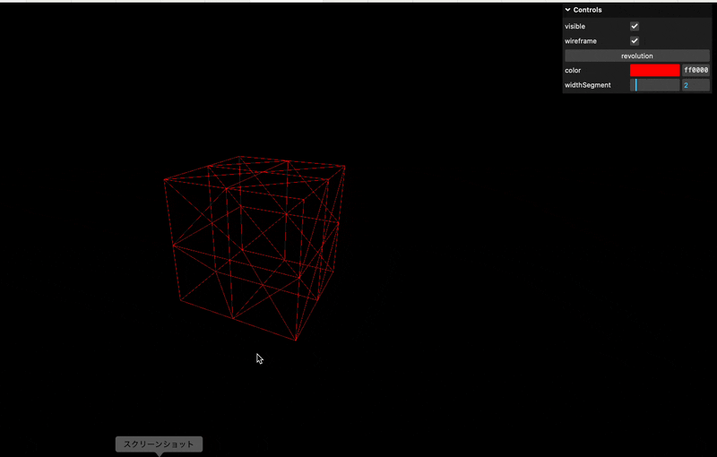

----

### addFolder()

デバッグUIの項目をまとめることができる機能

<br>

- gui.add でコントロールするパラメーターを追加していった場合
    - `controls` タブ直下に全ての項目が追加されている

    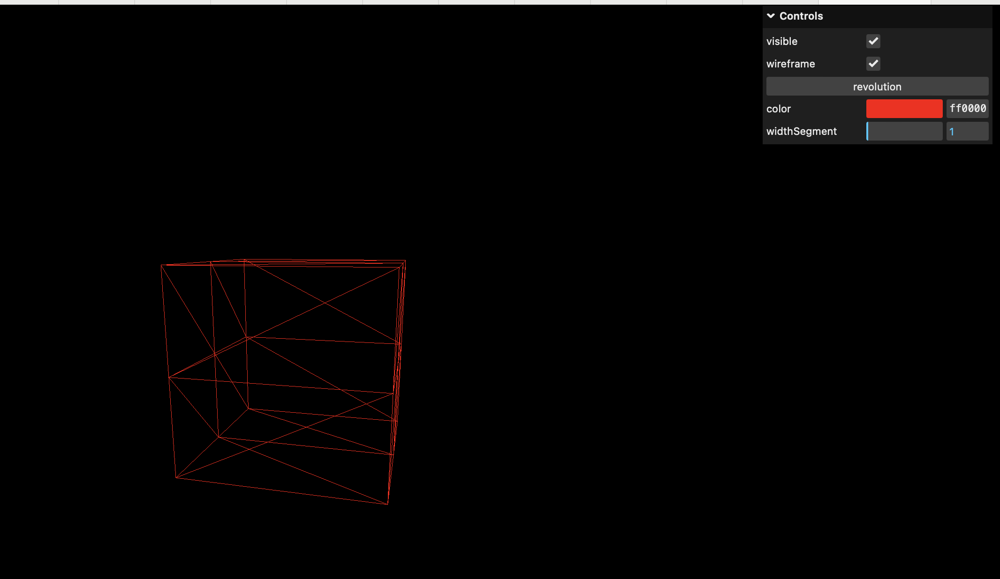

<br>

- gui.addFolder()
    - 引数: フォルダ(タブ)名
    - 戻り値: GUI

    ```js
    import GUI from "lil-gui";
    const gui = new GUI();
    const geometryObj = {
        widthSegment: 1,
    };

    // メッシュに関連する項目を追加するGUI
    const meshTweak = gui.addFolder("mesh");
    // マテリアルに関連する項目を追加するGUI
    const materialTweak = gui.addFolder("material");
    // ジオメトリに関連する項目を追加するGUI
    const geometryTweak = gui.addFolder("geometry");

    meshTweak.add(mesh.position, "y").min(-5).max(5);
    materialTweak.add(mesh.material, "wireframe");
    geometryTweak.add(geometryObj, "widthSegment").min(1).max(10).step(1).onFinishChange((v) => {
        mesh.geometry.dispose();
        mesh.geometry = new THREE.BoxGeometry(1, 1, 1, v, 1, 1);
    });
    ```
    結果: `controls` の直下に3つのフォルダ(タブ)が作成され、それぞれのタブ直下にそれぞれの項目が表示されている
    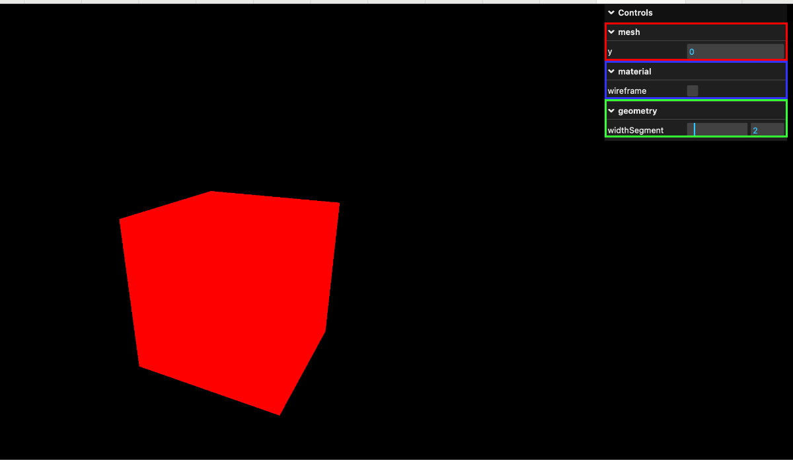

---

### デバッグUIのレイアウト変更

- サイズの変更

    *デバッグUIの横幅のみ変えることができる。高さは変えることができない

    - 方法: コンストラクタに　`{width: ~~~}` を渡す

    ```js
    const gui = new GUI({width: 800});
    ```

    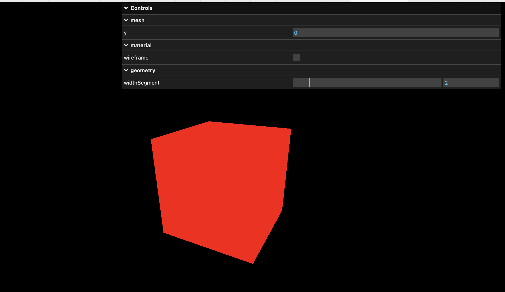

<br>

- タイトルの変更

    - デフォルトではデバッグGUIのタイトルは `controls`

    - 方法: コンストラクタに `{title: "新しいタイトル"}` を渡すか、 `GUIインスタンス.title = "新しいタイトル"` で設定する

    ```js
    const gui = new GUI({ title: "new title!"});

    // もしくは
    gui.title = "new title!!!!";
    ```

    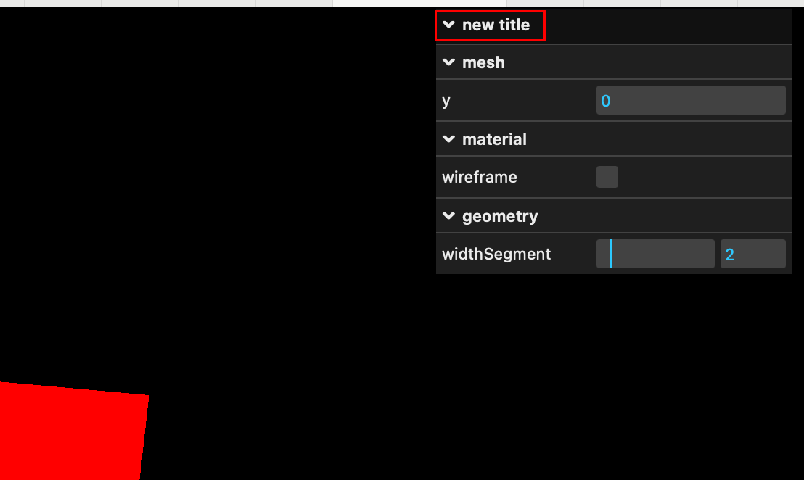

<br>

- デバッグ GUI やフォルダーをデフォルトで閉じる

    - デバッグ GUI を閉じる場合
        - `guiインスタンス.close()` を呼ぶ

    ```js
    const gui = new GUI();
    gui.close();
    ```

    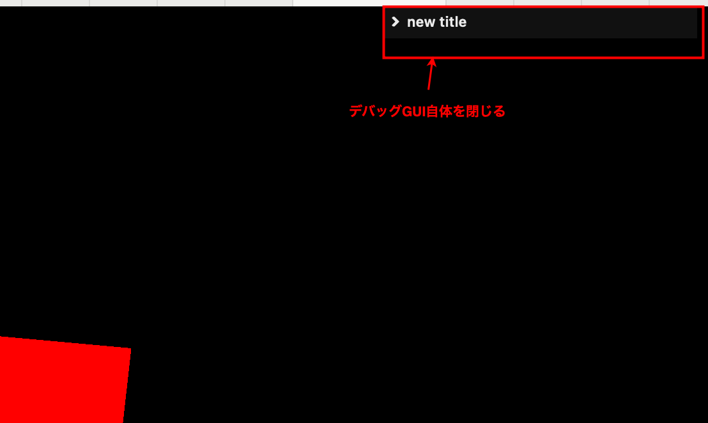

    <br>

    - フォルダーを閉じたい場合
        - コンストラクタに `{closeFolders: true}` を渡す

    ```js
    const gui = new GUI({ colseFolders: true });
    ```

    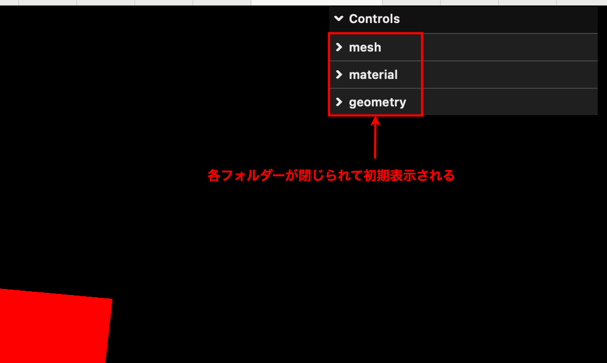
    


<br>

- デバッグUI を非表示にする

    - `guiインスタンス.hide()` を呼ぶ

    ```js
    const gui = new GUI();
    gui.hide();
    ```

    <br>

    - 実用的な使い方としては、とあるキーを押したら デバッグGUI の表示/非表示を切り替えるといった使い方がある

    ```js
    window.addEventListner("keydown", (e) => {
        if (e.key == "h") {

            // gui._hiddenはguiがhide状態であればtrue、そうでなければfalseが入る
            gui.show(gui._hidden)
        }
    })
    ```