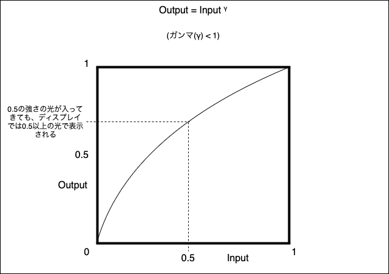

### カラー空間

- 色を数値で表現するための体系的な方法
    - 色相、彩度、明度などの数値で色を表す

    - 上記要素は色を表すための座標系のようなもの

        以下は RBG の色空間
        

<br>

- 代表的なカラー空間
    - RGB
    - CMYK
    - HSV

<br>

- 広義の意味でのカラー空間と狭義の意味でのカラー空間
    - 広義: 狭義の意味のカラー空間 + [ガンマ](#ガンマとは)

    - 狭義: 数値で色を表現するための方法 = 本来の意味でのカラー空間

<br>
<br>

参考サイト

[色空間（カラースペース）とは何か、そしてACESが必要な理由とは](https://garagefarm.net/jp-blog/what-is-color-space-and-why-you-should-use-aces)

[色空間（カラースペース）とは？基本から応用まで解説](https://it-note.stylemap.co.jp/others/color-space→-understanding-the-basics-and-applications/)

---

### テクスチャを読み込んだ後の coloｒSpace の設定の意味

以下のコードは何を表しているのか?

```js
texture.colorSpace = THREE.SRGBColorSpace;
```

<br>

テクスチャーのカラー空間は sRGB ですと明示的に指定している

→ Three.js が自動でテクスチャーのカラー空間を判断することはできないため

→ また、テクスチャーのカラー空間はデフォルトだと空("")なため、デフォルトのままだと、テクスチャーの変換(補正)がされない

<br>

ここで疑問

- なぜテクスチャーのカラー空間を Three.js に伝える必要があるのか?

    - どうやら、内部でテクスチャーのカラースペースを別のカラースペースに変換して処理を行なっているらしい ([リニアーワークフロー](#リニアーワークフロー)を参照)

<br>

注意点

- テクスチャーのカラースペースを指定しないと、実際のテクスチャー画像よりも明るい画像が表示される問題が発生することがある

    →[原因](#threejs-にてテクスチャーのカラースペースを指定いなかった時にテクスチャーの色が実際のものより明るく表示されてしまった理由)

<br>
<br>

参考サイト

[Three.js備忘録（2）](https://koro-koro.com/threejs-no2/)

[Three.jsのカラー管理](https://zenn.dev/mebiusbox/articles/3016e220bfbd99#📌-テクスチャ)

[three.jsのテクスチャが意図した色合いにならない時](https://qiita.com/yoshiya_sugimoto/items/eeeee0113726bf290a00)

---

### sRGB とは

R, G, B の値が物理的な実際の色とどう対応するを表現する一種

→ RGB の規格のうちの1つ

---

### ガンマとは

- ガンマとは画像や映像の輝度を調整するための関数

    - Input は入力される光 (実際の輝度)
        - 通常は 0 ~ 1 の範囲に正規化されている

    - Output はディスプレイなどに出力される光 (見た目の輝度)
        - 通常は 0 ~ 1 の範囲に正規化されている

    - ガンマ値とは下記関数にて使用される変数(実数値)

    

    引用: [ガンマについて](http://compojigoku.blog.fc2.com/blog-entry-23.html)

<br>

- 現実の世界では、光の強度 (input) が0から1に増加すると、明るさ (output) はそれに比例して増加する (線形)

    →これは ガンマ(γ) = 1のグラフと同じ

    

<br>

#### なぜガンマは必要なのか?

- 実は、我々が見ているディスプレイの多くはガンマ値=2.2で補正をかけている = ガンマが利用されている

    - 疑問: なぜディスプレイのガンマ(値)は1.0じゃないのか? ガンマ値 = 1.0ならば、そのまま自然のコントラストを映せそうなのに、、、

        <br>

        上記疑問については様々な説がある

        - 昔のブラウン管が大体 ガンマ値 = 2.2 だったらしく、ディスプレイもその名残で同じようなガンマ値で表示している

        - 人間の視覚もガンマ (ガンマ値が約0.4) が働いており、我々人間がディスプレイを見た時に自然な感覚のコントラストになるようにガンマで補正をかけている

<br>

#### ガンマの値とディスプレイでのみえ方


引用: [ガンマについて](http://compojigoku.blog.fc2.com/blog-entry-23.html)

<br>

上記のガンマ(変形関数)について、ガンマ値(Gamma) をいじると、グラフは以下のように変化する


引用: [ガンマについて](http://compojigoku.blog.fc2.com/blog-entry-23.html)

<br>

- ガンマ > 1 の時、グラフのは下に凹むような形になる

    - なぜ $\text{Output} = \text{Input}^\gamma$ で γ \> 1 の時 $\text{Output} <= \text{Input}$ になるのか?

        - Input は 0 ~ 1の範囲で正規化されているから

    - Output は Input よりも小さくなる = 暗くなる
        - とある画像を γ \> 1 のディスプレイで表示すると、実際の画像より暗く表示される

    

<br>

- ガンマ < 1 の時、グラフのは上に膨らむような形になる

    - Output は Input よりも大きくなる = 明るくなる

        - とある画像を γ \< 1 のディスプレイで表示すると、実際の画像より明るく表示される

    

<br>

#### ガンマ補正とは

- 目的: ガンマが作用しているディスプレイでもリニア(γ = 1)に表示したい

- ガンマ補正とは: ディスプレイ表示時に画像のガンマがリニアになるように、ディスプレイに送る画像のガンマ値を修正すること

- ガンマ補正は以下の関数を利用する

    

    引用: [ガンマについて](http://compojigoku.blog.fc2.com/blog-entry-23.html)

    <br>

    ディスプレイにかかっているガンマ値を打ち消す逆数の指数を利用する

    - もし、ディスプレイのガンマ値が2.2だった場合、前もって画像に ガンマ値 $\frac{1}{2.2}$ を適用する = ガンマ補正

    $$Output = input^\frac{1}{2.2}$$

    - 上記のガンマ補正のかかった画像をディスプレイに表示するとき、ガンマ値 = 1 のリニアな表示になる

    $$
    Output = (input^{2.2})^\frac{1}{2.2} \\[10pt]
    Output = input^{(2.2 \times \frac{1}{2.2})} \\[10pt]
    Output = Input^{1}
    $$

<br>

イメージ
- ディスプレイに表示する画像に前もってガンマ補正をかける

    

    引用: [第1回：リニアワークフローについて＜その1＞](https://area.autodesk.jp/column/tutorial/designviz_essence/1_about_linearworkflow_1/)

    

    引用: [第7回 "曲線美"が色再現性の決め手になる？――液晶ディスプレイの「ガンマ」を知ろう](https://www.eizo.co.jp/eizolibrary/other/itmedia02_07/)

    

    引用: [ガンマについて](http://compojigoku.blog.fc2.com/blog-entry-23.html)

<br>
<br>

参考サイト

ガンマについて
- [ガンマとは何か](https://cg-squid.com/2022/07/03/gammatohananika/#toc2)

- とてもわかりやすい!: [ガンマについて](http://compojigoku.blog.fc2.com/blog-entry-23.html)

- [カラースペース（色空間）とガンマ](https://vook.vc/n/3715#)

- [ガンマ補正 #1](https://note.com/lydiacorp/n/nce678f89c347)

ガンマが必要な理由
- なぜディスプレイのガンマは1じゃないのか: [第11回　HDR映像（2） 二つのHDRガンマカーブの違い](https://www.eizo.co.jp/eizolibrary/color_management/colorworkflow/series-11.html)

- なぜディスプレイのガンマは1じゃないのか: [4. コンピュータとガンマ](http://rutenshikai.blog63.fc2.com/blog-entry-465.html?sp)

- [ガンマについて（理論編）](http://maxmint.blog82.fc2.com/blog-entry-27.html)

---

### リニアーワークフロー

- 3DCG ソフト、Unity、Three.js などの**内部では、画像などを [リニアー色空間 (Linear Color Space)](#リニアー色空間とは) で扱い**、**処理結果は元の色空間(+ガンマ補正)に戻す** ワークフロー(一連の処理の流れ)のこと

<br>

#### リニアーワークフローの具体的なイメージ

1. 画像などを取り込む際に、その画像にかかっているガンマ補正を取り払う
2. 上記で取得したリニアーな物を内部で処理
3. 処理結果をリニアー → 元のカラー空閑(+ ガンマ補正)に変換する


引用: [分かる！リニアワークフローのコンポジット](http://compojigoku.blog.fc2.com/blog-entry-26.html)


引用: [【Unity】Linearワークフロー と Gammaワークフローについてまとめてみる](https://r-ngtm.hatenablog.com/entry/2021/01/21/010643)

<br>

#### リニアーワークフローの必要性

- 実際の物理的な光の強度と同じ方法で色を表現するため

- ガンマ補正されたテクスチャを使用して物体にライティングを行うと、物体の表面で正しい光の反射を計算することができず、結果として不自然な見た目になる

    - よって、内部処理ではリニア空間で光の計算を行い物理的に正しい結果を得る

<br>

#### リニアー色空間とは

- AIの回答
    ```
    リニアー色空間は、通常RGB色空間に関連付けられます。しかし、RGBにもいくつかの形式があります。リニアーRGBは、輝度に基づいて色を表現する方法であり、色の計算や合成を行う際に非常に重要です。一般的なRGBは、ガンマ補正が施されているため、リニアーではありません。

    HSLやCMYKは、リニアー色空間ではなく、どちらも異なる目的や用途に応じた色空間です。HSLは色相、彩度、明度を表現する方法で、CMYKは印刷などのために非光源色（減法混色）として使用されます。

    したがって、リニアー色空間は主にリニアーRGBで扱われることが多いですが、それ以外の色空間（HSLやCMYK）とは異なります。
    ```

<br>

- ざっくり言うと、RGB で ガンマ値 = 1 のカラースペース

<br>
<br>

参考サイト

[分かる！リニアワークフローのコンポジット](http://compojigoku.blog.fc2.com/blog-entry-26.html)

わかりやすい: [【Unity】Linearワークフロー と Gammaワークフローについてまとめてみる](https://r-ngtm.hatenablog.com/entry/2021/01/21/010643)

[物理ベースレンダリング -リニアワークフロー編 ](https://tech.cygames.co.jp/archives/2296/)

[第1回：リニアワークフローについて＜その1＞](https://area.autodesk.jp/column/tutorial/designviz_essence/1_about_linearworkflow_1/)

[CG de カラマネ！第13回：「カラーマネジメントとリニアワークフローの違い」](https://cgworld.jp/regular/cms013.html)

---

### ガンマワークフロー

リニアーワークフローとは異なり

- 内部での計算の前のリニアー色空間に変換は**しない**

- 計算結果にガンマ補正は**かけない**

- テクスチャーの色空間(+すでにかかっているガンマ補正)によっては、処理結果がリアルに見えないかも

<br>

#### わかりやすいイメージ


引用: [【Unity】Linearワークフロー と Gammaワークフローについてまとめてみる](https://r-ngtm.hatenablog.com/entry/2021/01/21/010643)

<br>
<br>

参考サイト

[【Unity】Linearワークフロー と Gammaワークフローについてまとめてみる](https://r-ngtm.hatenablog.com/entry/2021/01/21/010643)

---

### Three.js にてテクスチャーのカラースペースを指定いなかった時にテクスチャーの色が実際のものより明るく表示されてしまった理由

- Three.js にてテクスチャーのカラースペースを指定しないと、テクスチャー(画像)はリニアー色空間のテクスチャーだと認識される (たぶん)

- リニアーワークフローでは、そもそもの画像(テクスチャー)がリニアー色空間のものだと、**入力画像をリニアー色空間に変換する処理がない**

    →ガンマ補正をかけてリニアーに直さない (すでにリニアーと認識されてるから)

- リニアー色空間の(だと認識された)画像を内部で計算する。その後、計算結果にガンマ補正をかけるので実際の画像より明るい補正がかかってディスプレイに表示される
    - sRGB の(補正)ガンマ値は 2.2 なので、以下のガンマ補正が働く

        $$Output = Input^\frac{1}{2.2}$$

<br>

わかりやすいイメージ画像


<br>
<br>

参考サイト

[【Unity】Linearワークフロー と Gammaワークフローについてまとめてみる](https://r-ngtm.hatenablog.com/entry/2021/01/21/010643)
