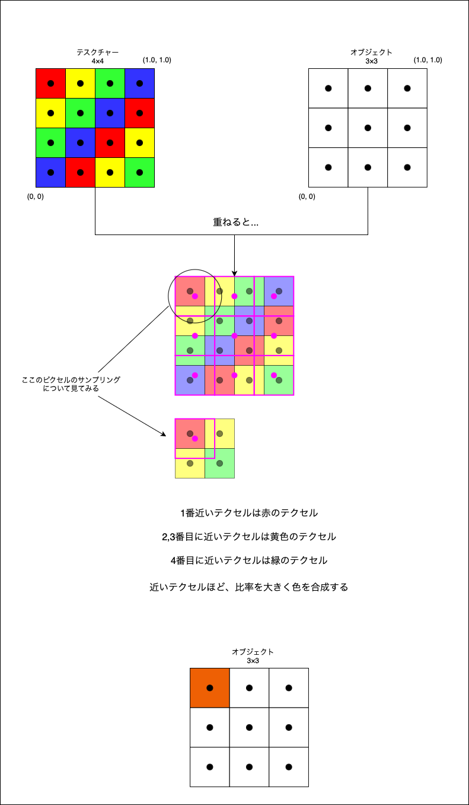

### テクセルとは

テクスチャーの画素のこと (テクスチャーのピクセルのイメージ)


---

### テクスチャーのサンプリングとは

3D オブジェクトの各頂点の uv 座標 に対応するテクセルの色を取得するプロセスのこと

*サンプリングの方法はいろいろある

**イメージ的には**オブジェクトの各ピクセルに対応するテクスチャー(テクセル)の色を取得する = サンプリング


---

### サンプリングの種類

#### Nearest Neighbourhood (ポイントサンプリング)

- ピクセルの uv 座標にもっとも近い座標のテクセルの色をサンプリングする方法

    

<br>

- 色の合成をしないため、テクスチャとオブジェクトのサイズが 1:1 でない場合、テクスチャの情報が欠損してしまう可能性がある

    

<br>

#### Bilinear Filtering (Bilinear Interpolation)

- オブジェクトのピクセルの uv 座標にもっとも近い4つの座標のテクセルの色を合成してサンプリングする方法

    - 4つのテクセルの uv 座標とピクセルの uv 座標との距離によって、どのぐらいそのテクセルの色が合成されるか決まる

        

        
    
- 計算を必要とするため、Nearest Neighbourhood よりは遅い

- Nearest Neighbourhood よりは滑らかに見える

<br>

#### Trilinear Filtering

- オブジェクトのサイズと一番近いテクスチャと1レベル高い [mip](#mipmapとは) でそれぞれ Bilinear Filtering を行い、それぞれの結果にさらに Linear Filtering (線形な補色) をかける

    - 合計3回 Linear なサンプリングを行うので Trilinear

    

- Bilinear Filtering より遅い

- Bilinear Filtering よりは滑らかに見える

<br>

他にも[異方性フィルタリング (Anisotropic Filtering)](#異方性フィルタリング) や三次たたみ込み内挿法 (Cubic convolution) などのサンプリング方法がある

<br>
<br>

参考サイト

とてもわかりやすい記事: [Textures and Sampling](https://cglearn.eu/pub/computer-graphics/textures-and-sampling)

[テクスチャマッピング](https://tkengo.github.io/blog/2015/01/27/opengl-es-2-2d-knowledge-5/)

[チュートリアル5：テクスチャされた立方体](http://www.opengl-tutorial.org/jp/beginners-tutorials/tutorial-5-a-textured-cube/#フィルタリングとミップマップの使い方)

[GPG雑学：バイリニアフィルタ - 画像を拡大する方法](https://blog.habanero.jp/2020/06/gpg_19.html)

[Trilinear Filtering](https://cs184.eecs.berkeley.edu/sp24/lecture/5-67/texture)

---

### テクスチャの拡大/縮小

- オブジェクトがカメラから遠くなり、オブジェクトが小さくなると、適用するテクスチャも $\color{red}\text{小さく縮小する必要がある}$

- 反対に、オブジェクトがカメラに近づき、オブジェクトが大きくなると、適用するテクスチャも $\color{red}\text{大きく拡大する必要がある}$

<br>

疑問: なぜテクスチャを拡大/縮小する必要があるのか?

→ オブジェクトの大きさにあったテクスチャでないと、色のちらつきが大きくなる


<br>

- オブジェクトのピクセルサイズ > テクセルサイズ の時 (オブジェクトが小さく描画される時)
    - テクスチャの縮小が起きる = Minification

    
    

<br>

- オブジェクトのピクセルサイズ < テクセルのサイズ の時 (オブジェクトが大きく描画される時)
    - テクスチャの拡大が起きる = Magnification

    
    

<br>

問題点

- オブジェクトの描画サイズが変わる(小さくなる)ごとに、テクスチャの縮小をするのは計算の負荷がかかるらしい

    - [Mipmap](#mipmapとは) という仕組みを利用することで、計算負荷を下げることができる (*テクスチャの縮小時のみ)


<br>
<br>

参考サイト

[chapter 8 - implementation 3](https://csweb.wooster.edu/dbyrnes/cs300/Documents/ch8/ch8info3.htm)

[FILTERING](https://opengl.org.ru/docs/pg/0903.html)

テクスチャの縮小の計算不可について言及している記事

- [［CEDEC 2007］最新3D技術論文読みこなしのススメ。2007年注目の「Frequency Domain Normal Map Filtering」とは？](https://www.4gamer.net/games/017/G001762/20070928051/)

- [WebGLのテクスチャ](https://webglfundamentals.org/webgl/lessons/ja/webgl-3d-textures.html)

- [MRGTのMipMapのデバッグ HoloLensアドベントカレンダー2022年12日](https://redhologerbera.hatenablog.com/entry/2022/12/12/213636)

---

### MipMapとは

#### 概要

- 元のテクスチャ画像より小さい(低解像度な)テクスチャを自動で生成する仕組み

    - 元のテクスチャの1/2の解像度、さらにその1/2の解像度、、、最終的には1×1のテクスチャまで生成する

<br>

- Mipmap テクスチャ (Mipmap によって生成されたテクスチャ画像) にはレベルがある
    - 元のテクスチャ画像は　Mipmap Level 0
    - 元のテクスチャの1/2の解像度のテクスチャは Mipmap Level 1
    - さらに1/2のテクスチャは Mipmap Level 2 といったように解像度が低くなるとレベルが上がっていく 

<br>

- オブジェクトのサイズに応じて、上記で生成しておいたテクスチャをマッピングしていく

    - *元のテクスチャより小さいテクスチャが必要な場合 (Minification) に Mipmap で生成した小さい(低解像度な)テクスチャを利用する

    - *元のテクスチャより大きいテクスチャが必要な場合　(Magnification)　は、GPUがその都度拡大処理を行っているらしい

<br>

#### ざっくりとしたイメージ


<br>

#### Mipmap はどのような仕組みで低解像のテクスチャを作成するのか?

- [Textures and Sampling](https://cglearn.eu/pub/computer-graphics/textures-and-sampling) によると Bilinear Filtering で低解像度のテクスチャを生成するらしい

    

<br>

#### Mipmap テクスチャの適用のされ方

- 基本的には以下のような決まりで Mipmap テクスチャが適用される

    

    

    *[Trilinear Filtering](#trilinear-filtering) では、2つの Mipmap テクスチャ (上記で適用されるテクスチャと $\color{red}\text{1つ高いレベル (低解像度) のテクスチャ}$) を使ってサンプリングする

<br>

- 3D 空間で描画されているオブジェクトは奥に傾いてたりする = オブジェクトのとある部分では他の部分よりも少ないピクセルで描画される

    - 少ないピクセルで描画されている部分はテクスチャの縮小が起きることがある = 低解像度の Mipmap テクスチャでマッピングされる

    - 逆に、多いピクセルで描画されている部分はテクスチャの拡大が起きることがある

    

    <br>

    - Bilinear で Mipmap からサンプリングすると

        

        引用: [異方性フィルタリング](https://wgld.org/d/webgl/w074.html)

    <br>

    - Trilinear で Mipmap からサンプリングすると

        

        引用: [異方性フィルタリング](https://wgld.org/d/webgl/w074.html)

<br>
<br>

参考サイト

とてもわかりやすい記事: [Textures and Sampling](https://cglearn.eu/pub/computer-graphics/textures-and-sampling)

[ためになる3Dグラフィックスの歴史(3)。テクスチャフィルタリング技術最適化の乱](https://pc.watch.impress.co.jp/docs/column/zenji/1483093.html)

---

### 異方性フィルタリング (Anisotropic Filtering)


#### ざっくりとした概要

- テクスチャからのサンプリングの際に、オブジェクトの大きさだけではなく、カメラからの角度 = オブジェクトの傾きも考慮に入れてサンプリングする方法

<br>

- 異方性フィルタリングは様々な実装方がある
    - Ripmap を生成する方法
    - EWA Filter ピクセルの色のサンプリング範囲を楕円形にとる方法
    - Summed Area Table というアルゴリズムを使う方法

<br>

- カメラとの角度が急な(鋭角)なオブジェクト面ピクセルの色は、より広範囲のテクスチャ領域からサンプリングされる

    

    引用: [ATI's Optimized Texture Filtering Called Into Question](https://www.tomshardware.com/reviews/ati,819-5.html)

    <br>

    

    <br>

    

<br>

- 対象のピクセルのサンプリング範囲から、サンプリングポイントを複数箇所設定し、Bilinear や Trilinear でそのポイントの色をサンプリングする。最終的に各サンプリングポイントでサンプリングした色を構成し、対象のピクセルの色を決定するらしい

    - サンプリングポイントが多ければ多いほど、傾いたオブジェクトでもテクスチャが綺麗に映る
    
        → しかし、計算量は多くなるので、パフォーマンスに影響がでる可能性もある 

    

<br>
<br>

参考サイト

[ためになる3Dグラフィックスの歴史(3)。テクスチャフィルタリング技術最適化の乱](https://pc.watch.impress.co.jp/docs/column/zenji/1483093.html)

[Chapter VIII Image Texturing](https://zumrakavafoglu.github.io/files/bca611-cg/lecture12/cg-lecture12.pdf)

[mipmap とフィルタリング(続き)](https://wlog.flatlib.jp/2006/11/03/n851/)

[テクスチャマッピング](https://kgussan.ojaru.jp/texture-mapping.html)

[Texture Filtering](https://glasnost.itcarlow.ie/~powerk/GeneralGraphicsNotes/texturemapping/TextureFiltering.html)

[Anti-aliasing for Texture Mapping](https://slideplayer.com/slide/14029741/)

---

### Three.js でのテクスチャフィルタリング

- Magnification 時のテクスチャのサンプリング方法を指定することができる (オブジェクトが元のテクスチャサイズよりも大きく描画される時の処理)

    - Texture インスタンスの magFilter プロパティにサンプリング方法を指定する

        - THREE.LinearFilter (デフォルト): Bilinear Sampling でピクセルの色のサンプリングを行う

        - THREE.NearestFilter: Nearest Neighbourhood でサンプリングを行う

    *元のテクスチャの大きさよりも大きい時のサンプリング方法なので、mipmap は使っていない

    ```js
    const texture = loader.load("テクスチャのパス");

    textur.magFilter = THREE.NearestFilter;
    ```

<br>

- Minification 時のテクスチャのサンプリング方法も指定することができる

    - Texture インスタンスの minFilter プロパティにサンプリング方法を指定する

        - THREE.NearestFilter: 最大サイズの mipmap テクスチャから Nearest Neighbourhood でサンプリングを行う

        - THREE.LinearFilter: 最大サイズの mipmap テクスチャから Bilinear Sampling でサンプリングを行う

        - THREE.NearestMipmapNearestFilter: 最適なレベルの mipmap テクスチャから Nearest Neighbourhood でサンプリングを行う

        - THREE.NearestMipmapLinearFilter: 最適なレベルの mipmap テクスチャから Bilinear Sampling でサンプリングを行う

        - THREE.LinearMipmapNearestFilter: 最適なレベルとその１つ上のレベル(低解像度)の mipmap テクスチャから Nearest Neighbourhood でサンプリングを行う

        - THREE.LinearMipmapLinearFilter (デフォルト): 最適なレベルとその１つ上のレベル(低解像度)の mipmap テクスチャから Trilinear Sampling でサンプリングを行う

    *NearestFilter と LinearFilter は Mipmap を利用していない

    ```js
    const texture = loader.load("テクスチャのパス");

    texture.minFilter = THREE.NearestFilter;
    ```

    <br>

    - ポイント
        - NearestMipmap~~: オブジェクトのサイズに最適なレベルの mipmap からサンプリングする

        - NearestMipmap~~: 最適なレベルとその１つ上のレベル(低解像度)の mipmap テクスチャからサンプリングする

<br>

- Mipmap 生成を OFF にする

    - minFilter に THREE.NearestFilter か THREE.LinearFilter を利用する時は、 OFF にした方が無駄な低解像度のテクスチャを GPU 側で持たなくて済む

    ```js
    texture.generateMipmaps = false;
    ```

<br>
<br>

参考サイト

[WebGLのテクスチャ](https://webglfundamentals.org/webgl/lessons/ja/webgl-3d-textures.html)

[Three.js備忘録（2）](https://koro-koro.com/threejs-no2/)