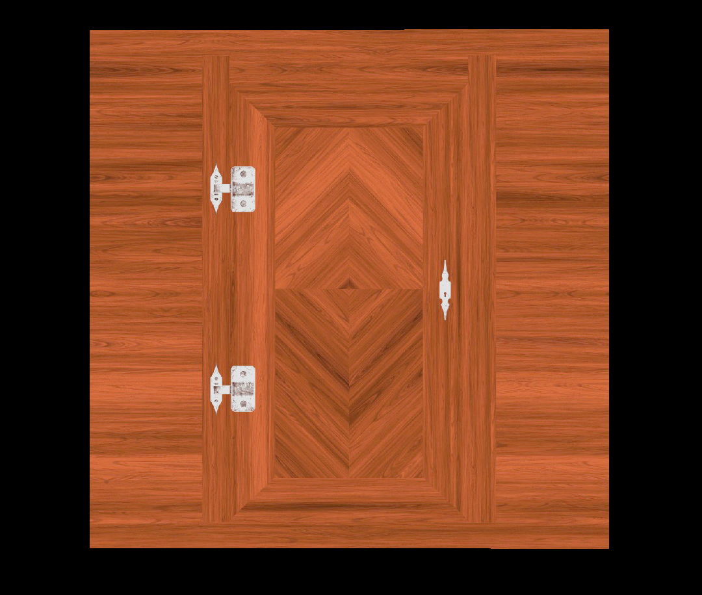

### Texture の変形

- 

---

### Repeat

#### 概要

- テクスチャーを繰り返し貼り付ける **Texture クラスのプロパティ**

- repeat は Vector2 型クラスで以下のプロパティを持つ
    - u 軸方向への繰り返し (2次元平面 (xy座標) の x 軸と同義)
    - v 軸方向への繰り返し (2次元平面 (xy座標) の y 軸と同義)

- repeat を設定する場合、場合によっては Texture クラスの以下のプロパティも設定する必要がある

    - プロパティ
        - wrapS: 横方向への繰り返され方を定義する
        
        - wrapT: 縦方向への繰り返され方を定義する

    <br>

    - プロパティへの設定値

        - THREE.RepeatWrapping: テクスチャが繰り返される

        - THREE.MirroredRepeatWrapping: テクスチャが**鏡写り**のように繰り返される

        - (デフォルト) THREE.ClampToEdgeWrapping: **最後のピクセルが**永遠に繰り返される

<br>

#### Repeat のざっくりとしたイメージ

- 以下のようなテクスチャーが貼り付けられたキューブオブジェクトがあるとして

    

<br>

- 横方向に2回テクスチャーを繰り返し貼り付けると

    - テクスチャーの幅が1/2になって2つ並ぶ

    

<br>

- 縦方向に2回テクスチャーを繰り返し貼り付けると

    - テクスチャーの高さが1/2になって2つ並ぶ

    

<br>

#### 使い方

1. Textureインスタンスの repeat プロパティにて繰り返しの方向と繰り返しの回数を指定する

    ```js
    const texture = loader.load("画像のパス");

    // 横方向に2回テクスチャを繰り返し貼り付ける
    texture.repeat = 2;
    ```

    <br>

    しかし、結果は繰り返し貼り付けられておらず、テクスチャーのサイズが1/2になっただけ

    

<br>

2. Texture インスタンスの wrapS プロパティの設定値を変更する

    - Texture インスタンスの wrapS プロパティのデフォルトの設定値は THREE.ClampToEdgeWrapping = **最後のピクセルが**永遠に繰り返される

    - 同じようにテクスチャーを繰り返したいときは THREE.RepeatWrapping を設定する

    ```js
    texture.repeat = 2;

    // テクスチャーの横方向への繰り返され方を指定する
    texture.wrapS = THREE.RepeatWrapping;
    ```

    <br>

    結果は想定した通り、テクスチャーの幅が1/2になり、横方向に2つ繰り返し貼られた

    

<br>

3. THREE.MirroredRepeatWrapping の繰り返され方

    ```js
    texture.repeat = 3;
    texture.wrapS = THREE.MirroredRepeatWrapping;
    ```

    左右反転しながら、テクスチャーが繰り返し貼り付けれる

    

    <br>

    ```js
    texture.repeat = 3;
    texture.wrapT = THREE.MirroredRepeatWrapping;
    ```

    (わかりずらいが)上下反転しながらテクスチャーが繰り返しはりつけられる

    

---

### Offset

#### 概要

- テクスチャーの開始地点 (原点) からどのくらい離れているか

- Texture インスタンスの offset プロパティにて指定する

- offset プロパティは Vector2 型のクラスで、以下のプロパティを持つ
    - u 軸方向にどのくらい離れているか (2次元平面 (xy座標) の x 軸と同義)
    - v 軸方向にどのくらい離れているか (2次元平面 (xy座標) の y 軸と同義)

<br>

#### ざっくりとしたイメージ

- 間違っていたイメージ

    

<br>

- 実際は

    

<br>

#### 使い方

1. Textureインスタンスの offset プロパティにてオフセットの方向とどのくらい離れているかを指定する

    - オフセットは 正規化した範囲 (0.0 ~ 1.0) で設定するのが普通とのこと

    ```js
    // x方向に 0.2 = 20% 離す(ずらす)
    texture.offset.x = 0.2;
    ```

    

    <br>

    ```js
    // y方向に 0.2 = 20% 離す(ずらす)
    texture.offset.y = 0.2;
    ```

    

<br>

2. offset と wrapS/T を組み合わせる

    - ずれた分をまたテクスチャーの最初から繰り返す感じになる

        
        

    ```js
    texture.wrapS = THREE.RepeatWrapping;
    texture.offset.x = 0.5
    ```

    

    <br>

    ```js
    texture.wrapT = THREE.RepeatWrapping;
    texture.offset.y = 0.5
    ```

    

---

### Rotation

#### 概要

- テクスチャーを回転させる **Texture クラスのプロパティ**

    - テクスチャーの左下の角を中心に回転させる

    - 回転の中心は Texture インスタンスの center プロパティの値を変更することで変更できる

        - center プロパティは Vector2 型クラス

- Texture インスタンスの rotation プロパティにて指定する

    - rotation プロパティのデータ型は number

- どのくらい回転させるかは**ラジアン**で指定する

<br>

#### ざっくりとしたイメージ


<br>

#### 使い方

1. Textureインスタンスの rotation プロパティにてテクスチャーをどの程度回転させるか指定する

    ```js
    // 45°回転させる
    texture.rotation = Math.PI / 4;
    ```

    

<br>

2. rotation と wrapS/T を組み合わせる

    - イメージ

        

    <br>

    - 実際は

        ```js
        // 縦、横方向の繰り返され方を定義
        texture.wrapS = THREE.RepeatWrapping;
        texture.wrapT = THREE.RepeatWrapping;

        // テクスチャーを45°回転
        texture.rotation = Math.PI / 4;
        ```

        
 
<br>

3. 回転の基準点を変更する

- Texture インスタンスの center プロパティの値を変更する

    - texture.center.x: 0.0 ~ 1.0 の範囲で指定

    - texture.center.y: 0.0 ~ 1.0 の範囲で指定

    

    <br>

    ```js
    // 回転の基準点の移動
    texture.center.x = 0.5;
    texture.center.y = 0.5;

    // テクスチャーの回転
    texture.rotation = Math.PI / 4;
    ```

    <br>

    