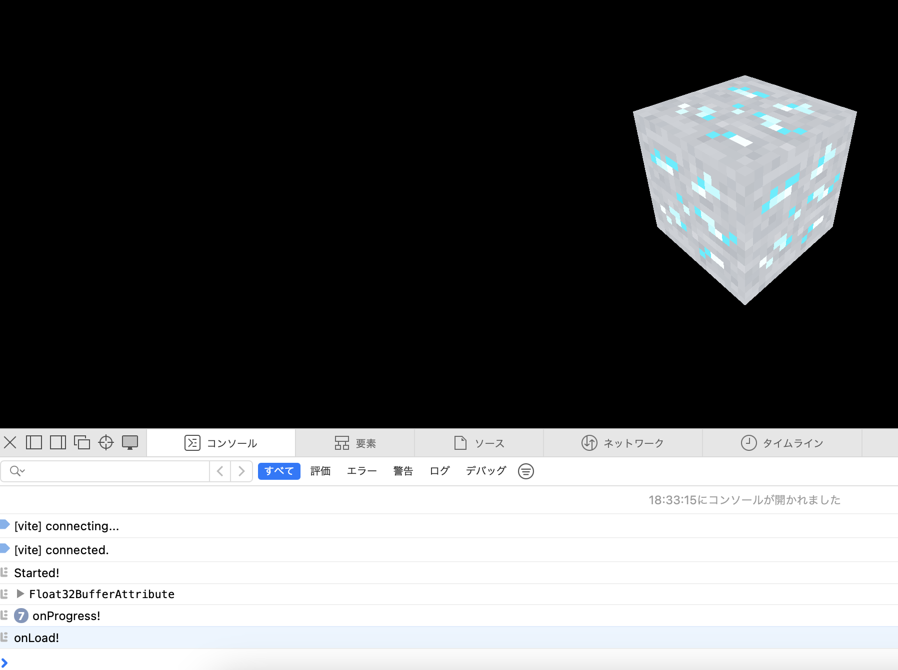

### Texture

Texture とはジオメトリの表面を覆う画像のこと

<br>

#### Materials と Textures の違い

- Material
    - 表面の物理的な特性を定義する
        - 光の反射や吸収、色の散乱など

- Textures
    - 表面の見た目を定義する

<br>

#### Texture Mapping

テクスチャーマッピングとは

- テクスチャを使用して3Dモデル表面に質感を与える手法

- 異なる視覚的効果を実現するため、様々なマッピング技法がある

    <br>

    例
    - バンプマッピング
        - グレースケールのテクスチャを利用して、オブジェクトに凹凸を表現するテクスチャーマッピングの技法

        - 実際にオブジェクトを凹凸に変形させるのではなく、グレースケールのテクスチャーから高低を判断し、その情報をテクスチャーのライトの反射や影の計算に加えながらマッピングしていく技法

    - Displacement マッピング
        - グレースケールのテクスチャを利用して、オブジェクトに凹凸を表現するテクスチャーマッピングの技法

        - こちらのテクスチャーマッピングは、テクスチャーに応じてジオメトリの頂点も移動させながらマッピングしてく技法

<br>
<br>

参考サイト

[【3DCGを学ぼう】PBRマテリアルとは？基本概念とフリーサイト紹介](https://www.moderno-pers.com/post/3dcg-pbr-material-textures/#index_id21)

[マテリアル・テクスチャ・シェーダー](https://note.com/u_ginger/n/ne2b274336e07#ee547954-9092-4c42-80ac-182026f3cbd4)

[【Blender】様々なテクスチャマップを理解しよう](https://styly.cc/ja/tips/3dcg_lighthing_maps/)

---

### PBR Principles

- PBR は Physically Based Rendering の略

- よりリアルな質感のレンダリングをするため、現実世界の光の性質を計算に取り入れる考え方のこと

<br>
<br>

参考サイト

- [【3DCGを学ぼう】PBRマテリアルとは？基本概念とフリーサイト紹介](https://www.moderno-pers.com/post/3dcg-pbr-material-textures/)

- [PBRとは](https://school.dhw.co.jp/course/3dcg/contents/w_pbr.html)

---

### Texture (画像)の読み込み方法

2つの方法がある

- JavaScript の Image クラスと Three.js の Texture クラスを利用する方法

- Three.js の TextureLoader をクラスを利用する方法 *こっちの方が簡単で基本こっちの方法でいい

<br>

前提: 以下のフォルダ構成で行なった (自分のフォルダ構成に応じて、以降のサンプルコードを読み替える)

```
prjoject
    L src
        L html や script ファイルなど
    L static
        L textures
            L 画像などの静的ファイル
    L dis
        L index.html: ビルドファイル
        L textures
            L static/textures 内のファイルやフォルダがビルド時に配置される
```

<br>

#### Image クラスと Texture を利用する方法

1. Image クラスを使って画像ファイルのロード

    ```js
    const textureImg = new Image();
    textureImg.src = "画像のパス";
    ```

2. ロードした画像をテクスチャーに変換する
    - Textureクラスのコンストラクタに Image インスタンスを渡す

    - Image インスタンスの画像のロード完了時にテクスチャーを更新する必要がある

        - 以下のコードにて、Textureクラスのコンストラクタに Imageインスタンスを渡した時に**Imageクラスがテクスチャー画像の読み込みを完了していない可能性があるから**

    ```js
    // 1. Image クラスを使って画像ファイルのロード
    const textureImg = new Image();
    textureImg.src = "画像のパス"; 

    // 2.ロードした画像をテクスチャーに変換する
    // TextureコンストラクタにImageインスタンスを渡す
    const texture = new THREE.Texture(textureImg); //*この時にtextureImgが画像のロードを完了しているとは限らない

    // テクスチャーのカラースペースの指定
    texture.colorSpace = THREE.SRGBColorSpace;

    // 画像のロードが完了したら、Textureインスタンスの更新を行う
    textureImg.addEventListener("load", () => {
        texture.needsUpdate = true;
    });
    ```

3. テスクチャーをマテリアルに渡す

    - map プロパティに Texture インスタンスを設定する

    ```js
    // テスクチャーをマテリアルに渡す
    const material = new THREE.MeshBasicMateria({map: texture});
    ```

<br>

#### TextureLoader を利用する方法

1. TextureLoader クラスをインスタンス化する

    ```js
    const loader = new THREE.TextureLoader();
    ```

2. TextureLoader.load() でテクスチャー画像のロードを行う

    - テクスチャーとしてロードするので、ロードした画像をあらためて**テスクチャーに変換する必要がない**

    ```js
    const texture = loader.load("画像のパス");

    // テクスチャーのカラースペースの指定
    texture.colorSpace = THREE.SRGBColorSpace;
    ```

3. テスクチャーをマテリアルに渡す

    - map プロパティに Texture インスタンスを設定する

    ```js
    // テスクチャーをマテリアルに渡す
    const material = new THREE.MeshBasicMateria({map: texture});
    ```

<br>

⭐︎テクスチャーのカラースペースの指定については[こちら](./ColorSpace.md)を参照
```js
texture.colorSpace = THREE.SRGBColorSpace;
```

---

### TextureLoader

特徴

- 1つの TextureLoader インスタンスで複数のテクスチャー画像をロードすることができる

    ```js
    const loader = new THREE.TextureLoader();

    const flowerTexture = loader("花の画像のパス");

    const catTexture = loader("猫の画像のパス");

    const pizzaTexture = loader("ピザの画像のパス");
    ```

<br>

- TextureLoader.load() には画像のパス以外にも以下の引数を渡すことができる
    - 第二引数: onLoad 関数 = 画像のロードが完了した時に呼ばれるコールバック関数
    - 第三引数: onProgress 関数 $\color{red} 現在ではサポートされていないので使用しないこと$
    - 第四引数: onError 関数 = 画像のロードに失敗した時に呼ばれるコールバック関数

    ```js
    const loader = new THREE.TextureLoader();
    const textuer = loader.load(
        "画像のパス",
        () => {
            console.log("This is called when loading finishes");
        },
        () => {
            console.log("never use this");
        },
        () => {
            console.log("This is called when loading fails");
        }
    );
    ```

---

### LoadingManager

画像やモデルデータのローディングイベントを handle and keep track するクラス

#### 利用方法

1. LoadingManager をインスタンス化する

    ```js
    const loadingManager = new THREE.LoadingManager();
    ```

<br>

2. LoadingManager インスタンスのイベント系プロパティに関数を設定する
    - onStart: 画像のロードが開始した時に呼ばれるコールバック関数
    - onLoad: 全ての画像のロードが完了した時に呼ばれるコールバック関数
    - onProgress: 1つの画像のロードが完了した時に呼ばれるコールバック関数
    - onError: 画像のロードが失敗した時に呼ばれるコールバック関数

    ```js
    const loadingManager = new THREE.LoadingManager();
    
    // LoadingManagerのイベント系プロパティを設定する
    loadingManager.onStart = () => {
        console.log("onStart!")
    };

    loadingManager.onStart = () => {
        console.log("onLoad!")
    };

    loadingManager.onProgress = () => {
        console.log("onProgress!")
    };

    loadingManager.onError = () => {
        console.log("onError!")
    };
    ```

<br>

3. LoadingManager インスタンスを TextuerLoader に渡す

    ```js
    const loadingManager = new THREE.LoadingManager();

    // LoadingManagerをTextureLoaderに渡す
    const textureLoader = new THREE.TextureLoader(loadingManager);
    ```

<br>

#### TextuerLoader と LoadingManager のイベントハンドリングの違い

- TextureLoader.load() へ設定するコールバック関数
    - load() を呼び出す時に毎回コールバック関数を渡さなければならない (*コールバック関数の必要がある時)

    ```js
    const loader = new THREE.TextureLoader();

    const onLoad = () => {
        console.log("onLoad");
    };

    const onProgress = () => {
        console.log("onProgress");
    };

    const onFinish = () => {
        console.log("onFinish");
    }

    // テクスチャーのロードごとに、イベントハンドラーを渡す必要がある
    const flowerTexture = loader.load(
        "花の画像のパス",
        onLoad,
        onProgress,
        onFinish
    );

    const catTexture = loader.load(
        "猫の画像のパス",
        onLoad,
        onProgress,
        onFinish
    );
    ```

<br>

- LoadingManager へ設定するコールバック関数
    - LoadingManager のイベント系プロパティに1回設定するだけで、あとは LoadingManager がそれを再利用してくれる

    ```js
    const loadingManager = new THREE.new THREE.LoadingManager();

    // 一度LoadingManagerにイベントハンドラーを設定するだけでいい
    loadingManager.onStart = () => {
        console.log("onStart");
    };

    loadingManager.onProgress = () => {
        console.log("onProgress");
    };

    loadingManager.onError = () => {
        console.log("onError");
    };

    const loader = new THREE.TextureLoader(loadingManager);

    const flowerTexture = loader.load("花の画像のパス");

    const catTexture = loader.load("猫の画像のパス");
    ```

<br>

#### LoadingManager の onLoad と onProgress プロパティ

- onLoad: 全ての画像のロードが完了した時に呼ばれるコールバック関数
- onProgress: 1つの画像のロードが完了した時に呼ばれるコールバック関数

<br>

疑問

- 具体的にいつ呼ばれるのか?

```js
// LoadingManager の作成とイベントハンドラの登録
const loadingManager = new THREE.LoadingManager();
loadingManager.onLoad = () => {
  console.log("onLoad!");
};
loadingManager.onProgress = () => {
  console.log("onProgress!");
};

//TextureLoaderの作成
const textureLoader = new THREE.TextureLoader(loadingManager);

// 複数画像のロード (7枚)
const colorTexture = textureLoader.load("./textures/minecraft.png");
const alphaTexture = textureLoader.load("./textures/door/alpha.jpg");
const heightTexture = textureLoader.load("./textures/door/height.jpg");
const normalTexture = textureLoader.load("./textures/door/normal.jpg");
const ambientOcclusionTexture = textureLoader.load(
  "./textures/door/ambientOcclusion.jpg"
);
const metalnessTexture = textureLoader.load("./textures/door/metalness.jpg");
const roughnessTexture = textureLoader.load("./textures/door/roughness.jpg");
```

結果
- 各画像のロード完了ごとに onProgress が呼ばれた
- 全ての画像のロードが完了した時 onLoad が呼ばれた
    - 途中でロードのエラーが発生しても、最後の画像のロード完了 (onProgress) 後に onLoad は呼ばれた



---

### カラー空間

詳しくは[こちら](./ColorSpace.md)を参照

---

### UV 展開

詳しくは[こちら](./UV.md)を参照

---

### テクスチャーの変形

#### repeat: 
    - RepeatingWrapping
    - MirroredRepeatingWrapping

<br>

#### offset: x/y 軸からどのくらいテクスチャーを離してから貼り付けるか

<br>

#### rotate

    - 回転の中心となる点に注意

<br>
<br>

参考サイト

repeat の利用方法
[Three.js の ExtrudeGeometry に Texture を適用する](https://zenn.dev/ike_pon/scraps/8e9da4f68dfd43)

---

### Mipmapping

    - Minification Filter
        - メッシュのサイズがテクスチャー画像のサイズよりも小さい場合 = テクスチャー画像の縮小が必要な場合に発生する処理

    - Magnification Filter
        - メッシュのサイズがテクスチャー画像のサイズよりも大きい場合 = テクスチャー画像の拡大が必要な場合に発生する処理

    - MinMap の生成をオフにする

<br>
<br>

参考サイト

[MipMapを可視化しよう](https://qiita.com/dgtanaka/items/2ec0fd88236daa5c3cc7)

[ミップマップとテクスチャフィルタリング](https://wgld.org/d/webgl/w074.html)

[THREE.jsのテクスチャについて調べる](https://nogson2.hatenablog.com/entry/2017/08/01/235850)

[Three.js備忘録（2）](https://koro-koro.com/threejs-no2/)

---

### Texture Format and Optimisation

- テクスチャー画像や動画を使う際に考えるべきこと

    - 画像・動画ファイルのサイズ(解像度)
        - 解像度の大きい画像や動画は ただえさえ GPU のメモリを食うのに、さらに Minmapping によってメモリ使用量が増加する

            →適切なサイズ(解像度)の画像/動画を用意するべき

        - 画像のサイズ(解像度) は2のべき乗である必要がある
            → Minmap が作成される = 画像サイズ /　2 の画像が次々作られていくから

            $\color{red}動画では Minmap が作成されない$

    - ファイルサイズ

    - 

<br>
<br>

参考サイト

[Three.jsパフォーマンス最適化についてのまとめ](https://koro-koro.com/three-js-performance-optimization/)

---

### テクスチャーマッピング技法の種類

- Color (Albedo)

- Height (Displacement)

    - ジオメトリがたくさんの頂点を持つ必要がある

        - マッピングの際に頂点も移動させるので、計算に時間がかかる

- Normal

    - 頂点は動かさない

- Ambient Occlusion

- Metalness

    - 金属の光沢などの光の反射を視覚的に再現したい時に利用するマッピング技法

- Roughness

    - 光の拡散を視覚的に利用するマッピング技法