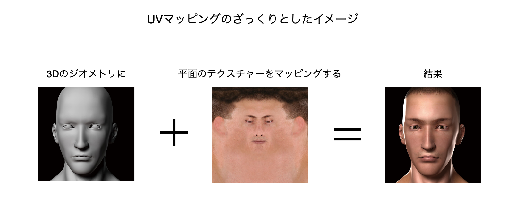
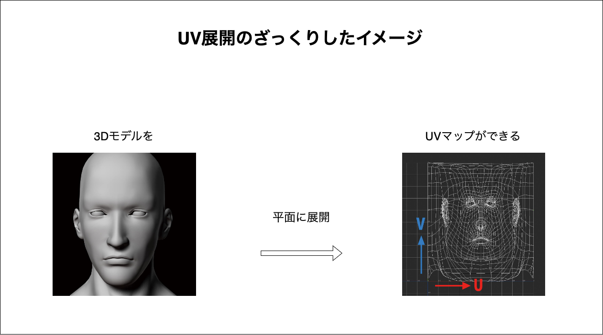
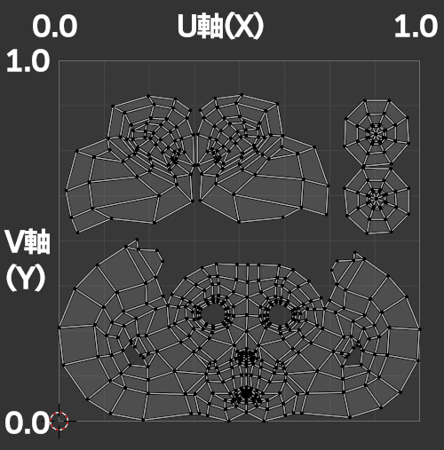
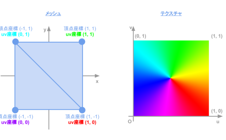
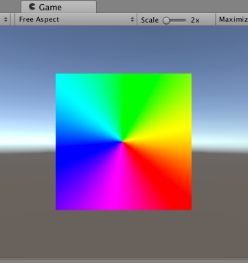

### UVマッピング

- 平面のテクスチャーがどのように立体のジオメトリにマッピングされるかについての仕組み

- 3D モデルの xyz 座標とテクスチャーの uv 座標をマッピングすること

- 3Dモデルの各頂点に2Dテクスチャの座標([UV 座標](#uv-座標))を割り当てることで、モデルにテクスチャを適切に貼り付けることができる

各画像の引用元: [UV座標系](https://cgworld.jp/terms/UV座標系.html)

---

### UV 展開 (UV Unwrapping)

- 3Dモデルを平面に展開する作業のこと

- 展開された平面を UV マップと呼ぶらしい
    - UV マップはテクスチャの UV 座標と対応づけることで、3Dモデルに正しくテクスチャを貼り付けることができる

 
 

参考サイト

[BlenderのUV展開とは？基本的な手順や設定のポイントを解説！](https://udemy.benesse.co.jp/design/uv-development.html)

[初心者のためのUVマッピングとアンラッピングのガイド](https://3dstudio.co/ja/uv-unwrapping-software/)

---

### UV 座標

- UV マッピングの際に利用する座標系のこと

- テクスチャーは2次元の頂点情報をもつ
    - u 軸と v 軸を使う (x 軸 と y 軸 にあたる)
        - u が横軸、 v が縦軸

    - u 軸 v 軸共に範囲は 0 ~ 1　に正規化されている

    

    引用: [「マテリアル」や「UVマップ」の意味を解説 ～用語を理解すれば3DCGは怖くない！](https://forest.watch.impress.co.jp/docs/serial/blenderwthing/1426698.html)

     

- Three.js で提供されているジオメトリは uv 座標が自動で生成(設定される)
    - 一方ジオメトリを自作する場合は、自分で uv 座標の設定が必要

 

イメージ
- テクスチャーは平面なので、 UV 座標を持つ

- ジオメトリの各頂点は XYZ 座標の他に、UV座標を持つ

- ジオメトリの各頂点の UV 座標 に対応するように テクスチャーを貼り付けていく

    - 実際はジオメトリの各頂点の UV 座標に対応するテクスチャーの色をジオメトリに描画してく

 

引用: [【連載】Unity時代の3D入門 – 第3回「テクスチャを貼ってみた」](https://blog.applibot.co.jp/2017/08/21/tutorial-for-unity-3d-3/)

 
 

参考サイト

[【Unity】頂点にUV座標を書き込んでメッシュに画像（テクスチャ）を貼り付ける方法](https://shibuya24.info/entry/unity-mesh-dynamic-apply-texture)