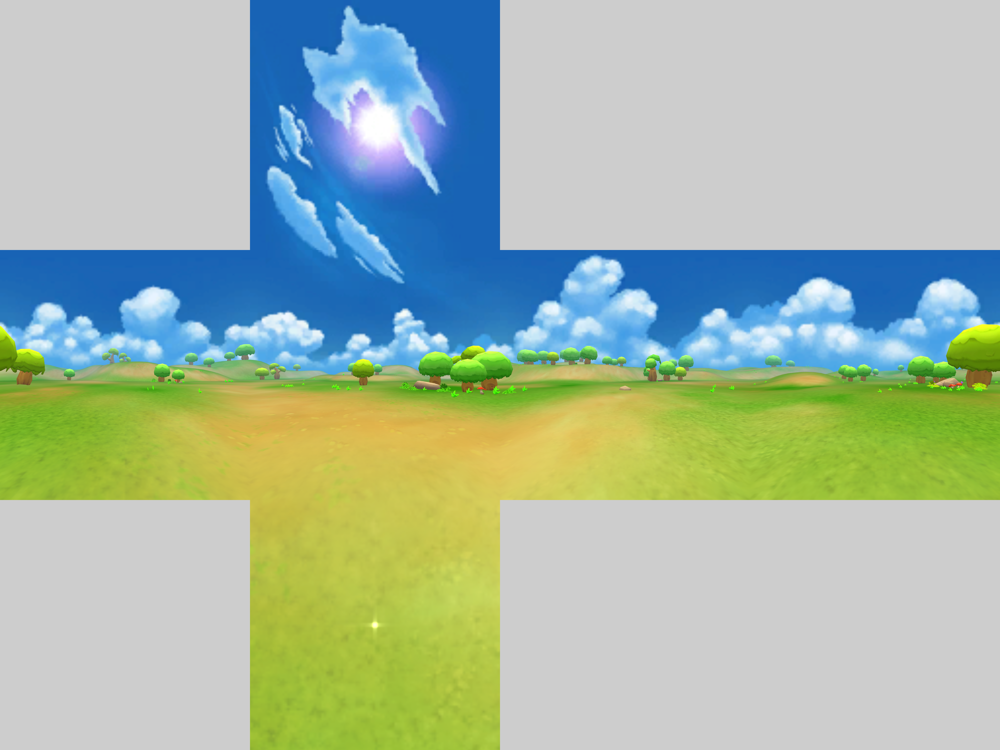
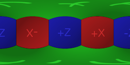
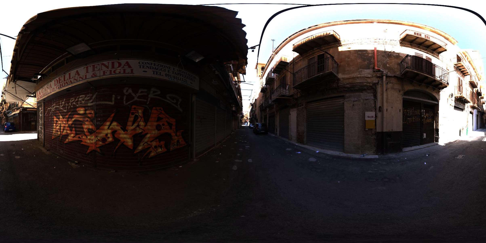
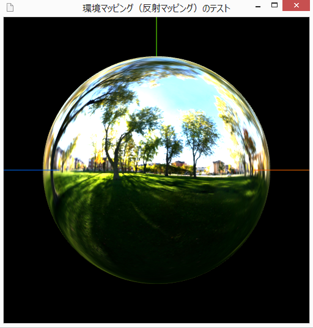
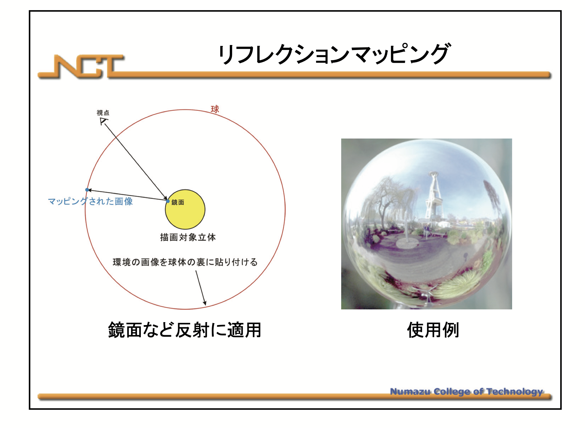
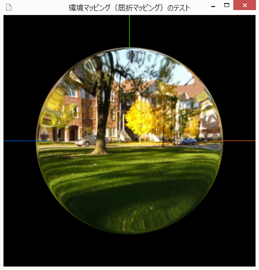
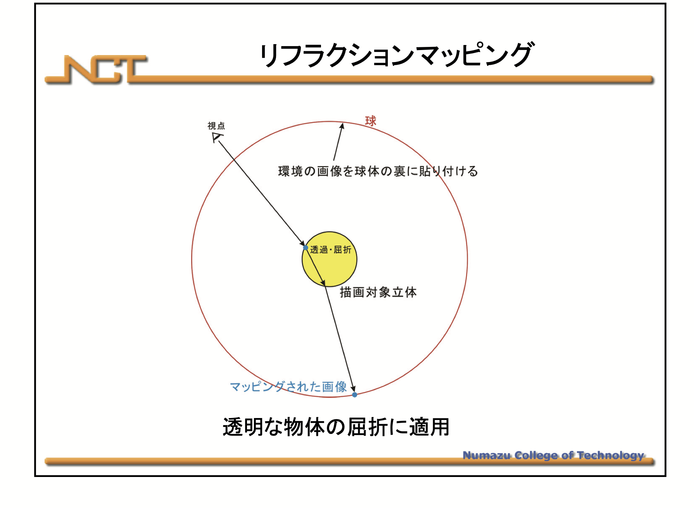

### 環境マッピング (Environment Mapping)

- [テクスチャマッピング技法](../10/Textures.md#テクスチャーマッピング技法の種類)の1つ

- まるでオブジェクトが[環境マップ](#環境マップ)に囲まれているようにオブジェクトに環境マップ(=テクスチャ)をマッピングしていく技法

    - 環境マッピングには [反射マッピングと屈折マッピング](#反射マッピングと屈折マッピング) の2種類がある

- MeshStandardMaterial のような **PBR マテリアルは、環境マップから光をシミュレートすることができる** → ライトを設置しなくてもオブジェクトが見える

    - MeshPhongMaterial や MeshLambertMaterial は PBR マテリアルではないので、ライトが別途必要

 
 

参考サイト

[Three.js備忘録（4）](https://koro-koro.com/threejs-no4/)

---

### 環境マップ

- =テクスチャ画像

 

- キューブマップやスフィアマップ、パノラマ画像が環境マップとして利用される

    - キューブマップ
        - 正方形テクスチャが 6 つで一組になったテクスチャ画像

            

            引用: [コンポーネントのレンダリング](https://docs.unity3d.com/ja/2018.4/Manual/class-Cubemap.html)

            

            引用: [【連載】Unity時代の3D入門 – 第7回「キューブマッピング」](https://blog.applibot.co.jp/2017/11/20/tutorial-for-unity-3d-7/)

     

    - スフィアマップ (球状マップ)

        - =[matcap](./Material.md#meshmatcapmaterial) テクスチャマッピング

        - カメラを動かしても常にオブジェクトの見え方が同じになる
    
     

    - パノラマ画像

        - 360度パノラマ画像 = 上下左右前後、すべての方向が1枚に収まった画像のこと

        

        引用: [コンポーネントのレンダリング](https://docs.unity3d.com/ja/2018.4/Manual/class-Cubemap.html)

         

        

 

- 環境マップ画像の拡張子は .hdr が良いらしい
    
    - HDR = Hight Dynamic Range

    - .hdr は表現できる色のレンジが広い画像や映像のフォーマット

    - .hdr ファイルでは各色調は 10bit (1024) や 12bit (4096) で表現される

        - 普通は RGB を (256,256,256) で表現されてきたが、HDR では (1024,1024,1024) で表現できるので、より色の表現の精度が高い

        - 一方でファイルサイズはデカくなる

    - jpegとhdrの比較

        - jpeg

            

        - hdr
            
 
 

参考サイト

環境マッピングのテクスチャについて
- [コンポーネントのレンダリング](https://docs.unity3d.com/ja/2018.4/Manual/class-Cubemap.html)

スフィアマップについて
- [【Unity】【シェーダ】MatCap（スフィアマッピング）を実装する](https://light11.hatenadiary.com/entry/2018/06/14/231424)

- [スフィア環境マッピング（Matcap Shader）](https://wgld.org/d/webgl/w089.html)

HDR について
- [8bit、10bit、12bitって何？ビット（bit）をマスターしてデジタルデータを正しく扱おう！](https://note.com/cinergia3c/n/n7c1c846edb94#bf29753b-51ba-4d41-a7cf-1122870cc9a5)

- [HDR 【High Dynamic Range】 ハイダイナミックレンジ](https://e-words.jp/w/HDR.html)

- [HDRとSDRの違いとは？それぞれの概要とHDRのメリット・デメリットもわかる！](https://www.splashtop.co.jp/knowhow/51/)

---

### 反射マッピングと屈折マッピング

- 反射マッピング

    - オブジェクトの表面の反射によって周りの環境の映り込みを表現するためのテクスチャマッピング技法

    - 反射するオブジェクトによって、周りの風景が映り込む表現ができる

        

        引用: [【第３部】テクスチャマッピング](https://www.natural-science.or.jp/WebGL/hajimekata/workshop3.html#/)

         

        

        引用: [Computer Graphics](https://user.numazu-ct.ac.jp/~fujio/personal/jp/kougi/zukei/slide/mapping.pdf)

 

- 屈折マッピング

    - オブジェクトの屈折を伴う透過を表現するためのテクスチャマッピング技法

    - 透明なオブジェクトを通して、背景が歪んで見える表現ができる

        

        引用: [【第３部】テクスチャマッピング](https://www.natural-science.or.jp/WebGL/hajimekata/workshop3.html#/)

         

        

        引用: [Computer Graphics](https://user.numazu-ct.ac.jp/~fujio/personal/jp/kougi/zukei/slide/mapping.pdf)

 
 

参考サイト

[環境マッピング](https://ja.wikipedia.org/wiki/環境マッピング)

[【第３部】テクスチャマッピング](https://www.natural-science.or.jp/WebGL/hajimekata/workshop3.html#/)

[Computer Graphics](https://user.numazu-ct.ac.jp/~fujio/personal/jp/kougi/zukei/slide/mapping.pdf)

---

### Three.js で環境マッピングの利用方法

 
 

参考サイト
