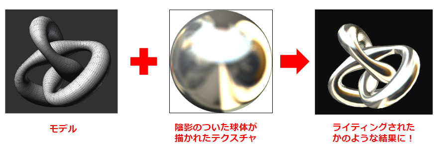

### 環境マッピング (Environment Mapping)

- [テクスチャマッピング技法](../10/Textures.md#テクスチャーマッピング技法の種類)の1つ

- まるでオブジェクトが[環境マップ](#環境マップ)に囲まれているようにオブジェクトに環境マップ(=テクスチャ)をマッピングしていく技法

    - 環境マッピングには [反射マッピングと屈折マッピング](#反射マッピングと屈折マッピング) の2種類がある

- MeshStandardMaterial のような **PBR マテリアルは、環境マップから光をシミュレートすることができる** → ライトを設置しなくてもオブジェクトが見える

    - MeshPhongMaterial や MeshLambertMaterial は PBR マテリアルではないので、ライトが別途必要

<br>
<br>

参考サイト

[環境マッピング](https://ja.wikipedia.org/wiki/環境マッピング)

---

### 環境マップ

- =テクスチャ画像

<br>

- キューブマップやスフィアマップ、パノラマ画像が環境マップとして利用される

    - キューブマップ
        - 正方形テクスチャが 6 つで一組になったテクスチャ画像

        

        引用: [コンポーネントのレンダリング](https://docs.unity3d.com/ja/2018.4/Manual/class-Cubemap.html)

        <br>

        

        引用: [【連載】Unity時代の3D入門 – 第7回「キューブマッピング」](https://blog.applibot.co.jp/2017/11/20/tutorial-for-unity-3d-7/)

        <br>

        - Three.js では6枚の独立したテクスチャ画像を CubeTextureLoader でロードする

    <br>

    - スフィアマップ (球状マップ)

        - =[matcap](./Material.md#meshmatcapmaterial) テクスチャマッピング

        - カメラを動かしても常にオブジェクトの見え方が同じになる

        

        引用: [コンポーネントのレンダリング](https://docs.unity3d.com/ja/2018.4/Manual/class-Cubemap.html)

        <br>

        

        引用: [【Unity】【シェーダ】MatCap（スフィアマッピング）を実装する](https://light11.hatenadiary.com/entry/2018/06/14/231424)
    
    <br>

    - パノラマ画像

        - 360度パノラマ画像 = 上下左右前後、すべての方向が1枚に収まった画像のこと

        

        引用: [コンポーネントのレンダリング](https://docs.unity3d.com/ja/2018.4/Manual/class-Cubemap.html)

        <br>

        

<br>

- 環境マップ画像の拡張子は .hdr が良いらしい
    
    - HDR = Hight Dynamic Range

    - .hdr は表現できる色のレンジが広い画像や映像のフォーマット

    - .hdr ファイルでは各色調は 10bit (1024) や 12bit (4096) で表現される

        - 普通は RGB を (256,256,256) で表現されてきたが、HDR では (1024,1024,1024) で表現できるので、より色の表現の精度が高い

        - 一方でファイルサイズはデカくなる

    - jpegとhdrの比較

        - jpeg

            

        - hdr
            
<br>
<br>

参考サイト

環境マッピングのテクスチャについて
- [コンポーネントのレンダリング](https://docs.unity3d.com/ja/2018.4/Manual/class-Cubemap.html)

スフィアマップについて
- [【Unity】【シェーダ】MatCap（スフィアマッピング）を実装する](https://light11.hatenadiary.com/entry/2018/06/14/231424)

- [スフィア環境マッピング（Matcap Shader）](https://wgld.org/d/webgl/w089.html)

HDR について
- [8bit、10bit、12bitって何？ビット（bit）をマスターしてデジタルデータを正しく扱おう！](https://note.com/cinergia3c/n/n7c1c846edb94#bf29753b-51ba-4d41-a7cf-1122870cc9a5)

- [HDR 【High Dynamic Range】 ハイダイナミックレンジ](https://e-words.jp/w/HDR.html)

- [HDRとSDRの違いとは？それぞれの概要とHDRのメリット・デメリットもわかる！](https://www.splashtop.co.jp/knowhow/51/)

---

### 反射マッピングと屈折マッピング

- 反射マッピング

    - オブジェクトの表面の反射によって周りの環境の映り込みを表現するためのテクスチャマッピング技法

    - 反射するオブジェクトによって、周りの風景が映り込む表現ができる

        

        引用: [【第３部】テクスチャマッピング](https://www.natural-science.or.jp/WebGL/hajimekata/workshop3.html#/)

        <br>

        

        引用: [Computer Graphics](https://user.numazu-ct.ac.jp/~fujio/personal/jp/kougi/zukei/slide/mapping.pdf)

<br>

- 屈折マッピング

    - オブジェクトの屈折を伴う透過を表現するためのテクスチャマッピング技法

    - 透明なオブジェクトを通して、背景が歪んで見える表現ができる

        

        引用: [【第３部】テクスチャマッピング](https://www.natural-science.or.jp/WebGL/hajimekata/workshop3.html#/)

        <br>

        

        引用: [Computer Graphics](https://user.numazu-ct.ac.jp/~fujio/personal/jp/kougi/zukei/slide/mapping.pdf)

<br>
<br>

参考サイト

[環境マッピング](https://ja.wikipedia.org/wiki/環境マッピング)

[【第３部】テクスチャマッピング](https://www.natural-science.or.jp/WebGL/hajimekata/workshop3.html#/)

[Computer Graphics](https://user.numazu-ct.ac.jp/~fujio/personal/jp/kougi/zukei/slide/mapping.pdf)

---

### Three.js で環境マッピングの利用方法

1. 環境マップテクスチャをロードするためのローダーを用意する

    - ロードする環境 **マップの種類や、マップの拡張子によって利用するローダーが異なる** ことに注意

        - キューブマップをロードする場合: **THREE.CubeTextureLoader** を使用する
            - CubeTextureLoader は `import * as THREE from "three"` 時にすでにインポートされている

            ```js
            import * as THREE from "three";

            // キューブマップ用のローダー
            const cubeTextureLoader = new THREE.CubeTextureLoader;
            ```

        <br>

        - .hdr 画像をロードする場合: **THREE.RGBELoader** を使用する
            - 別途 `three/addons/loaders/RGBELoader.js` からインポートする必要がある

            ```js
            import { RGBELoader } from "three/addons/loaders/RGBELoader.js";

            // .hdr用のローダー
            const hdrLoader = new RGBELoader();
            ```
        
        <br>

        - .exr 画像をロードする場合: **THREE.EXRLoader** を使用する
            - 別途 `three/addons/loaders/EXRLoader.js` からインポートする必要がある

            ```js    
            import { EXRLoader } from "three/addons/loaders/EXRLoader.js";

            // .exr用のローダー
            const exrLoader = new EXRLoader();
            ```

<br>

2. 環境マップテクスチャのロード

    - キューブマップテクスチャの場合

        - CubeTextureLoader.load の使い方
            - 第一引数: 6枚のテクスチャ画像のパスの**配列** (配列に格納するテクスチャのパスの順番に注意)

                - 配列に格納するテクスチャは、`pos-x, neg-x, pos-y, neg-y, pos-z, neg-z` の順番で格納すること

                - 右、左、上、下、正面、後ろのテクスチャ画像の順

            - 第二引数: onLoad のコールバック関数

            - 第三引数: onProgress のコールバック関数

            - 第四引数: onError のコールバック関数

            ```js
            const cubeTextures = [
                "右側のテクスチャ画像のパス",
                "左側のテクスチャ画像のパス",
                "上側のテクスチャ画像のパス",
                "下側のテクスチャ画像のパス",
                "正面のテクスチャ画像のパス",
                "後ろ側のテクスチャ画像のパス"
            ];

            // 6枚のテクスチャ画像からキューブマップを作成
            const cubeMap = cubeTextureLoader.load(cubeTextures);
            ```

    <br>

    - パノラママップテクスチャの場合

        - .hdr の場合
            - RGBELoader の load 関数の使い方: [TextureLoader](../10/Textures.md#textureloader-を利用する方法) と同じ

            ```js
            hdrLoader.load("テクスチャ画像のパス", (v) => {
                // ロード完了時のコールバック関数
            });
            ```

        <br>

        - .exr の場合

            - EXRLoader の load 関数の使い方: [TextureLoader](../10/Textures.md#textureloader-を利用する方法) と同じ

            ```js
            exrLoader.load("テクスチャ画像のパス", (v) => {
                // ロード完了時のコールバック関数
            });
            ```

<br>

3. 環境マップのテクスチャマッピング (反射マッピングか屈折マッピング) の指定

    - ポイント
        - **環境マップテクスチャに対して**設定する

        - 環境マップテクスチャの mapping プロパティで設定する
            - mapping プロパティ: テクスチャ画像がオブジェクトに対してどのようにマッピングされるかについてのプロパティ (デフォルトは UV マッピング)

    <br>

    - キューブマップテクスチャの場合

        - 反射マッピングの場合: `THREE.CubeReflectionMapping` を指定する

            ```js
            const cubeMap = cubeTextureLoader.load(["キューブテクスチャ画像のパス"]);

            // 反射マッピングを指定
            cubeMap.mapping = THREE.CubeReflectionMapping;
            ```

        <br>

        - 屈折マッピングの場合: `THREE.CubeRefractionMapping` を指定する

            ```js
            const cubeMap = cubeTextureLoader.load(["キューブテクスチャ画像のパス"]);

            // 屈折マッピングを指定
            cubeMap.mapping = THREE.CubeRefractionMapping;
            ```

    <br>

    - パノラママップテクスチャの場合
    
        - 反射マッピングの場合: `THREE.EquirectangularReflectionMapping` を指定する

            ```js
            hdrLoader.load("テクスチャ画像のパス", (texture) => {
                texture.mapping = THREE.EquirectangularReflectionMapping;
            });
            ```
        
        <br>

        - 屈折マッピングの場合: `THREE.EquirectangularRefractionMapping ` を指定する

            ```js
            exrLoader.load("テクスチャ画像のパス", (texture) => {
                texture.mapping = THREE.EquirectangularRefractionMapping;
            });
            ```

<br>

4. オブジェクトに環境マップを設定する (もしくは、シーンに環境マップを設定する)

    - ポイント
        - シーンに環境マップを設定すると、シーンにある全てのオブジェクトの**マテリアル**に環境マップが設定される
    
        - シーンに環境マップを設定する際に、すで envMap プロパティに環境マップが設定されているマテリアルがある場合、そのマテリアルの環境マップを上書くことはできない

    <br>

    - 個別にマテリアルに環境マップを設定する場合
        - 各マテリアルインスタンスの envMap プロパティに環境マップテクスチャを指定する

        ```js
        const cubeMap = cubeTextureLoader.load(["キューブテクスチャ画像のパス"]);

        //反射マッピングを指定
        cubeMap.mapping = THREE.CubeReflectionMapping;

        // 個別のマテリアルに環境マップを設定する
        const material = new THREE.MeshStandardMaterial({ envMap: cubeMap });
        ```

    <br>

    - シーンに環境マップを設定する場合

        - Sceneインスタンスの environment プロパティに環境マップテクスチャを指定する

        ```js
        // .hdr画像のロード
        hdrLoader.load("テクスチャ画像のパス", (texture) => {
                // 反射マッピングを指定
                texture.mapping = THREE.EquirectangularReflectionMapping;

                // ★シーンに環境マップを指定する
                scene.environment = texture;
            });
        ```
        


<br>
<br>

参考サイト

[Three.js備忘録（4）](https://koro-koro.com/threejs-no4/)

[CubeTextureLoader](https://threejs.org/docs/#api/en/loaders/CubeTextureLoader)

[Three.jsでキューブ環境マッピング](https://www.pentacreation.com/blog/2018/12/181215.html)

---

### 背景に環境マップを設定

- 背景に環境マップを設定することで、まるでその空間にいるかのようにシーンを作ることができる

    

<br>

- Scene インスタンスの background プロパティに読み込んだ環境マップテクスチャを設定する

    ```js
    // シーンの作成
    const scene = new THREE.Scene();

    /**
     * キューブマップの場合
     */
    const cubeMap = cubeTextureLoader.load(["画像パス"]);
    // シーンの背景に環境マップを設定
    scene.background = cubeMap;

    /**
     * パノラマ画像(.hdr)の場合
     */
    rgbeLoader.load("画像パス", (texture) => {
        // シーンの背景に環境マップを設定
        scece.background = texture;
    });
    ```

参考サイト

[Three.js備忘録（4）](https://koro-koro.com/threejs-no4/)