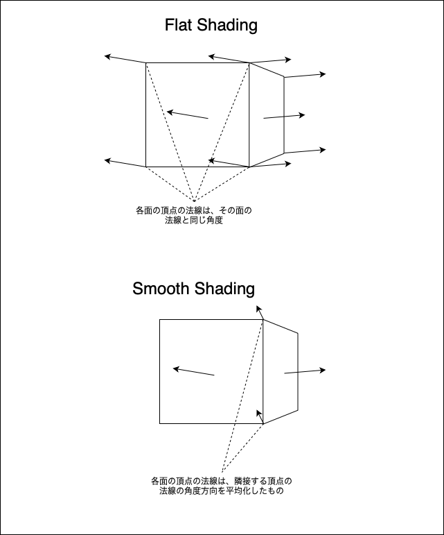
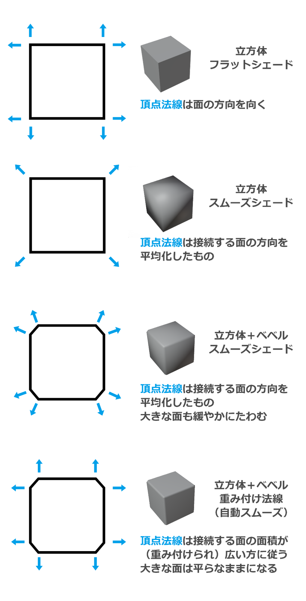

### FlatShading と SmoothShading

FlatShading
- 面の法線情報から色を計算する
- 各面の頂点の法線は面の法線と同じ角度
    - 面ごとに、その面の各頂点の法線の角度が変わるため、色がはっきり異なり、面と面の境界はくっきり表示される

SmoothShading
- 各頂点での法線が1方向にまとめられている
    - 2つの面が接する場合、接している頂点の法線の角度は同じになる

    - 面の境界線をまたいでも法線の向きが変わらないため、面と面との境界線ははっきりと表示されない

        → 滑らかな曲線を表現することができる

 

引用: [チュートリアル ゼロから分かるBlender講座 Vol.02―ピコピコハンマーをモデリングするまでのチュートリアル](https://gamemakers.jp/article/2023_03_14_21194/)

 
 

参考サイト

一番わかりやすかった記事: [【Blender3.1】「スムーズ」を使って見た目・形状を滑らかに！](https://cgbox.jp/2022/06/09/blender-smooth/#index_id2)

[コンピュータグラフィックスＳ 第12回 第12回 シェーディング、マッピング システム創成情報工学科 尾下 真樹](https://player.slidesplayer.net/60/11198840/)

[【Unityシェーダ入門】フラットシェーディングでローポリっぽく見せる](https://nn-hokuson.hatenablog.com/entry/2017/02/13/195748)