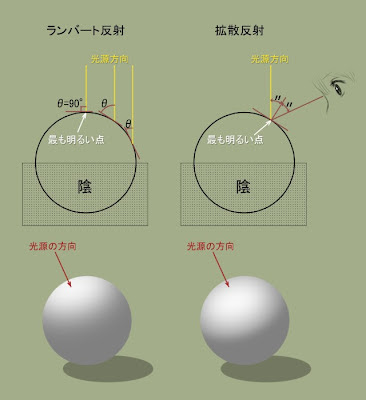

### Material とは

- Material
    - 表面の物理的な特性を定義する
        - 光の反射や吸収、色の散乱など

- Textures
    - 表面の見た目を定義する

---

### MeshBasicMaterial

- ライティングを考慮しないマテリアル

- 陰がつかないので均一な塗りつぶした状態になる

<br>

#### プロパティ

- map
    - [ColorMap](../10/Textures.md#color-albedo) に利用するテクスチャ画像を指定するプロパティ


<br>

- color

    - マテリアル全体に適用する色を指定するプロパティ


    - MeshBasicMaterial のコンストラクタで指定する場合
        - 'red' などの色名で指定できる
        - '#000000' などのカラーコードで指定できる
        - 0x000000 などの16進数で指定できる

    ```js
    // 色名で指定
    const redMaterial = new THREE.MeshBasicMaterial({color: "red"});

    // カラーコードで指定
    const greenMaterial = new THREE.MeshBasicMaterial({color: "#00ff00"});

    // 16進数で指定
    const blueMaterial = new THREE.MeshBasicMaterial({color: 0x0000ff});
    ```

    - MeshBasicMaterial インスタンスのプロパティで指定する場合
        - Three.js の Color クラスを作成する必要がある
            - Color クラスのコンストラクターズ引数には、"red" や "#00ff00", 0x0000ff などの方法で色の指定が可能

    ```js
    const material = new THREE.MeshBasicMaterial();

    // red
    material.color = new THREE.Color("red");

    // green
    material.color = new THREE.Color("#00ff00");

    // blue
    material.color = new THREE.Color(0x0000ff);
    ```

<br>

- map と color を両方設定したら

    - map に指定したテクスチャーを color 色にする

    ```js
    const material = new THREE.MeshBasicMaterial({ map: colorTexture, color: "#ff0000"});
    ```

    

<br>

- wireframe
    - オブジェクトの輪郭を表現する頂点と線分のみを表示するプロパティ

<br>

- transparent と opacity
    - *両方を指定しないと機能しない

    - transparent
        - 透過を有効にする
        - bool 値で指定する

    - opacity
        - 透過度を指定する
        - 0 ~ 1.0 の間で指定する (0 は完全に透明、 1.0は完全に不透明)

    ```js
    const material = new THREE.MeshBasicMaterial({color: "#ff0000"});
    
    material.transparent = true;
    material.opacity = 0.5;
    ```

    

<br>

- alphaMap

    - *alphaMap を利用する際も transparent プロパティに true を設定する必要がある

    - [alpha テクスチャマッピング](../10/Textures.md#aplpha)に利用するテクスチャ画像を指定する

    ```js
    const material = new THREE.MeshBasicMaterial();

    material.map = colorTexture;
    material.transparent = true;
    material.alphaMap = alphaTexture;
    ```

    

<br>

- side

    - THREE.FrontSide
        - オブジェクトの前面のみをレンダリングする = visibleになるイメージ

    - THREE.BackSide
        - オブジェクトの背面のみをレンダリングする

    - THREE.DoubleSide
        - オブジェクトの両面をレンダリングする
    
        - *DoubleSideの 場合は他の設定よりも処理が重いので、必要な時だけ　DoubleSide　を指定する


    ```js
    const material = new THREE.MeshBasicMaterial({ map: colorTexture });

    material.side = THREE.DoubleSide;
    ```

    - sphere などの場合、THREE.DoubleSideは球体の内部もレンダリングする

    

<br>
<br>

参考サイト

[Three.jsのさまざまなマテリアル](https://ics.media/tutorial-three/material_variation/)

---

### MeshNormalMaterial

- カメラに対するノーマルの向き(法線の向き = オブジェクトの面の向き)を RGB で表すマテリアル

- 主に法線のデバッグに利用されるマテリアル

- テクスチャ画像を渡さなくても OK なマテリアル

    ```js
    const material = new THREE.MeshNormalMaterial();
    const mesh = new THREE.Mesh(geometry, material);
    ```


<br>

#### プロパティ

- flatShading
    - [flat shading](./FlatShading.md) を有効にするかどうか
    - bool 値で指定する
    - デフォルトは false

    ```js
    const material = new THREE.MeshNormalMaterial();

    material.flatShading = true;
    ```

<br>
<br>

参考サイト

[Three.jsのさまざまなマテリアル](https://ics.media/tutorial-three/material_variation/)

---

### MeshMatcapMaterial

- テカリを表現するためのマテリアル

<br>

- 以下のようなライティング済みの球体が描かれたテクスチャを用意する必要がある

    

<br>

- リアルな表面の質感を表現できる一方で、MeshMatcapMaterial はライトやカメラの位置によって色の変化や光の反射は変化しない

    - テクスチャに描かれたライティングに依存するため

<br>

#### プロパティ

- mapcap
    - Material の map プロパティにテクスチャーを設定するのではなく、**matcap プロパティ**にテクスチャーを設定する

```js
// テクスチャーのロード
const textureLoader = new THREE.TextureLoader();
const matcapTexture = textureLoader.load("テクスチャー画像のパス");

// MeshMatcapMaterialの作成
const material = new THREE.MeshMatcapMaterial();
material.matcap = matcapTexture;
```

<br>
<br>

参考サイト

[【Unity】MatCapについて覚え書き](https://tech.spark-creative.co.jp/entry/2021/09/28/110828#MatCapとは)

[【three.js】マテリアルの種類まとめ](https://zenn.dev/raihara3/articles/20220505_threejs_material#meshmatcapmaterial)

---

### MeshDepthMaterial

- カメラに近いものは白く、遠いものほど黒になるマテリアル

- このマテリアルも MeshNormalMaterial のようにテクスチャ画像を渡さなくても OK なマテリアル

```js
const material = new THREE.MeshDepthMaterial();
```


<br>
<br>

参考サイト

[【three.js】マテリアルの種類まとめ](https://zenn.dev/raihara3/articles/20220505_threejs_material#meshdepthmaterial)

---

### MeshLambertMaterial

- *光源(ライト)が無いとオブジェクトが見えないマテリアル

- テクスチャ画像を渡さなくてもいいマテリアル

- 光の拡散反射(ランバート反射モデル)をシミュレートするマテリアル
    - ライトの方向と、オブジェクトの面が垂直で、距離が近ければ近いほどその面は明るく見える反射モデル = ランバート反射モデル

    - オブジェクトの面の明るさを決めるのは光源に対する角度と光の強さ

    

    引用サイト: [「光があたる面が明るい」というのは本当？](http://sawanoya.blogspot.com/2012/06/blog-post_29.html)

<br>

```js
// light オブジェクトの作成 & シーンへの追加を忘れずに

const material = new THREE.MeshLambertMaterial();
```


<br>
<br>

参考サイト

[【Unity 初心者】絵を見てざっくり学べるUnity　~反射モデルって何？~](https://zenn.dev/hitsumasf/articles/b3b92bb192a586)

[「光があたる面が明るい」というのは本当？](http://sawanoya.blogspot.com/2012/06/blog-post_29.html)

---

### MeshPhongMaterial

- *これもライトが無いとオブジェクトが見えないマテリアル

- テクスチャ画像を渡さなくてもいいマテリアル

- MeshLambertMaterial と同じようにに光の反射(Phong反射)をシミュレートするマテリアル

    - Phong 反射とは

        - ランバート反射モデルに、反射光のシミュレートを加えたような感じのモデル

            

            引用: [【Unityシェーダ入門】フォン鏡面反射で金属っぽくしてみる](https://nn-hokuson.hatenablog.com/entry/2016/11/04/104242)

        <br>

        - 視線(カメラからの角度)が光の反射ベクトルの角度に近ければ近いほど、反射光も強くなる
            - 光が反射する方向(光の反射ベクトル)は、物体の面の法線を挟んで光の入社ベクトルと反対方向になる
        
            

            引用: [【Unityシェーダ入門】フォン鏡面反射で金属っぽくしてみる](https://nn-hokuson.hatenablog.com/entry/2016/11/04/104242)

<br>

#### プロパティ

- specular
    - 反射光の色
    - Color インスタンスを渡す必要がある
    - デフォルトは `0x111111` (とても暗いグレー)

    ```js
    const material = new THREE.MeshPhongMaterial();

    // 反射光を赤色にしてみる
    material.specular = new THREE.Color("#ff0000");
    ```

    

<br>

- shininess
    - 反射光のぼやけ/シャープ具合 (float)

        - 数値が高ければよりシャープ = 反射光の範囲が小さくなる

        - 数値が低ければよりぼやけた感じ = 反射光の範囲が広くなる

    - デフォルトは30

    

<br>
<br>

参考サイト

[【Unityシェーダ入門】フォン鏡面反射で金属っぽくしてみる](https://nn-hokuson.hatenablog.com/entry/2016/11/04/104242)

---

### MeshToonMaterial

- *これもライトが無いとオブジェクトが見えないマテリアル

- テクスチャ画像を渡さなくてもいいマテリアル

- カートゥーンチックな陰影を表現することができるマテリアル

    - 光の入射ベクトルとオブジェクトの面の法線の内積をとり、その値によって光が当たっている・当たっておらず影になっていることの判定を行うらしい

        

        引用: [［CEDEC 2010］「次世代アイドルマスター」はこうして作られている！　トゥーンシェーディングの概念を覆す最新処理とは](https://www.4gamer.net/games/105/G010549/20100903012/)

    <br>

    - デフォルトでは、光が当たっている/当たっていない(= 影になっている)の2色で表現される

        

    - グラデーションマップ(ランプ)を利用することで、影の度合いを細かくすることもできる

        

        引用: [「生と死」を物語る陰影表現とは――『Xenoblade3（ゼノブレイド3）』のキャラクターを魅せる2灯トゥーンシェーディング、世界を描くアップサンプリング【CEDEC+KYUSHU 2022】](https://gamemakers.jp/article/2023_03_22_33475/)

<br>

#### プロパティ

- gradientMap
    - グラデーションマップ(ランプ) = 影の段階を表したテクスチャー画像を指定する

        

    - gradientMap を設定するとき、テクスチャーの min/magFilter を Nearest にしなければならない

        - Nearest にしないと影が表現されなくなる

        - min/magFilter が Nearest の場合、最大サイズ = 渡されたテクスチャしか参照しないので、 テクスチャの generateMipmaps を OFF にすると GPU のメモリ節約になる

```js
// グラデーションマップテクスチャーのロード
const gradientTexture = textureLoader.load("グラデーションマップ画像");

//グラデーションマップテクスチャが補色によって中間色が生成されないように mig/min Filter に Nearest を指定
gradientTexture.magFilter = THREE.NearestFilter;
gradientTexture.minFilter = THREE.NearestFilter;

// mipmap の生成を OFF にする
gradientTexture.generateMipmaps = false;

const material = new THREE.MeshToonMaterial();

// グラデーションマップの指定
material.gradientMap = gradientTexture;
```

<br>

影の段階がグラデーションマップに対応するようになった


<br>
<br>

参考サイト

[トゥーンレンダリング](https://ja.wikipedia.org/wiki/トゥーンレンダリング)

[UE5でつくるセルシェーディング 第1回：セルシェーディング入門](https://cgworld.jp/regular/202306-ue5toon-01.html)

[【Unity URP】キャラクタートゥーンシェーダの表現手法をまとめる その１(Lambert二値化)](https://zenn.dev/inpro/articles/84a72e5ebe3c33)

---

### MeshStandardMaterial

- *これもライトが無いとオブジェクトが見えない

- テクスチャ画像を渡さなくてもいいマテリアル

- PBRマテリアル = [PBR](../10/Textures.md#pbr-principles) をサポートするマテリアル

    - 光の反射/拡散だけではなく、荒さ(roughness)や金属度(metalness)もシミュレートすることができる

#### プロパティ

- metalness (float)
    - 表面の金属性を指定する (=表面の光の反射率)

    - 0.0 ~ 1.0 の範囲で指定する
        - 0.0: 金属性が低い = 表面の光の反射率が低い

        - 1.0: 金属性が高い = 表面の光の反射率が高い

<br>

- roughness (float)

    - 表面の荒さを指定する (表面の光の拡散率)

    - 0.0 ~ 1.0 の範囲で指定する
        - 0.0: 表面が滑らか = 光の拡散が少ない

        - 1.0: 表面が粗い = 光の拡散が大きい

<br>

#### テクスチャマッピング系のプロパティ