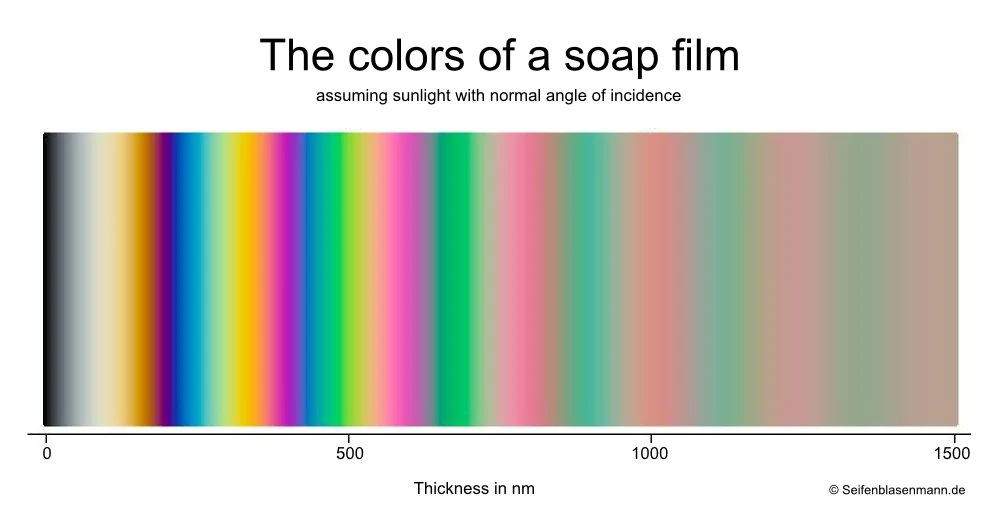

### PBR Material

- 物理ベースレンダリングマテリアル
    - = 現実の光の挙動をシミュレートとしたマテリアル

- 環境マップから光をシミュレートできるマテリアル (詳しくは[こちら](./EnvironmentMapping.md#環境マッピング-environment-mapping))

---

### MeshStandardMaterial

- *これもライト(or 環境マップ) が無いとオブジェクトが見えない

- テクスチャ画像を渡さなくてもいいマテリアル

- PBRマテリアル = [PBR](../10/Textures.md#pbr-principles) をサポートするマテリアル

    - 光の反射/拡散だけではなく、荒さ(roughness)や金属度(metalness)もシミュレートすることができる

#### プロパティ

- metalness (float)
    - 表面の金属性を指定する (=表面の光の反射率)

    - 0.0 ~ 1.0 の範囲で指定する
        - 0.0: 金属性が低い = 表面の光の反射率が低い

        - 1.0: 金属性が高い = 表面の光の反射率が高い

<br>

- roughness (float)

    - 表面の荒さを指定する (表面の光の拡散率)

    - 0.0 ~ 1.0 の範囲で指定する
        - 0.0: 表面が滑らか = 光の拡散が少ない

        - 1.0: 表面が粗い = 光の拡散が大きい

<br>

#### テクスチャマッピング系のプロパティ

- map
    - カラーテクスチャマッピングに使用するテクスチャ画像を指定する

<br>

- aoMap
    - [Ambient Occlusion](../10/Textures.md#ambient-occlusion) テクスチャマッピングに使用するテクスチャを指定する

    - グレースケールの画像を使い、黒い箇所がオブジェクト上で影になる

    

    <br>

    - aoMapIntensity (float)
        - ao mapping の強さを指定するプロパティ
        - 0にするほど ao mapping の強さが弱くなる
        - 0 は ao mapping OFF と同じ
        - デフォルト値は1

<br>

- displacementMap
    - [Height](../10/Textures.md#height-displacement) テクスチャマッピングに使用する画像を指定

    - グレースケールの画像を用いてオブジェクト表面の高さを表現する
        - 白: 高い
        - 黒: 元の高さと変わらない

    - 実際にオブジェクトの頂点の位置を動かす
        - *頂点の数が少ないと、あまり変化が見えないので注意

    

    <br>

    - displacementScale(float)
        - Height テクスチャマッピングの強さを指定するプロパティ

        - デフォルトは1

        - [DebugGUI](../09/DebugUI.md) を使って適切な値を見つけることができる

        

<br>

- metalnessMap
    - metalness をテクスチャ画像で指定するようなプロパティ

    - [metalness](../10/Textures.md#metalness) テクスチャマッピングに使用するテクスチャ画像を指定する

    - metalness プロパティも設定されていた場合
        - テクスチャ画像の持つ metalness の値と、設定されている metalness の値が**掛け合わされる**

        - *metalness プロパティはデフォルトで0 = どんな metalness テクスチャ画像を渡しても **デフォルトの metalness 値と掛け合わさると0になってしまう**

        - metalnessMap を設定する場合、基本的に metalness プロパティは1に設定すること

<br>

- roughnessMap
    - roughnessプロパティをテクスチャ画像で指定するようなプロパティ

    - [roughness](../10/Textures.md#roughness) テクスチャマッピングに使用するテクスチャ画像を指定する

    - roughness プロパティも設定されていた場合
        - テクスチャ画像の持つ roughness の値と、設定されている roughness の値が**掛け合わされる**

    - roughness プロパティのデフォルト値は1なので、 roughnessMap を設定する場合でも特に気にしなくていい

<br>

- normapMap
    - [normal](../10/Textures.md#normal) テクスチャマッピングに利用するテクスチャ画像を指定する

    - normal テクスチャ画像から、マテリアルの高さを表現する (実際の頂点は動かさない)

    

    <br>

    - normalScale (Vector2)

        - normalMappingの強さを指定するプロパティ

        - normalScale.x(.y)で横(縦)方向の凹凸間を各自指定するか、 normalScale.set(x, y)　で1回で指定する

            ```js
            // 横方向と縦方向の凸凹感をおのおの指定する
            material.normalScale.x = 0.5;
            material.normalScale.y = 0.5;

            // 1回で指定する
            material.normalScale.set(0.5, 0.5);
            ```

        - normalScale.x
            - 横方向のハイライト(凹凸感)の強さ

            

        <br>

        - normalScale.y
            - 縦方向のハイライト(凹凸感)の強さ

            

<br>

- alphaMap

    - [alpha](../10/Textures.md#alpha) テクスチャマッピングで使用するテクスチャ画像を指定する

    - マテリアルの transparent プロパティが true である必要がある

---

### MeshPhysicalMaterial

- PBL マテリアル

- MeshStandardMaterial の物理的な特性を拡張したマテリアル

    - 実際にMeshStandardMaterial クラスを継承しているクラスらしい

- MeshStandardMaterial にはないプロパティを提供する

<br>

#### プロパティ

- clearcoat (float)
    - ニスを塗ったかのような、透明で光を反射する層 (=clear coat 層) を設定する感じのプロパティ

    - 0: clear coat 無しと同じ

    - 1: clear coat 層の反射が強い

    

<br>

- clearcoatRoughness (float)
    - clear coat 層の荒さ

    - clearcoat を設定していないと意味ない

    - 0: clearcoatRoughness を設定していないのと同じ

    - 1: clearcoat 層の表面が荒く、光を反射しない

    

<br>

- clearcoat & clearcoatRoughness と roughness

    - 似ているようで違うプロパティ
        - 基本的に互いに干渉しない
        
    - roughness が 0 (= 表面が光を反射する) の場合でも、 clearcoatRoughness の値は何も影響を及ぼさない

        

    <br>

    - roughness が 0 (= 表面が光を反射する) の場合で、 clearcoat が 1 の場合、表面の反射がより明るくなる
        

<br>

- sheen

    - 布の表現につかえるプロパティらしい

    - clearcoart のように、マテリアルに sheen 層を追加することで、より多くの素材感の表現が可能になるっぽい

    - 0: sheen 層を設定していないのと同じ

    - 1: オブジェクトの端が sheenColor に色ずく

    

<br>

- sheenRoughness (float)
    - sheen 層の荒さを設定するプロパティ

    - sheen プロパティを設定していないと意味ない

    - 0: sheenRoughness を設定していないのと同じ

    - 1: オブジェクト全体に sheenColor 色の反射しない薄い膜が貼られているような見た目になる

    

<br>

- sheenColor (Color)
    - sheen 層の色

<br>

- iridescence (float)

    - 虹色光沢を表現する層 (iridescence 層) の強さを設定するプロパティ

        - 見る角度によって、異なる色の反射をする層

    - *iridescence について詳しくは[こちら](#iridescence-についてもっと詳しく)を参照

    - 0: 設定していないのと同じ

    - 0 ~ 1の範囲で設定

    - *metalness = 1 (光の反射率が高いマテリアル) に iridescence は適用しても意味ない = 金属性の表面は光をそのまま反射するため


        

<br>

- iridescenceIOR (float)

    - iridescence 層の光の屈折率(IOR) を指定するプロパティ

    - 1.0 ~ 2.333 の間で指定するのが普通、範囲外の値を指定すると非現実的な見え方になる
        - 1.0 は空気の屈折率とほぼ同じ = 屈折しない

    - デフォルトは 1.3 = シャボン玉の屈折率と同じ

<br>

- iridescenceThicknessRange (array)

    - iridescence 層の最も薄い所の値と最も厚い所の値を設定する

    - iridescenecMap を指定していない場合、配列の2番目の要素の値 (= 最も暑い所の値) がのみが適用される

    - デフォルトは [100, 400]


<br>

- transmission
 
<br>

- ior
    - 光の屈折率

    - iridescenceIOR は iridescence 層の光の屈折率だったが、 iro はオブジェクトの屈折率

<br>

- thickness

<br>
<br>

参考サイト

iridiscence について

- [シャボン玉をかんさつしよう](https://www.jp.nikon.com/company/corporate/sp/kids/bubble/)

- [なぜシャボン玉は虹色に見える？「光の干渉」で色が生まれる原理を学ぶ](https://jp.mitsuichemicals.com/jp/molp/article/detail_20240607/index.htm)

- [adokoの物理](http://adoko.blue.coocan.jp/hadou/kouha9.html)

---

### iridescence についてもっと詳しく

#### iridescence 層の IOR(屈折率) と thickness (膜厚) の関係

以下の2つの画像は膜厚と膜の屈折率の積とその時の反射光の色の見え方を示したもの


引用: [月刊　うちゅう vol.38](http://www.techno-synergy.co.jp/tech/book/Universe149(2022)pp4-9.pdf)

<br>



引用: [Color and Film Thickness](https://soapbubble.fandom.com/wiki/Color_and_Film_Thickness)

<br>

#### 練習問題

- iridescence 層の膜厚が 504 で屈折率が 1.3の時、積は 655.2 どんな色になるか

    

<br>

#### iridescence 層の反射光の色に影響するファクター

- 光の入射角(反射角) = カメラとオブジェクト (iridiscence 層) の角度

- iridescence 層の厚み

- iridescence 層の屈折率


引用: [光と色の話 第一部](https://www.ccs-inc.co.jp/guide/column/light_color/vol22.html)

<br>

カメラとの角度によって反射光の色が変化する例


<br>

#### 実験


<br>
<br>

参考サイト

[Color Profile](https://soapbubble.fandom.com/wiki/Color_Profile)

[Color and Film Thickness](https://soapbubble.fandom.com/wiki/Color_and_Film_Thickness)

[月刊　うちゅう vol.38](http://www.techno-synergy.co.jp/tech/book/Universe149(2022)pp4-9.pdf)

[光と色の話 第一部](https://www.ccs-inc.co.jp/guide/column/light_color/vol22.html)