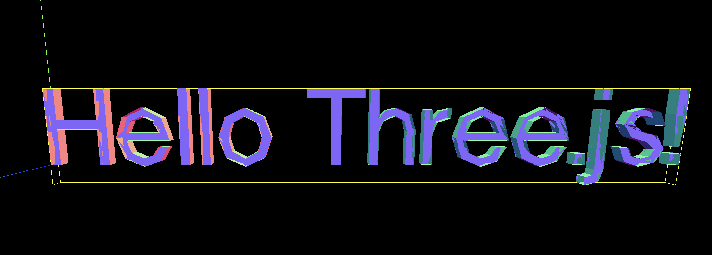
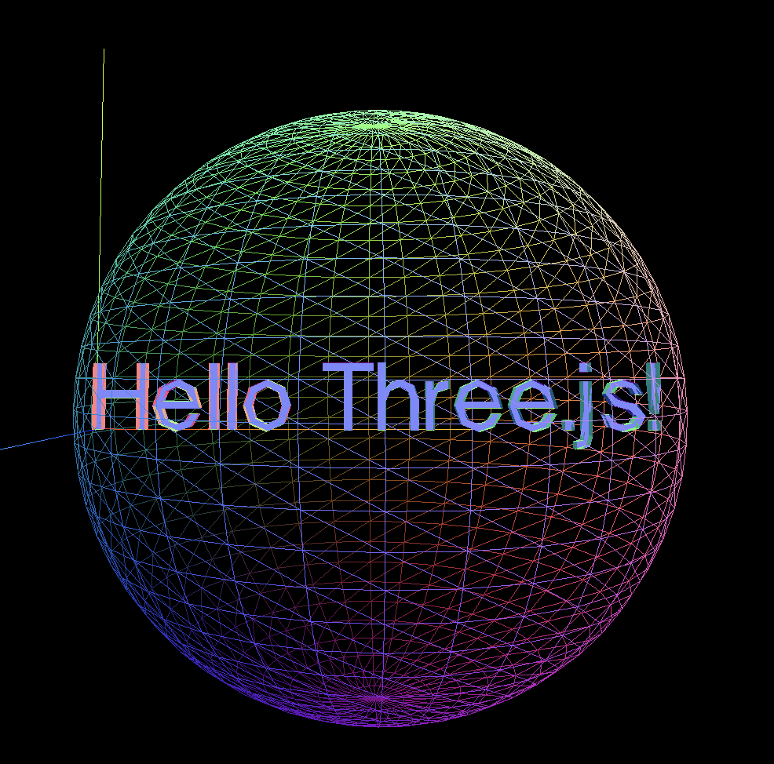
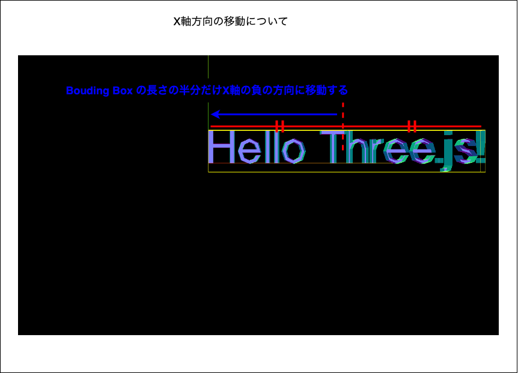
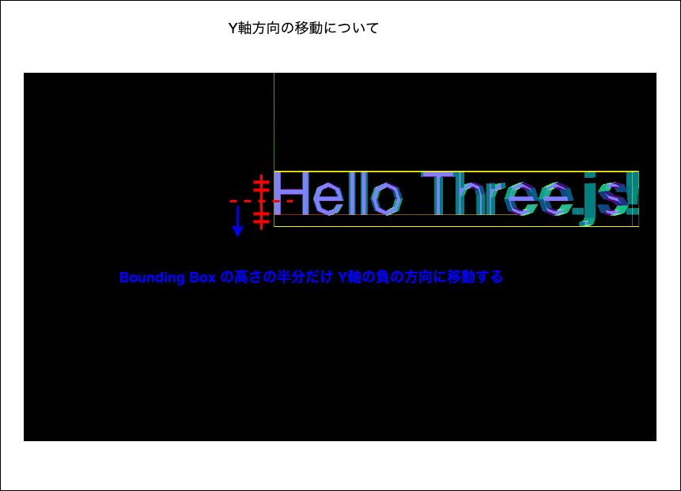
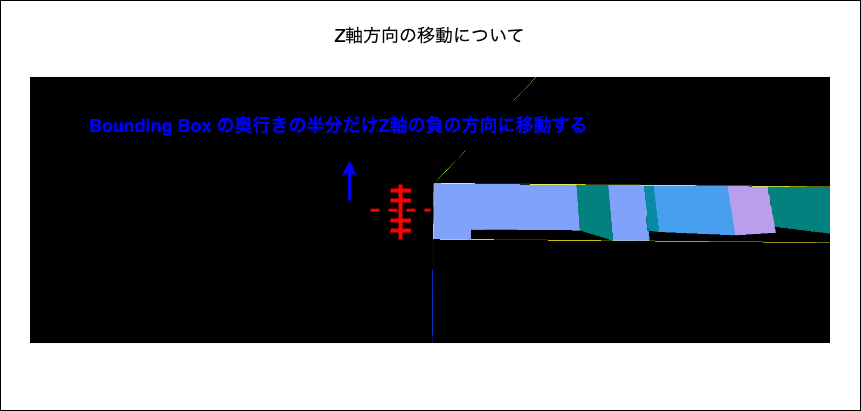
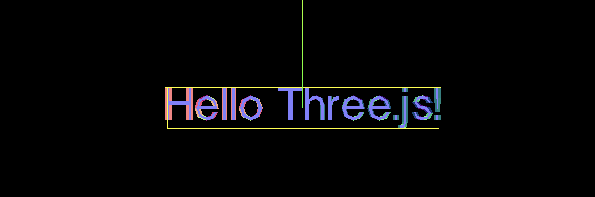

### Bouding とは

- 3D 空間でのオブジェクトの境界

<br>

- いくつかの Bounding の考え方がある

    - Box Bounding
        - オブジェクトを囲む立方体型の境界

        

    <br>

    - Sphere Bounding
        - オブジェクトを囲む球体型の境界

        

<br>

- Bounding の何が嬉しいのか?

    - オブジェクトの衝突判定に使える

    - frustum culling に利用されている

        →カメラ位置の範囲に入っているオブジェクトだけを描画する技術

---

### Three.js での Bounding の利用

Bounding Box を使ってオブジェクトの中心を原点(0,0,0)に移動してみる

*center() を使えばもっと簡単にできるが、今回は Bounding の理解を深めるためにめんどくさい方法で原点に配置する

<br>

ポイント

- Boudning Box / Sphere は BufferGeometry クラスのプロパティなので、ほとんどのジオメトリで利用できる (ほとんどのジオメトリが BufferGeometry を継承しているから)

- オブジェクト(ジオメトリ)の Bounding Box / Sphere はデフォルトでは null

- 上を利用する場合は、前もって computeBoundingBox() / computeBoundingSphere() で計算する必要がある

<br>

#### 手順

1. ジオメトリの Boudning Box を計算し取得する

    - computeBoundingBox() で計算する

    ```js
    const geometry = new THREE.TextGeometry(~,{~});

    // boundingBox の計算
    geometry.computeBoundingBox();
    ```

<br>

2. 計算した Bounding Box の値をもとにオブジェクト(ジオメトリ)を移動量を算出する
    
    - X軸方向の移動量の計算

        ```js
        const moveX = geometry.boundingBox.max.x - Math.abs(geometry.boundingBox.min.x);
        ```

        

    <br>
    
    - Y軸方向の移動量の計算

        ```js
        const moveY = geometry.boundingBox.max.y - Math.abs(geometry.boundingBox.min.y);
        ```

        

    <br>

    - Z軸方向の移動量の計算

        ```js
        const moveZ = geometry.boundingBox.max.z - Math.abs(geometry.boundingBox.min.z);
        ```

        

<br>

3.  ジオメトリを原点に移動させる

    - ジオメトリの translate() でオブジェクトを移動させる

    ```js
    geometry.translate(moveX, moveY, moveZ);
    ```

    