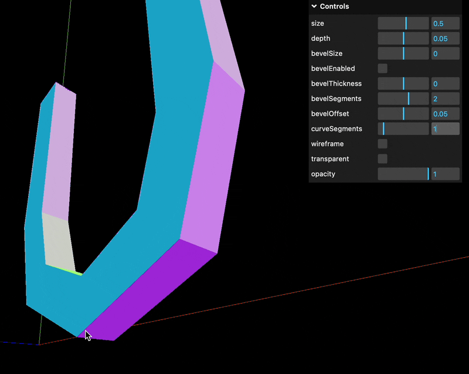

### TextGeometry

#### 概要

- 文字列からジオメトリを作成できるクラス

- *TextGeometry の作成には [Typeface (書体)](#typeface-vs-font) インスタンスが**必ず必要**


#### 利用方法

1. TextGeometry は add-on なので、別途インポートする

    ```js
    import { TextGeometry } from 'three/addons/geometries/TextGeometry.js';
    ```

<br>

2. [FontLoader](#fontloader) でロードしたフォントから TextGeometry インスタンスを作成する

    - 引数
        - 第一: ジオメトリを作成したい元の文字列 (String)
        - 第二: [パラメーター]() (Object)

    ```js
    fontLoader.load("typefaceファイルのパス", (font) => {
        // font: ロードしたtypeface ファイルから作成した Font インスタンス

        //TextGeometryインスタンスの作成
        const TextGeometry

    })
    ```

<br>

#### 間違えた&ややこしかったところ

- TextGeometry は 第二引数はオブジェクトを受け取ることに注意

    ```js
    fontLoader.load("typefaceファイルのパス", (font) => {
        //間違ったコード → font インスタンスをそのまま渡している
        const TextGeometry("Hello!", font);

        // 正しいコード → font インスタンスをオブジェクトに入れている
        const TextGeometry("Hello!", { font });
    })
    ```

<br>
<br>

参考サイト

[TextGeometry](https://threejs.org/docs/?q=textge#examples/en/geometries/TextGeometry)

---

### FontLoader

#### 概要

- json 形式の typeface ファイルを読み込むためのクラス

- json形式しかサポートしていない
    - (google フォントなどでダウンロードできる) 多くの typeface のファイル形式は ttf

    - ttf を [Facetype.js](http://gero3.github.io/facetype.js/) にて json に変換することで google フォントからダウンロードした typeface ファイルを Three.js で利用することができる

- typeface 用であること以外は基本的に他の Loader系クラス と同じような使用感
    - FontLoader のload 関数はFontインスタンスをリターンしないことに注意すること

#### 利用方法

1. FontLoader は add-on なので、別途インポートする

    ```js
    import { FontLoader } from 'three/addons/loaders/FontLoader.js';

    const fontLoader = new FontLoader();
    ```

<br>

2. load 関数で json 形式の typeface ファイルをロードする

    - TextureLoader と同じ引数をとる

    - TextureLoader とは異なり、load 関数はロードしたファイルを元に作成したインスタンスを返却しない

    - 第二引数の onload コールバック関数は Font インスタンスを引数として受け取る

    ```js
    fontLoader.load("typefaceファイルのパス", (font) => {
        // ロード完了時のコールバック関数
        // TextGeometry の作成
    });
    ```

<br>

#### Three.js がデフォルトで用意している typeface を利用する方法

1. Three.js がデフォルトで用意している typeface の json ファイルをインポートする

    ```js
    import helvetker from "three/examples/fonts/helvetiker_regular.typeface.json";
    ```

<br>

2. FontLoader の parse 関数を使って、インポートした typeface を Font オブジェクトに変換する

    - *インポートした helvetker は Object 型のデータになっている

    ```js
    import helvetker from "three/examples/fonts/helvetiker_regular.typeface.json";
    import { FontLoader } from 'three/addons/loaders/FontLoader.js';

    const fontLoader = new FontLoader():
    // インポートした json ファイルから Font インスタンスを作成
    const font = fontLoader.parse(helvetker);
    ```

<br>

3. parse 関数から取得した Font インスタンスをもとに TextGeometry を作成

    ```js
    import { TextGeometry } from 'three/addons/geometries/TextGeometry.js';
    ~~省略~~

    // インポートした json ファイルから Font インスタンスを作成
    const font = fontLoader.parse(helvetker);

    // TextGeometry の作成
    const geometry = new TextGeometry("Hi", { font });

    // あとはマテリアル & メッシュの作成など
    ```

<br>
<br>

参考サイト

[FontLoader](https://threejs.org/docs/index.html?q=Font#examples/en/loaders/FontLoader)

[Three.jsのTextGeometryで日本語を立体的に表示する 🇯🇵](https://blog.kimizuka.org/entry/2022/06/30/223537)

---

### Typeface vs Font

Typeface

- いわゆる書体
    - 文字の書き方のコンセプト、体系

- 明朝体、ゴシック体などが書体

<br>

Font

- 書体で特定の文字の大きさや太さで書かれるもの

- 明朝体だったら MS 明朝やヒラギノ明朝がフォント

- ゴシック体だったら MSゴシックやメイリオがフォント

<br>


引用: [フォントと書体ってどう違うの？](https://note.com/shijimiota/n/n5a5063f4602e)

<br>
<br>

参考サイト

[ゴシック体？明朝体？ フォントの基本とWebサイトでよく使われる日本語フォント](https://asue.jp/blog/?p=18391)

[書体](https://ja.wikipedia.org/wiki/書体)

[フォントと書体ってどう違うの？](https://note.com/shijimiota/n/n5a5063f4602e)

[What’s the difference between a type family and a font?](https://community.ucraft.com/t/35yhcga/whats-the-difference-between-a-type-family-and-a-font#:~:text=The%20main%20difference%20between%20these,a%20typeface%20is%20a%20font.)

---

### TextGeometryのパラメーター


- font: [FontLoader](#fontloader) でロードした font インスタンス

<br>

- size (float)
    - 文字 (TextGeometry) のサイズ
    - 負の値を指定すると、左右逆になる

    

<br>

- depth (float)
    - 文字 (TextGeometry) の奥行き
    - 負の値を指定すると、逆方向に厚さが増す

    

<br>

- curveSegment (integer)
    - 曲線をいくつの面(ポリゴン)で表現するかに関する設定
    - 最小値: 1
    - 曲線を構成する面の数 = curveSegment × 2
    - 値を大きくすればすれほど曲線が滑らかになるが、処理の負荷は大きくなる

    
    
    
    

<br>

- bevelEnable (bool)
    - 以下の bevel 系のパラメーターを有効にする (= 文字のエッジを丸める)

<br>

- bevelSize (float)
    - bevel の大きさ
    - 正の値を指定すると、文字のアウトラインから外側に bevel する
    - 負の値を設定すると、文字のアウトラインから外側に bevel する
    - *bevelSize を(正の値で)指定すると、sizeで指定したサイズよりもオブジェクトが大きくなってしまうので注意

    
    

<br>

- bevelThickness (float)
    - bevel の厚さ
    - 正の値を指定すると文字の外側に突き出るような見た目になる
    - 負の値を指定すると文字の外側にに引っ込むようなような見た目になる
    - *bevelThickness を(正の値で)指定すると、depthで指定した文字の厚さよりもオブジェクトが厚くなってしまうので注意

    
    

<br>

- bevelOffset (float)
    - 文字のアウトラインからの距離

    

    

<br>

- bevelSegment (integer)
    - bevel の面を構成するセグメント数
    - 最小値: 0
    - 値を大きくすればすれほど エッジの丸みが滑らかになるが、処理の負荷は大きくなる

    

---

### Bevel とは

- オブジェクトのエッジや角を滑らかにすること


引用: [Bevel](https://wiki.blender.jp/Dev:Source/Modeling/Bevel)

<br>

- Bevel の面を多くすれば多くするだけオブジェクトのエッジをより滑らかにすることがでできる


引用: [ベベル](https://cgworld.jp/terms/ベベル.html)

