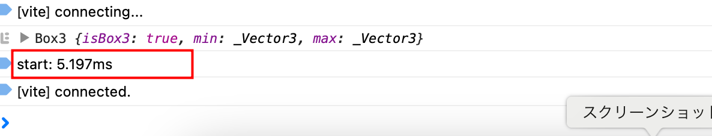

### コードの実行時間を計測する

- `console.time('label_name')` と `console.timeEnd('label_name')` でその間のコードの実行完了までにかかった時間を測ることができる
    - Date インスタンスを使うより簡単


#### 使い方

```js
// ここから
~~~
~~~~
~~~~
~~~
// ここまでのコード完了までの時間を計測したい
```

<br>

↓

<br>

```js
console.time("start");
~~~
~~~~
~~~~
~~~
console.timeEnd("start")
```

