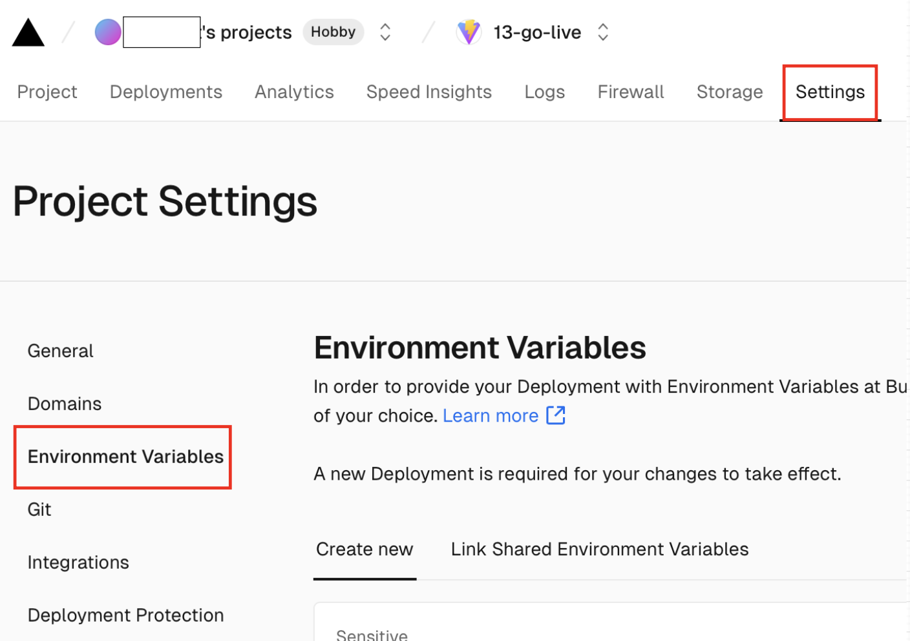

### Vercel とは

- Vercelはアプリケーションをデプロイするためのホスティングサービス

- PaaSの形態

---

### Vercel へのアップロードの方法

1. vercel CLI ツールをインストール (yarnやnpm などで)

    - 自分のマシンにグローバルインストールする場合

        ```bash
        npm install -g vercel
        ```

    - プロジェクトフォルダにローカルインストールする場合

        ```bash
        npm install -D vercel
        ```

<br>

2. Vercel にログイン

    ```bash
    npx vercel login
    ```

<br>

3. package.json に vercel のビルドコマンドを npm run で実行できるように編集する

    *vercel は vite.config.js のような設定ファイルを自動で見つけ、その設定に従ってビルドしてくれるらしい    

    ```json
    {
        "scripts": {
            # ローカル環境でのビルド
            "local-build": "vercel build",
            # 本番環境用の設定(環境変数)でビルド
            "production-build": "vercel build --prod",
        }
    }
    ```

    *環境変数について[こちら](#vercel-での環境変数の利用)を参照

<br>

3. package.json に vercel のデプロイコマンドを npm run で実行できるように編集する

    - ビルド + Vercel へデプロイするコマンド

        ```json
        {
            "scripts": {
                # ローカル環境でビルドしてデプロイ
                "deploy": "vercel deploy",
                # 本番環境用の設定(環境変数)でビルドしてデプロイ
                "production-deploy": "vercel --prod"
            }
        }
        ```

    <br>

    - ビルド済みのフォルダをデプロイするコマンド

        - vercel 側でビルドする手間が省ける

        ```json
        {
            "scripts": {
                "prebuild-deploy": "vercel deploy --prebuilt"
            }
        }
        ```
    
<br>

4. デプロイコマンド実行して Vercel にデプロイする

    ```bash
    npm run production-deploy  
    ```

<br>
<br>

参考サイト

[Vercel CLI コマンド一覧　CLIを駆使して開発効率UP](https://note.com/libproc/n/ndf45b937b394)

[Vercel CLI の基本的な使い方](https://www.kimizuy.dev/blog/post/how-to-use-vercel-cli)

---

### Vercel での環境変数の利用

Vercel の web ページからプロジェクトの環境変数の設定が可能

 `Settings` の `Environment Variables` から設定可能
 


<br>
<br>

参考サイト

[Vercelで設定した環境変数をNext.jsで使用する](https://qiita.com/Slowhand0309/items/f954237520d343fa9e4c)