### Lights

- 3D 空間に配置する光源

- PBR マテリアルなどは Light がないと見えない

- 様々な種類のライトが Three.js から提供されている

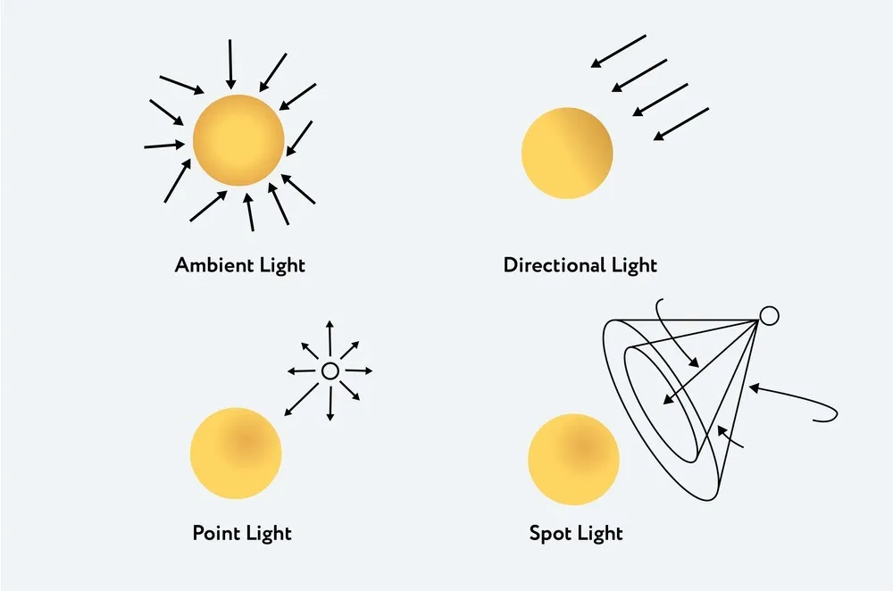

引用: [Enlightening 3D Worlds: Mastering Lighting Techniques in Three.js](https://medium.com/@althafkhanbecse/title-enlightening-3d-worlds-mastering-lighting-techniques-in-three-js-c860caa8cdcf)

---

### Ambient Light

- 3D空間全体に均等に光を当てるライト

- 影や陰影できない

#### Ambient Light をシーンに追加する

1. AmbientLight インスタンスを作成する
    - 第一引数: 光の色 (Integer)
        - `0x~~~~~` の16進数で指定する
        - デフォルトは `0xffffff`

    - 第二引数: 光の強さ (Float)
        - デフォルトは 1

    ```js
    const light = new THREE.AmbientLight(0xffffff, 1.0)
    ```

<br>

2. シーンに追加する

    ```js
    const light = ~~

    scene.add(light);
    ```

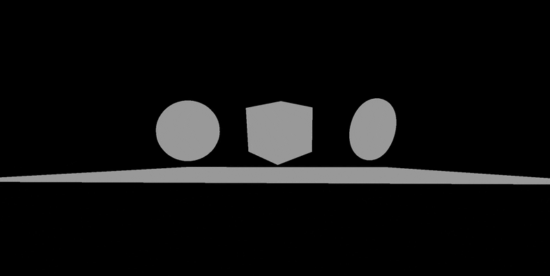

<br>

3. AmbientLight インスタンスの color　プロパティにて光の色を変更も可能

    ```js
    light = new THREE.Color("#00ff00");
    ```


<br>

ポイント

- AmbientLight の**コンストラクタ**で指定する時の光の色は **Integer 型**

- AmbientLightインスタンスの **color プロパティ**から光の色を変更する時は **Color インスタンス**

<br>

#### Ambient Light の使い所

- シーンを一律に明るくしたい時

- 他のオブジェクトからの光の反射をシミュレートしたい時

    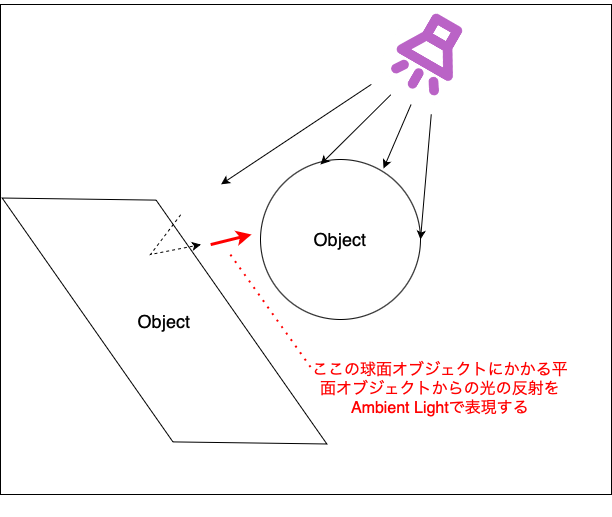

---

### Directional Light

- 特定の方向に**平行**に放射される光

- 光源は無限に離れているとする

- 太陽の光が多く例に出される

<br>

#### Directional Light をシーンに追加する

1. [AmbientLight](#ambient-light-をシーンに追加する) と同様に DirectionalLight インスタンスを作成する

    ```js
    const directionalLight = new THREE.DirectionalLight(0xffffff, 1);
    ```

<br>

2. 作成した DirectionalLight インスタンスをシーンに追加する

    ```js
    scene.add(directionalLight);
    ```

<br>

#### Directiional Light の向きを変えてみる

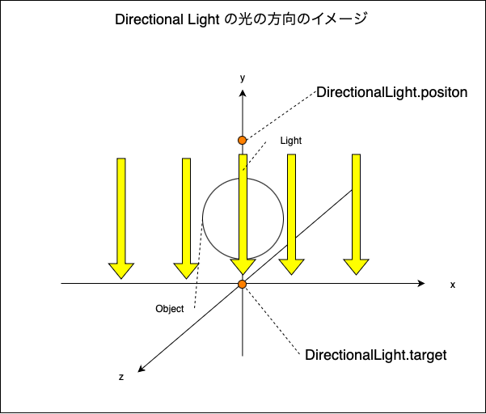

<br>

- DirectionalLight.position を変えると、光源の位置が変化する

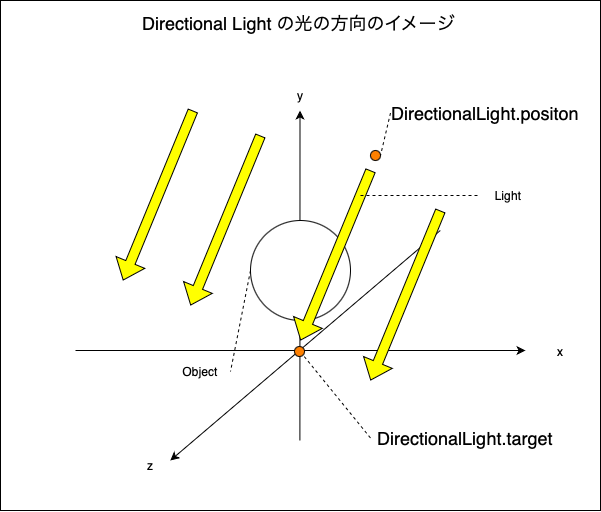

<br>

```js
directionalLight.position.x = 1;
directionalLight.position.y = 1;
directionalLight.position.z = 1;

// もしくは position.set() で1度で全てのpositionを指定する
directionalLight.position.set(1, 1, 1);
```

<br>

- DirectionalLight.target を変えると光の照射方向が変化する

    *target プロパティには、 Object3D Vector3 ではなく **Object3D インスタンス**で指定する

    *また、target プロパティに指定する Objecr3D インスタンスは**シーンに追加されている必要がある**

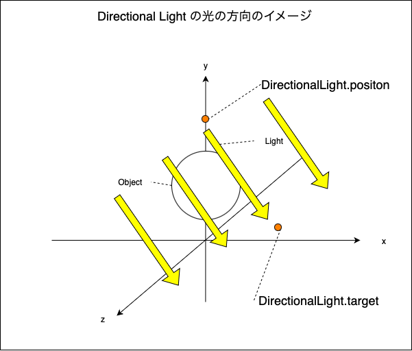

<br>

```js
const target = new THREE.Object3D();

// Object3Dインスタンスの位置を変更
target.position.set(1, 1, 1);

// ★シーンに追加する
scene.add(target);

// Derectional Light の照射方向を指定する
directionalLight.target = target;
```

---

### Hemisphere Light

- Ambient Light の上からの光の色と下からの光色を指摘できるバージョンのライトのイメージ

    - Hemisphere Light も影をとさないライト

    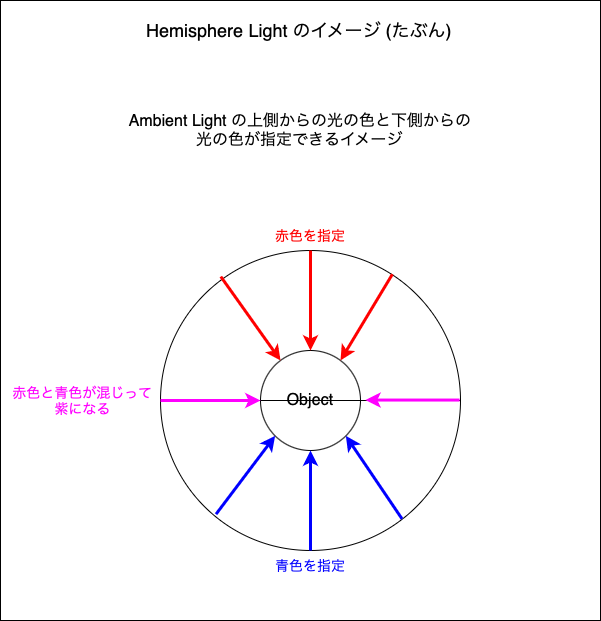

<br>

#### Hemisphere Light をシーンに追加する

1. HemisphereLight インスタンスの作成

    - 第一引数: 上からの光の色
    - 第二引数: 下からの光の色
    - 第三引数: 光の強さ

    ```js
    const hemisphereLight = new THREE.HemisphereLight(0xff0000, 0x0000ff, 1);
    ```

<br>

2. HemisphereLight インスタンスをシーンに追加する

    ```js
    scene.add(hemisphereLight);
    ```

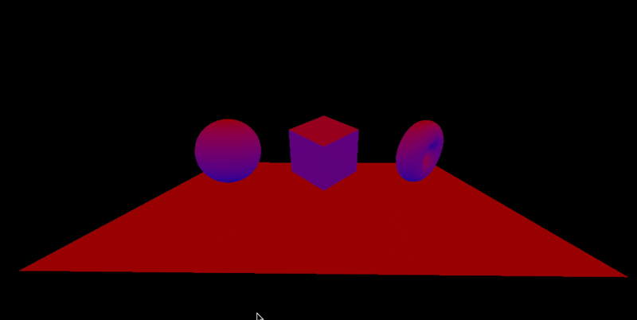

---

### Point Light

- 単一点からあらゆる方向に放射されるライト

<br>

#### Point Light をシーンに追加する

1. PointLight インスタンスの作成

    - 第一引数: ライトの色 (Integer)
    - 第二引数: ライトの強さ (Float)
    - 第三引数: 光の届く距離 (Number)
        - デフォルトは0 = 光は無限に届く

        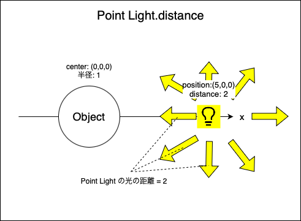
    
    <br>

    - 第四引数: 光の減退具合(明るさの減り具合) (Float)
        - デフォルトは2 = 逆2乗
            - つまり、 1/x^2 で光が減退していく(xは光の距離)

                = 距離が2倍になれば明るさは1/4になり、距離が3倍になれば明るさは1/9になる

            *光の減退については[こちら](https://area.autodesk.jp/column/tutorial/3ds_max_kitchen_stadium/9_so-blog_attenuation/)を参照

        <br>

        - 値を大きくすると、ライトのポジションからちょっとでも光が進むと急に暗くなる

            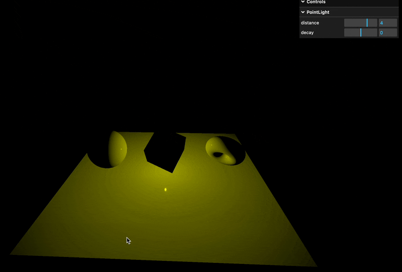

        <br>

        - 値がマイナスの場合、ライトのポジションから光が離れるほど明るくなる = リアルな見た目ではなくなるが面白い表現ができる

            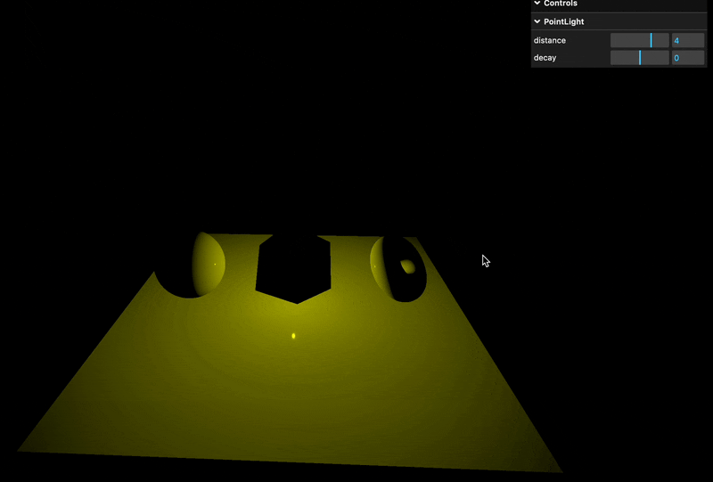

    ```js
    const pointLight = new THREE.PointLight(0xffffff, 1, 0, 2);
    ```

<br>

2. シーンにライトを追加する

    ```js
    scene.add(pointLight);
    ```

#### Ponit Light を移動する

- PointLight.position でポイントライトの座標を指定することができる

    ```js
    pointLight.position.x = 1;
    pointLight.position.y = 1;
    pointLight.position.z = 1;

    // もしくは position.set() で1度で全てのpositionを指定する
    pointLight.position.set(1, 1, 1);
    ```
<br>
<br>

参考サイト

[第9回：光の減衰](https://area.autodesk.jp/column/tutorial/3ds_max_kitchen_stadium/9_so-blog_attenuation/)

---

### Rect Area Light

- 矩形平面に均一に放出される光源

    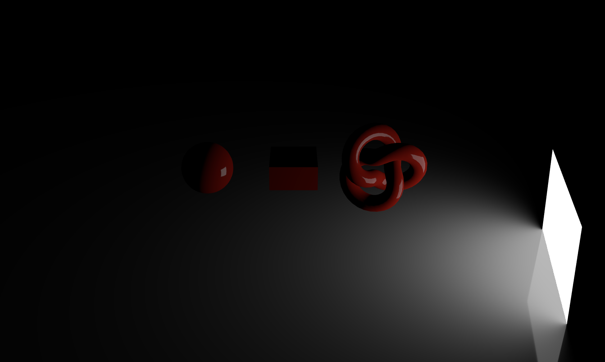

#### Rect Area Light をシーンに追加する

1. RectAreaLight インスタンスを作成する

    - 第一引数: ライトの色 (Integer)
        - デフォルトは `0xffffff` (白)

    - 第二引数: ライトの光の強さ (Float)
        - デフォルトは1

    - 第三引数: RectAreaLightの幅
        - デフォルトは10

    - 第四引数: RectAreaLightの高さ
        - デフォルトは10

    <br>

    ```js
    const rectAreaLight = new THREE.RectAreaLight(0xffffff, 1, 1, 1);
    ```

    <br>

    作成したライトのイメージ

    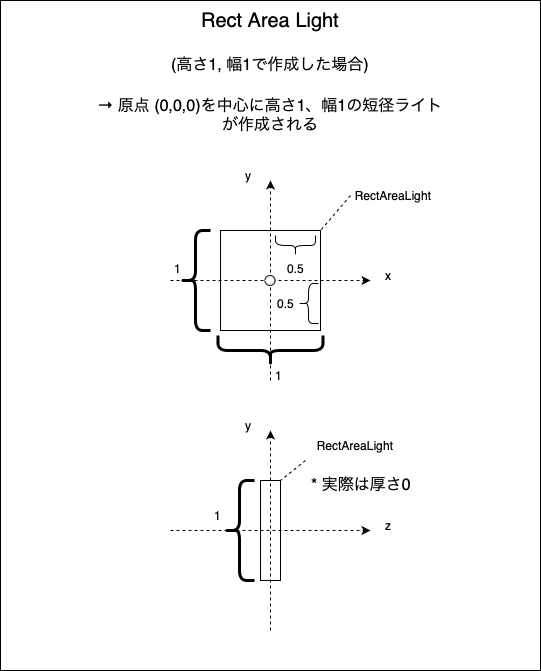

<br>

2. 作成した RectAreaLight インスタンスをシーンに追加する

    ```js
    scence.add(rectAreaLight);
    ```

<br>

#### RectAreaLight をいろんな方向に向けてみる