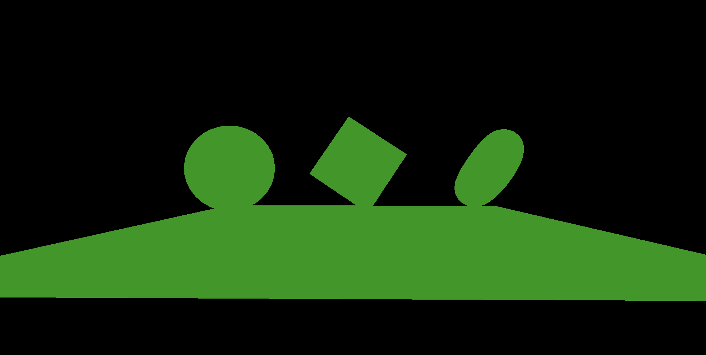
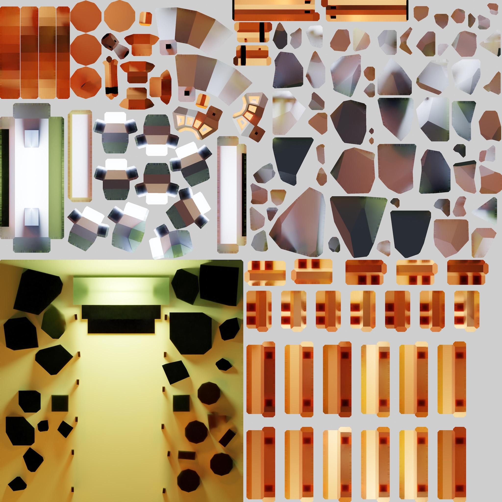

### Lights

- 3D 空間に配置する光源

- PBR マテリアルなどは Light がないと見えない

- 様々な種類のライトが Three.js から提供されている


引用: [Enlightening 3D Worlds: Mastering Lighting Techniques in Three.js](https://medium.com/@althafkhanbecse/title-enlightening-3d-worlds-mastering-lighting-techniques-in-three-js-c860caa8cdcf)

---

### Ambient Light

- 3D空間全体に均等に光を当てるライト

- 影や陰影できない

#### Ambient Light をシーンに追加する

1. AmbientLight インスタンスを作成する
    - 第一引数: 光の色 (Integer)
        - `0x~~~~~` の16進数で指定する
        - デフォルトは `0xffffff`

    - 第二引数: 光の強さ (Float)
        - デフォルトは 1

    ```js
    const light = new THREE.AmbientLight(0xffffff, 1.0)
    ```

<br>

2. シーンに追加する

    ```js
    const light = ~~

    scene.add(light);
    ```


<br>

3. AmbientLight インスタンスの color　プロパティにて光の色を変更も可能

    ```js
    light = new THREE.Color("#00ff00");
    ```



<br>

ポイント

- AmbientLight の**コンストラクタ**で指定する時の光の色は **Integer 型**

- AmbientLightインスタンスの **color プロパティ**から光の色を変更する時は **Color インスタンス**

<br>

#### Ambient Light の使い所

- シーンを一律に明るくしたい時

- 他のオブジェクトからの光の反射をシミュレートしたい時

    

---

### Directional Light

- 特定の方向に**平行**に放射される光

- 光源は無限に離れているとする

- 太陽の光が多く例に出される

<br>

#### Directional Light をシーンに追加する

1. [AmbientLight](#ambient-light-をシーンに追加する) と同様に DirectionalLight インスタンスを作成する

    ```js
    const directionalLight = new THREE.DirectionalLight(0xffffff, 1);
    ```

<br>

2. 作成した DirectionalLight インスタンスをシーンに追加する

    ```js
    scene.add(directionalLight);
    ```

<br>

#### Directiional Light の向きを変えてみる


<br>

- DirectionalLight.position を変えると、光源の位置が変化する


<br>

```js
directionalLight.position.x = 1;
directionalLight.position.y = 1;
directionalLight.position.z = 1;

// もしくは position.set() で1度で全てのpositionを指定する
directionalLight.position.set(1, 1, 1);
```

<br>

- DirectionalLight.target を変えると光の照射方向が変化する

    *target プロパティには、 Object3D Vector3 ではなく **Object3D インスタンス**で指定する

    *また、target プロパティに指定する Objecr3D インスタンスは**シーンに追加されている必要がある**


<br>

```js
const target = new THREE.Object3D();

// Object3Dインスタンスの位置を変更
target.position.set(1, 1, 1);

// ★シーンに追加する
scene.add(target);

// Derectional Light の照射方向を指定する
directionalLight.target = target;
```

---

### Hemisphere Light

- Ambient Light の上からの光の色と下からの光色を指摘できるバージョンのライトのイメージ

    - Hemisphere Light も影をとさないライト

    

<br>

#### Hemisphere Light をシーンに追加する

1. HemisphereLight インスタンスの作成

    - 第一引数: 上からの光の色
    - 第二引数: 下からの光の色
    - 第三引数: 光の強さ

    ```js
    const hemisphereLight = new THREE.HemisphereLight(0xff0000, 0x0000ff, 1);
    ```

<br>

2. HemisphereLight インスタンスをシーンに追加する

    ```js
    scene.add(hemisphereLight);
    ```


---

### Point Light

- 単一点からあらゆる方向に放射されるライト

<br>

#### Point Light をシーンに追加する

1. PointLight インスタンスの作成

    - 第一引数: ライトの色 (Integer)
    - 第二引数: ライトの強さ (Float)
    - 第三引数: 光の届く距離 (Float)
        - デフォルトは0 = 光は無限に届く

        
    
    <br>

    - 第四引数: 光の減退具合(明るさの減り具合) (Float)
        - デフォルトは2 = 逆2乗
            - つまり、 1/x^2 で光が減退していく(xは光の距離)

                = 距離が2倍になれば明るさは1/4になり、距離が3倍になれば明るさは1/9になる

            *光の減退については[こちら](https://area.autodesk.jp/column/tutorial/3ds_max_kitchen_stadium/9_so-blog_attenuation/)を参照

        <br>

        - 値を大きくすると、ライトのポジションからちょっとでも光が進むと急に暗くなる

            

        <br>

        - 値がマイナスの場合、ライトのポジションから光が離れるほど明るくなる = リアルな見た目ではなくなるが面白い表現ができる

            

    ```js
    const pointLight = new THREE.PointLight(0xffffff, 1, 0, 2);
    ```

<br>

2. シーンにライトを追加する

    ```js
    scene.add(pointLight);
    ```

#### Ponit Light を移動する

- PointLight.position でポイントライトの座標を指定することができる

    ```js
    pointLight.position.x = 1;
    pointLight.position.y = 1;
    pointLight.position.z = 1;

    // もしくは position.set() で1度で全てのpositionを指定する
    pointLight.position.set(1, 1, 1);
    ```
<br>
<br>

参考サイト

[第9回：光の減衰](https://area.autodesk.jp/column/tutorial/3ds_max_kitchen_stadium/9_so-blog_attenuation/)

---

### Rect Area Light

- 矩形平面に均一に放出される光源

    

#### Rect Area Light をシーンに追加する

1. RectAreaLight インスタンスを作成する

    - 第一引数: ライトの色 (Integer)
        - デフォルトは `0xffffff` (白)

    - 第二引数: ライトの光の強さ (Float)
        - デフォルトは1

    - 第三引数: RectAreaLightの幅
        - デフォルトは10

    - 第四引数: RectAreaLightの高さ
        - デフォルトは10

    <br>

    ```js
    const rectAreaLight = new THREE.RectAreaLight(0xffffff, 1, 1, 1);
    ```

    <br>

    作成したライトのイメージ

    

<br>

2. 作成した RectAreaLight インスタンスをシーンに追加する

    ```js
    scence.add(rectAreaLight);
    ```

<br>

### RectAreaLight Helper を利用して RectAreaLight の形状、向きなどを可視化する

1. RectAreaLightHelper をインポートする

    - RectAreaLightHelper は add-on なので別途インポートする

    ```js
    import { RectAreaLightHelper } from 'three/addons/helpers/RectAreaLightHelper.js';
    ```

<br>

2. RectAreaLightHelper インスタンスを作成する

    - 引数: RectAreaLight インスタンス

    ```js
    const light = new THREE.RectAreaLight( 0xffffff, 1.0, 5, 5);

    // RectAreaLightHelper インスタンス作成
    const helper = new RectAreaLightHelper(light);
    ```

<br>

3. **RectAreaLight インスタンス** に RectAreaLightHelper インスタンスを追加する

    - *sceneに追加ではないことに注意

    - RectAreaLight はデフォルトだと後ろ向きらしい

    ```js
    light.add(helper);
    ```


<br>

*RectAreaLightHelper の注意点

- RectAreaLight は物体に落とす光だけが見える。
    → RectAreaLightHelper は光源を可視化するが、RectAreaLight では光源は見えない
    


<br>

#### RectAreaLight を移動したり、いろんな方向に向けてみる

ポイント

- RectAreaLight の位置を変更するのは position プロパティで行う
    - デフォルトは (0,0,0)

- RectAreaLight の向きを変更するのは以下の2つの方法がある
    - lookAt() で向く位置を指定する
    - rotation プロパティでどのぐらい回転するかを指定する

<br>

RectAreaLight の移動

```js
rectAreaLight.position.x = 2;
rectAreaLight.position.y = 2;
rectAreaLight.position.z = 2;

// もしくは
rectAreaLight.position.set(2, 2, 2);
```


<br>

RectAreaLight の向きを変える

- RectAreaLight.lookAt() で向く位置を指定する方法

    ```js
    rectAreaLight.lookAt(new THREE.Vector3(2, 0, 0));

    //　もしくは
    rectAreaLight.lookAt(2, 0, 0);
    ```

    

<br>

- RectAreaLight.rotation プロパティでどのぐらい回転するかを指定する方法

    ```js
    rectAreaLight.rotation.y = Math.PI * 0.5;
    ```

    

---

### Spot Light

- 単一の点から一方向に放出され、円錐に沿って放出される光源

- その名の通りスポットライトや懐中電灯をイメージするとわかりやすい

#### Spot Light をシーンに追加する

1. SpotLight インスタンスを作成する

    - 第一引数: 光の色 (Integer)
    - 第二引数: 光の強さ (Float)
    - 第三引数: 光の届く距離 (Float)
    - 第四引数: 照射角 (光線軸とのなす角度) (Float)
        - ラジアンで指定する必要がある

        
    
    <br>

    - 第五引数: オブジェクトに当たった光の光線軸からの減退具体(Float)
        - 光の輪郭のぼやけ具合という理解でもいい
        - 0 ~ 1の範囲で指定する
        - 0: 光の輪郭がすごくはっきり映る
        - 1: 光の輪郭はぼやけて映る

        

    <br>

    - 第六引数: 光源からの光の減退具合 (Float)

        

    ```js
    const spotLight = new THREE.SpotLight(
        0x00ff00,
        5,
        5,
        Math.PI * 0.1,
        0.25,
        1);
    ```

<br>

2. SpotLight インスタンスをシーンに追加する

    ```js
    scene.add(spotLight);
    ```


<br>

#### SpotLightHelper で Spot Light が照らす範囲を可視化する

1. SpotLightHelper インスタンスを作成する

    - 第一引数: SpotLight インスタンス
    - 第二引数: SpotLightHelper の枠の色
        - 省略すると SpotLight の光の色と同じ色になる

    ```js
    const spotLightHelper = new THREE.SpotLightHelper(
        spotLight,
        new THREE.Color(0xff0000)
    );
    ```

<br>

2. SpotLightHelper インスタンスをシーンに追加する

    ```js
    scene.add(spotLightHelper);
    ```


<br>

SpotLightHelper を使う際の注意点

- SpotLightHelper インスタンスをシーンに追加以降、 spotLight の位置や向きなどを変更した場合、 SpotLightHelper インスタンスを update() で更新する必要がある

    ```js
    // SpotLightHelperの更新を忘れた場合
    scene.add(spotLightHelper);

    // Spot Light の向きの変更
    spotLight.target.position.set(-1, -2, 0);
    ```

    

    <br>

    ```js
    scene.add(spotLightHelper);

    // Spot Light の向きの変更
    spotLight.target.position.set(-1, -2, 0);

    // ★SpotLightで何らかの変更を行なった場合は、SpotLightHelperの更新を忘れずに
    spotLightHelper.update();
    ```

    

<br>

#### Spot Light の位置や向ける方向を変えてみる

- Spot Light の光源の位置を変更する

    - SpotLight.position プロティで設定する

    ```js
    spotLight.position.x = 1;
    spotLight.position.y = 2;
    spotLight.position.z = 3;

    // もしくは set() で一度で指定する
    spotLight.position.set(1, 2, 3);
    ```

<br>

- Spot Light の向ける方向を変更する

    - SpotLight.target で設定する

    - target プロパティを設定したら、その target を**シーンに追加する必要がある**

    - target に指定するのは Object3D インスタンス (以下の2つの方法がある)

        - target プロパティにデフォルトで設定されている Object3D インスタンスの position を変更する

            ```js
            spotLight.target.position.set(-1, -2, -3);

            // ★ターゲットをシーンに追加する
            scene.add(spotLight.target)
            ```

            

        <br>

        - target プロパティに Spot Light を向けたいオブジェクトを設定する

            ```js
            const sphere = new THREE.Mesh(
                new THREE.SphereGeometry(0.5, 32, 32),
                new THREE.MeshStandardMaterial()
            );
            sphere.position.x = -1.5;

            // target を sphere オブジェクトにする
            spotLight.target = sphere;

            // ★ターゲットをシーンに追加する
            scene.add(spotLight.target)
            ```

            

<br>

#### decay が負の値を取るとどうなるか

- 光の距離が進むと明るくなり、近い距離だと暗くなるという現実的ではない光の表現になる

    

---

### Baking

- 基本的に Light は処理の重いオブジェクト

- 処理の重さ的には、 Ambient Light などが一番軽く、 Point Light などが一番重い

    Ambient Light, Hemisphere Light \< Directional Light, Point Light \< Spot Light, Rect Area Light

- 多くの Light インスタンスをシーンに追加するとパフォーマンスの低下を招く

- 解決策として、**テクスチャーに影も書き込む = ベイクする**

    - しかし、カメラの角度を変えても影は変化しないというデメリットもある

- 以下は、ベイクしたテクスチャの例

    

    引用: [three.js journey](https://threejs-journey.com)