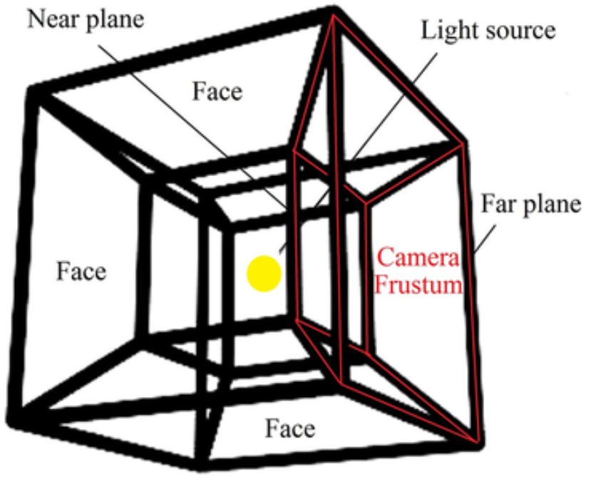

### Point Light のライトカメラ

- Perspective Camera を Point Light の上下左右前後に配置して6つのシャドウマップを作成する (この手法をキューブマップと呼ぶ)

    

    引用: [Soft bilateral filtering volumetric shadows using cube shadow maps](https://www.researchgate.net/publication/318260733_Soft_bilateral_filtering_volumetric_shadows_using_cube_shadow_maps)

    <br>

    

    引用: [Multipass Shadow Mapping With Point Lights](https://ogldev.org/www/tutorial43/tutorial43.html)

<br>

#### ポイント

- Rendere がシーンをレンダリングする前に、 Point Light のカメラでシャドウマップを6つ作成するため、ポイントライトは他のライトに比べて処理が重い

<br>
<br>

参考サイト

[Omnidirectional Shadow Mapping(全方位シャドウマップ)を実装した](https://riyaaaaasan.hatenablog.com/entry/2018/03/07/222815)

---

### Point Light のライトカメラを可視化してみる

1. CameraHelper に Point Light のライトカメラを渡しインスタンス化 & シーンに追加する

    ```js
    // PointLightの作成&追加
    const pointLight = new THREE.PointLight(0xffffff, 3);
    pointLight.castShadow = true;
    pointLight.position.set(0, 2, 2);
    scene.add(pointLight);

    // CameraHelperの作成&追加
    const pointLightCameraHelper = new THREE.CameraHelper(pointLight.shadow.camera);
    scene.add(pointLightCameraHelper);
    ```

    <br>

しかし、1方向の Perspective Cameraのガイド枠しか表示されない


→ これはカメラヘルパーの問題で、実際には[こちら](#point-light-のライトカメラ)で説明しているように、他の5方向にも同様の Perspective Camera を向けている

---

### Point Light のライトカメラの修正


- 上記のままだと、 far 面が遠すぎるので、far 面の距離を小さくする

    - デフォルトの far 面の距離は 500


    ```js
    pointLight.shadow.camera.far = 5;
    ```

    

<br>

- near 面ももう少し遠くできそうなので、修正する

    - デフォルトの far 面の距離は 0.5
    ```js
    pointLight.shadow.camera.near = 1;
    ```

    

<br>

- もし、 near 面と far 面にオブジェクトが正しく入り切らなかったら影がきれる

    

---

### Point Light のライトカメラのFov の変更

できるけど、しないほうがいい

→ 影が切れたり、離れたり、変なところに落とされたりする

