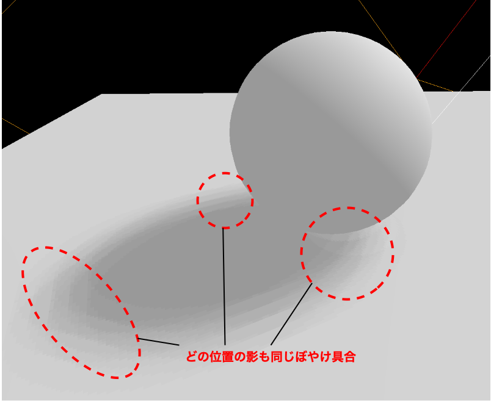

### Shadow

影には2種類ある

- core shadow
    - 自身が自身に落とす影

- drop shadow (cast shadow)
    - 他のオブジェクトから落とされる影


引用: [How to Add a Drop Shadow in Photoshop](https://koro-koro.com/threejs-no1/#chapter-13)

<br>

Three.jsでは以下のライトが Drop Shadow を落とせる

- Point Light
- Directional Light
- Spot Light

<br>
<br>

参考サイト
[Three.jsこと始め](https://koro-koro.com/threejs-no1/)

---

### 影が落とされる仕組み ~ Shadow Mapping

1. カメラからのシーンをレンダリングする前に、**ライトの視点から見たシーン内のオブジェクトとの距離関係をグレースケールで表したマップ(テクスチャ)** (= シャドウマップ) を作成する

    

    引用: [シャドウマッピング](http://asura.iaigiri.com/OpenGL/gl46.html)

    <br>

    - 作成されるシャドウマップ(深度マップ)は以下のような感じ

        - 黒: ライトとの距離が近い = 深度が小さい
        - 白: ライトとの距離が遠い = 深度が大きい

        

        引用: [Variance Shadow Maps](https://graphics.stanford.edu/~mdfisher/Shadows.html)

<br>

2. カメラからのシーンをレンダリングする際に、`レンダリングするオブジェクトの頂点とライトの距離` & `レンダリングするオブジェクトの頂点のシャドウマップでの深度` を比較し対象の頂点が影になるかどうかを判定する

    

    引用: [シャドウマッピング](http://asura.iaigiri.com/OpenGL/gl46.html)

    <br>

    - 比較方法
        - ライトからオブジェクトの頂点までの距離を D とおく

        - シャドウマップでのオブジェクトの頂点の深度を d とおく

            - D > d であれば、その頂点の前に何かオブジェクトが遮っているので影になる判定となる

            - D \<= d であれば、遮るオブジェクトがないので光が当たる判定となる

        

        引用: [【Unity】シャドウマッピングについて](https://r-ngtm.hatenablog.com/entry/2021/01/26/131305)

<br>

3. オブジェクトに影を描写してシーンをレンダリングする

<br>
<br>

参考サイト

[シャドウマッピング](http://asura.iaigiri.com/OpenGL/gl46.html)

[いまさら聞けない業界用語 ～ライティング編②～](https://3d.crdg.jp/tech/archives/1688)

[【Unity】シャドウマッピングについて](https://r-ngtm.hatenablog.com/entry/2021/01/26/131305)

[three.jsのシャドウマッピング](https://mofu-dev.com/blog/threejs-shadow-map)

---

### Three.js でオブジェクトに Drop Shadow を落とす

1. レンダラーでがシャドウマップを利用するよう設定する

    - [こちら](#影が落とされる仕組み--shadow-mapping)でいう手順2でレンダラーがシャドウマップを利用していることがわかる

    - Rendere インスタンスのshadowMap.enabled プロパティに true を設定する

    ```js
    rendere.shadowMap.enabled = true;
    ```

<br>

2. Drop Shadow を落とすオブジェクト、Drop Shadow を落とされるオブジェクトの設定をする

    

    <br>

    - Drop Shadow を落とすオブジェクトには、 `castShadow = true` を設定する

        ```js
        sphereObj.castShadow = true;
        ```

    <br>

    - Drop Shadow を落とされるオブジェクトには、 `receiveShadow = true` を設定する

        ```js
        planeObj.receiveShadow = true;
        ```

<br>

3. Light オブジェクトでシャドウマップを生成するようにする

    ```js
    // Spot Lightを使う場合は
    spotLight.castShadow = true;
    ```


---

### Optimizing Shadows ~ シャドウマップの解像度の変更

- [上記](#threejs-でオブジェクトに-drop-shadow-を落とす)手順で作成した影はジャギって見える

    - シャドウマップのデフォルトサイズは 512 × 512 で少し解像度が低い

    

<br>

- シャドウマップにアクセスする方法

    - Light インスタンスの shadow プロパティの中にシャドウマップの情報がある    

        ```js
        console.log(directionalLlight.shadow);
        ```

        

<br>

#### シャドウマップの解像度を上げる

- Light インスタンスの `shadow.mapSize` プロパティにて、解像度を指定する

- シャドウマップの高さ、幅は2の累乗である必要がある

- シャドウマップの高さと幅は同じである必要はない

    ```js
    pointLight.shadow.mapSize.width = 2048;
    pointLight.shadow.mapSize.height = 2048;
    ```


<br>
<br>

参考サイト

[WebGL と JavaScript で学ぶ3D表現 Three.jsで影を落とす方法](https://ics.media/tutorial-three/light_shadowmap/)

---

### Optimizing Shadows ~ ライトカメラの範囲変更

- シャドウマップを作成する視点となるライトカメラを修正することで、シャドウマップの精度を上げることができる

    - ライトカメラのnearがオブジェクトから遠いとシャドウマップに小さく描画される

        - シャドウマップにオブジェクトが小さく描画されると、影がテクスチャマッピングの時にチラつく = ジャぎる (理由は[こちら](../../chap1/10/Mipmap_TextureFiltering.md)を参照)

    

<br>

#### ライトカメラへのアクセス

- ライトカメラへは Light インスタンスの `shadow.camera` プロパティからアクセスすることができる

    - `Light.shadow.camera` (Camera)
    - `Light.shadow.camera.near` (Float)
    - `Light.shadow.camera.far` (Float)

<br>

#### ライトカメラの種類

- Perspectvive camera
    - **Point Light / Spot Light** がシャドウマップを作成する際に利用するライト視点のカメラ **(シーンをレンダリングする時に利用するカメラと同じ)**

        - `Light.shadow.camera.fov`
        - `Light.shadow.camera.aspect`

- Orthographic Camera
    - **Directional Light** がシャドウマップを作成する際に利用するライト視点のカメラ **(シーンをレンダリングする時に利用するカメラと同じ)**

        - `Light.shadow.camera.top`
            - ライトの position を原点として正の値をとる
            - 値が大きいほど、カメラの上方向の範囲が大きくなる
            - bottom より小さい値を設定するとカメラの上下が反転する
            
            
        
        <br>

        - `Light.shadow.camera.bottom`
            - ライトの position を原点として負の値をとる
            - 値が小さいほど、カメラの下方向の範囲が大きくなる
            - top より大きい値を設定するとカメラの上下が反転する

            

        <br>

        - `Light.shadow.camera.left`
            - ライトの position を原点として負の値をとる
            - 値が小さいほど、カメラの左方向の範囲が大きくなる
            - right より大きい値を設定するとカメラの左右が反転する

            

        <br>

        - `Light.shadow.camera.right`
            - ライトの position を原点として正の値をとる
            - 値が大きいほど、カメラの右方向の範囲が大きくなる
            - left より小さい値を設定するとカメラの左右が反転する

            

<br>

#### CameraHelper の利用

- ライトカメラを可視化し、ライトカメラの範囲を変更しやすくする

1. CameraHelper インスタンスを作成する

    - 第一引数: カメラインスタンス (Camera)

    ```js
    const cameraHelper = new THREE.CameraHelper(directionalLight.shadow.camera);
    ```

<br>

2. CameraHelper インスタンスをシーンに追加する

    ```js
    scence.add(cameraHelper);
    ```


<br>

#### ライトカメラの範囲の修正

- デフォルトだと、far面が遠過ぎたり、top, bottom, left, right が大き過ぎたりする

    

    <br>

    - その際に、[debugGUI](../../chap1/09/DebugUI.md) を利用すると実際にライトカメラの範囲を動かしならが確認できる

        - カメラの範囲を変更した後は、 `Light.shadow.camera.updateProjectionMatrix()` と `CameraHelper.update()` をコールしないと、画面に反映されない

    ```js
    // Light camera Debug
    const cameraDebug = gui.addFolder("Light Camera");
    const updateLightCamera = () => {
    directionalLight.shadow.camera.updateProjectionMatrix();
    cameraHelper.update();
    };

    cameraDebug
    .add(directionalLight.shadow.camera, "near")
    .min(-100)
    .max(10)
    .onChange(() => {
        updateLightCamera();
    });

    cameraDebug
    .add(directionalLight.shadow.camera, "far")
    .min(0)
    .max(100)
    .onChange(() => {
        updateLightCamera();
    });

    cameraDebug
    .add(directionalLight.shadow.camera, "top")
    .min(-10)
    .max(10)
    .onChange(() => {
        updateLightCamera();
    });

    cameraDebug
    .add(directionalLight.shadow.camera, "bottom")
    .min(-10)
    .max(0)
    .onChange(() => {
        updateLightCamera();
    });

    cameraDebug
    .add(directionalLight.shadow.camera, "right")
    .min(0)
    .max(10)
    .onChange(() => {
        updateLightCamera();
    });

    cameraDebug
    .add(directionalLight.shadow.camera, "left")
    .min(-10)
    .max(0)
    .onChange(() => {
        updateLightCamera();
    });
    ```

    

<br>

#### ライトカメラの範囲修正と影の精度

- カメラの平面上の範囲の修正は影の精度を向上させる
    - カメラの範囲が広すぎると影がジャぎる

    

<br>

- near, farの修正は影の精度にほとんど影響しないっぽい

    - 以下のように、near と far を無駄に広く取っても、影は変化しない

        

    - しかし、無題に広い空間を計算させるより、必要最低限の空間の計算をさせた方がパフォーマンス的にいいらしい

<br>

- カメラの範囲がデフォルトのままでの影の見た目

    

<br>

- ライトカメラの範囲を修正した状態の影の見た目 (シャドウマップのサイズはデフォルトのまま)

    

<br>

#### ライトカメラの範囲修正の際の注意点

- ライトカメラの範囲に必要なオブジェクトが入っていないと、影が見切れてしまう

    

<br>

- near, far 面に必要なオブジェクトが入っていないと、影がうまく落ちない

    

<br>


---

### Optimizing Shadows ~ シャドウマップのアルゴリズムの変更

#### シャドウマップアルゴリズムの種類
 
- THREE.BasicShadowMap

    - フィルタリングなし (=ポイントサンプリング的なやつ)

    - 影か影じゃないかの2色の色分け (=ジャギりやすい)

    - 処理は早い

    

<br>

- THREE.PCFShadowMap (Percentage-Closer Filtering)

    - 影を落とす際のデフォルトのアルゴリズム

    - イメージ的には[Bilinear Filtering](../../chap1/10/Mipmap_TextureFiltering.md)に近い

        - 影の判定の結果、影を描画することになった場合、そのピクセルに対応するテクセルの周囲のテクセルも参照するフィルタリング方法

    - 影 or 影ではない の 0 or 1 ではなく、周りのテクセルも参照し影の色の合成を行うので、ジャギりが緩和される

    - THREE.BasicShadowMap よりは処理が重い

    

<br>

- THREE.PCFSoftShadowMap

    - THREE.PCFShadowMap と同じく Percentage-Closer Filtering　を用いるアルゴリズム

    - THREE.PCFShadowMap よりもジャギりがないらしい

    - THREE.PCFShadowMap よりも処理が重い

    

<br>

- THREE.VSMShadowMap (Variance Shadow Map)
    - Variance Shadow Map というアルゴリズムを用いる方法

        - シャドウマップの各テクセルにライトカメラからの距離(深度値)と深度値の2乗を書き込む

        - 深度値の2乗から分散を計算し、その分散値によって、光が届く確率を計算する

        - 影の判定の結果、影を描画することになった場合、光が届く確率の高いところは影を薄く、光が届く確率の低いところは影を濃く描写する

    <br>

    - VSMShadowMap を利用すると、**影を落とされる設定だけをしているオブジェクトも影を落とす設定が有効になる**

    - 処理は重い

    

<br>

#### シャドウマップアルゴリズムの変更

1. Rendere インスタンスの `shadowMap.type` プロパティに利用したいアルゴリズムを指定する

    ```js
    rendere.shadowMap.type = THREE.PCFSoftShadowMap;
    ```

<br>
<br>

参考サイト

Three.js で利用できるアルゴリズムについて
- [Three.jsこと始め](https://koro-koro.com/threejs-no1/#chapter-13)

PCFアルゴリズムについて
- [3Dゲームファンのための「Splinter Cell Chaos Theory」グラフィックス講座 UnrealEngine3.0より先に登場したプログラマブルシェーダ3.0作品](https://game.watch.impress.co.jp/docs/20050512/scct.htm)

VSMアルゴリズムについて
- [Variance Shadow Maps](http://asura.iaigiri.com/XNA_GS/xna33.html)

[「メビリンス」ポートフォリオ](https://yonema.github.io/Mobyrinth_Portfolio/#68-vsm分散シャドウマップ)

---

#### 影の輪郭をぼやかす

- [シャドウマッピングのアルゴリズム](#シャドウマップアルゴリズムの種類)を変更せずとも、影の輪郭をぼやかすことができる

#### 影をぼやかす

1. Light インスタンスの `shadow.radius` プロパティにてぼやけ具合を指定する

    - 1以上の値を指定することで Cast Shadow がぼやける

    - *シャドウマッピングのアルゴリズムが **THREE.BasicShadowMap と THREE.PCFSoftShadowMap** の時は shadow.radius にどんな値を設定しても反映されない

    ```js
    // *シャドウマッピングアルゴリズムはデフォルトのTHREE.PCFShadowMap

    directionalLight.shadow.radisu = 10;
    ```


<br>

#### Light.shadow.raidus で影をぼやかす時の注意点

- Cast Shadow を**全体的に**ぼやかすので、リアルな影の感じは薄まる



<br>

#### 他の方法での影のぼやかし方

1. シャドウマッピングアルゴリズムに THREE.PCFSoftShadowMap を選択

    ```js
    render.shadowMap.type = THREE.PCFSoftShadowMap;
    ```

<br>

2. シャドウマップテクスチャのサイズを小さくする

    ```js
    directionalLight.shadow.mapSize.width = 512 / 2;
    directionalLight.shadow.mapSize.height = 512 / 2;
    ```

    

    <br>

    - 以下はデフォルトの 512×512 のシャドウマップテクスチャを使った時の見え方

    