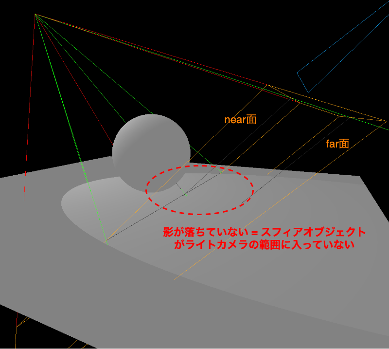
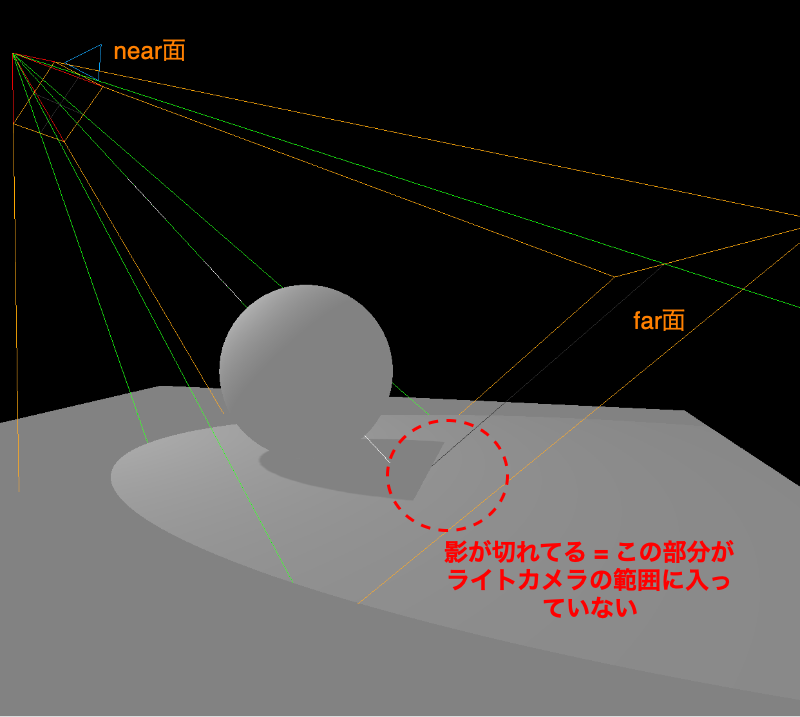
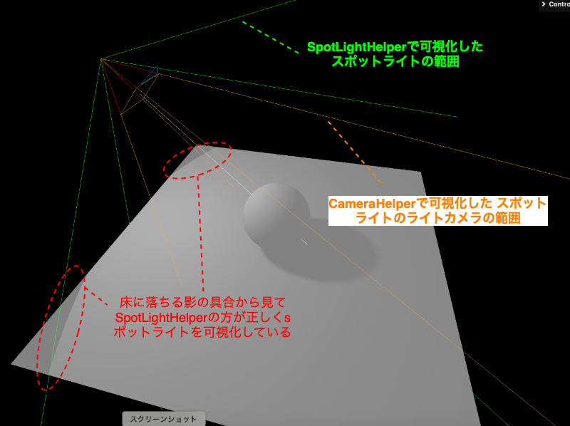

### Spot Light のライトカメラを Camera Helper で認識してみる

1. SpotLight インスタンスの作成 & シーンへ追加

    ```js
    const spotLight = new THREE.SpotLight(0xffffff, 3.6);

    spotLight.castShadow = true;

    scence.add(spotLight);
    ```

<br>

2. CameraHelper インスタンスの作成 & シーンへ追加

    ```js
    const cameraHelper = new THREE.CameraHelper(spotLight.shadow.camera);

    scene.add(cameraHelper);
    ```

<br>

#### SpotLight のライトカメラの範囲の修正

- オブジェクトが正しくライトカメラの範囲 (near 面と far 面の間)に入っていないと、うまく影が落ちない

    
    

<br>

- ライトカメラの fov を変えて試したいときは注意
    - [こちら](#spot-light-カメラヘルパーのバグ)より、 ライトカメラの fov は変えても意味ないことがわかる

---

### Spot Light カメラヘルパーのバグ?

- CameraHelper で可視化されるスポットライトの角度が合っていない
    
    以下の比較をしてみる

    - SpotLightHelperを使って可視化する Spot Light の範囲

    - CameraHelper を使って可視化する Spot Light のライトカメラの範囲

    ```js
    // Spot Light の追加
    const spotLight = new THREE.SpotLight(0xffffff, 4);
    spotLight.castShadow = true;
    scene.add(spotLight);

    // Spot Light の可視化
    const spotLightHelper = new THREE.SpotLightHelper(spotLight, 0x00ff00);
    scene.add(spotLightHelper);


    // Spot Light のライトカメラの可視化
    const spotLightCameraHelper = new THREE.CameraHelper(spotLight.shadow.camera);
    scene.add(spotLightCameraHelper);
    ```

    →以下の画像からも、SpotLightHelper の方が正しいライトの形状を表している = **CameraHelper で可視化されているスポットライトは何かおかしい**

    

<br>

- 原因

    - Spot Light のライトカメラの fov のデフォルトは 50°

    - Spot Light の angleのデフォルトは Math.PI / 3 (= 1.047 = 120°)

    - ★上記ライトカメラの fov は最終的に内部(たぶんレンダラーがレンダリングする直前)で Spot Light の angle に上書かれる
        - しかし、カメラヘルパーは上書かれる前のライトカメラの fov を元にオレンジのガイド枠をシーンに描画するため、カメラヘルパーとスポットライトヘルパーで異なって見える

            →最終的に、ライトカメラの fov は上書かれるため、ライトカメラの fov の変更は意味ない (ライトカメラの fov を変えたいんだったら、スポットライトの angle を変更しないとだめ)

<br>

- もし、カメラヘルパーとライトヘルパーを合わせたければ SpotLight インスタンスの `shadow.updateupdateMatrices()` に SpotLightインスタンスを渡せば直る

    ```js
    // Spot Light の追加
    const spotLight = new THREE.SpotLight(0xffffff, 4);
    spotLight.castShadow = true;
    scene.add(spotLight);

    // Spot Light の可視化
    const spotLightHelper = new THREE.SpotLightHelper(spotLight, 0x00ff00);
    scene.add(spotLightHelper);

    // ★Spot Light のライトカメラの fov を Spot Light の angle に合わせる
    spotLight.shadow.updateMatrices(spotLight);

    // Spot Light のライトカメラの可視化
    const spotLightCameraHelper = new THREE.CameraHelper(spotLight.shadow.camera);
    scene.add(spotLightCameraHelper);
    ```

---

### Spot Light のライトカメラの注意点

- Spot Light の distance が設定されている場合 (デフォルトの0以外の場合)
    - ライトカメラの far は Spot Light の distance に設定されている値に固定される

    ```js
    // 第三引数がdistance
    // この場合、スポットライトのライトカメラのfarは10に固定される
    const spotLight = new THREE.SpotLight(0xffffff, 3, 10);

    // また、スポットライトに個別にdistanceを設定しても同じ
    // この場合、スポットライトのライトカメラのfarは20に固定される
    spotLight.distance = 20;
    ```

<br>

- Spot Light の angle が設定されている場合
    - ライトカメラの fov は Spot Light の angle に設定されている値に固定される

    ```js
    // 第四引数がangle
    // この場合、スポットライトのライトカメラのfovは Math.PI * 0.3 に固定される
    const spotLight = new THREE.SpotLight(0xffffff, 3, 10, Math.PI * 0.3);

    // また、スポットライトに個別にangleを設定しても同じ
    // この場合、スポットライトのライトカメラのfovは Math.PI * 0.1 に固定される
    spotLight.angle = Math.PI * 0.1;
    ```

<br>

- Spot Light の shadow.mapSize の　width と height が設定されている場合
    - ライトカメラの aspect は Spot Light の shadow.mapSize の　width と height の比率に固定される

<br>
<br>

参考サイト

[SpotLightShadow](https://threejs.org/docs/index.html#api/en/lights/shadows/SpotLightShadow.camera)
