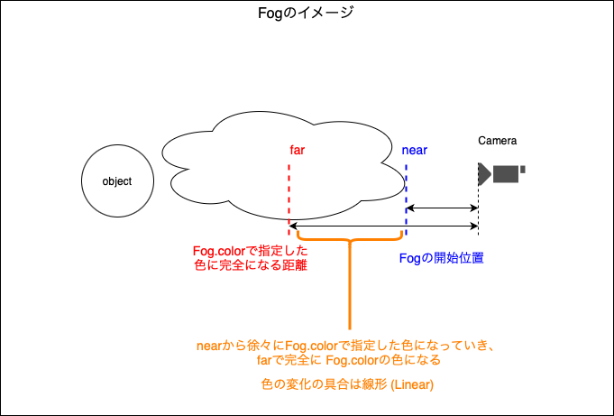
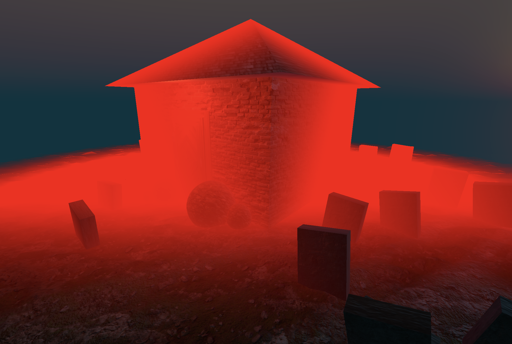
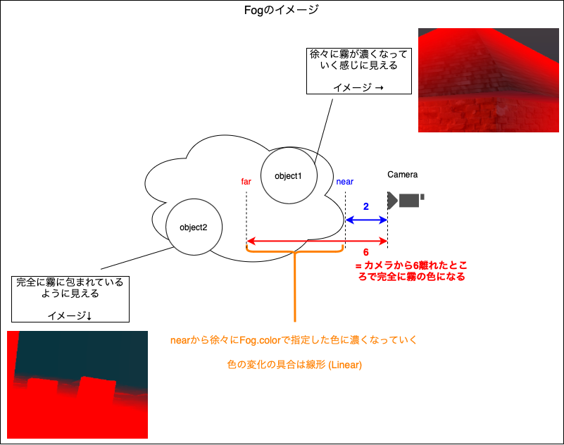
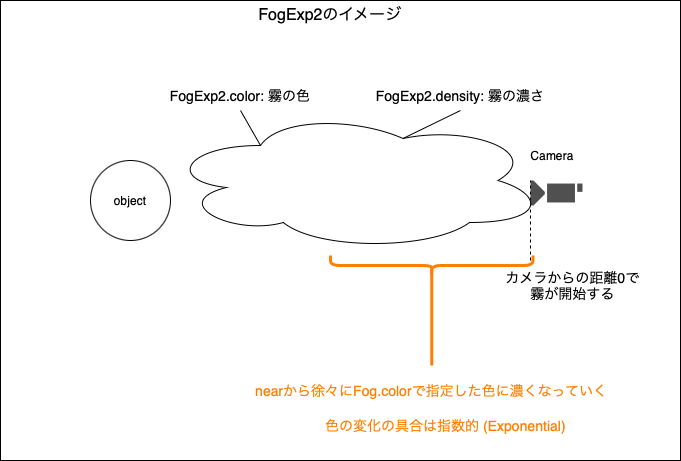
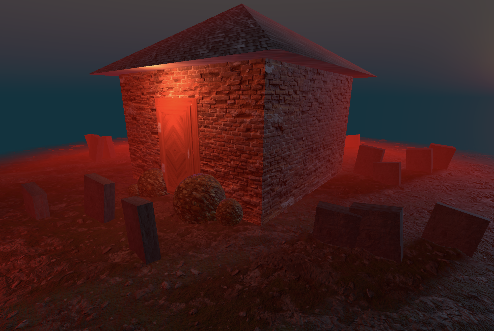

### シーンに霧を追加する

Three.js で利用できるビルトイン霧
- Fog
- FogExp2

上記2つの霧は霧の濃さの計算が違うらしい (FogExp2 の方がよりリアルな霧の見え方になるらしい)

---

### Fog の利用方法

1. Three.Fog クラスのインスタンスを作成する

    - 第一引数 (16進数(Integer) or カラーコード(String)): 霧の色

    - 第二引数 (Float): 霧の開始位置 (カメラからどのぐらい離れて霧が開始するかを指定する)

    - 第三引数 (Float): カメラからどのぐらい離れたら完全に霧の色になるかを指定する

    

    ```js
    import * as THREE from "three";

    const fog = new THREE.Fog(0xff00000, 2, 6);
    ```

<br>

2. シーンに Fog インスタンスを追加する

    - `Scene.add()` で追加するのではなく、 `Scene.fog` に Fog インスタンスを指定する

    ```js
    scnece.fog = fog;
    ```

<br>




<br>
<br>

参考サイト

[Three.js　Fog(フォグ)](https://gupuru.hatenablog.jp/entry/2013/12/05/210924)

---

### Three.js での　FogExp2 の利用方法

1. Three.FogExp2 クラスのインスタンスを作成する

    - 第一引数 (16進数(Integer) or カラーコード(String): 霧の色
    - 第二引数 (Float): 霧の濃さ

    

    ```js
    import * as THREE from "three";

    const fogExp2 = new THREE.FogExp2(0xff00000, 0.1);
    ```

<br>

2. シーンに Fog インスタンスを追加する

- `Scene.add()` で追加するのではなく、 `Scene.fog` に Fog インスタンスを指定する


    ```js
    scnece.fog = fogExp2;
    ```

