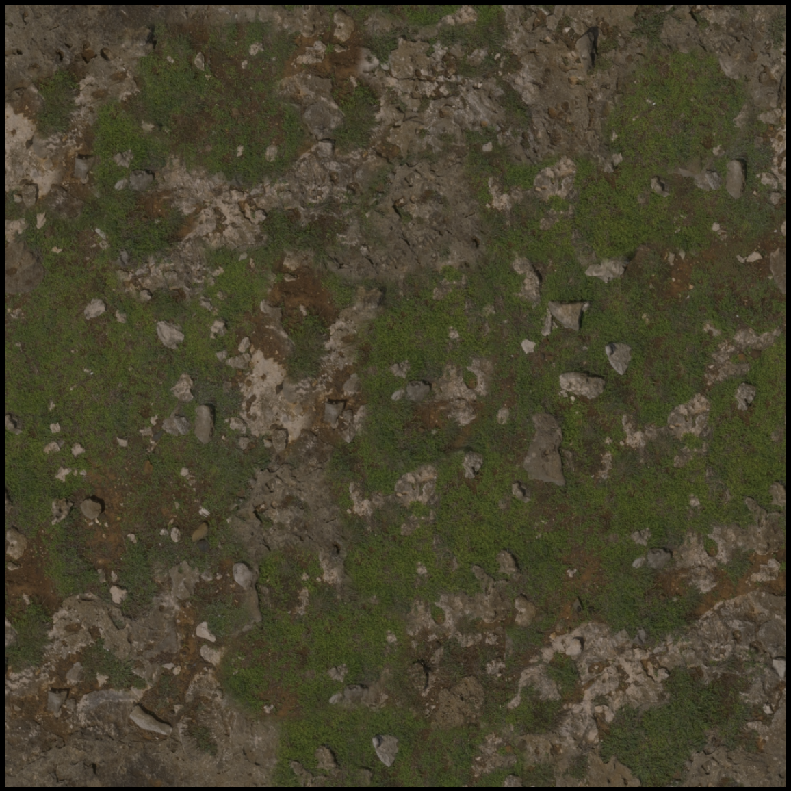
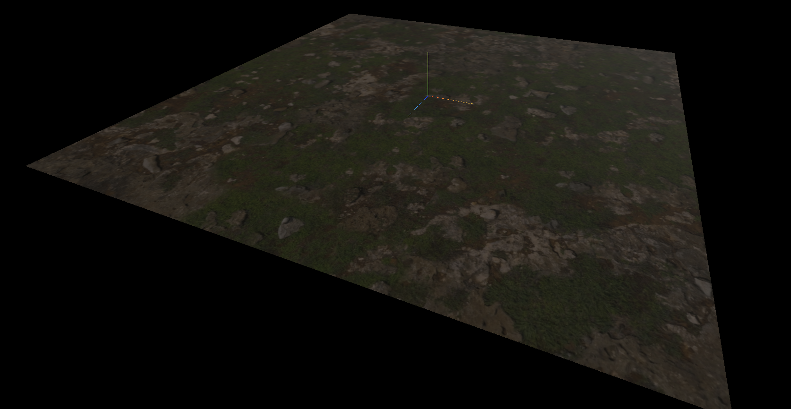
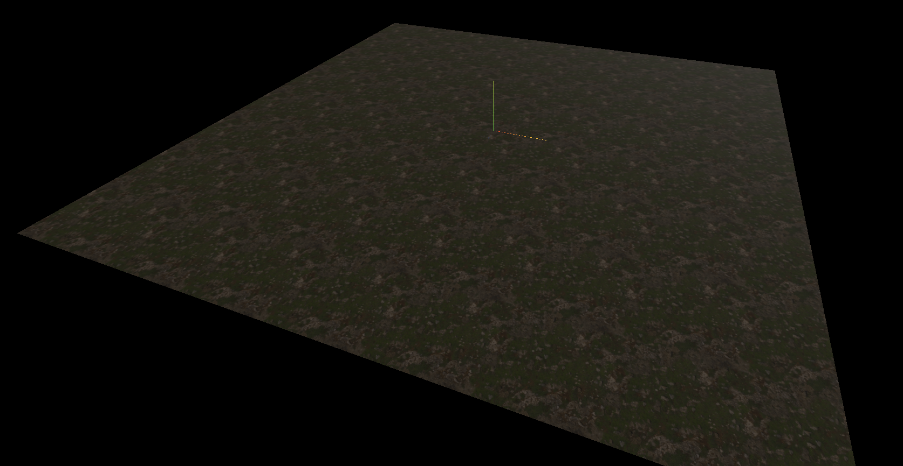
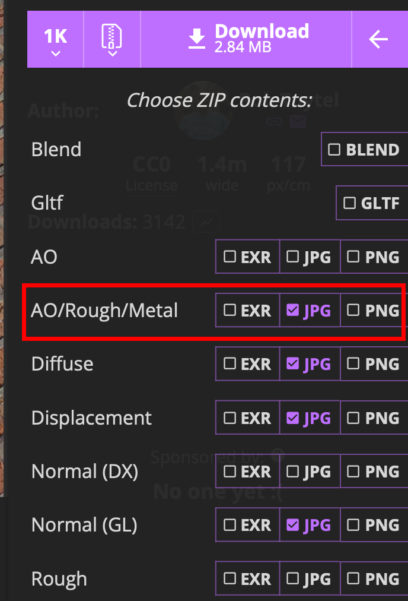
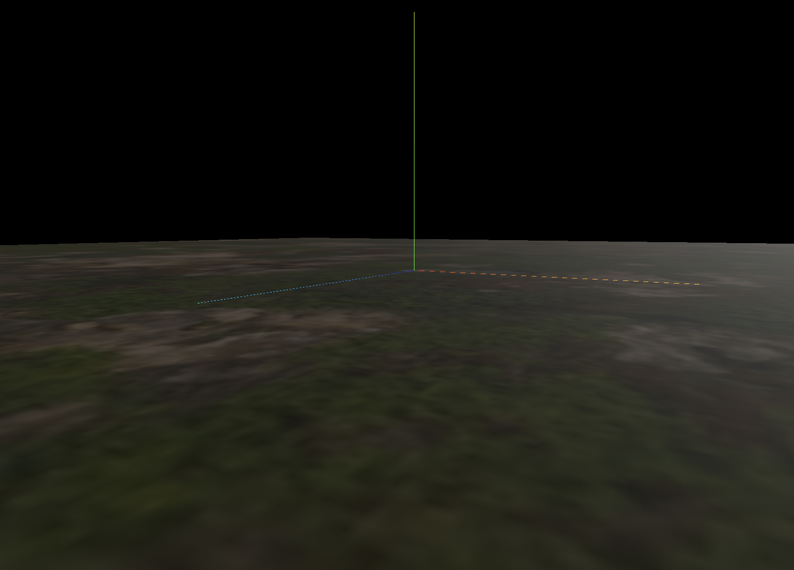
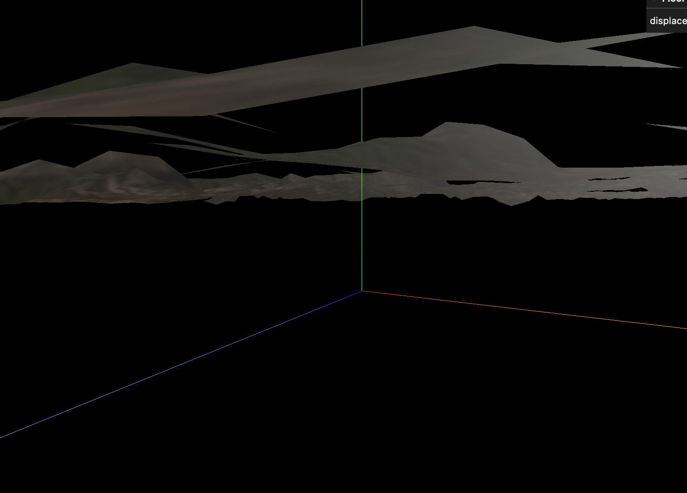

### テクスチャの繰り返し

- 以下のカラーテクスチャを平面オブジェクトにマッピングすると

    - テクスチャ
    

    - マッピングしたオブジェクト
    

<br>

- テクスチャに繰り返しを設定すると、模様のようにオブジェクトの表面を表現できる

    ```js
    const textureLoader = new THREE.TextureLoader();

    const colorTexture = textureLoader.load("カラーテクスチャのパス");

    // 色空間の指定
    coloTexture.colorSpace = THREE.SRGBColorSpace;

    // 繰り返しの指定
    coloTexture.wrapS = THREE.RepeatWrapping;
    coloTexture.wrapT = THREE.RepeatWrapping;
    coloTexture.repeat.x = 8;
    coloTexture.repeat.y = 8;
    ```
    
    <br>

    

<br>

#### テクスチャを繰り返す際の注意点

- マテリアルにカラーテクスチャだけではなく他のテクスチャ (NormalやRoughness等々) もマッピングしている場合、他のテクスチャも同じ繰り返し設定を行う必要がある

    ```js
    const textureLoader = new THREE.TextureLoader();

    const colorTexture = textureLoader.load("カラーテクスチャのパス");

    // 色空間の指定
    coloTexture.colorSpace = THREE.SRGBColorSpace;

    const normalTexture = textureLoader.load("ノーマルテクスチャのパス");

    // 繰り返しの指定
    coloTexture.wrapS = THREE.RepeatWrapping;
    coloTexture.wrapT = THREE.RepeatWrapping;
    coloTexture.repeat.x = 8;
    coloTexture.repeat.y = 8;

    // ノーマルテクスチャも同様に繰り返しの設定をする必要がある
    normalTexture.wrapS = THREE.RepeatWrapping;
    normalTexture.wrapT = THREE.RepeatWrapping;
    normalTexture.repeat.x = 8;
    normalTexture.repeat.y = 8;

    // マテリアル
    const floorMaterial = new THREE.MeshStandardMaterial({
        map: coloTexture,
        normalMap: normalTexture
    });
    ```

---

### ARM 画像

- PloyHeaven などのテクスチャがダウンロードできるサイトにて、 AO/Rough/Metal (ARM) というテクスチャがダウンロードできる時がある

    

<br>

- AO/Rough/Metal とは1つのテクスチャ画像にて、赤色で AO テクスチャ、　緑色で Roughnessテクスチャ、　青色で Metalness テクスチャを表現したテクスチャ画像のこと

    - AO, Roughness, Metalness は元々グレースケールで表される画像なので、1つの値(0 ~ 1)を使ってテクスチャの色々な場所を表現していた

<br>

- AO/Rough/Metal が提供されている場合、積極的に AO/Rough/Metal をダウンロードした方が良い
    - AO テクスチャ、 Roughness テクスチャ、 Metalness テクスチャの3つのテクスチャをダウンロードするよりも、1つの ARM テクスチャの方がダウンロード容量を少なく済ませることができる

    - ARM を利用すると Three.js で ARM テクスチャ画像のロード1回で済ますことができる (AO, Roughness, Metalness を個別に用意すると3回ロードする必要がある)

<br>

#### Three.js での ARM テクスチャ画像の利用法

- TextureLoader.load() で ARM 画像をロードする

    ```js
    const textureLoader = new THREE.TextureLoader();

    const armTexture = textureLoader.load("ARM画像のパス");
    ```

<br>

- ロードした ARM テクスチャをそれぞれ マテリアルの aoMap, roughnessMap, metalnessMap プロパティに設定する

    - Three.js のマテリアルでは、aoMapはテクスチャ画像の青色の値を参照し、roughnessMap はテクスチャ画像の緑色の値を参照し、metalnessMap はテクスチャ画像の青色の値を参照するようになっている

    ```js
    const material = new THREE.MeshStandardMaterial({
        aoMap: armTexture,
        roughnessMap: armTexture,
        metalnessMap: armTexture,
    })
    ```

----

### DisplacementBias

- DisplacementMappingが適用された頂点全体の位置を調整するプロパティ

<br>

- 多くの場合、マテリアルに displacementMap を
利用するとオブジェクトの上下の位置がずれる

    - displacementMap 設定なし

        

    <br>

    - displacementMap 設定あり
        
        

<br>

- マテリアルの displacementBias プロパティを指定して、**マテリアルの全頂点の上下の位置を調整することができる** = オブジェクトの上下の位置の調整ができる

    - [lil-gui](../../chap1/09/DebugUI.md) などを利用して、ちょうどいい値を見つけることができる

    ```js
    const floor = new THREE.Mesh(floorGeometry, floorMaterial);

    gui.add(floor.material, "displacementBias").min(-5).max(5).step(0.01)
    ```

    <br>

    