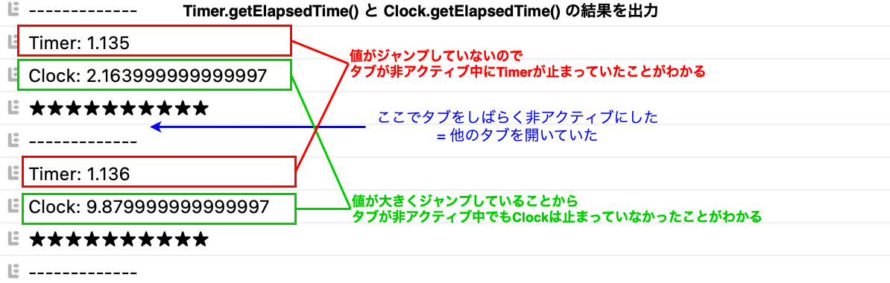

### アニメーション

- 今まで FPS に影響されないアニメーションの実装のために、[Three.ClockやDateインスタンス](../../chap1/05/Animation.md)を利用してきた

- 今回は Timer クラスを使ってアニメーションの実装を行う

    - Timer クラスは Clock のように使える Three.js のアドオンクラス

    - 基本的な使い方は Clock と一緒

    - Clock と Timer の違いについては[こちら](#threeclock-との違い)

---

### Timer

- Three.js のアドオンのクラス
    - したがって、明示的に import を記述する必要がある

        ```js
        import { Timer } from "three/addons/misc/Timer.js";
        ```

<br>


#### 使い方

- getElapsedTIme() で Timer インスタンスの作成からの経過時間を取得することができる

- getDeltaTime() で 前回読んだgetDeltaTime() からの経過時間を取得することができる

- ★getDeltaTime() や getDeltaTime() を実行する前に Timer.update() を自前で呼ぶ必要がある
    - Timer.update() を呼ぶことにより、 Timer インスタンスの内部の値が更新され getElapsedTime() や getDeltaTime() の値が正しく取得できるようになる

    - もし、Timer.update() を呼ばなかったら...
        - Timer インスタンスの内部の値が変更されないため、 getElapsedTime() や getDeltaTime() が同じ値を返し続ける

<br>

```js
import { Timer } from "three/addons/misc/Timer.js";

const animate = () => {

    // Timerの内部状態を更新
    timer.update();

    const elapsedTimer = timer.getElapsedTime();

    // 前回の　Timer.getDeltaTime() からの経過時間を取得したい場合
    const deltaTime = timer.getDeltaTime();

    aninmate();
}

animate();
```

---

### Three.Clock との違い


- Timer はタブが非アクティブの時に止まるらしい

- 一方で　Clock はタブが非アクティブの時でも止まらないらしい

- よって、ユーザーがアニメーションの途中でタブを非アクティブにし、しばらく経ってから戻ってきたらアニメーションがめっちゃ進んでたり、終わってたりする状況が Clock では起きる可能性がある

<br>

#### 確認

```js
/**
 * Animate
 */
const clock = new THREE.Clock();

const tick = () => {

  console.log("-------------");
  timer.update();
  const elapsedTime = timer.getElapsed();

  // それぞれの getElapsedTime() の結果を表示
  console.log(`Timer: ${elapsedTime}`);
  console.log(`Clock: ${clock.getElapsedTime()}`);

  console.log("★★★★★★★★★★");

  // Call tick again on the next frame
  if (elapsedTime < 10) {
    window.requestAnimationFrame(tick);
  }
};

tick();
```


