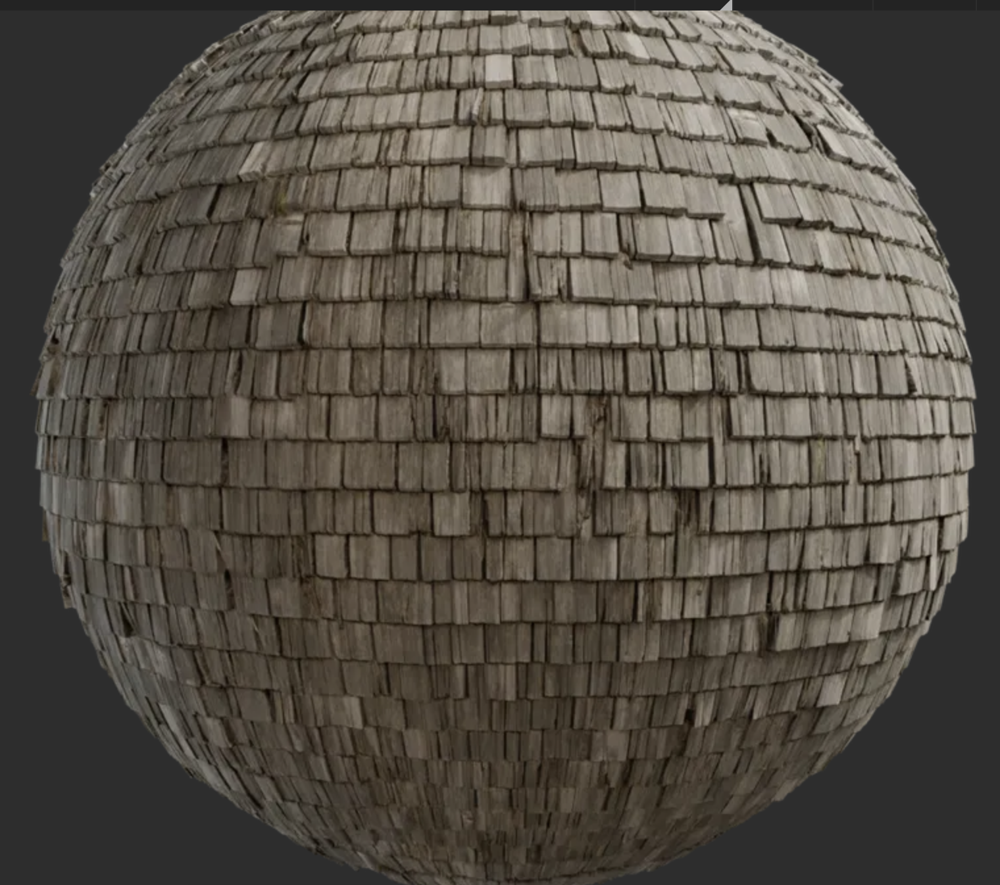
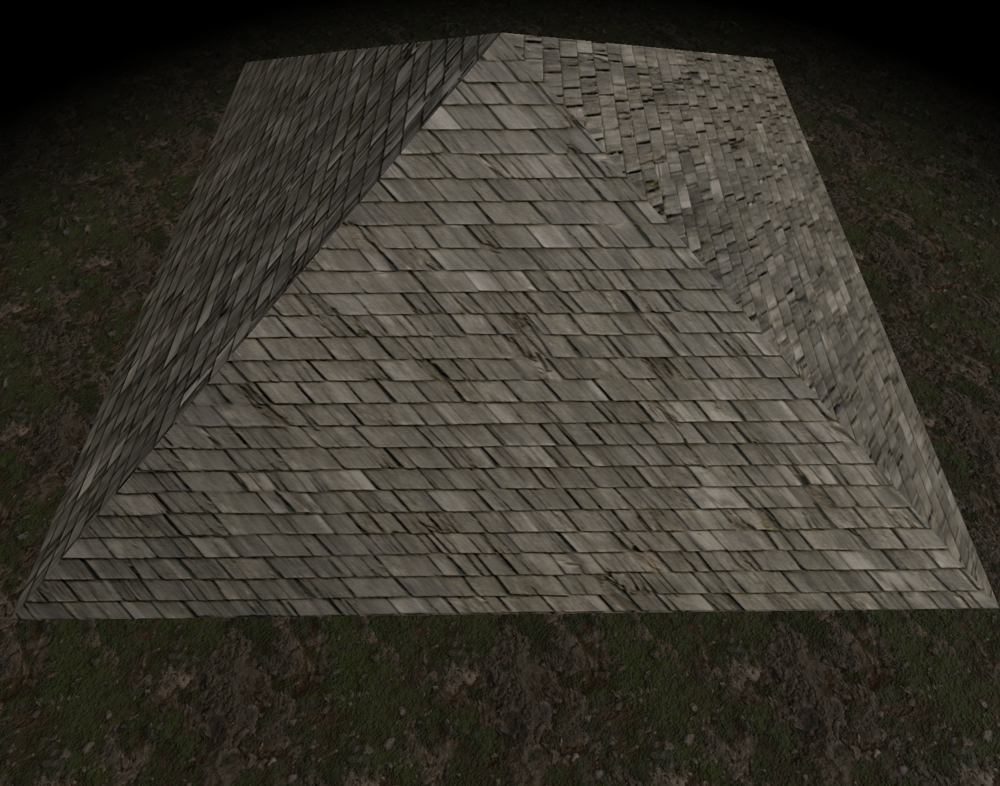
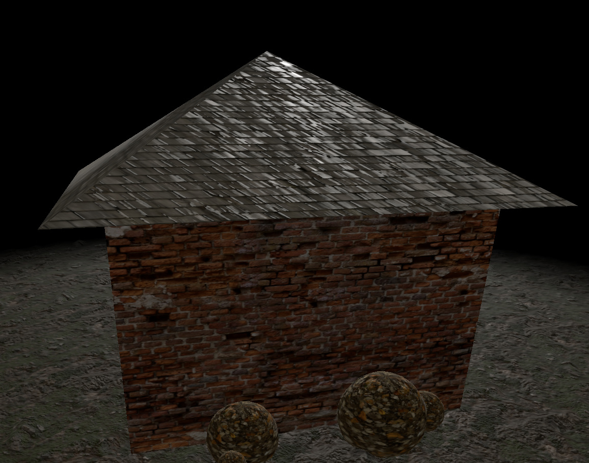
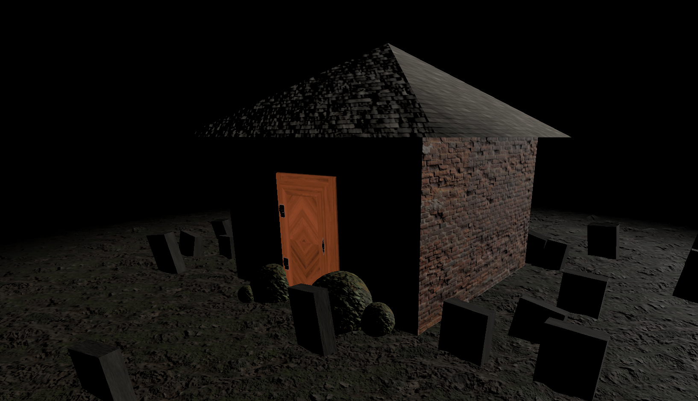

### 屋根のテクスチャリング時に以下の事象が起きた

#### 事象

1. テクスチャが斜めに貼られてしまっている

    - 実現したい見た目

        

    <br>

    - 実際の見た目

        

<br>

2. 岩の屋根 (slate roof) をテクスチャリングしているが、光が反射し、屋根がツルツルして見える

    - 実際の見た目

        

<br>

#### 原因

- 屋根のジオメトリに ConeGeometry を使っていたのが原因

    - Three.js が提供しているジオメトリの [UV座標](../../chap1/10/UV.md) が決まっているため、今回のようにテクスチャが勝手に斜めに貼られてしまった

    - Three.js が提供しているジオメトリの Normal (法線) は ↑の UV 座標のように決まっているため、今回のように意図せぬ光の反射が発生する

<br>

#### 解決策

- Blender などのソフトで自分で屋根オブジェクトを作成する

- BufferGeometry を利用し、自分でオブジェクトの形状、 UV、 Normal を定義する

どちらも今回のレッスンの範囲外なので採用しない

---

### ドアのテクスチャリングで起きた問題

#### 事象

1. 光が当たっていないのにドアがはっきり見える

    

<br>

#### 原因

- マテリアルの normalMap プロパティにカラーテクスチャを指定していた

    ```js
    const doorMaterial = new THREE.MeshStandardMaterial({
    map: doorColorTexture,
    aoMap: doorAOTextuer,
    roughnessMap: doorRoughnessTexture,
    metalnessMap: doorMetalnessTexture,
    normalMap: doorColorTexture, // ここが問題
    });
    ```

<br>

#### 解決策

- normalMap プロパティに Normal テクスチャを指定する

    ```js
    const doorNormalTexture = textureLoader.load("Normalテクスチャのパス");

    const doorMaterial = new THREE.MeshStandardMaterial({
    map: doorColorTexture,
    aoMap: doorAOTextuer,
    roughnessMap: doorRoughnessTexture,
    metalnessMap: doorMetalnessTexture,
    normalMap: doorNormalTexture, //修正後
    });
    ```