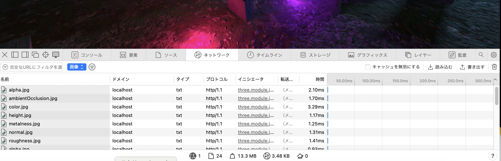
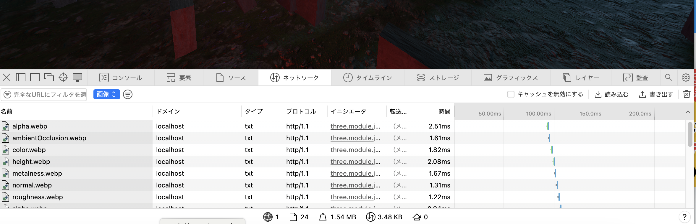

### テクスチャ画像が大きすぎる

- Safari の開発者オプションにて、 `ネットワークタブ` → `画像` を選択し、今回作成したページどのくらい画像が使われているかを調査した

    - 結果: 13.3 MB → 大きすぎ

 

- 使用するテクスチャ画像が大きいと
    - 画像のロードに時間がかかる
    
    - GUP のメモリを多く消費する

    →結果的にパフォーマンスの低下を引き起こす

 

- 今回のページで使用している画像全てを [webp](#テクスチャ画像の最適化--画像形式) に変換したところ総画像サイズが 1.54 MB まで下がった

---

### テクスチャ画像の最適化 ~ 画像形式

- **WebP** フォーマットを利用することを検討する

#### WebP とは

概要

- Googleが開発した新しい画像フォーマット

 

特徴

- JPEG 以上の圧縮率 = より画像を軽くできる
    - サイズを軽くしても画質が劣化しない

 

- 可逆圧縮・非可逆圧縮の両方に対応している

- PNG のように背景の透過処理ができる

- GIF のようにアニメーションが表示できる
    - WebP は GIF　よりも多くの色が使える

 

#### WebP に変換できるサイト

- squoosh
    - 複数の画像を1度に変換できない

- CouldConvert
    - 1日に25ファイルまで変換可能

- TinyPNG
    - 20ファイルまで変換可能 (数分間で)

 
 

参考サイト

WebP について
- [WebPとは？メリットやほかの画像ファイル形式との違い・変換方法を詳しく解説](https://imageflux.sakura.ad.jp/column/webp/)

- [Webpとは？メリットや他の画像形式との違い、変換方法を解説](https://www.profuture.co.jp/mk/column/what-is-webp)

- [WebPとは？メリット・デメリットや画像の変換方法を解説](https://rank-quest.jp/column/column/webp/)

- [WebPとはどんな画像形式？メリット・デメリットと最新の変換方法を解説](https://www.plan-b.co.jp/blog/seo/38398/)

PNG のサイズが大きい理由

- [PNGファイル](https://www.adobe.com/jp/creativecloud/file-types/image/raster/png-file.html)

- [JPEGとPNG](https://www.adobe.com/jp/creativecloud/file-types/image/comparison/jpeg-vs-png.html#ファイルサイズ)
