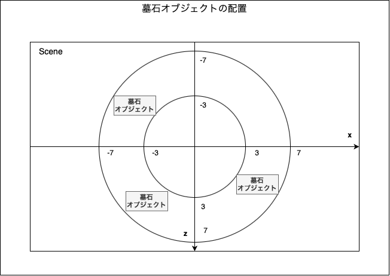
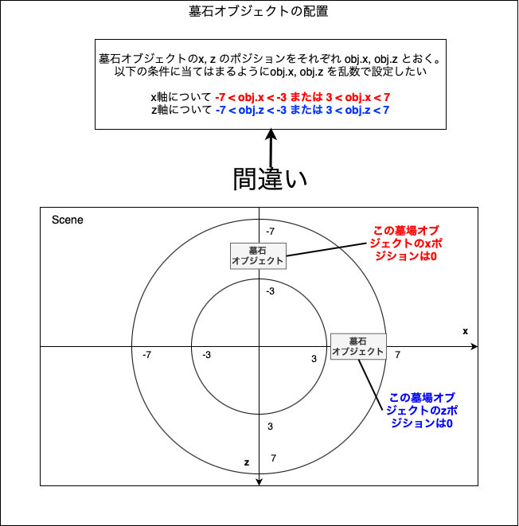
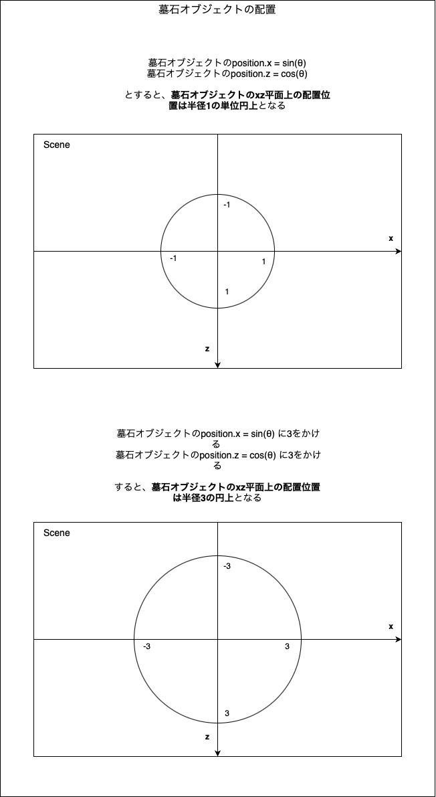
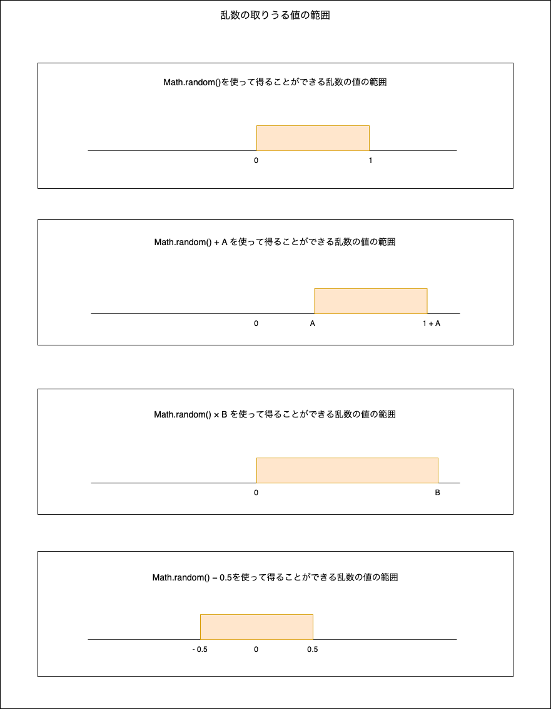

### 墓石オブジェクトの配置について

- 以下の画像のように墓石オブジェクトを配置したい



---

### 同心円上に配置するには

- 墓場オブジェクトのxはzのポジションをsin, 残りのポジションをcosで設定すればいい

    ```js
    /**
     * コードのイメージ
    */

    // θ(角度)をランダムに生成する 
    const theta = Math.PI * 2 * Math.random();
    
    // 単位円上に配置
    grave.position.x = Math.sin(theta);
    grave.position.y = Math.cos(theta);

    //↑はこのコードでもいい
    grave.position.x = Math.cos(theta);
    grave.position.y = Math.sin(theta);
    ```


引用: [Sine and cosine](https://en.wikipedia.org/wiki/Sine_and_cosine)

---

### ハマったところ


<br>

- 上記の画像から、下のような勘違いをしてしまった
    - xの取りうる値の範囲は -7 \< x \< -3 または 3 \< x \< 7
    - zの取りうる値の範囲は -7 \< x \< -3 または 3 \< x \< 7

- -3 \<= x \<= 3 の場合も -3 \<= z \<= 3 の場合も全然あり得る

<br>



<br>

#### 正しい考え方

[同心円上に配置するには](#同心円上に配置するには)を拡張すればいい

```js
const theta = Math.PI * 2 * Math.random();
    
    // sin, cos に3をかけてみると
    grave.position.x = Math.sin(theta) * 3;
    grave.position.y = Math.cos(theta) * 3;
```



<br>

以上の考えを利用して、墓石オブジェクトを配置する同心円を半径3 ~ 7 にランダムに拡張すればいい

*乱数の基本的な考え方は[こちら](#乱数の基本)を参照

```js
// 3 ~ 7 をランダムに生成
const expansion = (Math.random() * 4) + 3;

// sin, cos に拡張度合いをかける
grave.position.x = Math.sin(theta) * expansion;
grave.position.y = Math.cos(theta) * expansion;
```


<br>

#### 乱数の基本

