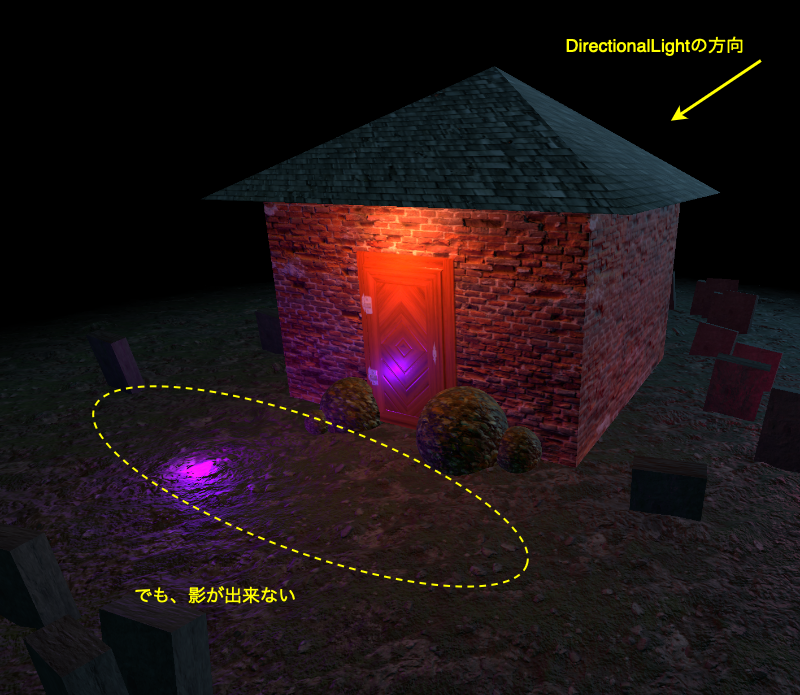
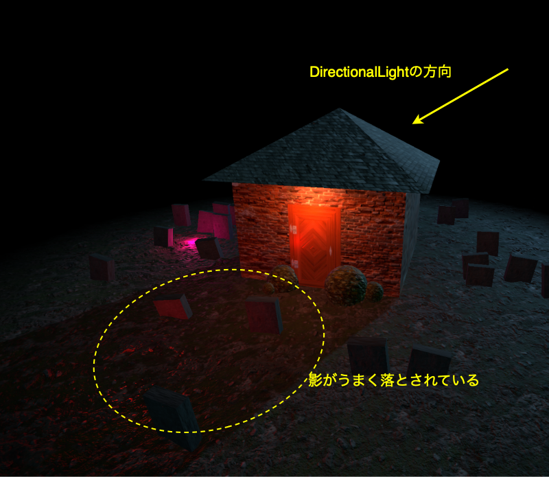
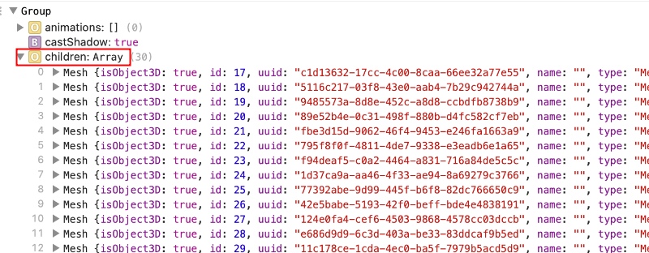
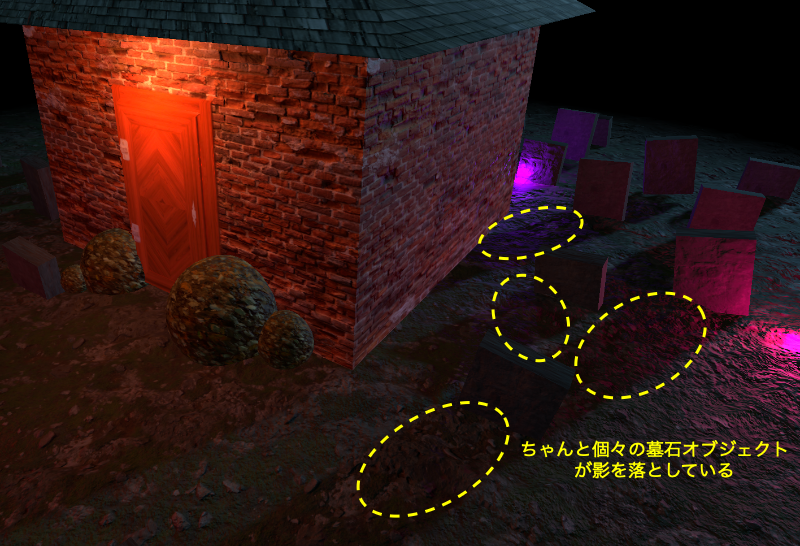

### グルーピングされたオブジェクトに対する影の設定

- THREE.Group インスタンスに receiveShadow/castShadow の設定をしても、そのグループに属しているメッシュに**適用されない**

    ```js
    const house = new THREE.Group();
    scene.add(house);

    const roof = new THREE.Mesh(roofGeo, roofMat);
    const walls = new THREE.Mesh(wallsGeo, wallsMat);
    const door = new THREE.Mesh(doorGeo, doorMat);
    house.add(roof, walls, door);

    // 家の屋根、壁、ドアオブジェクトに影を落とさせたい
    house.castShadow = true; // ×

    const floor = new THREE.Mesh(floorGeo, floorMat);
    floor.receiveShadow = true;
    ```

    <br>

    

<br>

- 影の receive/cast は個別のメッシュに指定していく必要がある

    ```js
    const house = new THREE.Group();
    scene.add(house);

    const roof = new THREE.Mesh(roofGeo, roofMat);
    const walls = new THREE.Mesh(wallsGeo, wallsMat);
    const door = new THREE.Mesh(doorGeo, doorMat);
    house.add(roof, walls, door);

    // 家の屋根、壁、ドアオブジェクトに影を落とさせたい
    roof.castShadow = true; // ○ (receiveSahdowも同じ)
    walls.castShadow = true; // ○
    door.castShadow = true; // ○

    const floor = new THREE.Mesh(floorGeo, floorMat);
    floor.receiveShadow = true;
    ```

    

---

### 墓石グループの個々の墓石に対して影の設定を行う

- 墓石オブジェクトの grave は THREE.Group インスタンスの graves にグルーピングされている

        
    - grave インスタンスは for **ループ内で宣言されているので、ループ外からはアクセス出来ない**

    ```js
    const graves = new THREE.Group();
    scene.add(graves);

    const graveGeometry = new THREE.BoxGeometry(0.6, 0.8, 0.2);
    const graveMaterial = new THREE.MeshStandardMaterial();
    for (let i = 0; i < 30; i++) {
        const grave = new THREE.Mesh(graveGeometry, graveMaterial);
        // それぞれの墓石オブジェクトのポジションの調整処理など
        ~~
        graves.add(grave);
    }
    ```

    <br>

    - 墓石オブジェクトに castShadow を設定したいが、graves に設定しても意味ない

        ```js
        // Group への影の設定は意味ない
        graves.castShadow = true;

        // しかし、grave インスタンスへのアクセスはループ外からは出来ない
        grave.castShadow = true; // grave参照エラー
        ```

<br>

- THREE.Group インスタンスは children プロパティを持ち、そこに Group に属している Mesh オブジェクトが配列で格納されている

    ```js
    console.log(graves);
    ```

    

<br>

- children プロパティにアクセスすることで、その Group に属している grave インスタンスにアクセスできる

    ```js
    graves.children.forEach((grave) => {
        grave.castShadow = true;
    });
    ```

    