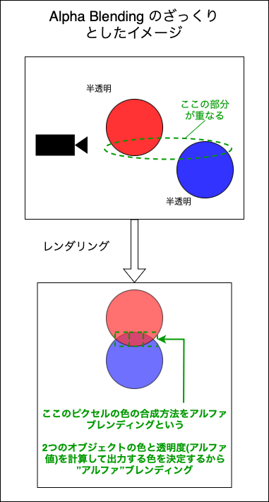
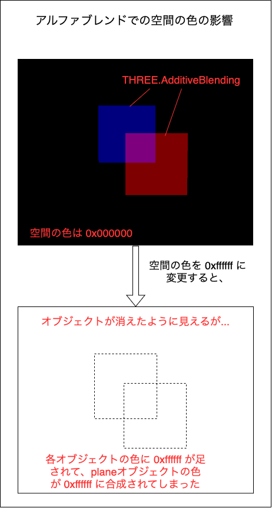
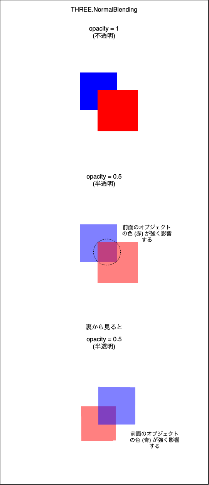
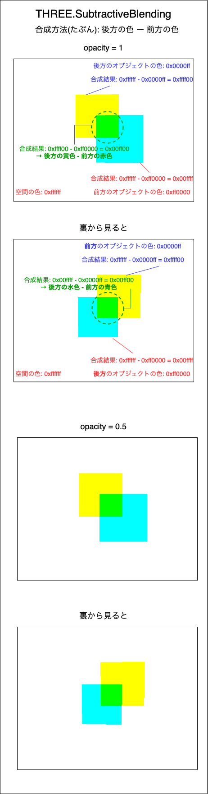
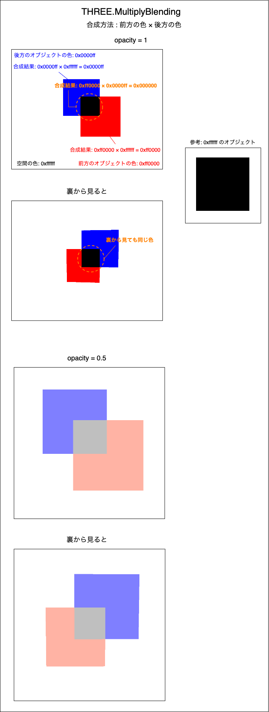
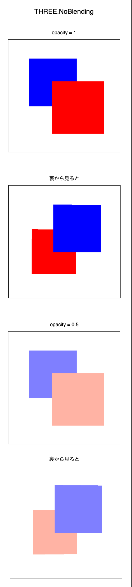
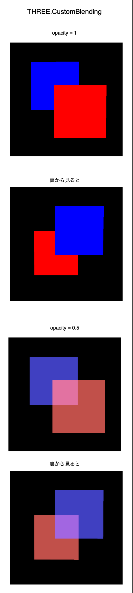

### Alpha Belnding

- 1のピクセルに、2つ以上の半透明なオブジェクトが描画されるときに、そのピクセルの色を決める方法



---

### Three.js でアルファブレンディングの利用方法

- Material インスタンスの blending プロパティにブレンデイング方法を指定する

    - ブレンディング方法は以下の6種類

        1. [THREE.NormalBlending](#normal-blending)

            - デフォルトのブレンディングモード 

            - 前面のオブジェクトの色が強く影響する

        <br>

        2. [THREE.AdditiveBlending](#additive-blending)

            - 加算ブレンディング

            - 基本的にはオブジェクトが重なった部分が明るく見える

            - `後方のオブジェクトの色 + 前方のオブジェクトの色` らしい

        <br>

        3. [THREE.SubtractiveBlending](#subtractive-blending)
         
            - 減算ブレンディング

            - `後方のオブジェクトの色 - 前方のオブジェクトの色` らしい

        <br>

        4. [THREE.MultiplyBlending](#multiply-blending)

            - 乗算ブレンディング

            - `前方のオブジェクトの色 × 後方のオブジェクトの色`

                - 掛け算なので、前方後方のかける順番は逆でもいい

            - 重なった部分が暗くなる
                - 

        <br>

        5. [THREE.CustomBlending](#)

            - 自分でどのような色の合成にするかをカスタマイズできるブレンディング

            - デフォルトでは、、、

                - opacity = 1 の時は色の合成を行わない

                - opacity \< 1 の時は重なった部分は前面のオブジェクトの色の影響を強く受ける

        <br>

        6. [THREE.NoBlending](#no-blending)

            - 色の合成を行わない

            - 透明なオブジェクトでも NoBlending にすると不透明に見える

        #### 注意点
        
        - 上記ブレンディング方法は透明なオブジェクト間の重なる部分だけではなく、空間の色とも作用し合うことに注意

            
    <br>

    ```js
    const material = new THREE.MeshBasicMaterial({ 
        transparent: true,
        opacity: 0.5
        blending: THREE.AdditiveBlending // 加算ブレンディングを設定
    });
    ```

---

### Three.js で利用できるアルファブレンディングの種類

<br>

#### Normal Blending



<br>

#### Additive Blending


<br>

#### Subtractive Blending



<br>

#### Multiply Blending



<br>

#### No Blending



<br>

#### Custom Blending



<br>

- 合成方法のカスタマイズの方法

    - Material.blendEquation: 合成方法の式を指定

    - Material.blendSrc: つまり既に描画されている色

    - Material.blendDst: これから描画されようとする色

    ```js
    const material = new THREE.MeshBasicMaterial();

    // ★CustomBlending の合成方法のカスタマイズ
    material.blendEquation = THREE.AddEquation; //default 
    material.blendSrc = THREE.SrcAlphaFactor;  //default 
    material.blendDst = THREE.OneMinusSrcAlphaFactor; //default
    ```

<br>
<br>

参考サイト

[ブレンドモード](https://ja.wikipedia.org/wiki/ブレンドモード#)

[Custom Blending Equation Constants](https://threejs.org/docs/index.html#api/en/constants/CustomBlendingEquations)

[アルファブレンディング](https://wgld.org/d/webgl/w029.html)