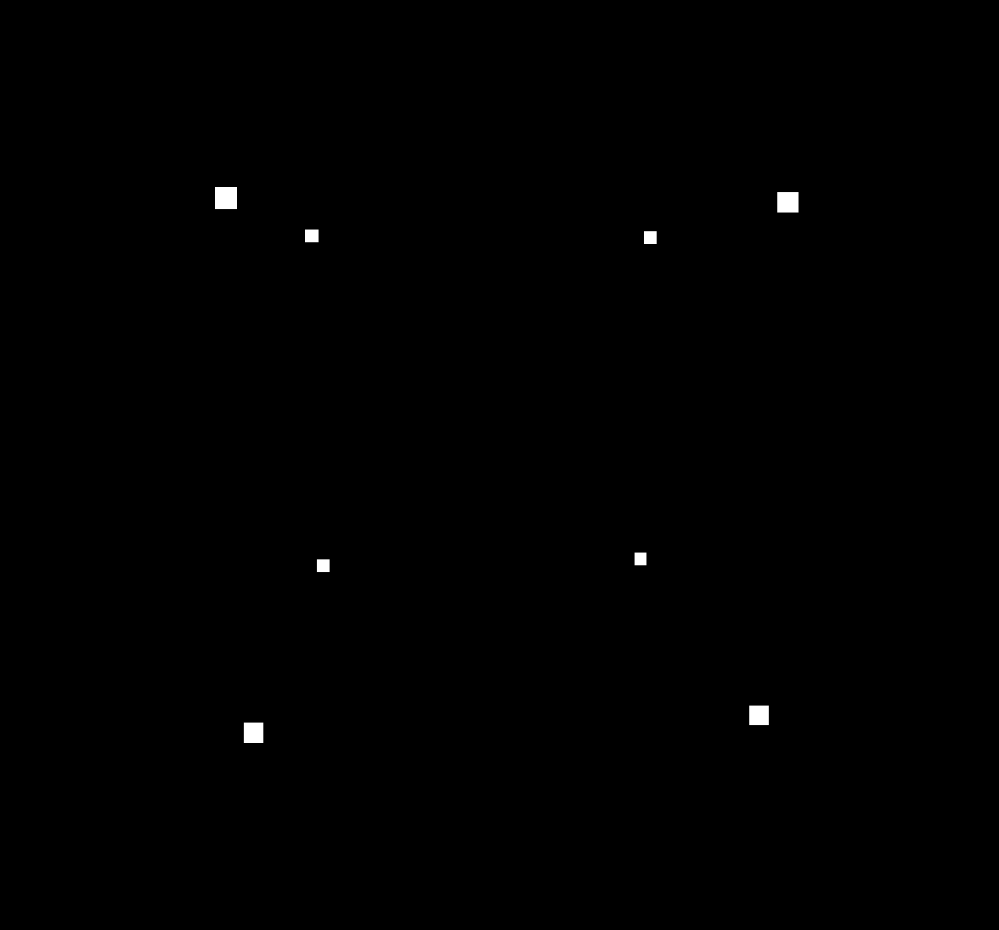
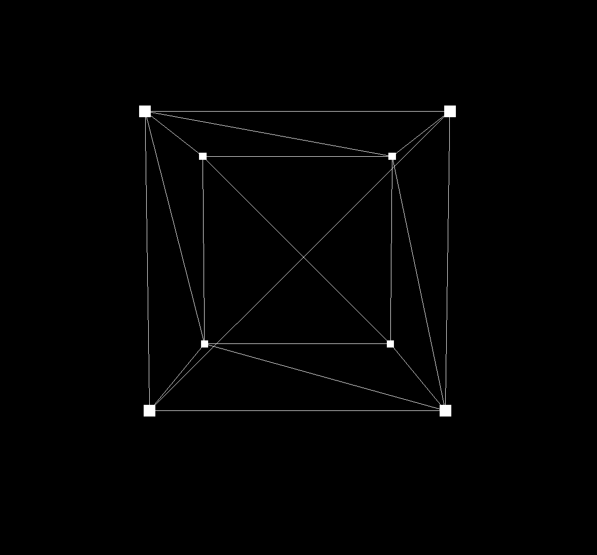
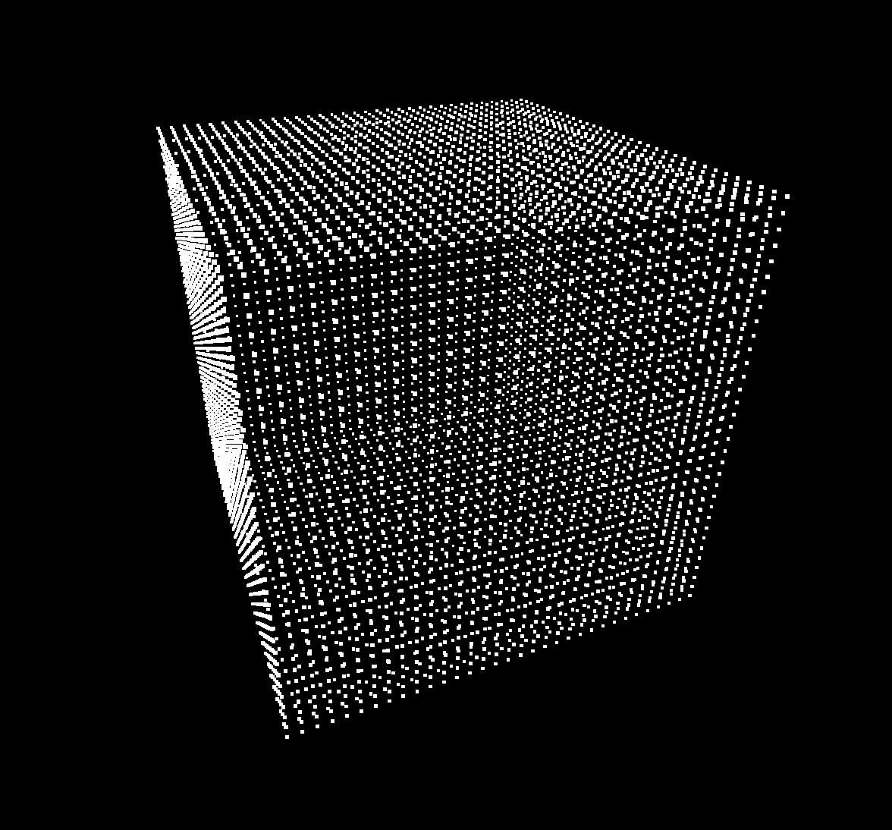
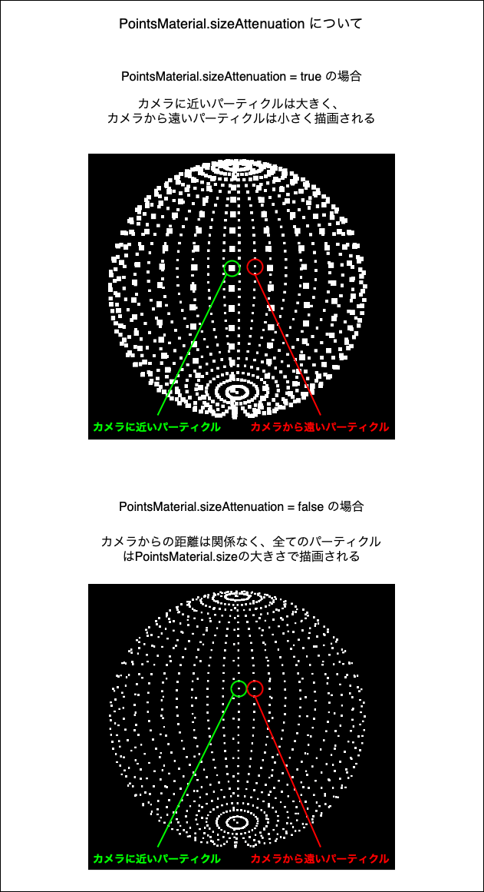
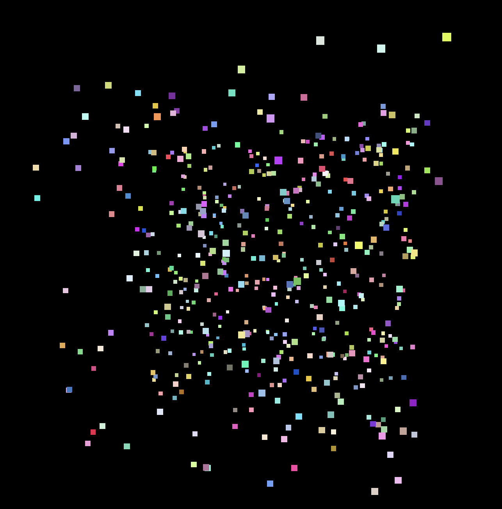
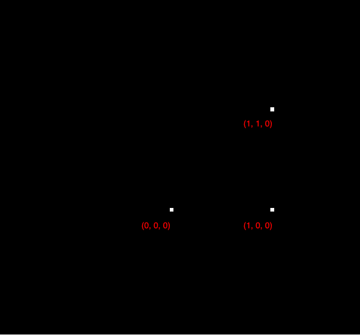
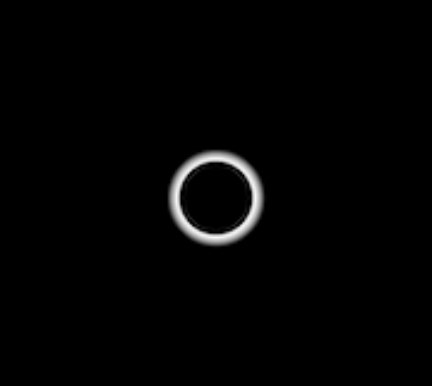
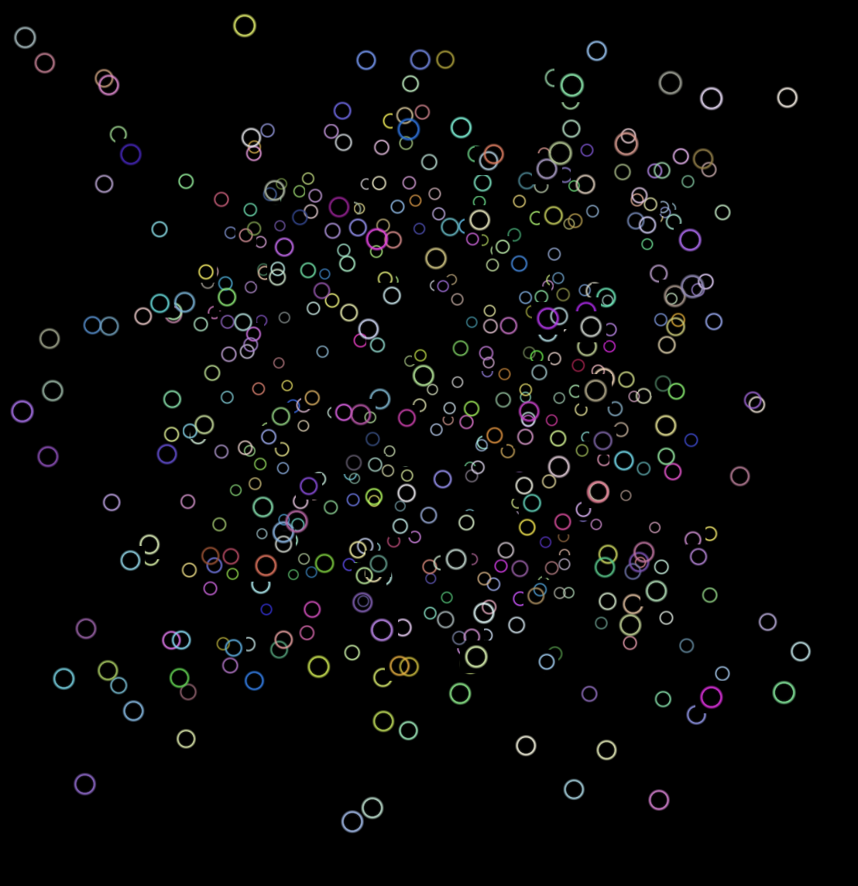

### パーティクルの作り方 (Three.js が提供するジオメトリを利用する場合)

#### 手順

1. ビルトインジオメトリを作成する

    ```js
    const particlesGeometry = new THREE.BoxGeometry(1, 1, 1);
    ```

<br>

2. PointsMaterial をインスタンス化する

    - 引数 (Object): マテリアルに関するパラメーターをプロパティに指定することで見た目などを変えることができる
        - color (Color): パーティクルの色を指定

        - size (Number): パーティクルのサイズを指定

        - sizeAttenuation (Boolean): 

            - trueの場合: カメラに近いパーティクルは大きく描画し、カメラから遠いパーティクルは小さく描画する

            - falseの場合: カメラからの距離に関係なく、sizeで指定された大きさでパーティクルを描画する

    ```js
    const particlesMaterial = new THREE.PointsMaterial({
        size: 0.05,
        sizeAttenuation: true,
    });
    ```

<br>

3. ジオメトリとマテリアルを元に Points インスタンスを作成する

    - Points メッシュはジオメトリの頂点しか描画しないため、、計算負荷は低く、数が多くなっても高いフレームレートで描画が可能

    ```js
    scene.add(new THREE.Points(particlesGeometry, particlesMaterial));
    ```

<br>



<br>

- わかりやすくするために同じ大きさ、セグメント数の BoxGeometry を重ねるように置いてみると



<br>

#### ポイント

- Points メッシュはジオメトリの頂点しか描画しない

    - 試しに、[セグメント数](../../chap1/08/Geometry.md#セグメントとは)を多くした BoxGeometry で Points メッシュを作成すると...

        ```js
        // セグメント数を多く取ったジオメトリ
        const particleGeometry = new THREE.BoxGeometry(1, 1, 1, 32, 32, 32);

        // マテリアル
        const particleMaterial = new THREE.THREE.PointsMaterial({
        color: 0x00ff00,
        size: 0.01,
        sizeAttenuation: true,
        });

        // パーティクルメッシュ
        scene.add(new THREE.Points(particleGeometry, particleMaterial));
        ```

    多くの頂点が描画される

    

---

### パーティクルの作り方 (BufferGeomtry を利用する場合)

- BuffereGeometry の使い方は[こちら](../../chap1/08/Geometry.md#buffergeometry)を参照

#### 手順

1. 頂点データを格納する配列変数 (Float32Array 型) を用意し、頂点データを格納する

    ```js
    const vertecies = 
    // 頂点1
    vertecies[0] = 0; //x座標
    vertecies[1] = 0; //y座標
    vertecies[2] = 0; //z座標

    // 頂点2
    vertecies[3] = 1; //x座標
    vertecies[4] = 1; //y座標
    vertecies[5] = 0; //z座標

    // 頂点3
    vertecies[6] = 1; //x座標
    vertecies[7] = 0; //y座標
    vertecies[8] = 0; //z座標
    ```

<br>

2.  頂点データを格納した配列を、**BufferAttributeに変換する**

    - BufferAttribute をインスタンス化する
        - 第一引数: 配列データ
        - 第二引数: アイテムサイズ (配列の要素何個で1つのデータを表すのか)

    ```js
    const bufferAttribute = new THREE.BufferAttribute(vertecies, 3);
    ```

4. 作成した BuffereAttribute を元に BufferGeometry インスタンスを作成する

    ```js
    const geometry = new THREE.BufferGeometry();
    // 今回は頂点の位置情報(座標)を渡すので Attribute名は position
    geometry.setAttribute("position", bufferAttribute);
    ```

5. PointsMaterial インスタンスを作成する

    - [こっち](#パーティクルの作り方-threejs-が提供するジオメトリを利用する場合)で既に紹介ずみのため省略

<br>

6. ジオメトリとマテリアルを元に Points インスタンスを作成する

    - [こっち](#パーティクルの作り方-threejs-が提供するジオメトリを利用する場合)で既に紹介ずみのため省略

<br>


<br>
<br>

参考サイト

[Three.jsで大量のパーティクルを表示する方法](https://ics.media/tutorial-three/points/)

---

### sizeAttenuation について



---

### 大量でランダムな色とりどりのパーティクルを作成する

1. 頂点データを格納する配列変数 (Float32Array 型) を用意し、頂点データを格納する

    - 各頂点の x, y, z 座標を乱数を使って設定する

    ```js
    // 頂点の数 = パーティクルの数
    const numVertecies = 500;

    // 頂点は x, y, z の3つの情報を持つため、頂点情報を格納する配列のサイズは、頂点の数×3
    const vertecies = new Float32Array(numVertecies * 3);

    for (let i = 0; i < vertecies.length; i++) {
        // 今回は -0.5 ~ 0,5の範囲でランダムに x, y, z 座標を設定する
        vertecies[i] = (Math.random() - 0.5) * 10;
    }
    ```

<br>

2. ★ 頂点の色情報を格納する配列 (Float32Array 型) も用意し頂点の色データを格納する
    
    - 頂点は R, G, B の3つの色情報をもつ

        - ★ R, G, B の値は 0.0 ~ 1.0 で指定する (**0~255ではないことに注意**)

    ```js
    const numVertecies = 500;

    // 頂点の位置を格納
    const vertecies = new Float32Array(numVertecies * 3);

    // 頂点は R, G, B の3つの色情報を持つため、頂点の色情報を格納する配列のサイズは、頂点の数×3
    const colorVertecies = new Float32Array(numVertecies * 3);

    for (let i = 0; i < vertecies.length; i++) {
        // 頂点の位置を設定
        vertecies[i] = (Math.random() - 0.5) * 10;

        // 各頂点の R, G, B を 0.0 ~ 1.0　の値で設定する
        colorVertecies[i] = Math.random();
    }
    ```

<br>

3. 頂点データを格納した配列を、**BufferAttributeに変換する**

    - 頂点の位置情報の配列と、頂点の色情報の配列のそれぞれ別々に BufferAttribute に変換する

    ```js
    const positionAttribute = new THREE.BufferAttribute(vertecies, 3);

    const colorAttribute = new THREE.BufferAttribute(colorVertecies, 3);
    ```

<br>

4. 作成した BuffereAttribute を元に BufferGeometry インスタンスを作成する

    ```js
    const particlesGeometry = new THREE.BufferGeometry();

    particlesGeometry.setAttribute("position", bufferAttribute);

    // 頂点の色情報を渡す場合の Attribute名は color
    particlesGeometry.setAttribute("color", colorBufferAttribute);
    ```

<br>

5. PointsMaterial インスタンスを作成する

    - ★ PointsMaterial.vertexColors プロパティを true にしないと色が反映されない

        - vertexColors プロパティは頂点カラーをマテリアルに適用するかについてのプロパティ

    ```js
    const particleMaterial = new THREE.PointsMaterial({
        size: 0.2,
        sizeAttenuation: true,
        vertexColors: true,
    });
    ```

<br>

6. ジオメトリとマテリアルを元に Points インスタンスを作成しシーンに add する

    ```js
    const particles = new THREE.Points(particlesGeometry, particleMaterial);

    scene.add(particles);
    ```
    
<br>



<br>
<br>

参考サイト

[Three.js備忘録（3）](https://koro-koro.com/threejs-no3/)

[3Dゲーム開発#06】頂点カラーでポリゴンに色をつける](https://proglog.site/vertex-color/#toc3)

---

### パーティクルの形状を変える

- 通常、パーティクルは正方形で描画される

    

- パーティクルの形を変えたい場合は alphaMapping を利用する必要がある

<br>

#### alphaMapping

1. アルファマップテクスチャーを用意する

    

<br>

2. テクスチャ画像をロードする

    ```js
    const textureLoader = new THREE.TextureLoader();

    const alphaTexture = textureLoader.load("テクスチャ画像のパス");
    ```

<br>

3. PointsMaterial の alpha プロパティにロードしたテクスチャを指定する

    ```js
    const particleMaterial = new THREE.PointsMaterial({
        size: 0.2,
        sizeAttenuation: true,
        vertexColors: true,
        transparent: true, // アルファマッピング利用時には true にする必要がある
        alpha: alphaTexture, // アルファマッピングに利用するテクスチャの指定
    });
    ```

<br>

