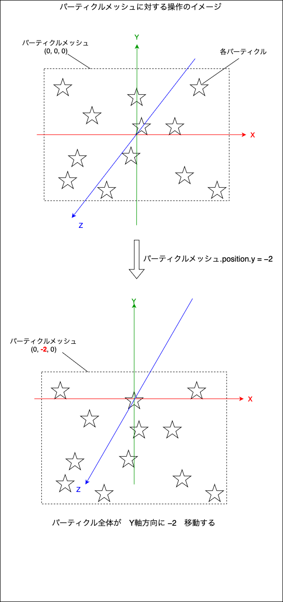
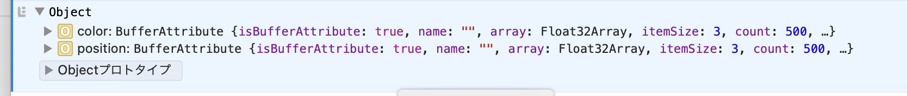
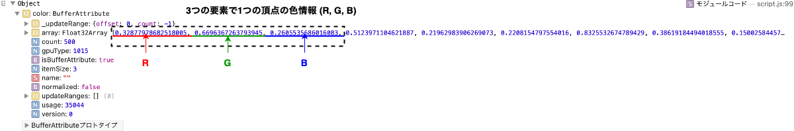
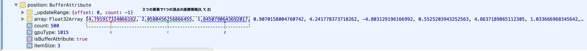
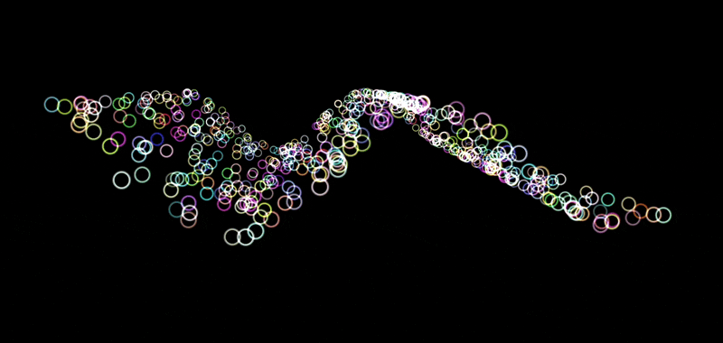

### パーティクルへのアニメーション

```js
const numVertecies = 500; // パーティクルの数
const vertecies = new Float32Array(numVertecies * 3); // パーティクルの頂点情報配列
const colorVertecies = new Float32Array(numVertecies * 3); // パーティクルの色情報配列

// 配列に頂点や色情報を格納する (ランダムな場所と色)
for (let i = 0; i < vertecies.length; i++) {
  vertecies[i] = (Math.random() - 0.5) * 10;
  colorVertecies[i] = Math.random();
}

// 配列から BufferAttribute を作成する
const bufferAttribute = new THREE.BufferAttribute(vertecies, 3);
const colorBufferAttribute = new THREE.BufferAttribute(colorVertecies, 3);

// BufferAttribute から BufferGeometry を作成する (パーティクルのジオメトリ作成)
const particlesGeometry = new THREE.BufferGeometry();
particlesGeometry.setAttribute("position", bufferAttribute);
particlesGeometry.setAttribute("color", colorBufferAttribute);

// パーティクルのマテリアルを作成
const particleMaterial = new THREE.PointsMaterial({
  size: 0.5,
  sizeAttenuation: true,
  transparent: true,
  alphaMap: alpha2,
  depthWrite: false, // 深度バッファへの書き込みのみを無効
  blending: THREE.AdditiveBlending, // 加算アルファブレンディングを設定
  vertexColors: true, // 色バッファを利用
});

// パーティクルメッシュの作成&シーンへの追加
const particle = new THREE.Points(particlesGeometry, particleMaterial);
scene.add(particle);
```

<br>

- 上記の方法で作成したパーティクルをアニメーションさせる方法

    1. **パーティクルメッシュ (THREE.Point)** に対してアニメーションをかけると、、、

        ```js
        /**
         * アニメーション
        */
        const clock = new THREE.Clock();

        const tick = () => {
        const elapsedTime = clock.getElapsedTime();

        // パーティクルのアニメーション
        particle.rotation.y = elapsedTime * 0.2;
        particle.position.y = -elapsedTime * 0.2;

        // Update controls
        controls.update();

        // Render
        renderer.render(scene, camera);

        // Call tick again on the next frame
        window.requestAnimationFrame(tick);
        };

        tick();
        ```

        - 全てのパーティクルに一様にアニメーションが適用される

        

        <br>

        - particle メッシュに対する操作のイメージ

        


    <br>

    2. 個別のパーティクルの座標や色情報にアクセスする方法

        - THREE.BufferGeomtry.attributes で座標や色情報にアクセス可能

            ```js
            console.log(particlesGeometry.attrbutes)
            ```
            
            

          <br>

        - color プロパティ (Float32Array)
            - 各頂点の色情報を格納している配列

            ```js
            console.log(particlesGeometry.attrbutes.color);
            ```

            
        
        <br>

        - position プロパティ (Float32Array)
            - 各頂点の座標情報を格納している配列

            ```js
            console.log(particlesGeometry.attrbutes.position);
            ```

            

          
        <br>

        - パーティクルを波のように動かす

          ```js
          const clock = new THREE.Clock();

          const tick = () => {
          const elapsedTime = clock.getElapsedTime();

          // パーティクルのアニメーション
          for (let i = 0; i < numVertecies; i++) {
            // attributes.position の y座標要素のインデックス
            const yIndex = i * 3 + 1;

            // attributes.position の y座標要素の値
            const xPosition = particlesGeometry.attributes.position.array[i * 3];

            // 各パーティクルのy座標を変更
            particlesGeometry.attributes.position.array[yIndex] = Math.sin(
              elapsedTime * 0.8 + xPosition
            );
          }

          // ★attribues 情報を変更したら必ず更新が必要
          particlesGeometry.attributes.position.needsUpdate = true;

          // Update controls
          controls.update();

          // Render
          renderer.render(scene, camera);

          // Call tick again on the next frame
          window.requestAnimationFrame(tick);
          };

          tick();
          ```

          

<br>

#### 注意点

- 個別のパーティクルへのアニメーションは非常に負荷が高い

  → やるんだったら、シェーダーを自分で描く方がいいらしい
  

            