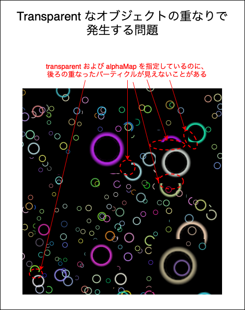
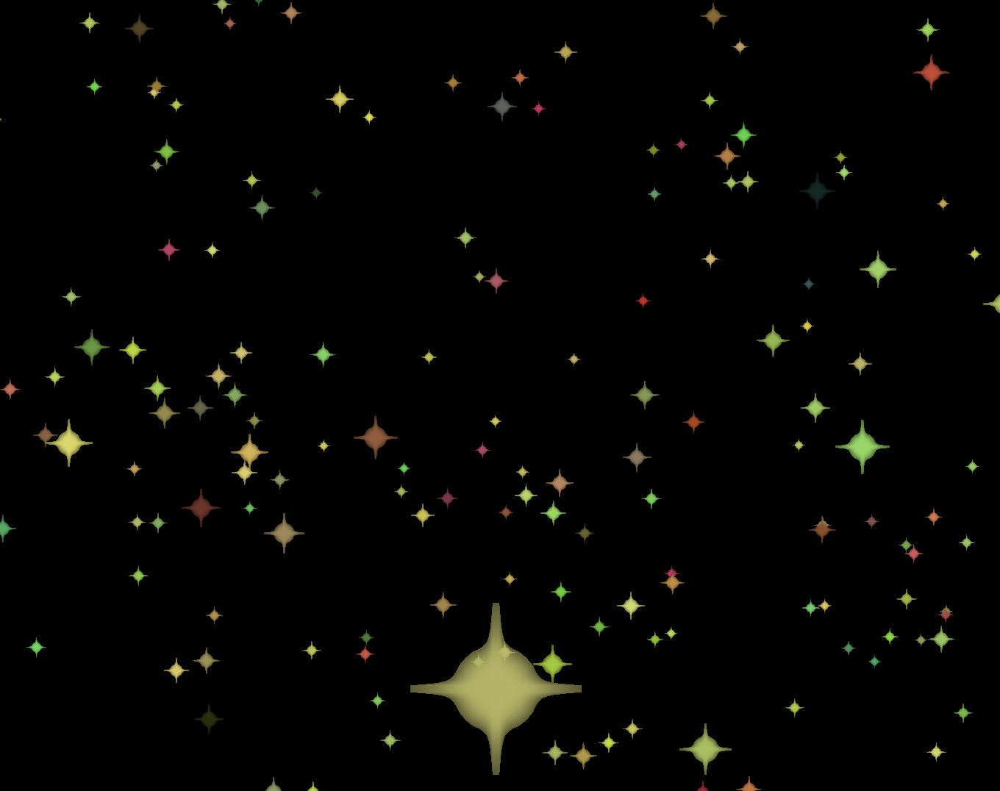
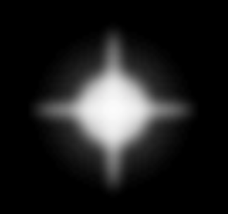
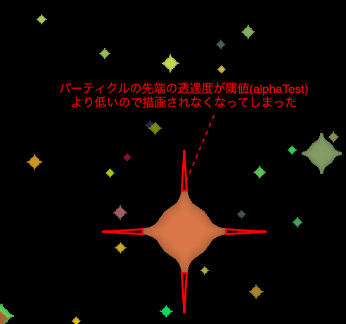
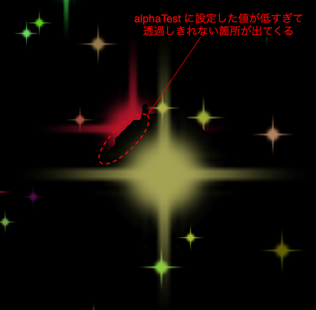
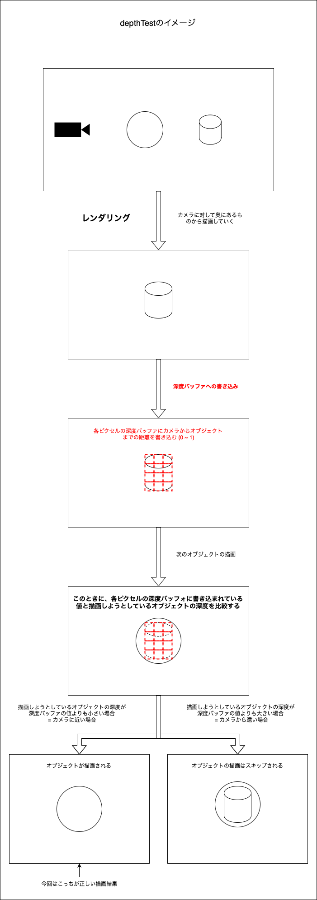
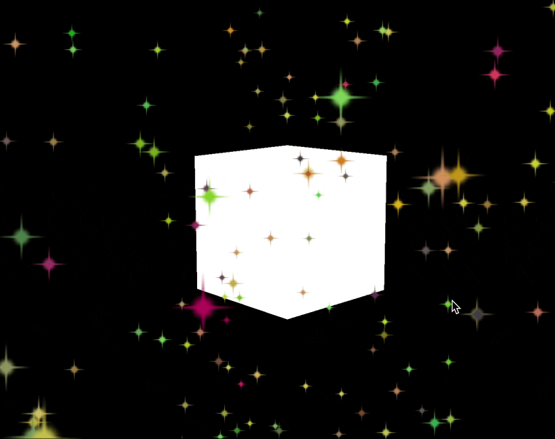
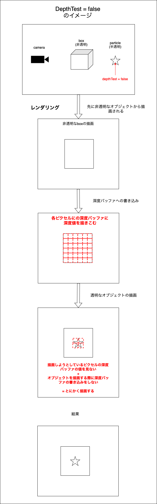
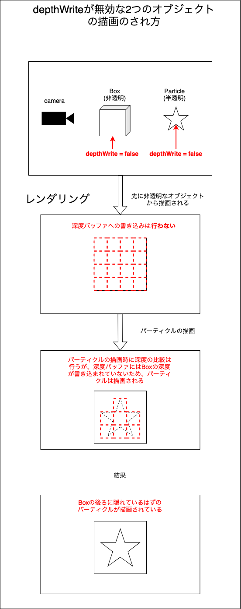

### Transparent なオブジェクトの重なりで起こりうる問題



<br>

#### 原因

- パーティクルの [depthTest](#depth-test) がデフォルト (ON) のままであったため、後ろのパーティクルを遮るように手前のパーティクルが描画された

    - 半透明なオブジェクトで depthTest が ON だと手前のオブジェクトが後ろのオブジェクトを遮ったり、透過したりで不安定っぽい

<br>

#### 解決策

- パーティクルの **Material** に対して以下のうちどれかを利用する

    1. [AlphaTest](#alpha-test) (透明度のしきい値の設定)を利用する

    2. [depthTest](#depth-test) を無効にする

    3. [depthWrite](#depth-write) を無効にする

<br>

- 今回のパーティクルのケースには利用できないが、同じような他のケースにて利用できるかもしれない解決法
    - オブジェクトの描画の順番をコントロールする

<br>
<br>

参考サイト

今回の問題を一番わかりやすく説明している記事
- [その17 Zバッファとアルファブレンドの嫌な関係](http://marupeke296.com/DXG_No17_ZBufferAndAplhaBlending.html)

DepthWriteやDepthTestについて
- [[Three.js] transparent再入門](https://qiita.com/masato_makino/items/ce57452196d480aaa203#前提--gpuの描画処理)

- [ThreeJS PointMaterial texture transparent background issue](https://stackoverflow.com/questions/33830972/threejs-pointmaterial-texture-transparent-background-issue)

---

### Alpha Test

- ピクセルの透明度のしきい値の設定をするプロパティ
    - 例: 透過度が 0.5 以下の透過度をもつピクセルは描画しない

    ```js
    /**
     * テクスチャのロード 
     */
    const textureLoader = new THREE.TextureLoader();
    
    const alphaMapTexture = textureLoader.load("テクスチャのパス");

    // パーティクルの作成は省略

    // PointsMaterial の作成
    const particleMaterial = new THREE.PointsMaterial({
        size: 0.5,
        sizeAttenuation: true,
        transparent: true,
        alphaMap: alphaMapTexture,
        alphaTest: 0.5, // ★透過度が0.5以下のピクセルは描画しない
    });

    // パーティクルをシーンに追加
    scene.add(new THREE.Points(particlesGeometry, particleMaterial);)
    ```

    

<br>

#### 注意点
- 設定するしきい値によっては、表示したい部分が描画されず、意図した見え方でなくなる可能性がある

    例: 以下のテクスチャを alpha マッピングに利用し、パーティクルの形を変えたい

    

    - alphaTest の値を高く設定すると...

        ```js
        // PointsMaterial の作成
        const particleMaterial = new THREE.PointsMaterial({
            size: 0.5,
            sizeAttenuation: true,
            transparent: true,
            alphaMap: alphaMapTexture,
            alphaTest: 0.8, // ★透過度が0.8以下のピクセルは描画しない
        });
        ```

        
    
    <br>

    - alphaTest の値を低く設定すると...

        ```js
        // PointsMaterial の作成
        const particleMaterial = new THREE.PointsMaterial({
            size: 0.5,
            sizeAttenuation: true,
            transparent: true,
            alphaMap: alphaMapTexture,
            alphaTest: 0.01, // ★透過度が0.01以下のピクセルは描画しない
        });
        ```

        

---

### Depth Test



<br>

- 各オブジェクトの深度(前後の位置)を比較して、後ろにあるオブジェクトは前にあるオブジェクトに隠れるようにする機能

    - デフォルトで ON (true)

<br>

- **Depth Test を OFF にする** と、`オブジェクトの描画時に深度バッファに書き込まない` + `オブジェクトの描画時に深度バッファとの比較をしない`

    - つまり、対象のオブジェクト (DepthTest OFF) と他のオブジェクトの深度に関係なく対象のオブジェクトを描画しようとする

    ```js
    const particleMatrial = new THREE.PointsMaterial({
        alpha: alphaMapTexture,
        depthTest: false, // ★DepthTest をオフにする = このマテリアルのオブジェクトは深度バッファへの書き込み+深度値の比較を行わずに描画される
    });
    ```

<br>

#### 注意点

- 他のオブジェクトと併用する場合に意図しない見え方になる時がある

    ```js
    // 非透明のボックスオブジェクトを追加
    const box = new THREE.Mesh(
        new THREE.BoxGeometry(1, 1, 1),
        new THREE.MeshBasicMaterial()
    );
    scene.add(box);

    // bufferGeometryを利用したパーティクルのジオメトリの作成は省略
    
    // PointsMaterial の作成
    const particleMatrial = new THREE.PointsMaterial({
        alpha: alphaMapTexture,
        depthTest: false, // ★DepthTest を OFF
    });

    // 半透明なパーティクルをシーンに追加
    scene.add(new THREE.Points(particleGeometry, particleMaterial));
    ```

    <br>

    結果
    
    - 非透明なオブジェクトの後ろにあるはずのパーティクルが描画されてしまう

    

    <br>

    - 原因は以下の通り

    
<br>
<br>

参考サイト

Three.js でのオブジェクトの描画順について
- [WebGL入門 ~ three.js ②~](https://zenn.dev/vava/articles/06db6a23de2f87#マテリアル(透明度))

- [Web上でちょっと本気の3Dアクションゲームを作る](https://qiita.com/teradonburi/items/785085c109cd55d92d32#空と海の表現)

---

### Depth Write

- Depth Test = Depth Write + Comparison of Depth のイメージ

- ★ Depth Write を OFF にすると、`オブジェクトの描画時の深度バッファへの書き込み` は OFF になるが、`オブジェクト描画時に対応するピクセルの深度バッファに記録されている値との比較` は ON のまま

    ```js
    const particleMatrial = new THREE.PointsMaterial({
            alpha: alphaMapTexture,
            depthWrite: false, // ★DepthWrite をオフにする = このマテリアルのオブジェクトは深度バッファへの書き込みは行わないが,他のオブジェクトとの重なっているのは判断する
        });
    ```

    <br>

    結果

     - [半透明なパーティクル同士の重なりの問題](#transparent-なオブジェクトの重なりで起こりうる問題)が解消

     - [DepthTest をOFFにした時の問題](#注意点-1)も解消

    

<br>
<br>

#### 注意点

- 他の deptWrite が無効のマテリアルを使ったオブジェクトがある場合、前後関係無く両方のオブジェクが描画されることに注意

    ```js
    // depthWrite が無効のボックスオブジェクトを追加
    const box = new THREE.Mesh(
        new THREE.BoxGeometry(1, 1, 1),
        new THREE.MeshBasicMaterial({ depthWrite: false }) //depthWrite を無効にする
    );
    scene.add(box);

    // bufferGeometryを利用したパーティクルのジオメトリの作成は省略
    
    // PointsMaterial の作成
    const particleMatrial = new THREE.PointsMaterial({
        alpha: alphaMapTexture,
        depthWrite: false, // ★depthWrite を OFF
    });

    // 半透明なパーティクルをシーンに追加
    scene.add(new THREE.Points(particleGeometry, particleMaterial));
    ```

    
    
    <br>

    - 原因は以下の通り

        