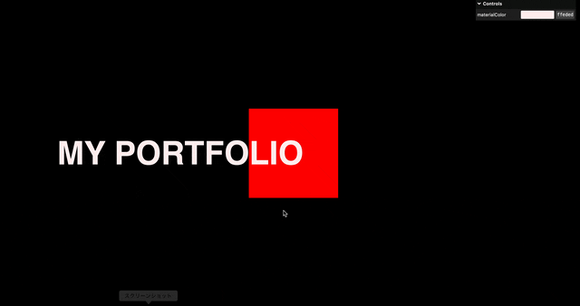
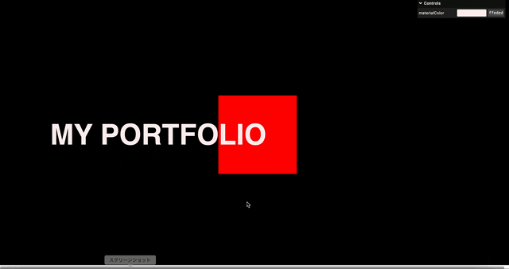

### Canvas 要素を背景として固定する方法

- Canvas 要素のポジションを fixed にする



```html
<!-- HTML -->

<body>
    <canvas class="canvas"></canvas> <!-- 背景として使いたいCanvas 要素 -->

    <!-- そのほかのwebページの要素 -->
    <section class="first-page">
        <p>Hello</p>
    </section>

    <section class="second-page">
        <p>Bye</p>
    </section>
</body>
```


```css
/* CSS */
.canvas {
position: fixed;
top: 0;
left: 0;
outline: none;
}
```

<br>

- もし、position を absolute や relative に変更すると、ほかの要素と同様にスクロールで移動していく

<br>
