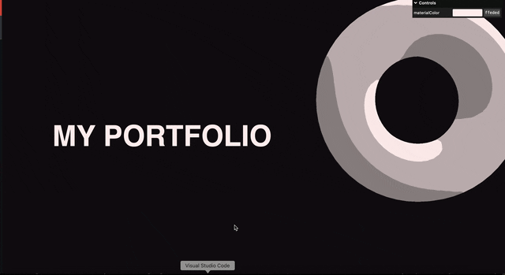

### マウスイベントに応じたカメラの動き

- 以下のようなイベントに応じてカメラの位置を変更した

    - [スクロールに応じてカメラを動かす](./スクロールに合わせてカメラを移動させる.md)

    - [マウスイベントに応じてカメラを動かす](./複数のイベントに対応してカメラを移動させる.md#マウスの移動に合わせてカメラを移動させる)

<br>

- しかし、どちらも1回のフレームでカメラを対象位置まで動かしている

    

    <br>

    - 数回のフレームに分けて、カメラを対象位置まで動かすことで easing を実現することができる

        

---

### easing を実現するために


<br>

##### ポイント

- 到達地点 - 現在地 = 距離

- 距離 ÷ 任意の値を進み続けることで、何フレームかかけて到達地点に移動させることができる

---

### 実装

- 今回はスクロールに応じたカメラの移動に easing をかける

- カメラの位置は += 演算子を使って徐々に移動させることがポイント

<br>

```js
import * as THREE from "three";

/**
 * Base
 */
// Canvas
const canvas = document.querySelector("canvas.webgl");

// Scene
const scene = new THREE.Scene();

/**
 * Objects
 */
// material
const material = new THREE.MeshToonMaterial({
  color: parameters.materialColor,
});
material.gradientMap = gradientMap;

const objectDistance = 4; // オブジェクト間の距離

const obj1 = new THREE.Mesh(new THREE.TorusGeometry(1, 0.4, 16, 60), material);

const obj2 = new THREE.Mesh(new THREE.ConeGeometry(1, 2, 32), material);

const obj3 = new THREE.Mesh(
  new THREE.TorusKnotGeometry(0.8, 0.35, 100, 16),
  material
);

obj1.position.y = -objectDistance * 0;
obj2.position.y = -objectDistance * 1;
obj3.position.y = -objectDistance * 2;
scene.add(obj1, obj2, obj3);
const sectionMeshes = [obj1, obj2, obj3]; //参照用の配列

/**
 * Lights
 */
const light = new THREE.DirectionalLight(0xffffff, 3);
light.position.set(1, 1, 0);
scene.add(light);

/**
 * Camera
 */
// Base camera
const camera = new THREE.PerspectiveCamera(
  35,
  sizes.width / sizes.height,
  0.1,
  100
);
camera.position.z = 6;

/**
 * Renderer
 */
const renderer = new THREE.WebGLRenderer({
  canvas: canvas,
  alpha: true,
});

renderer.setClearAlpha(0.5);
renderer.setClearAlpha(0.5);
renderer.setSize(sizes.width, sizes.height);
renderer.setPixelRatio(Math.min(window.devicePixelRatio, 2));

/**
 * Animate
 */
const clock = new THREE.Clock();

const tick = () => {
  const elapsedTime = clock.getElapsedTime();

  /**
   *  ★スクロールに合わせてカメラを移動する (easing)
   */
  // 到達地点の計算
  let targetPosition = -(window.scrollY / sizes.height) * objectDistance;

  // ★★距離の計算
  let distance = targetPosition - camera.position.y;

  // 徐々に到達地点まで移動させる
  cameraGroup.position.y += distance * 0.01; 

  // Render
  renderer.render(scene, camera);

  // Call tick again on the next frame
  window.requestAnimationFrame(tick);
};

tick();
```

<br>



<br>

- 一見良さそうに見えるが、実は[問題](#フレームレートの違いを考慮)有り

---

### フレームレートの違いを考慮

- [こちらの実装](#実装)では、フレームレートの違うクライアントを考慮していない

    - フレームレートの高いクライアントでは easing が短く、フレームレートの低いクライアントでは easing が長くなる

<br>

#### フレームレートを考慮したアニメーションの実装

- delta time (フレーム間の経過時間) を利用する

    - delta time については[こちら](../../chap1/05/Animation.md#異なる-fps-デバイス間でも同じようなアニメーションを実装する)を参照


    <br>

    ```js
    /**
     * Animate
     */
    const clock = new THREE.Clock();
    let previsouTime = 0;

    const tick = () => {
    const elapsedTime = clock.getElapsedTime();
    // ★★★デルタタイムの計算
    const delta = elapsedTime - previousTime;
    previousTime = elapsedTime;


    /**
     *  ★スクロールに合わせてカメラを移動する (easing)
     */
    // 到達地点の計算
    let targetPosition = -(window.scrollY / sizes.height) * objectDistance;

    // ★★距離の計算
    let distance = targetPosition - camera.position.y;

    // 徐々に到達地点まで移動させる
    // ★★★移動量にデルタタイムをかけることで、フレームレートの違いをなくす★★★
    cameraGroup.position.y += distance * 0.01 * deltaTime; 

    // Render
    renderer.render(scene, camera);

    // Call tick again on the next frame
    window.requestAnimationFrame(tick);
    };

    tick();
    ```