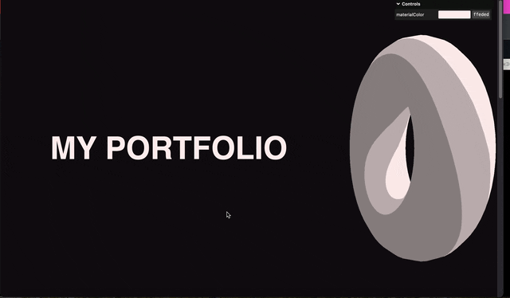
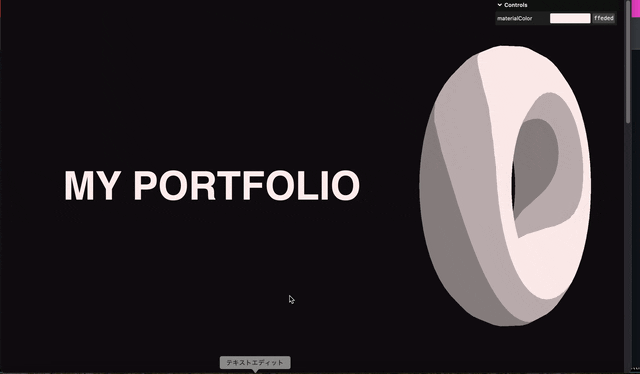
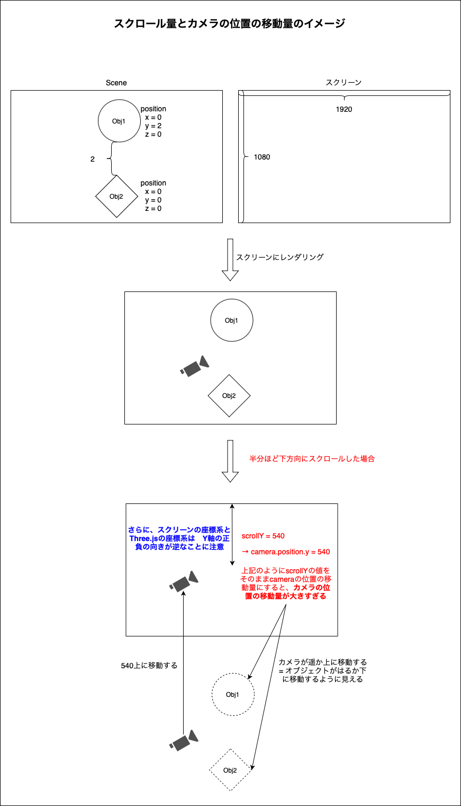
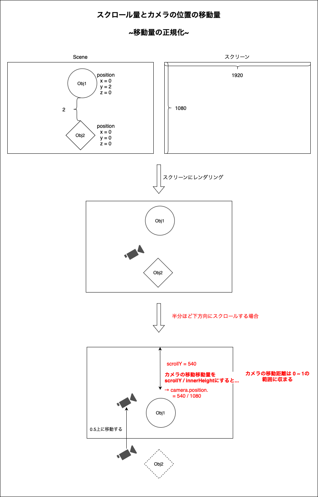
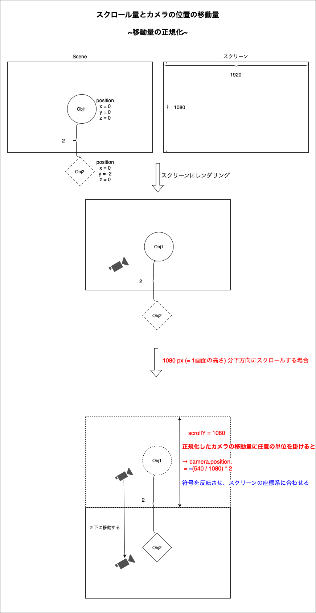

### スクロールにあ合わせてカメラを移動させる

- 以下の2つの方法がある

<br>

1. スクロールイベントが発火した時にカメラの位置を移動する

    - window.addEventListener でスクロールイベントを登録する

    - window.scrollY で縦方向のスクロール量を取得し、そのスクロール量に応じてカメラの位置を変更する

    <br>

    ```js
    // objectDistance はオブジェクト間の距離
    window.addEventListener("scroll", () => {
        camera.position.y = -(window.scrollY / window.innerHeight) * objectDistance;
    });
    ```

<br>

2. レンダリングするタイミングと一緒に、スクロール量に応じてカメラを移動させる

    - 毎フレーム呼び出されるレンダリングの関数内に処理を記述

    - window.scrollY で縦方向のスクロール量を取得し、そのスクロール量に応じてカメラの位置を変更する

    <br>

    ```js
    /**
     * Animate
    */
    const clock = new THREE.Clock();

    const tick = () => {
    const elapsedTime = clock.getElapsedTime();

    // ★★★ move camera according to scroll ★★★
    // objectDistance はオブジェクト間の距離
    camera.position.y = -(window.scrollY / window.innerHeight) * objectDistance;

    // Render
    renderer.render(scene, camera);

    // Call tick again on the next frame
    window.requestAnimationFrame(tick);
    };

    tick();
    ```

<br>

- 結果

    

<br>

- ちなみに、カメラの位置を動かさないと...

    


<br>

- ★カメラのをどのぐらい移動させるかについてはこちら[スクロール量とカメラの移動量](#スクロール量とカメラの移動量)を参照


<br>
<br>

参考サイト
[Three.js備忘録（５）](https://koro-koro.com/three-js-no5/)

---

### スクロール量とカメラの移動量

- スクロール量に応じてカメラを移動させるときの注意点

    - カメラの position.x ( y / z ) に scrollY (X) で取得した値を**そのまま**代入すると、カメラの移動量が大きくなりすぎることがよくある

    <br>

    

<br>

#### 解決策

- カメラの位置の移動量を正規化する

    - scrollY を innerHeight で割る

    - `camera.position.y = window.scrollY / window.innerHeight` とすることで、カメラの位置の移動距離を 0 ~ 1 の範囲に収めることができる

    <br>

    

<br>

- さらに、正規化した移動量に任意の単位を掛けることで、移動量を調節することができる

    - `(window.scrollY / innerHeight) * 任意の移動量`

    <br>

    

<br>

- 最終的なカメラの移動量は**符号を反転させ、Three.jsの座標系に合わせる**必要があることに注意

参考サイト
[Three.js備忘録（５）](https://koro-koro.com/three-js-no5/)