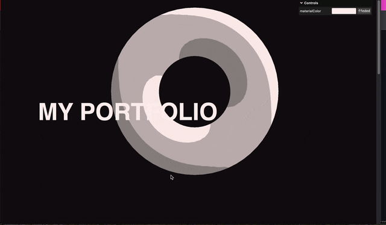

### 複数のイベントに応じたカメラのポジションの変更

- 以下の2つのイベントに対してカメラの位置を変更したいケースを考える

    1. スクロールに対応して、カメラの Y 座標を変更する

        - 実装方法は[こちら](./スクロールに合わせてカメラを移動させる.md)を参照

    2. マウスの移動に合わせてカメラの X 座標 Y 座標を変更する

        - 実装方法は[こちら](#マウスの移動に合わせてカメラを移動させるを参照

<br>

- とりあえず何も考えずに実装してみると...

    ```js
    /**
     * スクロールに応じたカメラ位置の変更
     */
    // objectDistance はオブジェクト間の距離
    window.addEventListener("scroll", () => {
        camera.position.y = -(window.scrollY / window.innerHeight) * objectDistance;
    });

    // マウスの位置情報(正規化済み)を持つオブジェクト
    let cursor = {
        y: 0,
        x: 0,
    };

    /**
     * マウスの動きに応じたカメラ位置の変更
     */
    window.addEventListener("mousemove", (e) => {
        // -0.5 しているのは、中心から右は正、中心から左は負といったように、★★★Three.js の座標系に合わせたいから★★★
        cursor.y = -(e.clientY / window.innerHeight - 0.5); // 値を反転することに注意
        cursor.x = e.clientX / window.innerWidth - 0.5;

        // カメラ位置の変更
        camera.position.x = cursor.x;
        camera.position.y = cursor.y;
    });
    ```

<br>

#### 問題点



<br>

- 「スクロールに応じたカメラ位置の変更」でカメラ位置が動いても、後続の「マウスの動きに応じたカメラ位置の変更」のカメラ位置に上書かれてしまう

<br>

#### 解決策

- カメラの位置　(同じ座標軸) を複数回更新しない

    - (今回はこっち) カメラを Group に入れて Group のポジションを「スクロール」か「マウスの移動」のどちらかに応じて更新するようにする

    <br>

    - 「スクロール」か「マウスの移動」のどちらかではカメラではなく、オブジェクトの位置を変更するようにする

<br>


<br>

- コード

    ```js
    /**
     * Camera を Group に入れる
     */
    // Base camera
    const camera = new THREE.PerspectiveCamera(
    35,
    sizes.width / sizes.height,
    0.1,
    100
    );
    camera.position.z = 6;

    // Camera Group
    const cameraGroup = new THREE.Group();
    cameraGroup.add(camera);

    // ★scene に add するのは Group インスタンス
    scene.add(cameraGroup); 

    /**
     * Scroll に応じてカメラの Group の位置の変更
     */
    window.addEventListener("scroll", () => {
    cameraGroup.position.y = -(window.scrollY / sizes.height) * objectDistance;
    });

    /**
     * マウスの動きに応じてカメラの位置の変更
     */
    window.addEventListener("mousemove", (e) => {
    cursor.y = -(e.clientY / sizes.height - 0.5);
    cursor.x = e.clientX / sizes.width - 0.5;
    camera.position.x = cursor.x;
    camera.position.y = cursor.y;
    });
    ```

<br>

---

### マウスの移動に合わせてカメラを移動させる

[スクロールに合わせてカメラを移動させる](./スクロールに合わせてカメラを移動させる.md)と同様に以下の2つの方法がある

1. マウスムーブイベントが発火した時にカメラの位置を移動する

    - window.addEventListener でマウスムーブイベントを登録する

    - コールバック関数に渡ってくるイベントオブジェクトの clientX, clientY でマウスの現在位置を取得できる

    - ★[カメラの移動量の正規化](./スクロールに合わせてカメラを移動させる.md#解決策)を忘れずに

    
    ```js
    // マウスの位置情報(正規化済み)を持つオブジェクト
    let cursor = {
        y: 0,
        x: 0,
    };

    // マウスが動かされた時に発火する
    window.addEventListener("mousemove", (e) => {
        // -0.5 しているのは、中心から右は正、中心から左は負といったように、★★★Three.js の座標系に合わせたいから★★★
        cursor.y = -(e.clientY / window.innerHeight - 0.5); // 値を反転することに注意
        cursor.x = e.clientX / window.innerWidth - 0.5;

        // カメラ位置の変更
        camera.position.x = cursor.x;
        camera.position.y = cursor.y;
    });
    ```

<br>

2. レンダリングするタイミングと一緒に、マウスの移動量に応じてカメラを移動させる

    - ★MouseEvent.clientX (clientY) はマウスムーブイベントに登録したコールバック関数の引数からしか取得できない
        
        - こちらの方法でもwindow.addEventListener でマウスムーブイベントを登録する

    <br>

    ```js
    // マウスの位置情報(正規化済み)を持つオブジェクト
    let cursor = {
        y: 0,
        x: 0,
    };

    // マウスが動かされた時に発火する
    window.addEventListener("mousemove", (e) => {
        // -0.5 しているのは、中心から右は正、中心から左は負といったように、★★★Three.js の座標系に合わせたいから★★★
        cursor.y = -(e.clientY / window.innerHeight - 0.5); // 値を反転することに注意
        cursor.x = e.clientX / window.innerWidth - 0.5;
    });

    /**
    * Animate
    */
    const clock = new THREE.Clock();

    const tick = () => {
        const elapsedTime = clock.getElapsedTime();

        // カメラ位置の変更
        camera.position.x = cursor.x;
        camera.position.y = cursor.y;

        // Render
        renderer.render(scene, camera);

        // Call tick again on the next frame
        window.requestAnimationFrame(tick);
    };

    tick();
    ```

<br>

- 結果

    