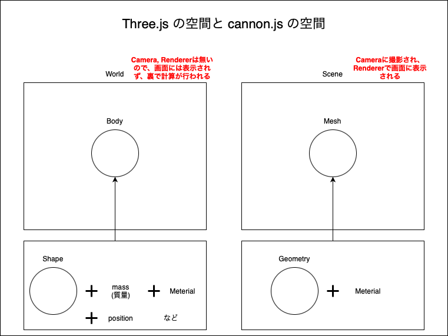
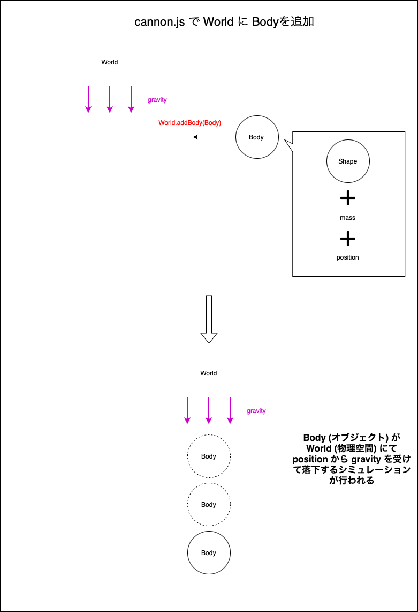

### cannon.js とは

- 3D の物理演算ライブラリ

- 現在はメンテナンスされていないが、 cannon.js を fork した [cannon-es](./cannon-es.md) があるのでそちらを使った方が良い

---

### cannon.js について

#### ポイント

- Three.js で Scene を作るように、物理円算用の [World](#world) を cannon.js で作成する

- 物理演算の計算結果を Scene 内のオブジェクトに適用することで、オブジェクト達は物理演算世界の動きに合わせて動くようになる

<br>

#### cannon.js の重要なコンセプト



<br>

- ##### World

    - 物理演算用の空間。この空間に cannon.js で物体を作成し、動きをシミュレートする

    - cannon.js の World ≒ Three.js の Scene

    - World.gravity プロパティに x,y,z軸への重力を設定することで、その物理演算空間内に重力を適用することができる

        - 地球の重力は 9.80665 m/s2 らしい = y軸方向に -9.8 を設定すれば地球の重力と同じ感じの物理演算ができるっぽい

    <br>

    ```js
    import CANNON from "cannon";

    // 物理演算空間の作成
    const world = new CANNON.world();

    // 物理演算空間の x, y, z 軸方向への重力
    world.gravity.set(0, -9.82, 0);
    ```

<br>

- ##### Shape

    - cannon.js の Shape ≒ Three.js の Geometry

    - Shape には Sphere や Plane、 Box などがある

        - ★★★物理演算空間の Shape と Three.js の Scene 内の Geometry は形状、大きさを揃える必要がある★★★

        <br>

        - 球体を扱いたい場合は Three.js の SphereGeometry と cannon.js の Shpere の radius を同じにする

        <br>

        - ボックスを扱いたい場合は、Three.js の BoxGeometry の幅、高さ、奥行き の半分の値を cannon.js の Box に指定する必要がある

            - new THREE.BoxGeometry(高さ, 幅, 奥行き) = new CANNON.Box(new CANNON.Vec3(高さ * 0.5, 幅 * 0.5, 奥行き * 0.5))
        
        <br>

        - ★Plane の扱いには注意

            - cannon.js の Plane はサイズの指定はなく、**無限に広がる平面**

    <br>

    ```js
    import * as THREE from "three";
    import CANNON from "cannon";

    /**
     * 球体を作成
     */
    const sphereRadius = 0.5;

    // cannon.js の球体
    // Sphere コンストラクターは引数に radius を受け取る (radius を揃える必要がある)
    const sphereShape = new CANNON.Sphere(sphereRadius);

    // Three.js の球体
    // radius を揃える必要がある
    const shpereGeometry = new THREE.SphereGeometry(sphereRadius, 20, 20);


    /**
     * Box を作成
     */
    const boxSize = {
        width: 2,
        height: 2,
        depth: 2,
    };

    // cannon.js の Box
    // Three.js の BoxGeometry のサイズの半分を指定する
    const boxShape = new CANNON.Box(
        new CANNON.Vec3(boxSize.width / 2, boxSize.height / 2, boxSize.depth / 2)
    );

    // Three.js の Box
    const boxGeometry = new THREE.BoxGeometry(boxSize.width, boxSize.height, boxSize.depth);


    /**
     * Plane の作成
     */
    const planeSize = {
        width: 10,
        height: 10,
    };
    // cannon.js の Plane
    const planeShape =  new CANNON.Plane();

    // Three.js の Plane
    new THREE.PlaneGeometry(planeSize.width, planeSize.height);
    ```

<br>

- ##### Body

    - cannon.js の Body ≒ Three.js のMesh

    - Body は Shape や Material (Material は省略可能) から構成される

    - Body に Shape などを指定し、**作成した Body を World に追加することでその物体の物理演算をシミュレートすることができる**

        

    <br>

    ```js
    import CANNON from "cannon";

    /**
     *  物理演算空間の作成
     */
    const world = new CANNON.world();
    // 物理演算空間の x, y, z 軸方向への重力
    world.gravity.set(0, -9.82, 0);

    /**
     * Shape の作成
     */
    const sphereRadius = 0.5;
    // cannon.js の球体
    const sphereShape = new CANNON.Sphere(sphereRadius);

    /**
     * ★Body の作成
     */
    const sphereBody = new CANNON.Body({
        mass: 1,
        position: new CANNON.Vec3(0, 2, 0),
        shape: sphereShape, // ★★ 作成した Shape を元に Body を作成
    });

    // ★★★Body を物理演算空間に追加
    // 裏で高さ2(y = 2)から　重力-9.82 で落下する球体のシミュレーションが行われる
    world.addBody(sphereBody);
    ```

<br>

- ##### Vec3
    
    - cannon.js の Vec3 ≒ Three.jsの Vector3

    - 物理演算空間でのポジションなどは Vec3 を使って設定していく

    - Three.js の Vector3 と cannon.js の Vec3 は互換性があるっぽい

    <br>

    ```js
    import CANNON from "cannon";

    const position = {
        x: 0,
        y: 0,
        z: 0
    };

    // cannon.js の Shpere
    const shpereBody = new CANNON.Body({
        mass: 1,
        position: new CANNON.Vec3(0, 0, 0),
        shape: new CANNON.Shpere(1),
    });

    // Three.js のShpere
    const shpereGeometry = new THREE.ShpereGeometry(1, 20, 20);
    
    // ★★★Vector3 を指定するプロパティに Vec3 型のデータを渡しても大丈夫★★★
    shpereGeometry.position.copy(shpereBody.position);
    ```

<br>

- ##### Material

    - 摩擦や反発（弾性）などの物理的なプロパティをシミュレートするためのオブジェクト

    - 詳しくは[こちら](./オブジェクト同士の接触のシミュレーション.md)を参照

<br>

- ##### ContactMaterial

    - マテリアルが同士が接触した場合の摩擦や反発（弾性）などの物理的なプロパティをシミュレートするためのオブジェクト

    - 詳しくは[こちら](./オブジェクト同士の接触のシミュレーション.md)を参照

<br>
<br>

参考サイト

[Three.js備忘録（６）](https://koro-koro.com/threejs-no6/)

---

### 基本的な使い方

物理演算の世界を更新(=計算)するには World.step() で行う必要がある


    step() に必要なパラメータ

        - fixedTimestamp
        - 前回の呼び出しからの経過時間
        - 


---

### cannon,js でのオブジェクトの回転