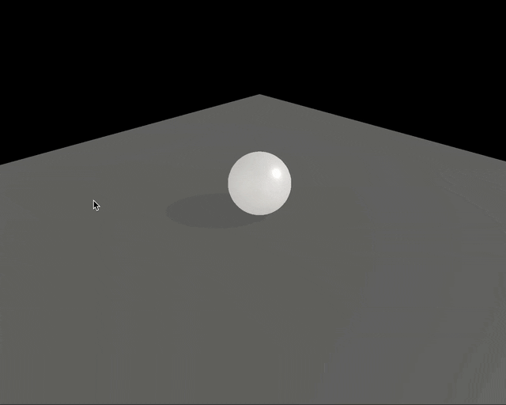

### Material

#### 概要

- 材質 (摩擦係数、反発係数など)を表現するオブジェクト

<br>

#### 使い方

1. Cannon.js (cannon-es) の Material インスタンスの作成

    - Material

        - 第一引数： 作成するマテリアルのラベル (String) or 作成するマテリアルのプロパティを持つオブジェクト (Object)

        - Material.friction でそのマテリアルの持つ摩擦係数を指定する

        - Material.restitution でそのマテリアルの持つ反発係数を指定する

<br>

2. 作成した Material を 対象の Body の material プロパティに指定する

<br>

```js
import * as CANNON from "cannon-es";

// 1. ゴムの性質をもつ Material の作成
const rubberMaterial = new CANNON.Material({
    name: "rubberMaterial",
    friction = 0.5;
    restitution = 0.9;
});

// 2. ゴムの Material が適用された球体 (物理空間の中のオブジェクト)
const shpereBody = new CANNON.Body({
    mass: 1,
    position: new CANNON.Vec3(0, 3, 0),
    shape: new CANNON.Sphere(0.5),
    material: rubberMaterial, // material プロパティに作成した Material を指定する
});

// 1. プラスティックの性質をもつ Material の作成
const plasticMaterial = new CANNON.Material("plastic");
plasticMaterial.friction = 0.2;
plasticMaterial.restitution = 0.4;

// 2.プラスティックの Material が適用された平面 (物理空間の中のオブジェクト)
const planeBody = new CANNON.Body({
    mass: 0,
    shape: new CANNON.Plane(),
    material: plasticMaterial
});
```

<br>

##### 注意点

- Material を適用しただけでは、Material が適用されたオブジェクト同士の接触に影響を及ぼさないことに注意する

    - 球体にゴムの性質 (高反発)を持たせたにも関わらず全然跳ねない

    

    <br>

    - ★[ContactMaterial](#contactmaterial) を作成する必要がある (ゴムとプラスティックのマテリアルが接触した際の性質を定義するインスタンス)

<br>
<br>

参考サイト

[Three.js備忘録（６）](https://koro-koro.com/threejs-no6/)

---

### ContactMaterial

#### 概要

- マテリアル同士が接触した際の反応 (摩擦係数や反発係数) を表現するオブジェクト

<br>

#### 使い方

1. ConatctMaterial インスタンスを作成する

    - 第一引数: 作成した Material インスタンス (Material)

    - 第二引数: 作成した Material インスタンス (Material)

    - 第三引数: オプションオブジェクト (Object)

        - friction: 摩擦係数。デフォルトは 0.3

        - restitution: 反発係数。デフォルトは0.3

            などなど

<br>

2. 作成した ContactMaterial インスタンスを World.addContactMaterial() で World に追加する

```js
// 1. ConatctMaterial インスタンスの作成
const rubberPlasticContactMaterial = new CANNON.ContactMaterial(rubberMaterial, plasticMaterial, {
    friction: 0.2,
    restitution: 0.7,
});

// 2. 作成した ContactMaterial を World に追加
world.addContactMaterial(rubberPlasticContactMaterial);
```

<br>

#### 注意点

- 各 [Material](#material) に restitution や friction を設定している場合、 ContactMaterial に設定した restitution や friction の値は無視されるっぽい

    - ContactMaterial に渡す2つの Material に restitution や friction が設定さている場合 (0以上の値)

        - 2つの Material の restitution や friction は それぞれの Material の restitution や friction を掛け合わせた値が適用される

        - ContactMaterial に restitution や friction が設定されていたとしても無視される

        <br>

        

        <br>

        ```js
        // ゴムの性質をもつ Material の作成
        const rubberMaterial = new CANNON.Material({
            name: "rubberMaterial",
            friction = 0.8;
            restitution = 0.9;
        });

        // プラスティックの性質をもつ Material の作成
        const plasticMaterial = new CANNON.Material("plastic");
        plasticMaterial.friction = 0.5;
        plasticMaterial.restitution = 0.4;

        //  ConatctMaterial インスタンスの作成
        const rubberPlasticContactMaterial = new CANNON.ContactMaterial(rubberMaterial, plasticMaterial, {
            friction: 0.2, // この値は無視される
            restitution: 0.7, // この値は無視される
        });

        /**
         *  ★rubberMaterial と plasticMaterial 間の restitution は 0.9 * 0.4 = 0.36
         *
         * ★rubberMaterial と plasticMaterial 間の friction は 0.8 * 0.5 = 0.4
         /
        ```

    <br>

    - ContactMaterual に渡す2つの Material のうち、どちらか一方の Material の restitution や friction が設定されていなかったり、負の値が設定されている場合

        - 2つの Material を結びつけた ContactMaterial の restitution や friction の方が適用される

        <br>

        

        <br>

        ```js
        // ゴムの性質をもつ Material の作成　(restitution の設定値無し)
        const rubberMaterial = new CANNON.Material({
            name: "rubberMaterial",
            friction = 0.8;
        });

        // プラスティックの性質をもつ Material の作成 (friction の設定値無し)
        const plasticMaterial = new CANNON.Material("plastic");
        plasticMaterial.restitution = 0.4;

        //  ConatctMaterial インスタンスの作成
        const rubberPlasticContactMaterial = new CANNON.ContactMaterial(rubberMaterial, plasticMaterial, {
            friction: 0.2, // この値が適用される
            restitution: 0.7, // この値が適用される
        });
        ```

<br>

- 多くの場合、各 Material で restitution や friction　の設定は行わず、 ContactMaterial で設定するっぽい

    ```js
    // ゴムの性質を表したい Material の作成
    const rubberMaterial = new CANNON.Material( "rubberMaterial");

    // ゴムの Material が適用された球体 (物理空間の中のオブジェクト)
    const shpereBody = new CANNON.Body({
        mass: 1,
        position: new CANNON.Vec3(0, 3, 0),
        shape: new CANNON.Sphere(0.5),
        material: rubberMaterial, // material プロパティに作成した Material を指定する
    });

    // プラスティックを表したい Material の作成
    const plasticMaterial = new CANNON.Material("plastic");

    // プラスティックの Material が適用された平面 (物理空間の中のオブジェクト)
    const planeBody = new CANNON.Body({
        mass: 0,
        shape: new CANNON.Plane(),
        material: plasticMaterial
    });

    // ★★★ ここでゴムとプラスチックが接触した時の性質を表現する ★★★
    // ConatctMaterial インスタンスの作成
    const rubberPlasticContactMaterial = new CANNON.ContactMaterial(rubberMaterial, plasticMaterial, {
        friction: 0.2,
        restitution: 0.7,
    });
    ```

<br>
<br>

参考サイト

[Three.js備忘録（６）](https://koro-koro.com/threejs-no6/)

---

### デフォルトの Material と ContactMaterial

#### デフォルトマテリアル
- ★World 内の Body にて、マテリアルの指定がない Body は対してデフォルトのマテリアルが設定される

    - **World.defaultMaterial にてデフォルトのマテリアルを指定可能**

    ```js
    // world の作成
    const world = new CANNON.World();
    world.gravity = new CANNON.Vec3(0, -9.82, 0);

    // デフォルトのマテリアルを作成 & 指定
    world.defaultMaterial = new CANNON.Material({
        name: "default",
        restitution: 0.8,
        friction: 0.1
    });

    // body の作成&追加 (material の指定がないため、デフォルトマテリアル(restitution: 0.8, friction: 0.1) が適用される)
    const planeBody = new CANNON.Body({
    mass: 0,
    shape: new CANNON.Plane(),
    });

    world.addBody(planeBody);
    ```

<br>

#### デフォルトマテリアルについての注意点

- デフォルトマテリアル同士の接触を定義する ContactMaterial は別途作成する必要がある

    - デフォルトマテリアル同士の ContactMaterial を作成しない場合は、[world.defaultMaterial](#デフォルトコンタクトマテリアル) が適用される

<br>

#### デフォルトコンタクトマテリアル
- ★World 内での接触の際、ContactMaterial の定義がされていないマテリアルの接触の場合、デフォルトのコンタクトマテリアルが参照される

    - **World.defaultContactMaterial にてデフォルトのコンタクトマテリアルを指定可能**

        ```js
        // world の作成
        const world = new CANNON.World();
        world.gravity = new CANNON.Vec3(0, -9.82, 0);

        // デフォルトのコンタクトマテリアルを作成 & 指定
        // マテリアルが指定されていない body 同士の衝突はこのデフォルトコンタクトマテリアルの設定に従う
        const world.defaultContactMaterial = new CANNON.ContactMaterial(
            world.defaultMaterial,
            world.defaultMaterial,
            {
                restitution: 0.9,
                friction:0.2,
            }
        );
        ```

---

### デフォルトマテリアルとデフォルトコンタクトマテリアの注意点

#### 事象

- 以下のコードは思うように動かない

    - world.defaultMaterial に restitution = 1 のよく跳ねるマテリアルを指定した

    - world.defaultContactMaterial に world.defarultMaterial 同士のコンタクトマテリアルを指定した

    ```js
    // world
    const world = new CANNON.World();
    world.gravity = new CANNON.Vec3(0, -9.82, 0);

    // defaultMaterial
    world.defaultMaterial = new CANNON.Material("default");
    defaultMaterial.friction = 0.1;
    defaultMaterial.restitution = 1;

    // defaultContactMaterial
    world.defaultContactMaterial = new CANNON.ContactMaterial(
    defaultMaterial,
    defaultMaterial
    );
    ```
<br>

#### 期待したこと

- world に追加した body 同士 (マテリアルの指定無し) の接触が発生した場合、 restittion は 1 の挙動をすると期待

    - デフォルトの ContactMaterial に渡した Material の friction & restition を設定しているため、接触の際はその Materal 同士の restitution を元に計算されると思っていた (詳しくは[こちら](#注意点-1)を参照)

<br>

#### 実際に起きたこと

- マテリアルを指定していないオブジェクト同士が接触した時、 restitution = 1 のように跳ねない

    

<br>

#### 原因

- world.defaultContactMaterial の初期値

    - friction = 0.3, restitution = 0

        

<br>

- world.defaultContactMaterial に新たな ContactMateri (friction & restitution の指定無し) を指定した場合

    - friction = 0.3, restitution = 0.3

        

        → ContactMaterialインスタンス の friction, restitution のデフォルト値が 0.3 のため

    <br>


<br>

#### 原因

- デフォルトコンタクトマテリアルのmaterials に渡されている material に0以上の restitution が設定されているにも関わらず、デフォルトコンタクトマテリアルの restitution = 0.3 が適用されているっぽい

    

<br>

#### 解決策

- デフォルトコンタクトマテリアルの restitution と friction を直接更新するか、デフォルトコンタクトマテリアルに渡す ContactMaterial インスタスにて friction と restitution を指定する

    ```js
    // デフォルトコンタクトマテリアルの restitution と friction を直接更新する
    world.defaultContactMaterial.restitution = 1;
    world.defaultContactMaterial.friction = 0.5;

    // デフォルトコンタクトマテリアルに渡す ContactMaterial の restitution & friction を指定する
    world.defaultContactMaterial = new CANNON.ContactMaterial(
        world.defaultMaterial,
        world.defaultMaterial,
        {
            friction: 0.5,
            restitution: 1,
        }
    );
    ```