### 当たり判定

- オブジェクトの当たり判定は大きく以下の2段階で構成されている

    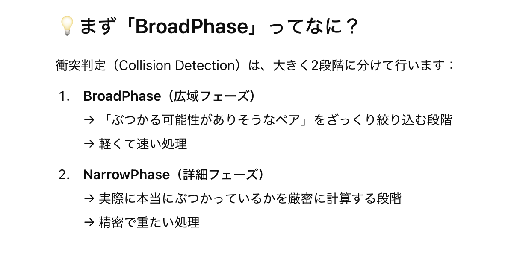

    <br>

    1. BroadPhase

        - オブジェクトの大まかな形状で衝突の判定を行う

        - 後述する NarrowPhase よりも軽くて高速な処理

    <br>

    2. NarrowPhase

        - BroadPhase で衝突と判定されたオブジェクト同士に対して、行うもっと精密な衝突判定

<br>
<br>

参考サイト

[当たり判定の高速化 ‐ ブロードフェーズとナローフェーズ](https://ftvoid.com/blog/post/329)

---

### BroadPhase の基本

- オブジェクトの境界をざっくりと決める

- 上記境界について、他のオブジェクトの境界と重なっていないか = 衝突していないかをアルゴリズム ([ここで紹介しているアルゴリズムなど](#cannon-jses-での-boradphase)) で判定する

<br>

#### オブジェクトの境界

- オブジェクトの境界の決め方は、以下のように様々ある

    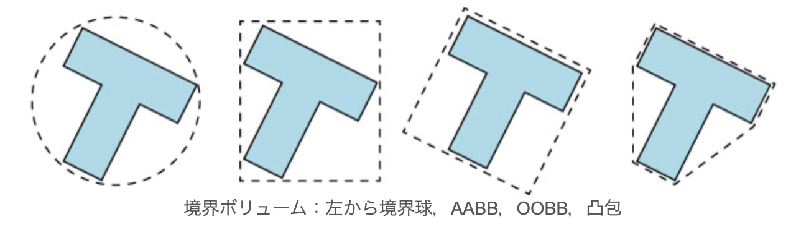

    引用: [情報メディア実験 物理エンジンを使ったアプリケーション開発(3)](https://fujis.github.io/iml_physics/text/3_collision/index.html)

    <br>

    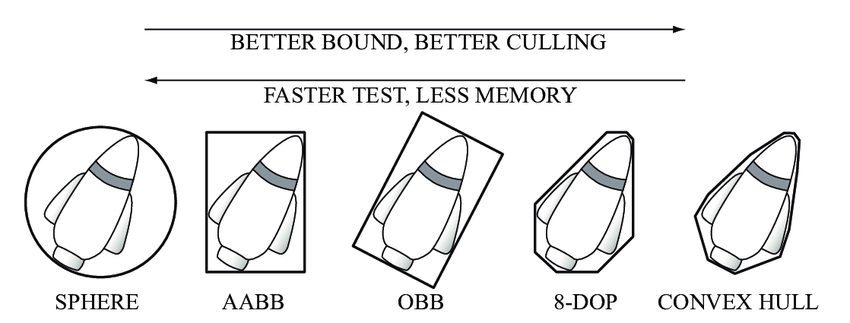

    引用: [Create a box that exactly matches the bounding box after rotation](https://forum.babylonjs.com/t/create-a-box-that-exactly-matches-the-bounding-box-after-rotation/38580)

<br>

- #### AABB (Axis-Aligned Bounding Box = 軸平行境界ボックス)

    - オブジェクトの境界となる各辺が、各軸と並行となるような短形で構成された境界

    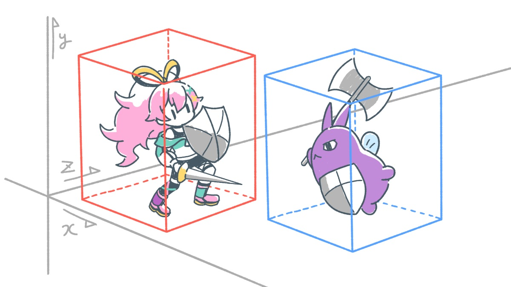

    引用: [【西川善司が語る“ゲームの仕組み” Vol.3】見た目とは違う！？ゲームの「当たり判定」](https://gamemakers.jp/article/2023_03_03_30379/)

<br>

- #### OBB (Oriented Bounding Box = 有向境界ボックス)

    - オブジェクトの向きも考慮した AABB というイメージ

    - AABB よりも重い処理

    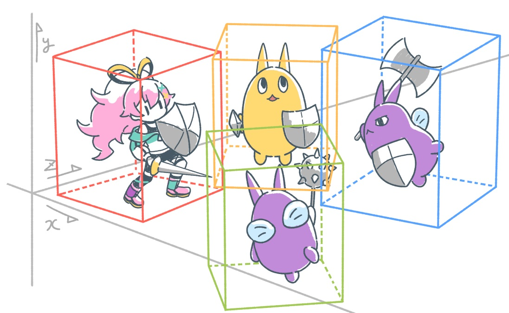

    引用: [【西川善司が語る“ゲームの仕組み” Vol.3】見た目とは違う！？ゲームの「当たり判定」](https://gamemakers.jp/article/2023_03_03_30379/)

<br>
<br>

参考サイト

[【西川善司が語る“ゲームの仕組み” Vol.3】見た目とは違う！？ゲームの「当たり判定」](https://gamemakers.jp/article/2023_03_03_30379/)

---

### Cannon-js(es) での BroadPhase

- #### Naive BroadPhase

    - 物理空間上の全てのオブジェクト同士について 衝突判定 (BroadPhase) を行う

    - Cannon-js (es) ではデフォルトの BroadPhase アルゴリズム

<br>

- #### Grid BroadPhase

    - Naive Broadphaseよりも高速なアルゴリズム

        - 物理空間が均等なグリッドにうまく調節されている場合は高速

        - しかし、上記のようにうまく調節されていない空間では Naive Broadphase 並みに低速

    <br>

    - 物理空間上を均等なグリッドに分け、同じグリッドに存在しているオブジェクト同士についてのみ衝突判定 (BroadPhase) を行う

        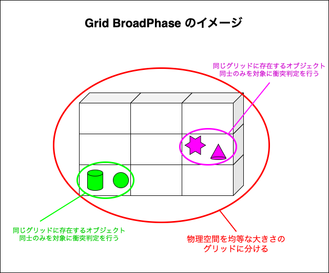

<br>

- #### SAP (Sweep and Prune) BroadPhase

    - 一般的には Naive Broadphase, Grid Broadphase よりも高速なアルゴリズム

    - オブジェクトの境界 ([AABB](#aabb-axis-aligned-bounding-box--軸平行境界ボックス) や [OBB](#obb-oriented-bounding-box--有向境界ボックス)) について、各軸の座標値を他のオブジェクトのものと比べることで衝突判定 (BroadPhase) を行う

        1. 各オブジェクトの境界の x, y (,z) の座標値を計算し、**各配列 (x軸についての配列、y軸についての配列など) にソートして格納する**

            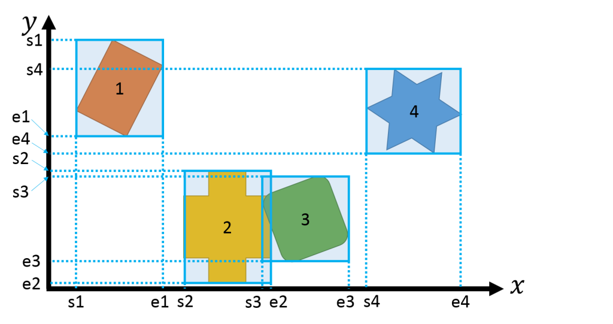

            引用: [当たり判定の高速化 ‐ スイープ＆プルーンの使用](https://ftvoid.com/blog/post/407)

            <br>

            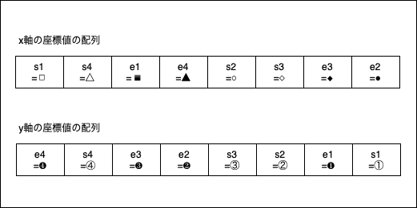

        <br>

        2. 各軸 (x 軸) の座標値を他のオブジェクトと比較する

            - オブジェクト1の始点から終点の間に他のオブジェクトの座標が無いので **x 軸においてオブジェクト1は他のオブジェクトと衝突していないと言える**

                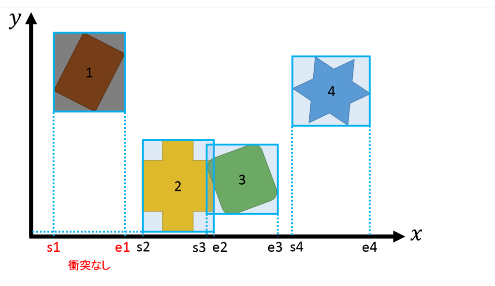

                引用: [当たり判定の高速化 ‐ スイープ＆プルーンの使用](https://ftvoid.com/blog/post/407)

            <br>

            - 次に、オブジェクト2について見ると、オブジェクト2の x 座標の始点から終点間にオブジェクト3の x 座標が存在するので、**オブジェクト2とオブジェクト3は x 軸において衝突していると言える = この2次元空間でオブジェクト2とオブジェク3は衝突している可能性がある**

                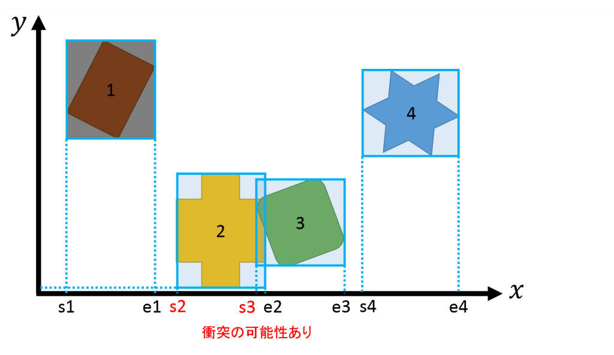

                引用: [当たり判定の高速化 ‐ スイープ＆プルーンの使用](https://ftvoid.com/blog/post/407)

            <br>

            - 同様にオブジェクト4の x 軸の座標を見てみると、オブジェクト1と同様に、x 軸において他のオブジェクトと衝突していないと言える

                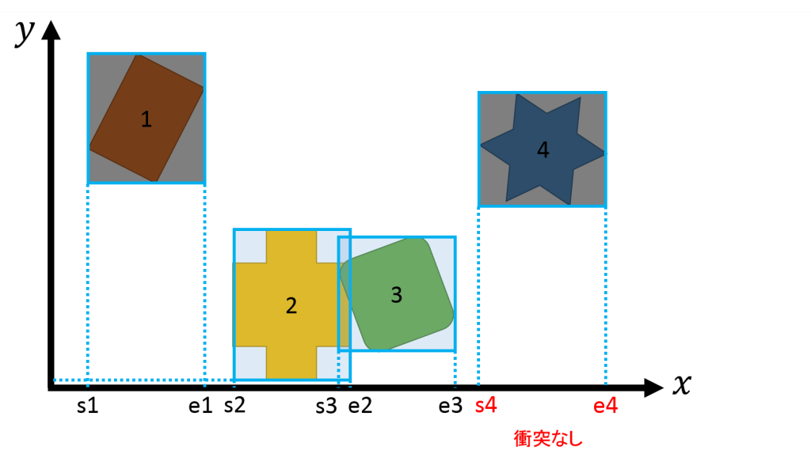

                引用: [当たり判定の高速化 ‐ スイープ＆プルーンの使用](https://ftvoid.com/blog/post/407)

        <br>

        3. 各軸 (y 軸) の座標値を他のオブジェクトと比較する

            - オブジェクト1の y 座標の始点から終点の間にオブジェクト4の y 座標が存在するため、**オブジェクト1とオブジェクト4は y 軸上で衝突している = この2次元空間でオブジェクト1とオブジェクト4は衝突している可能性がある**

                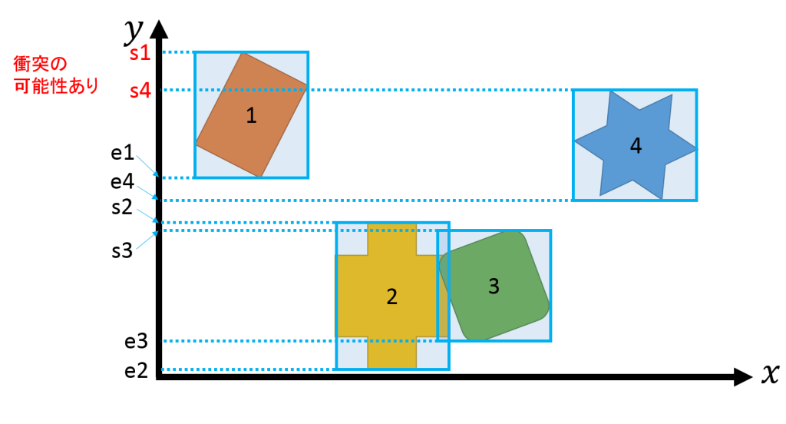

                引用: [当たり判定の高速化 ‐ スイープ＆プルーンの使用](https://ftvoid.com/blog/post/407)

            <br>

            - 同様に、オブジェクト2とオブジェクト3も y 軸上で衝突している = この2次元空間でオブジェクト2とオブジェクト3は衝突している可能性がある

                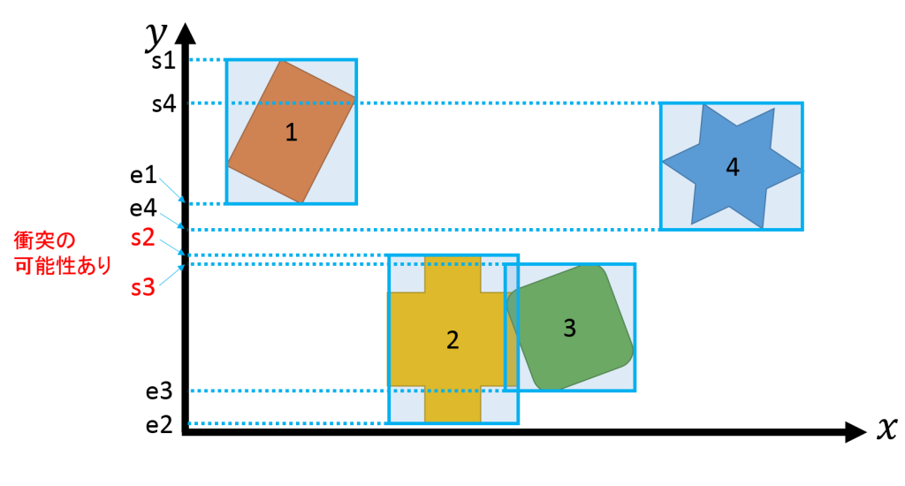

                引用: [当たり判定の高速化 ‐ スイープ＆プルーンの使用](https://ftvoid.com/blog/post/407)

        <br>

        4. 各軸上での衝突判定を行った結果、衝突の可能性のあるオブジェクトのペアを列挙し、最終的な衝突判定を行う

            - x 軸ではオブジェクト2と3が衝突

            - y 軸オブジェクト1と4、オブジェクト2と3が衝突

            - ★★★よって、x 軸、y 軸の両方で衝突していると判定されたオブジェクト2と3が2次元空間で衝突していると判定される

<br>

#### Cannon-js (es) での BroadPhase アルゴリズムの変更

- `worldインスタンス.broadphase` プロパティに、使用したい `Broadphaseインスタンス` を代入する

    - *各 Broadphase インスタンスはコンストラクターへの引数が異なるので、リファレンスを参照すること

    ```js
    /*
    * worldインスタンス作成
    */
    const world = new CANNON.world();

    /*
    * world上でのBroadphaseアルゴリズムの変更
    */

    // SAPBroadphase (コンストラクターへの引数はworldインスタンス)
    world.broadphase = new CANNON.SAPBroadphase(world);

    // GridBroadphase
    world.broadphase = new CANNON.GridBroadphase();
    ```

<br>
<br>

参考サイト

[当たり判定の高速化 ‐ スイープ＆プルーンの使用](https://ftvoid.com/blog/post/407)

---

### Sleep

- 動いていないオブジェクト = オブジェクトの速度 (= Velocity) が0 のオブジェクトを sleep 状態とし、**衝突判定の対象から除外する**機能のこと

<br>

#### cannon-js (es) で Sleep 機能を有効にする

- `Worldインスタンス.allowSleep` プロパティに `true` を設定する

    ```js
    const world = new CANNON.World();
    
    //★★★Sleep機能の有効化★★★
    world.allowSleep = true;
    ```

<br>

#### Sleep 機能のカスタマイズ

- オブジェクトの Velocity がどのくらい遅くなり、その状態から何秒経過したら sleep 状態とするのかをカスタマイズできる

    - オブジェクトの **Velocity がどのくらい遅くなったら**に関する条件

        - `Bodyインスタンス.sleepSpeedLimit` プロパティで設定する


    <br>

    - オブジェクトの Velocity が特定の閾値以下の状態を**何秒維持したら** sleep 状態とするのかについての設定

        - `Bodyインスタンス.sleepTimeLimit` プロパティで設定する

    <br>

    ```js
    const sphere = new CANNON.Sphere(radisu);

    //★★★sphereのvelociyが0.2以下の状態を3秒維持したら sleep状態とみなすようにカスタマイズ★★★
    sphere.sleepSpeedLimit = 0.2;
    sphere.sleepTimeLimit = 3;
    ```