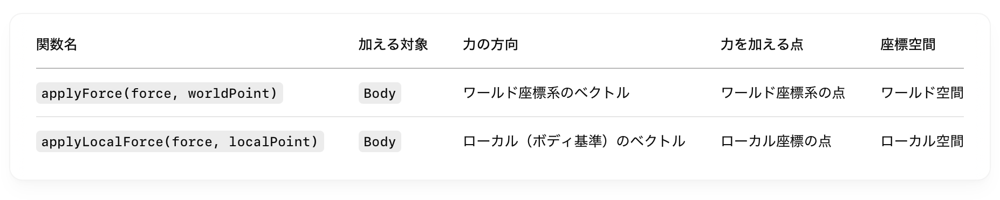
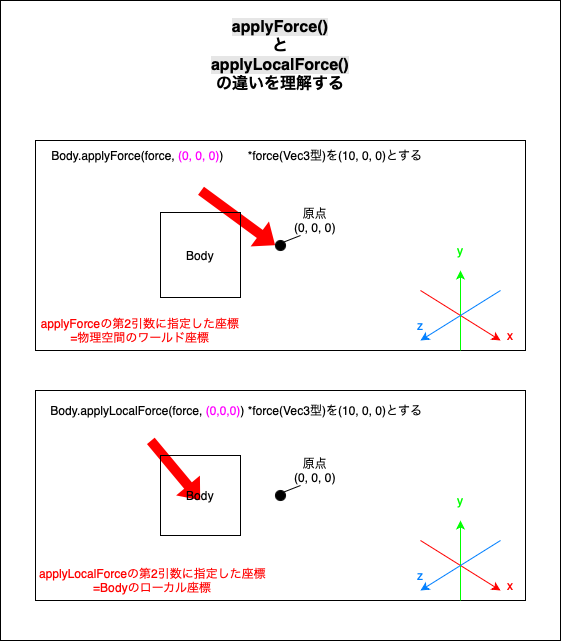

### applyForce と applyLocalFoce

#### ポイント

 

- `applyForce()` も `applyLocalForce()` **力が作用する対象は オブジェクト (Body)**

- 力をかける点がワールド座標なのか、オブジェクトのローカル座標なのかの違い

 

 
 

参考サイト

[Three.js備忘録（６） ~ 物体に力やインパルスを加える](https://koro-koro.com/threejs-no6/#chapter-4)

---

### applyForce() 系と applyImpuls() 系の違い

- ざっくり説明すると、オブジェクトへの力の作用の仕方が異なる

    - オブジェクトの速度への計算方法が異なるらしい

 

- #### Force 系メソッド

    - イメージ的にはじわじわ力をかけるのが Force 系メソッド

    - 毎フレーム呼び出して、じわじわ力を加えるようなケースに Force 系メソッドを利用する

        - 例: 風のシミュレーション

         

    

 

- #### Impuls 系メソッド

    - イメージ的には一瞬で力をかけるのが Impuls 系メソッド

    - 1回だけ呼び出して、オブジェクトに一瞬だけ力を加えるようなケースに Impuls 系メソッドを利用する

        - 例: キャラクターのジャンプ、大砲の発射など

         

    

 
 

参考サイト

[【Unity】RigidbodyのAddForceは「ForceMode」の違いに注目！4つのForceModeを徹底解説！](https://shibuya24.info/entry/unity-rigidbody-addforce)
