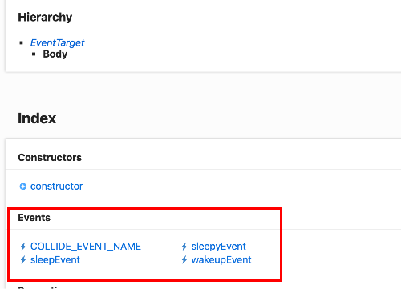

### Body にイベントリスナーを登録する

- ★`Bodyインスタンス.addEventListner()` でイベントリスナーを張る

    - addEventListner() は以下の引数を受け取る

        - 第1引数 (String): 登録するイベント

        - 第2引数 (Function): イベントが発火した際に実行するコールバック関数

    ```js
    // Body の作成
    const radius = 0.5;
    const sphere = new CANNON.Sphere(radius);
    //以下省略

    // ★★★Body(sphere)へのイベントの登録★★★
    sphere.addEventListner("collide", () => {
        // collideイベント発火時に実行したい処理
    });
    ```

<br>

#### イベントの種類

- Body インスタンスに登録できるイベントは以下の通り

    

    <br>

    - `"collide"`: Body が他のオブジェクトと衝突した時に発火

    <br>

    - `"sleep"`: Body が [sleep 状態](./パフォーマンス向上の方法.md)になった時に発火

    <br>

    - `"sleepy"`: Body が sleepy 状態になった時に発火
        - ★★★ sleepy 状態とは、その Body の velocity が特定の閾値以下なってから sleep 状態に入るまでの特定の期間の状態を指す

    <br>

    - `"wakeup"`: Body が sleep 状態から起きる時に発火

<br>
<br>

参考サイト

[Three.js備忘録（６） ~ イベントのリスニング](https://koro-koro.com/threejs-no6/#chapter-5)

[cannon-es ~ Body](https://pmndrs.github.io/cannon-es/docs/classes/Body.html)

---

### イベントリスナーの削除

- [addeventListner()](#body-にイベントリスナーを登録する)と同じように `Bodyインスタンス.removeEventListener()` で登録したイベントとコールバック関数を削除する

    - `removeEventListener()` は以下の引数を受け取る

        - 第1引数 (String): 削除したい登録済みのイベント

        - 第2引数 (Function): 削除したい登録済みのコールバック関数

    ```js
    // Body の作成
    const radius = 0.5;
    const sphere = new CANNON.Sphere(radius);
    //以下省略

    // コールバック関数
    const func1 = () => {
        // collideイベント発火時に実行したい処理
    };

    // Body(sphere)へのイベントの登録
    sphere.addEventListner("collide", func1);

    // ★★★Body(sphere)のイベントの削除★★★
    sphere.removeEventListner("collide", func1);
    ```

