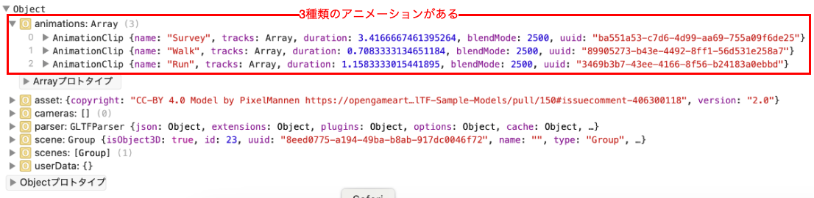
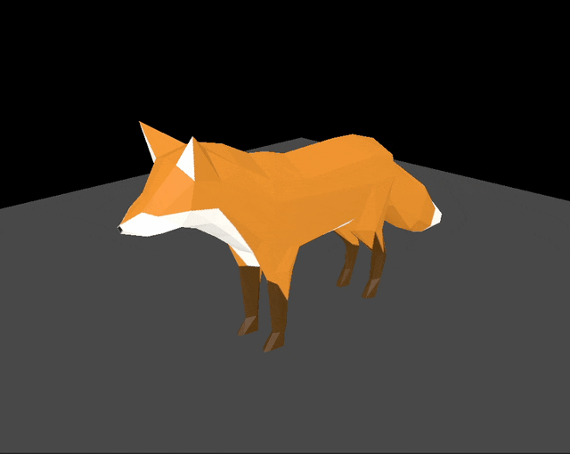
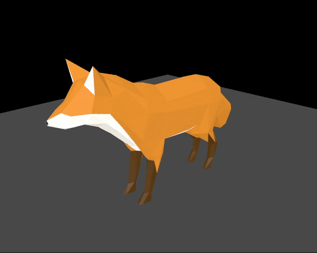

### アニメーションが含まれた 3D モデル (GLTF)

#### アニメーションが含まれた3Dモデルの取り込み&確認

```js
import { GLTFLoader } from 'three/addons/loaders/GLTFLoader.js';

//GLTFLoaderインスタンスの作成
const gltfLoader = new GLTFLoader();

//アニメーションが含まれた3Dモデルの取り込み
gltfLoader.load(
    "/models/Fox/glTF-Binary/Fox.glb",
    (gltf) => {
        console.log(gltf);
    }
);
```

<br>

- コンソールログを見てみると、アニメーション情報は GLTF オブジェクトの `animations` プロパティにある

    - `anmations` プロパティ = `AnimationClip` インスタンスの配列

    

<br>

- AnimationClip インスタンスを再生できればアニメーションの再生ができそう

---

### AimationClip を再生する方法

- そもそも AnimationClip クラスとは?

    - Three.js が用意しているキーフレームアニメーションのキーフレームトラックを表すクラス

<br>

- ★★★同じく Three.js が 用意している **AnimationMixer クラス**を使うことで AnimationClip に定義されているキーフレームアニメーションを再生することができる**AnimationAction インスタンス**を作成することができる

<br>

#### ざっくりしたイメージ

1. AnimationMixer と AnimationClip から AnimationAction を作成する

2. AnimationAction にてアニメーションを作成する

<br>

#### AnimationClip を再生する方法

1. AnimationMixer インスタンスを作成する

    - コンストラクターに渡す引数 (Object3D 型): アニメーションで動くオブジェクト = 今回では 3D モデル

    ```js
    import { GLTFLoader } from 'three/addons/loaders/GLTFLoader.js';

    //GLTFLoaderインスタンスの作成
    const gltfLoader = new GLTFLoader();

    //アニメーションが含まれた3Dモデルの取り込み
    gltfLoader.load(
        "/models/Fox/glTF-Binary/Fox.glb",
        (gltf) => {

            //★★★AnimationMixerインスタンスの作成★★★
            const animationMixer = new THREE.AnimationMixer(gltf.scene);
        }
    );
    ```

<br>

2. `AnimxationMixer.clipAction()` を呼び AnimationActionインスタンス を作成する

    - `AnimxationMixer.clipAction()`の引数

        - 第1引数 (AnimationClip 型): 再生したいキーフレームアニメーションインスタンス

    <br>

    ```js
    import { GLTFLoader } from 'three/addons/loaders/GLTFLoader.js';

    //GLTFLoaderインスタンスの作成
    const gltfLoader = new GLTFLoader();

    //アニメーションが含まれた3Dモデルの取り込み
    gltfLoader.load(
        "/models/Fox/glTF-Binary/Fox.glb",
        (gltf) => {

            //AnimationMixerインスタンスの作成
            const animationMixer = new THREE.AnimationMixer(gltf.scene);

            //★★★AnimationActionインスタンスの作成★★★
            const animationAction = animationMixer.clipAction(gltf.animations[0]);
        }
    );
    ```

<br>

3. `AnimationAction.play()` でアニメーションを再生する

    ```js
    import { GLTFLoader } from 'three/addons/loaders/GLTFLoader.js';

    //GLTFLoaderインスタンスの作成
    const gltfLoader = new GLTFLoader();

    //アニメーションが含まれた3Dモデルの取り込み
    gltfLoader.load(
        "/models/Fox/glTF-Binary/Fox.glb",
        (gltf) => {

            //AnimationMixerインスタンスの作成
            const animationMixer = new THREE.AnimationMixer(gltf.scene);

            //AnimationActionインスタンスの作成
            const animationAction = animationMixer.clipAction(gltf.animations[0]);

            //★★★AnimationAction.play()でアニメーションの再生★★★
            animationAction.play();
        }
    );
    ```

<br>

- 結果、アニメーションは再生されない

    

<br>

#### アニメーションが再生されなかった理由

- ★★★`AnimationMixer.update()` を毎フレームごとに呼び出す必要がある

    - 第1引数 (Number 型); デルタタイム = 前回呼ばれてから経過した時間

    ```js
    import { GLTFLoader } from 'three/addons/loaders/GLTFLoader.js';

    //GLTFLoaderインスタンスの作成
    const gltfLoader = new GLTFLoader();

    //★★★AnimationMixerをグローバル変数に変更 (コールバック関数内で再代入するのでletで宣言)★★★
    let animationMixer = null;

    //アニメーションが含まれた3Dモデルの取り込み
    gltfLoader.load(
        "/models/Fox/glTF-Binary/Fox.glb",
        (gltf) => {

            //AnimationMixerインスタンスの作成
            animationMixer = new THREE.AnimationMixer(gltf.scene);

            //AnimationActionインスタンスの作成
            const animationAction = animationMixer.clipAction(gltf.animations[0]);

            //AnimationAction.play()でアニメーションの再生
            animationAction.play();

            //3Dモデルをシーンに追加
            scene.add(gltf.scene);
        }
    );

    //各フレームごとに呼ばれる関数
    const clock = new THREE.Clock();
    let previousTime = 0;

    const tick = () => {
        const elapsedTime = clock.getElapsedTime();
        const deltaTime = elapsedTime - previousTime;
        previousTime = elapsedTime;

        //★★★アニメーションのアップデート★★★
        if (animationMixer != null) {
            animationMixer.update(deltaTime);
        }

        // Render
        renderer.render(scene, camera)

        window.requestAnimationFrame(tick)
    };

    tick();
    ```

<br>

- 結果、正しくキーフレームアニメーションが再生された

    

<br>
<br>

参考サイト

[Three.js アニメーション システム（Mixamoアニメーションの統合）](https://koro-koro.com/threejs-animation-system/)

[手付けモーション（キーフレームアニメーション）とは？｜ゲーム・映像制作](https://confidence-creator.jp/column/302/)

[【これを読めばだいたいわかる】アニメーションの種類や相場は？【具体例】](https://mediassort.jp/contents01/skd_anime_01)