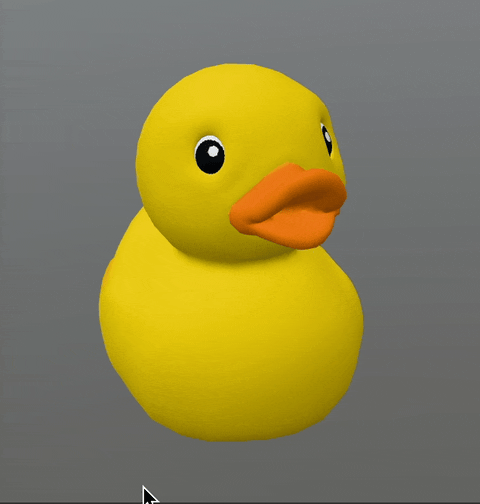
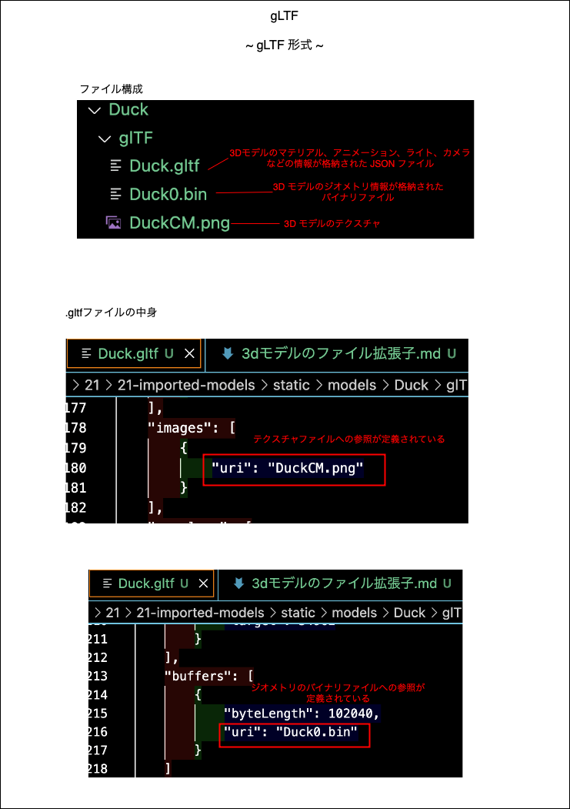
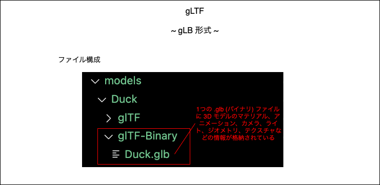
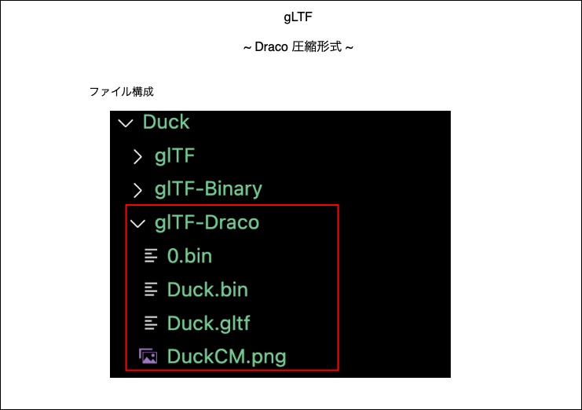
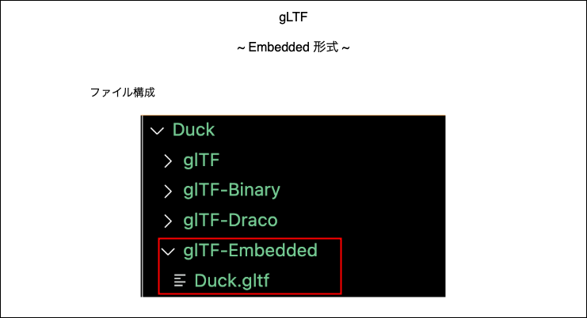

### 3D モデルのファイル拡張子

- 3D モデルのファイルには以下のような様々な拡張子がある

    - #### GLTF / GLB

        - **Web ブラウザ上**で 3D モデルを利用する際に広く利用される

        - GLTF の 3D モデルにはアニメーションも含めることができる
    
     

    - #### VRM

        - **Vtuber の 3D モデル**のファイルに広く使われるファイル拡張子

        - GLTF をベースにしたファイル形式らしい

     

    - #### OBJ

        - 多くの 3D ソフトウェアでサポートされており、**互換性が高い**のが特徴らしい

        - GLTF とは異なり、OBJ の 3D モデルにはアニメーションを含めることはできない

     

    - #### FBX

        - **映画、ゲーム、VFX でよく使われる** 3D モデルのファイル形式らしい

        - GLTF と同様に FBX の 3 Dモデルにアニメーションを含めることができる

 
 

参考サイト

[glTF、GLB、OBJ、FBX、USDZ？WebARで使用される3Dの拡張子を解説！](https://webar-lab.palanar.com/column/3d-kakuchoshi/)

[【VTuberのなり方解説#5】VRMって何よ！？【ざっくり解説】](https://takaaki-hobby-blog.com/unity/what_vrm/)

[glTFの仕様とその出力方法](https://www.codegrid.net/articles/2018-gltf-1/)

---

### GLTF / GLB

- 以下のアヒルの 3D モデルをサンプルとして取り上げる

    

 

- GLTF は様々な形式が存在する

    - GLTF

        - 以下のファイルから構成される形式

            

             

            - `.gltf` (=JSON)

                - 3D モデルのマテリアル、アニメーション、シーングラフ、カメラ、ライトなどの情報を格納したファイル
                
                - JSON なので、テキストファイルから開いて自分で修正することも可能

             

            - `.bin` (=バイナリ)

                - 3D モデルのジオメトリ情報を格納したファイル

             

            - テクスチャ

                - 3D モデルのテクスチャ

     

    - GLB

        

         

        - ジオメトリ、マテリアル、テクスチャなどの情報を1つのバイナリファイル (`.glb`) にまとめた形式

        - ファイルは軽いが、バイナリファイルなので、修正できないことに注意する

     

    - Draco

        

         

        - Draco という Google が開発した圧縮ライブラリで、メッシュや点群データを圧縮した形式

        - gLTF で利用できる形式の中で1番軽い

        - GLTF 形式と同様に `.gltf`ファイル、 `.bin` (バイナリ) ファイル、　テクスチャファイルで構成される

        - ★★Three.js で Draco 圧縮された gLTF のモデルを取り込む場合、**他の gLTF ファイル形式でのモデルの取り込み方と違うので注意**

     

    - gLTF Embedded

        

         

        - ジオメトリやマテリアル、テクスチャなどの情報を1つの `.gltf` (JSON) ファイルにまとめた形式

        - gLTF で利用できる形式の中で1番ファイルサイズが大きくなることが多い

 
 

参考サイト

[Three.js備忘録（4）~ 3Dモデルの描画](https://koro-koro.com/threejs-no4/#chapter-5)