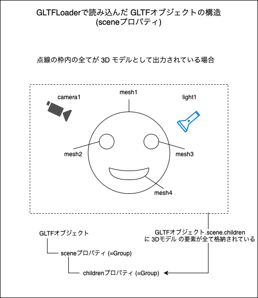
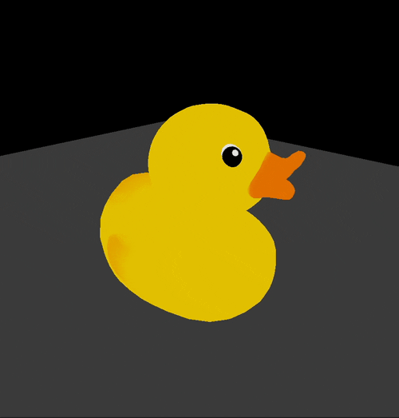
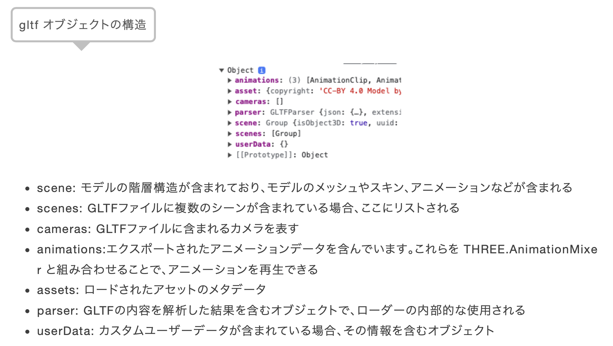
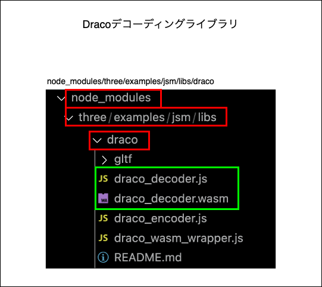
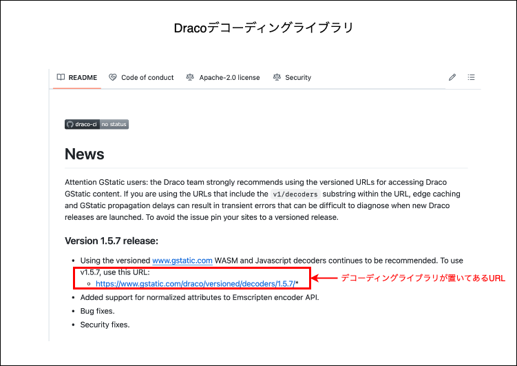

### 3Dモデルを取り込む前に

- [3D モデルのファイルの拡張子](./3dモデルのファイル拡張子.md#3d-モデルのファイル拡張子)の種類によって、取り込むためのローダーが違ってくることに注意

    - gLTF の 3D モデルを取り込むには [GLTFLoader](https://threejs.org/docs/#examples/en/loaders/GLTFLoader) を利用する必要がある

    <br>

    - ★★Draco 圧縮された gLTF のモデルを取り込む場合、GLTFLoader + Draco 圧縮されたジオメトリファイルをデコードするためのローダーである [DRACOLoader](https://threejs.org/docs/?q=Draco#examples/en/loaders/DRACOLoader) を利用する必要がある

    <br>

    - OBJ の 3D モデルを取り込むには [OBJLoader](https://threejs.org/docs/?q=VRM#examples/en/loaders/OBJLoader) を利用する必要がある

    <br>

    - VRM は GLTF がベースなので、GLTFLoader で取り込めるっぽいが、[three-vrm](https://zenn.dev/nciv/articles/05e0b1ed7a57c0#gltfloader) というモジュールがあるので、そちらを使うのが良いっぽい

---

### gLTF の 3D モデル (Draco 圧縮以外) を取り込む方法

1. GLTFLoader インスタンスの作成

    ```js
    import { GLTFLoader } from 'three/addons/loaders/GLTFLoader.js';

    // ★★★GLTFLoaderインスタンス作成★★★
    const gltfLoader = new GLTFLoader();
    ```

<br>

2. GLTFLoader インスタンスの load メソッドで、モデルの取り込みを行う

    - load メソッドの引数 ([TextureLoader](https://github.com/MasaGt/threejs_journey/blob/61d61072f10909c047ad964bccf2b2e088651001/chap1/10/Textures.md#textureloader) と同じ)

        - 第1引数 (String): 取り込みたいモデルファイル (.gltf) のパス

        <br>

        - 第2引数 (Function): onLoad 時に呼ばれるコールバック関数

            - コールバック関数は、引数 (ロードしたモデルの情報) を受け取る

        <br>

        - 第3引数 (Function): onProgress 時に呼ばれるコールバック関数

        <br>

        - 第4引数 (Function): onError 時に呼ばれるコールバック関数

    <br>

    ```js
    // GLTFLoaderインスタンス作成
    const gltfLoader = new GLTFLoader();

    // ★★★3Dモデルの取り込み★★★
    gltfLoader.load(
        "duck.gltf", //3Dモデルファイルのパス
        (model) => {
            // onLoad時のコールバック関数
        }
    );
    ```

<br>

3. モデルの取り込みが完了したら、Scene に追加する

    - 取り込んだモデルを Scene に追加するには以下のように、いくつか方法がある

        - #### 取り込んだモデルオブジェクトの scene プロパティ (Group型) が格納している Object3D を1つづつ Scene に追加する方法 = *3D モデルを構成するパーツを1つづつ Scene に追加するイメージ*

            

            - メリット: 多分特にない (少なくとも練習にはなる)

            - デメリット:
                - めんどくさい

                - `GLTFオブジェクト.scene` プロパティに scale や rotation が設定されている場合、その設定を無視してモデルを Scene に追加することになる

                - `GLTFオブジェクト.scene.children` プロパティに scale や rotation が設定されている場合、その設定を無視してモデルを Scene に追加することになる

            <br>
            
            ```js
            // GLTFLoaderインスタンス作成
            const gltfLoader = new GLTFLoader();

            // 3Dモデルの取り込み
            gltfLoader.load(
                "duck.gltf",
                (gltf) => {
                    
                    // ★★★取り込んだ3DモデルをSceneに追加する★★★
                    const chidren = [...gltf.scece.children];

                    for (const child of childnre) {
                        scene.add(child);
                    }
                }
            );
            ```

        <br>
        <br>

        - #### 取り込んモデルオブジェクトの scene プロパティ (Group) 自体を Scene に追加する方法

            - メリット: 楽

            - デメリット: もし、モデルにライトやカメラなども含まれている場合、そのような意図しないオブジェクトも追加してしまう恐れがある

                - 3D モデルの編集ツールを使ってライトやカメラを取り除いてからインポートし直すという手もある

            <br>

            ```js
            // GLTFLoaderインスタンス作成
            const gltfLoader = new GLTFLoader();

            // 3Dモデルの取り込み
            gltfLoader.load(
                "duck.gltf",
                (gltf) => {
                    
                    // ★★★取り込んだ3DモデルをSceneに追加する★★★
                    scene.add(gltf.scene);
                }
            );
            ```

<br>



<br>

#### ロードした GLTF モデルの情報の中身

- `GLTFLoader.load()` で読み込んだモデルは以下のプロパティを持ったオブジェクトとして取り込まれる

    

    引用: [Three.js備忘録（4）](https://koro-koro.com/threejs-no4/)

<br>

- ★★★ scece プロパティの正体は [Three.Group オブジェクト](https://threejs.org/docs/?q=Group#api/en/objects/Group)

    - Group とは複数のメッシュ、カメラ、ライトを1つのオブジェクトとしてまとめることができるクラス

        - 復習ノート → https://github.com/MasaGt/threejs_journey/blob/61d61072f10909c047ad964bccf2b2e088651001/chap1/04/Group.md

    <br>

---

### gLTF の 3D モデル  (Draco 圧縮)  を取り込む方法

#### ポイント

- Draco で圧縮されたジオメトリファイルをデコードする必要がある

    - Tree.js では [DRACOLoader](https://threejs.org/docs/?q=Draco#examples/en/loaders/DRACOLoader) が用意されている

<br>

#### Three.js で Draco 圧縮された gLTF 形式の 3D モデルを取り込む方法

1. DracoLoader インスタンスの作成

    ```js
    import { DRACOLoader } from 'three/addons/loaders/DRACOLoader.js';

    //★★★DRACOLoaderインスタンスの作成
    const dracoLoader = new DRACOLoader();
    ```

<br>

2. ★★★`DracoLoader.setDecoderPath()` を呼び、DracoLoader でデコードする際のライブラリを指定する

    - 第1引数 (String): Draco 圧縮をデコードするための `draco_decoder.js` と `draco_decoder.wasm` が格納されているフォルダーへのパス

    <br>

    - *デコーディングライブラリ (`draco_decoder.js` と `draco_decoder.wasm`) は `/node_modules/three/examples/jsm/libs/draco/` に格納されているが、 `DracoLoader.setDecoderPath("/node_modules/three/examples/jsm/libs/draco/")` はムリ

        

        <br>

        - ★★方法1: `/node_modules/three/examples/jsm/libs/` 配下の `draco` フォルダをローカルフォルダにコピーする

            ```js
            import { DRACOLoader } from 'three/addons/loaders/DRACOLoader.js';

            //DRACOLoaderインスタンスの作成
            const dracoLoader = new DRACOLoader();

            //★★★★デコーディングライブラリの指定 (ローカルにdracoフォルダをコピー済み)★★★
            dracoLoader.setDecoderPath("./public/draco/")
            ```

        <br>

        - ★★方法2: [Github の draco リポジトリ](https://github.com/google/draco) にて デコーディングライブラリをホストしている CDN の URL が公開されているので、その URL を `DracoLoader.setDecoderPath()` の引数に指定する

            

            ```js
            import { DRACOLoader } from 'three/addons/loaders/DRACOLoader.js';

            //DRACOLoaderインスタンスの作成
            const dracoLoader = new DRACOLoader();

            //★★★★デコーディングライブラリをホストしているCDNのURLを指定★★★
            dracoLoader.setDecoderPath("https://www.gstatic.com/draco/versioned/decoders/1.5.7/")
            ```

<br>

3. `GLTFLoader.setDRACOLoader()` に上記手順で作成した DracoLoader インスタンスを渡す

    ```js
    import { DRACOLoader } from 'three/addons/loaders/DRACOLoader.js';
    import { GLTFLoader } from 'three/addons/loaders/GLTFLoader.js';

    //DRACOLoaderインスタンスの作成
    const dracoLoader = new DRACOLoader();

    //デコーディングライブラリをホストしているCDNのURLを指定
    dracoLoader.setDecoderPath("https://www.gstatic.com/draco/versioned/decoders/1.5.7/")

    //GLTFLoaderインスタンスの作成
    const gltfLoader = new GLTFLoader();

    //★★★GLTFLoaderに作成&設定済みのDRACOLoaderインスタンスを設定する★★★
    gltfLoader.setDRACOLoader(dracoLoader);
    ```

<br>

4. `GLTFLoader.load()` で Draco 圧縮された 3D モデルを取り込む

    ```js
    //DRACOLoader & GLTFLoader の作成手順はsすでに紹介済みなので省略

    //★★★3Dモデルの取り込み★★★
    gltfLoader.load(
        "fox.gltf", //3Dモデルファイル(.gltf)のパス
        (gltf) => {
            //onLoad時のコールバック関数
        }
    );
    ```

<br>

5. 取り込んだ3Dモデルを Scene に追加する

    ```js
    //3Dモデルの取り込み
    gltfLoader.load(
        "fox.gltf", //3Dモデルファイル(.gltf)のパス
        (gltf) => {
            //onLoad時のコールバック関数

            //★★★取り込み済みの3DモデルをSceneに追加★★★
            scene.add(gltf.scene);
        }
    );
    ```

<br>
<br>

参考サイト

[【WebGL / three.js】DRACO＆Basis圧縮でWebに最適なレベルまで3Dモデルを圧縮する](https://zenn.dev/tanabee8/articles/fc40a20deebcbd)

[DracoをThree.js GLTFLoaderで使う](https://scrapbox.io/0b5vr/DracoをThree.js_GLTFLoaderで使う)

[【Three.js】Blenderで作成した３DモデルをWebページに表示する方法](https://mawasu-blog.com/threejs_view_3dmodel/)

---

### もしも、意図した色で表示されない場合

- [テクスチャーのカラースペース](https://github.com/MasaGt/threejs_journey/blob/61d61072f10909c047ad964bccf2b2e088651001/chap1/10/ColorSpace.md#%E3%83%86%E3%82%AF%E3%82%B9%E3%83%81%E3%83%A3%E3%82%92%E8%AA%AD%E3%81%BF%E8%BE%BC%E3%82%93%E3%81%A0%E5%BE%8C%E3%81%AE-colo%EF%BD%92space-%E3%81%AE%E8%A8%AD%E5%AE%9A%E3%81%AE%E6%84%8F%E5%91%B3)が意図したものになっていない可能性がある

-　こちらの[記事](https://qiita.com/yoshiya_sugimoto/items/eeeee0113726bf290a00)で紹介されているように以下の方法で解決できそう

    1. レンダラー自体にカラースペースを指定

    2. ロードした GLTF モデルの各メッシュのテクスチャーに利用したいカラースペースを指定する

        ```js
        //GLTFLoadaerインスタンスの作成
        const gltfLoader = new GLTFLoader();

        //3Dモデルの取り込み
        gltfLoader.load(
            "duck.gltf",
            (gltf) => {
                //★★★モデルを構成する各メッシュのカラー空間の指定★★★
                for (const mesh of gltf.scene.children) {
                    if (mesh.isMesh) {
                        mesh.material.map.encoding = THREE.sRGBEncoding
                    }
                }

                //3Dモデルを丸ごとシーンに追加する
                scene.add(gltf.scene);
            }
        );
        ```