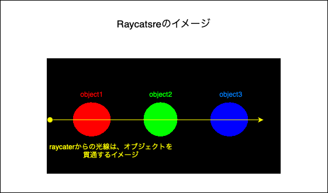
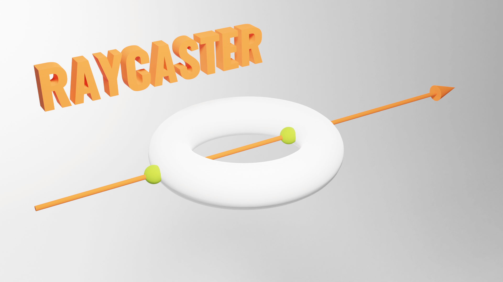
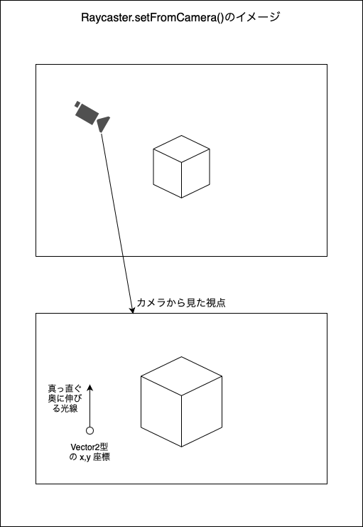
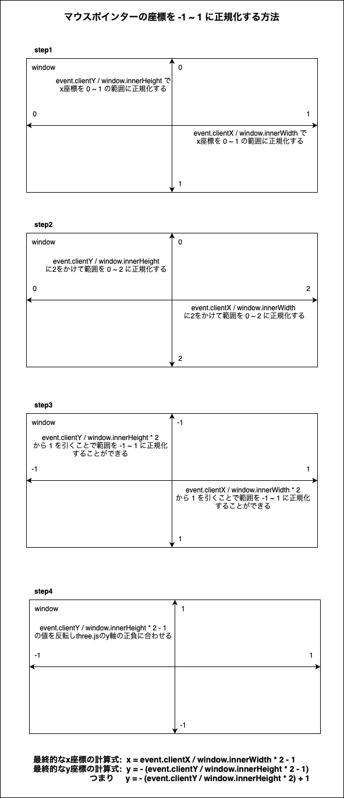
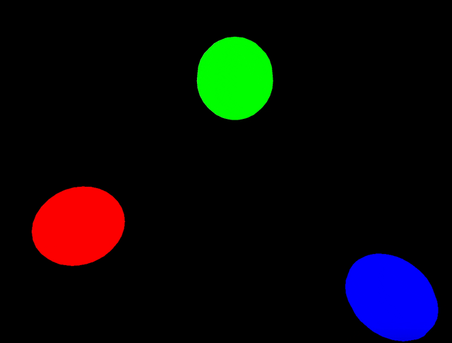
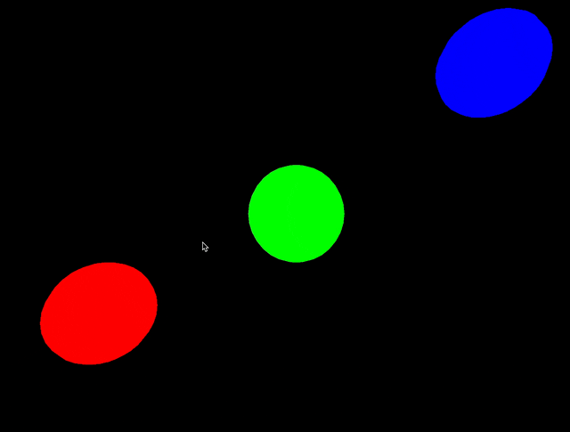
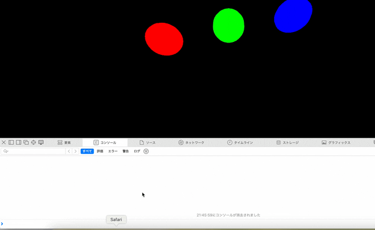

### Raycaster (Raycast) とは

- とある地点から、任意の方向に光線を放出し、その光線に衝突するオブジェクトを検出する技術のこと

<br>

- 具体的な利用例

    - オブジェクト同士の衝突を検出するのに Raycasterm を利用できる

    - マウスカーソルとオブジェクトの交差を検出するのに Raycaster を利用できる

<br>

- Raycaster からの光線はオブジェクトを貫通するイメージ

    

<br>
<br>

参考サイト

[Unityのレイキャストとは何ぞや？(自分用)](https://qiita.com/4_mio_11/items/4b10c6fe37fd7a856350#:~:text=レイキャストとはある,場合などに用います%E3%80%82)

[🎡レイトレーシング、レイキャスティング、レイマーチングの違いについて教えてください](https://note.com/rodz/n/nddff1b6acb12#00dbc2ed-9af1-4f80-a503-3e1b590af209)

---

### Three.js で Raycaster の利用方法

1. Raycatster インスタンスを作成する

    ```js
    //★Raycatsterのインスタンスを作成
    const raycaster = new THREE.Raycaster();
    ```

<br>

2. Raycaster で光線を発射する原点とその方向を　`Three.Vector3` 型で定義する

    - ★★★光線の方向ベクトルは正規化されている必要がある★★★

        - `Three.Vector3.normalize()` で単位ベクトルに変換することができる

    <br>

    ```js
    const origin = new THREE.Vector3(0, 0, 0);

    //★Raycaster用の方向ベクトルは単位ベクトルである必要がある★
    const direction = new THREE.Vector3(1, 0, 0); //←単位ベクトル

    //★★単位ベクトルでなくとも、normalize()を使うと単位ベクトルに変換してくれる★★
    const direction2 = new THREE.Vector3(10, 5, 3);
    direction2.normalize();
    ```

<br>

3. `Raycaster.set()` に定義した光線の原点と方向ベクトルを渡す

    - 第1引数 (Vector3 型): 光線の原点

    - 第2引数 (Vector3 型): 光線の発射方向

    <br>

    ```js
    raycaster.set(origin, direction);
    ```

<br>

4. `Raycaster.intersectObject()` や `Raycaster.intersectObjects()` で光線がヒットしたオブジェクトを検出することができる

    - 詳しい違いは[こちら](#intersectobject-と-intersectobjects)を参照  

    ```js
    const obj1 = new THREE.Mesh(geometry, material);
    const obj2 = new THREE.Mesh(geometry, material);
    const obj3 = new THREE.Mesh(geometry, material);

    //★Raycaster.intersectObject()で1つのオブジェクトとの交差をチェックする
    const targetObject = obj1;
    raycaster.intersectObject(targetObject);

    //★Raycaster.intersectObjects()で複数オブジェクトとの交差をチェックする
    const targetObjectArray = [obj1, obj2, obj3];
    raycaster.intersectObject(targetObjectArray);
    ```

<br>
<br>

参考サイト

[Three.js備忘録（3）](https://koro-koro.com/threejs-no3/)

---

### intersectObject() と intersectObjects()

#### ポイント

- ##### `intersectObject()`

    - Raycasterからの光線と**1つ**のオブジェクトの交差をチェックしたい時に使う

    - `intersectObject()` は第1引数に Object3D 型の**インスタンスを受け取る**
    
    - `intersectObject()` の戻り値には以下の情報などが含まれている
    
        - Raycater の原点からの距離
        - Raycaster からの光線が交差したオブジェクト (Object3D) の情報
        - Raycaster の光線とオブジェクトが交差したワールド座標
        - Raycaster の光線とオブジェクトが交差した点の UV 座標

<br>

- ##### `intersectObjects()`

    - Raycasterからの光線と**複数**のオブジェクトの交差をチェックしたい時に使う

    - `intersectObjects()` は第1引数に Object3D 型の**配列を受け取る**

    - `intersectObjects()` の戻り値は `intersectObject()` と同じ情報が含まれている

<br>

#### intersectObject() の結果が配列になるわけ

- 以下のように1つのオブジェクトでも光線が2つの点と交差するケースがあるから

    

    引用: [three.js journey](https://threejs-journey.com)

---

### `Raycaster.setFromCamera()`

- ざっくり言うと、カメラから真っ直ぐに伸びる光線を発射するメソッド

<br>



<br>

#### 引数

- 第1引数 (**Vector2** 型)

    - 光線の原点 (2次元ベクトル = x, y 座標)

        - カメラから真っ直ぐ奥に伸びる光線を発射するので、[Raycaster.set()](#threejs-で-raycaster-の利用方法) とは異なり x, y の2次元ベクトルを渡す

    - ★★Vector2 に設定する x, y 座標の値は **-1 ~ 1** である必要がある★★

<br>

- 第2引数 (Camera 型)

    - 光線の発射元となるカメラオブジェクト

<br>

#### 利用イメージ

- setFromCamera() の第1引数にマウス (ポインター) の座標を渡すことで、ポインターが Scene のオブジェクトに **enter / hover / leave/** している状態を検知することができる

    

<br>

- [`Racaster.set()` の時](#threejs-で-raycaster-の利用方法)と同様に `Raycaster.intersectObject()` や `Raycaster.intersectObjects()` で光線とオブジェクトの交差を判定する

<br>
<br>

参考サイト

[Raycaster](https://threejs.org/docs/?q=rayc#api/en/core/Raycaster)

---

### Raycaster.setFromCamera() の練習

1. #### マウスポインターがオブジェクトに乗っている時はそのオブジェクトの色を黄色にしたい

    #### ポイント

    - ★★★マウスの座標を `Raycaster.setFromCamera()` に渡す際は、 -1 ~ 1 に正規化する必要がある★★★

        

        <br>

        ```js
        //ポインター座標を保持する変数を作成 (オブジェクトでもいい{x:~~, y:~~})
        const mousePointer = new THREE.Vector2();

        //マウスが動いた時に、マウスの座標を更新する
        window.addEventListner("mousemove", (e) => {
            //マウスのx座標を-1~1に標準化
            const x = (e.clientX / window.innerWidth) * 2 - 1;

            //マウスのy座標を-1~1に標準化
            const y = - (event.clientY / window.innerHeight) * 2 + 1;

            mousePointer.set(x, y);
        });
        ```

    <br>

    - `raycaster.setFromCamera()` は毎フレーム呼び出す必要がある

        - ダメなコード

            ```js
            //Raycasterインスタンスの作成&カメラから光線を放射
            const raycaster = new THREE.Raycaster();
            raycaster.setFromCamera(mousePointer, camera);

            //アニメーション関数
            const tick = () => {
                object1.material.color.set("#ff0000");
                object2.material.color.set("#00ff00");
                object3.material.color.set("#0000ff");

                //raycasterからの光線と交差したオブジェクトを黄色に変える
                const hitObjects = raycaster.intersectObjects([object1, object2, object3]);
                if (hitObjects.length > 0) {
                    for (const obj of hitObjects) {
                        //色を黄色に変更
                        obj.object.material.color.set("#FFE500");
                    }
                }


                renderer.render(scene, camera);

                window.requestAnimationFrame(tick);
            }

            tick();
            ```

            <br>

            - 結果、オブジェクトにマウスポインターを乗せても色が変わらず、緑のオブジェクトが画面中央に来る時のみ色が変わる

                - 理由: マウスポインターの座標である mousePointer が更新されないから

            
            
        <br>
        <br>

        - OKなコード

            ```js
            //Raycasterインスタンスの作成
            const raycaster = new THREE.Raycaster();
            

            //アニメーション関数
            const tick = () => {
                object1.material.color.set("#ff0000");
                object2.material.color.set("#00ff00");
                object3.material.color.set("#0000ff");

                //★★★毎フレームraycaster.setFromCameraを呼ぶ → mousePointerを更新する必要がある★★★
                raycaster.setFromCamera(mousePointer, camera);

                //raycasterからの光線と交差したオブジェクトを黄色に変える
                const hitObjects = raycaster.intersectObjects([object1, object2, object3]);
                if (hitObjects.length > 0) {
                    for (const obj of hitObjects) {
                        //色を黄色に変更
                        obj.object.material.color.set("#FFE500");
                    }
                }
                
                renderer.render(scene, camera);

                window.requestAnimationFrame(tick);
            }

            tick();
            ```

            <br>

            - 結果、ちゃんとマウスポインターが乗ったオブジェクトの色が変更されるようになった

            

<br>
<br>

2. #### マウスポインターがオブジェクトに enter / hover / leave した時のイベントを Raycaster を使って実装したい

    #### ポイント

    - マウスからのrayとオブジェクトが交差したかどうかの状態を保持しておき、次のフレームで前フレームの交差状態によって enter / hover / leave の判定を行う

        ```js
        //★★前フレームでrayとオブジェクトが交差してたかどうかを保持する変数★★
        let lastIntersect = null;

        //アニメーション関数
        const tick = () => {

            //pointerは定義済みとする
            raycaster.setFromCamera(pointer, camera);

            const hitObjects = raycaster.intersectObjects([object1, object2, object3]);

            if (hitObjetc.length) {
                //今回rayとオブジェクトが交差した場合

                if (lastIntersect === null) {
                    //前フレームではrayとオブジェクトが交差していなかった場合
                    // → mouse enter
                    console.log("mouseEnter");
                } else {
                    //前フレームでもrayとオブジェクトが交差していた場合
                    // → mouse hover
                    console.log("mouseHover");
                }
                
                //lastIntersectを今回のrayとオブジェクトの交差状態に更新
                lastIntersect = hitObjects[0];
            } else {
                //今回rayとオブジェクトが交差しなかった場合

                if (lastIntersect !== null) {
                    //前フレームではrayとオブジェクトが交差していた場合
                    // → mouse leave
                    console.log("mouseLeave");
                }
            }

            renderer.render(scene, camera)

            window.requestAnimationFrame(tick);
        };

        tick();
        ```

    <br>

    - 結果、期待した通りに enter / hover / leave の判定ができた

    

<br>
<br>

参考サイト

[Three.jsの基礎（マウスイベント）](https://qiita.com/led-ray/items/bf5fd3a192eb0defd457)